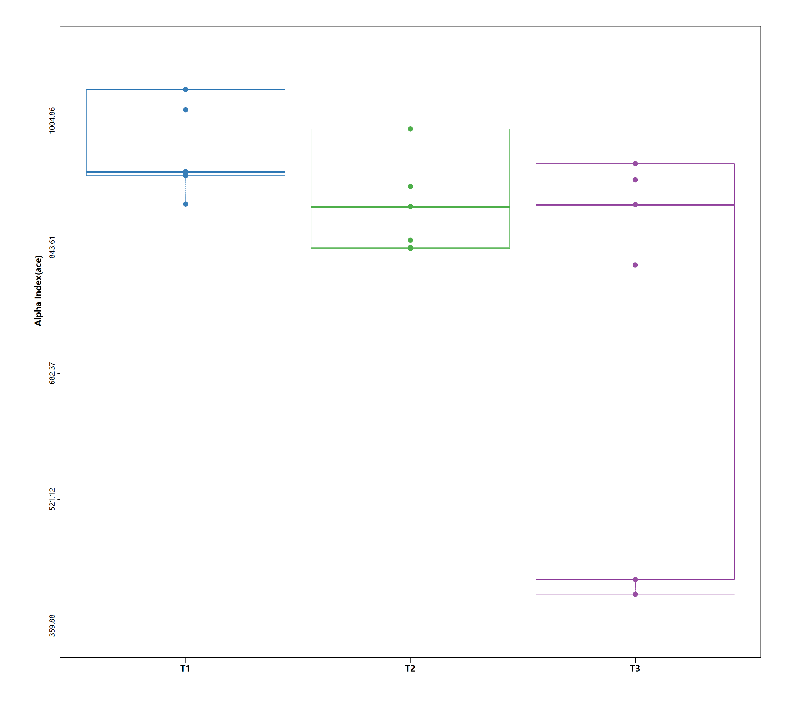
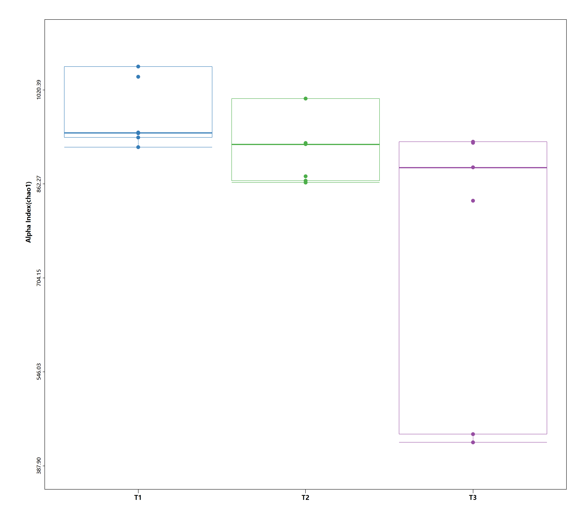
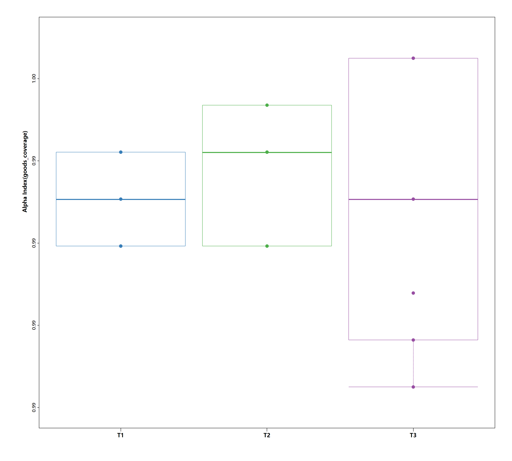
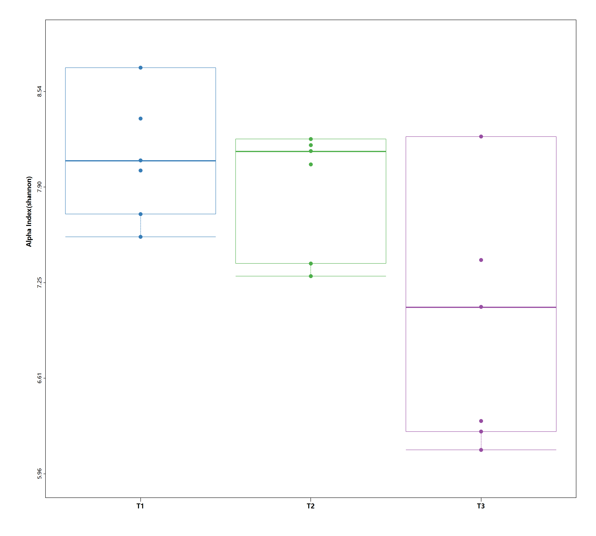

```vbnet
Imports Microsoft.VisualBasic.ComponentModel.DataSourceModel
Imports Microsoft.VisualBasic.Data.ChartPlots.BarPlot
Imports Microsoft.VisualBasic.Data.ChartPlots.Statistics

Dim groups = {
    New NamedCollection(Of String)("T1", {"T1-1", "T1-2", "T1-3", "T1-4", "T1-5", "T1-6"}),
    New NamedCollection(Of String)("T2", {"T2-1", "T2-2", "T2-3", "T2-4", "T2-5", "T2-6"}),
    New NamedCollection(Of String)("T3", {"T3-1", "T3-2", "T3-3", "T3-4", "T3-5", "T3-6"})
}
Dim boxGroups = BoxData _
    .Load("./alpha-box.csv", groups) _
    .ToArray

For Each x As BoxData In boxGroups
    Call x _
        .Plot(YaxisLabel:=$"Alpha Index({x.SerialName})") _
        .Save($"./{x.SerialName}.png")
Next
```





