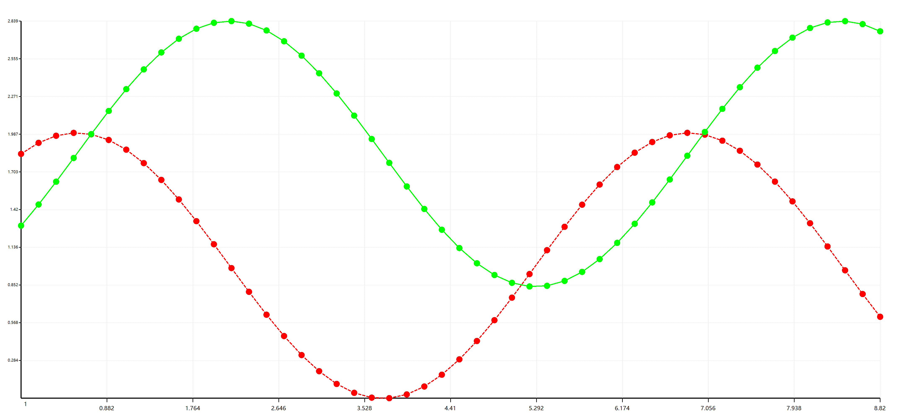
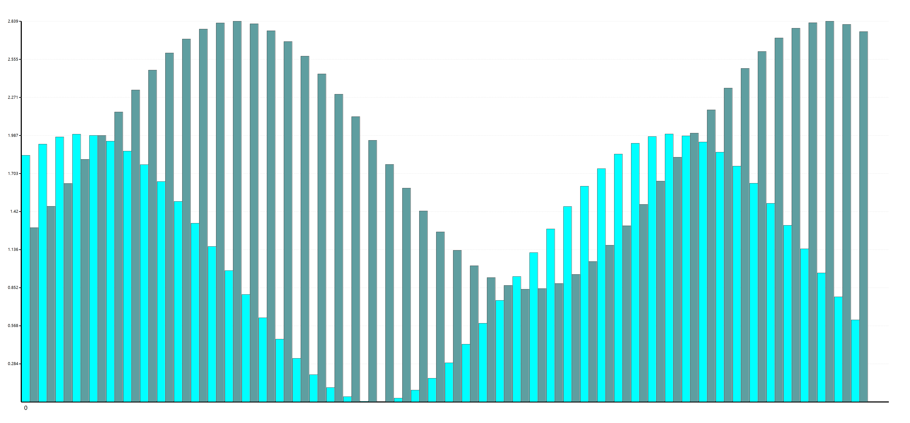
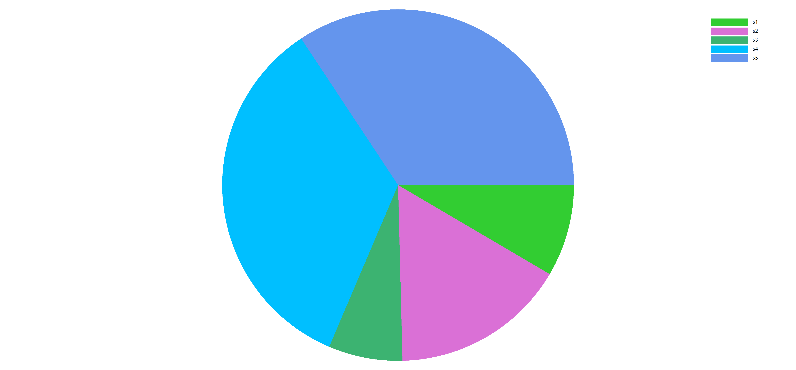

### VisualBasic Mathematics expression evaluation


If you are running on Linux/macOS platform, try start by mono:

> mono ./vbmath.exe

Or if you are running Windows/Ubuntu system, just using .NET application directly by typing:

> ./vbmath.exe

If you are running on Windows, just double click on the program and then application running.

Have a try of some test:

```R
> function f1(a,b,c,d) a*b*c+d
> f1(1,2,3,1)
> 1+2+3+1
> f1(1,2,3,sin(6))
> 1+2+3+sin(6)
> sin(6)
> PI
> sin(PI)
> PI*2
> PI^2
> PI*PI
> PI+E
> E
> E^3
> 2.7^3
```

##### Using the math expression engine

First, create the object instance of the math expression engine, and makes some configuration:
```vbnet
Imports Microsoft.VisualBasic.Mathematical

Dim engine As New Expression

' Add variable
Call engine.Variables.Set(Name, expr)
' Add Constant
' But please notices that, unlike the variable its value can be updated, the constant value can not be updated after it was assigned the initial value.
Call engine.Constant.Add(Name, expr)
' Add user define function
Call engine.Functions.Add(Name, def)
```

And then you can evaluate any of the math expression that its syntax match the VisualBasic language syntax:

```vbnet
Dim value = engine.Evaluation(expr)

' For example
value = engine.Evaluation("1+1")
value = engine.Evaluation("sin(PI)")
value = engine.Evaluation("cos(PI)+sin(PI/5)+6%3")
```

### VisualBasic Data Science plot system

##### Bubble Plot

```vbnet
Call Bubble.Plot(csv.SerialData.GetData("./images/BubbleTest.csv"), legend:=False).SaveAs("./images/Bubble.png")
```


##### Heatmap


##### Scatter & Histogram Plot

```vbnet
Imports Microsoft.VisualBasic.Imaging
Imports Microsoft.VisualBasic.Language
Imports Microsoft.VisualBasic.Mathematical
Imports Microsoft.VisualBasic.Mathematical.diffEq
Imports Microsoft.VisualBasic.Mathematical.Plots

Dim ode As New ODE With {
    .df = Function(x, y) Math.Cos(x),
    .y0 = 0.540302
}
Dim ode2 As New ODE With {
    .df = Function(x, y) Math.Sin(x),
    .y0 = Math.Sin(0)
}
Call ode.RK4(50, 1, 10)
Call ode2.RK4(50, 1, 10)

Dim serials = {
    ode.FromODE("red"),
    ode2.FromODE("lime", DashStyle.Solid)
}

Call Scatter.Plot(serials).SaveAs("./cos.png")
Call Histogram.Plot(Histogram.FromODE(ode, ode2)).SaveAs("./cos.hist.png")
```




##### Simple PieChart

```vbnet
Call {
    New NamedValue(Of Integer)("s1", 123),
    New NamedValue(Of Integer)("s2", 235),
    New NamedValue(Of Integer)("s3", 99),
    New NamedValue(Of Integer)("s4", 499),
    New NamedValue(Of Integer)("s5", 499)
}.FromData().Plot().SaveAs("./pie_chart.png")
```



##### Solving ODEs

Try solving the ODEs example below:

```
Const a = b = c = 0.1

P' = a*P-b*C*P
C' = b*P*C-c*C
```

Solving in R language

```R
require(deSolve)

func <- function(t, x, parms) {
   with(as.list(c(parms, x)), {

      dP  <- a * P      - b * C * P
      dC  <- b * P * C  - c * C

      list(c(dP, dC))
   })
}

y0    <- c(P = 2, C = 1)
parms <- c(a = 0.1, b = 0.1, c = 0.1)
out   <- ode(y = y0, times = 0:500, func, parms = parms)

head(out)
plot(out)
```

Here is two method that can solving this ODEs problems in VisualBasic, these two method output the same mathematics result:

###### Example 1

```vbnet
Imports Microsoft.VisualBasic.Mathematical.BasicR
Imports Microsoft.VisualBasic.Mathematical.diffEq

Public Class ODEsTest : Inherits ODEs

    Const a = 0.1, b = 0.1, c = 0.1

    Dim yC As var
    Dim P As var

    Protected Overrides Sub func(dx As Double, ByRef dy As Vector)
        dy(P) = a * P - b * yC * P
        dy(yC) = b * P * yC - c * yC
    End Sub

    Protected Overrides Function y0() As var()
        Return {P = 2, yC = 1}
    End Function
End Class
```

Solving:
```vbnet
Call New ODEsTest().Solve(300, 0, 500).Plot.SaveAs("./ODEs.png")
```


###### Example 2

```vbnet
Dim P As New var(NameOf(P))
Dim C As New var(NameOf(C))

Call New GenericODEs(P = 2, C = 1) With {
     .df = Sub(dx, ByRef dy)
               dy(P) = 0.1 * P - 0.1 * C * P
               dy(C) = 0.1 * P * C - 0.1 * C
           End Sub
}.Solve(300, 0, 500).Plot().SaveAs("./ODEs_test2.png")
```


Set value ``n=100000`` or larger value will makes the calculated result more precise:


##### Legend Shapes

```vbnet
Dim type As New Value(Of LegendStyles)
Dim legends As Legend() = {
    New Legend With {.fontstyle = CSSFont.Win7Normal, .color = "red", .style = type = LegendStyles.Hexagon, .title = type.ToString},
    New Legend With {.fontstyle = CSSFont.Win7Normal, .color = "blue", .style = type = LegendStyles.Rectangle, .title = type.ToString},
    New Legend With {.fontstyle = CSSFont.Win7Normal, .color = "lime", .style = type = LegendStyles.Diamond, .title = type.ToString},
    New Legend With {.fontstyle = CSSFont.Win7Normal, .color = "skyblue", .style = type = LegendStyles.Triangle, .title = type.ToString},
    New Legend With {.fontstyle = CSSFont.Win7Normal, .color = "black", .style = type = LegendStyles.Circle, .title = type.ToString},
    New Legend With {.fontstyle = CSSFont.Win7Normal, .color = "skyblue", .style = type = LegendStyles.DashLine, .title = type.ToString},
    New Legend With {.fontstyle = CSSFont.Win7Normal, .color = "black", .style = type = LegendStyles.SolidLine, .title = type.ToString},
    New Legend With {.fontstyle = CSSFont.Win7Normal, .color = "yellow", .style = type = LegendStyles.Pentacle, .title = type.ToString}
}

Call g.GraphicsPlots(
    New Size(350, 600), New Size, "white",
    Sub(g)
        Call LegendPlotExtensions.DrawLegends(g, New Point(20, 60), legends, New SizeF(200, 50),)
    End Sub).SaveAs("./legends_test.png")
```

###### Image output


