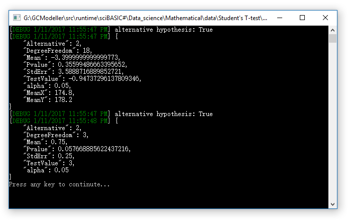

# Student’s t-test

A t-test is any statistical hypothesis test in which the test statistic follows a Student's t-distribution under the null hypothesis. It can be used to determine if two sets of data are significantly different from each other.

## The R language example

###### One sample

```R
v = c(0, 1, 1, 1)

t.test(v, mu=1)

#         One Sample t-test
#
# data:  v
# t = -1, df = 3, p-value = 0.391
# alternative hypothesis: true mean is not equal to 1
# 95 percent confidence interval:
#  -0.04561158  1.54561158
# sample estimates:
# mean of x
#      0.75
```

###### Two sample

```R
a = c(175, 168, 168, 190, 156, 181, 182, 175, 174, 179)
b = c(185, 169, 173, 173, 188, 186, 175, 174, 179, 180)

t.test(a,b, var.equal=TRUE, paired=FALSE)

#        Two Sample t-test
#
# data:  a and b
# t = -0.94737, df = 18, p-value = 0.356
# alternative hypothesis: true difference in means is not equal to 0
# 95 percent confidence interval:
#  -10.93994   4.13994
# sample estimates:
# mean of x mean of y
#     174.8     178.2
```


## Key function in the Student's T-test

#### CDF

The cumulative distribution function for a Student ``t`` random variable is

> F(t) = 1 - 0.5 * I<sub>x(t)</sub>(v/2, 0.5); (where t > 0)
>
> https://en.wikipedia.org/wiki/Student%27s_t-distribution

where **x(t) = v / (t<sup>2</sup> + v)** and I<sub>x(t)</sub> is the regularized incomplete beta function.

```vbnet
''' <summary>
''' ###### Student's t-distribution CDF
'''
''' https://en.wikipedia.org/wiki/Student%27s_t-distribution#Non-standardized_Student.27s_t-distribution
''' </summary>
''' <param name="t">Only works for ``t > 0``</param>
''' <param name="v">v is the degrees of freedom</param>
''' <returns></returns>
''' <remarks>
''' ###### 2017-1-11 test success!
'''
''' tcdf(1,1) = 0.75
''' tcdf(0,5) = 0.5
''' </remarks>
Public Function Tcdf(t#, v#) As Double
    Dim x# = v / (v + t ^ 2)
    Dim inc = SpecialFunctions.RegularizedIncompleteBetaFunction(v / 2, 0.5, x)
    Dim cdf# = 1 - 0.5 * inc
    Return cdf
End Function
```

#### T-test P-value

```vbnet
''' <summary>
'''
''' </summary>
''' <param name="t#">The t test value</param>
''' <param name="v">v is the degrees of freedom</param>
''' <returns></returns>
Public Function Pvalue(t#, v#, Optional hyp As Hypothesis = Hypothesis.TwoSided) As Double
    Select Case hyp
        Case Hypothesis.Greater
            Return 1 - Tcdf(t, v)
        Case Hypothesis.Less
            Return Tcdf(t, v)
        Case Else
            Return 2 * (1 - Tcdf(Math.Abs(t), v))
    End Select
End Function
```

## Demo

###### One sample T-test

```vbnet
Dim x#() = {0, 1, 1, 1}

With t.Test(x, mu:=1)
    Call $"alternative hypothesis: { .Valid}".__DEBUG_ECHO
    Call .GetJson(True).__DEBUG_ECHO
End With
```

###### Two sample T-test

```vbnet
Dim a#() = {175, 168, 168, 190, 156, 181, 182, 175, 174, 179}
Dim b#() = {185, 169, 173, 173, 188, 186, 175, 174, 179, 180}

With t.Test(a, b)
    Call $"alternative hypothesis: { .Valid}".__DEBUG_ECHO
    Call .GetJson(True).__DEBUG_ECHO
End With
```

