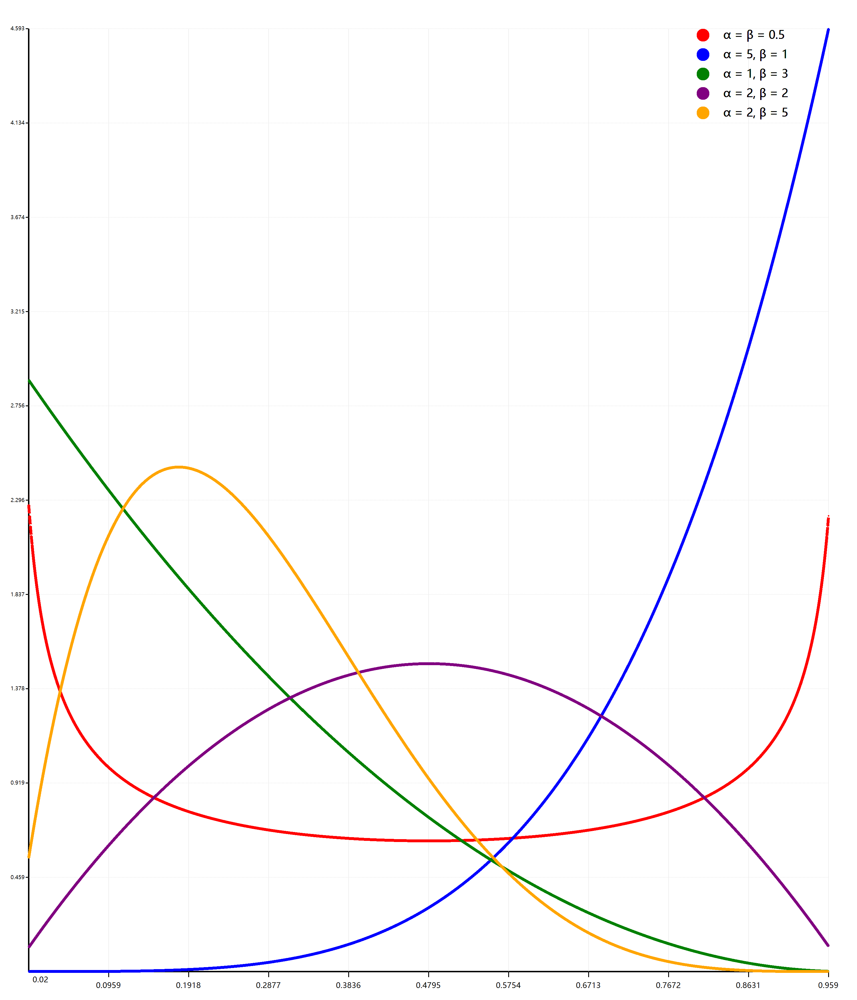

# Beta distribution

> https://en.wikipedia.org/wiki/Beta_distribution

In probability theory and statistics, the beta distribution is a family of continuous probability distributions defined on the interval [0, 1] parametrized by two positive shape parameters, denoted by ``α`` and ``β``, that appear as exponents of the random variable and control the shape of the distribution.

The beta distribution has been applied to model the behavior of random variables limited to intervals of finite length in a wide variety of disciplines. For example, it has been used as a statistical description of allele frequencies in population genetics; time allocation in project management / control systems; sunshine data; variability of soil properties; proportions of the minerals in rocks in stratigraphy; and heterogeneity in the probability of HIV transmission.

In Bayesian inference, the beta distribution is the conjugate prior probability distribution for the Bernoulli, binomial, negative binomial and geometric distributions. For example, the beta distribution can be used in Bayesian analysis to describe initial knowledge concerning probability of success such as the probability that a space vehicle will successfully complete a specified mission. The beta distribution is a suitable model for the random behavior of percentages and proportions.

The usual formulation of the beta distribution is also known as the beta distribution of the first kind, whereas beta distribution of the second kind is an alternative name for the beta prime distribution.

##### Beta PDF in VisualBasic

###### How to calculate?

```vbnet
Public Function beta(x#, alpha#, _beta#) As Double
    Return Pow(x, alpha - 1) * Pow((1 - x), _beta - 1) *
        Exp(lgamma(alpha + _beta) - lgamma(alpha) - lgamma(_beta))
End Function

Public Function lgamma(x As Double) As Double
    Dim logterm As Double = Math.Log(x * (1.0F + x) * (2.0F + x))
    Dim xp3 As Double = 3.0F + x

    Return -2.081061F - x + 0.0833333F / xp3 - 
        logterm + (2.5F + x) * Math.Log(xp3)
End Function
```

###### Plot Example

```vbnet
Imports System.Drawing
Imports Microsoft.VisualBasic.Imaging
Imports Microsoft.VisualBasic.Mathematical
Imports Microsoft.VisualBasic.Mathematical.BasicR
Imports Microsoft.VisualBasic.Mathematical.Distributions
Imports Microsoft.VisualBasic.Mathematical.Plots

Dim x As New Vector(VBMathExtensions.seq(0.02, 0.98, 0.001))
Dim s1 = Scatter.FromVector(
    Beta.beta(x, 0.5, 0.5), "red",
    ptSize:=5,
    width:=10,
    xrange:=x,
    title:="α = β = 0.5")
Dim s2 = Scatter.FromVector(
    Beta.beta(x, 5, 1), "blue",
    ptSize:=5,
    width:=10,
    xrange:=x,
    title:="α = 5, β = 1")
Dim s3 = Scatter.FromVector(
    Beta.beta(x, 1, 3), "green",
    ptSize:=5,
    width:=10,
    xrange:=x,
    title:="α = 1, β = 3")
Dim s4 = Scatter.FromVector(
    Beta.beta(x, 2, 2), "purple",
    ptSize:=5,
    width:=10,
    xrange:=x,
    title:="α = 2, β = 2")
Dim s5 = Scatter.FromVector(
    Beta.beta(x, 2, 5), "orange",
    ptSize:=5,
    width:=10,
    xrange:=x,
    title:="α = 2, β = 5")

Dim canvasSize As New Size(3000, 3500)
Dim png As Bitmap = Scatter.Plot({s1, s2, s3, s4, s5}, canvasSize)

Call png.SaveAs("./beta_PDF.png")
```

###### Generated result



##### Histogram Plot of beta-PDF

```vbnet
Dim range As New DoubleRange(0, 1)
Dim f1 = Function(xx) Beta.beta(xx, 2, 5)
Dim f2 = Function(xx) Beta.beta(xx, 2, 2)
Dim a1 As New HistProfile(range, f1, 0.025) With {
    .legend = New Legend With {
        .color = "green",
        .fontstyle = CSSFont.Win10Normal,
        .style = LegendStyles.Triangle,
        .title = "α = 2, β = 5"
        }
    }
Dim a2 As New HistProfile(range, f2, 0.05) With {
    .legend = New Legend With {
        .color = "yellow",
        .fontstyle = CSSFont.Win7Normal,
        .style = LegendStyles.Triangle,
        .title = "α = β = 2"
    }
}
Dim hist As New HistogramGroup({a2, a1})

Call Histogram.Plot(
    hist,,
    New Size(2000, 1300),
    alpha:=230) _
    .SaveAs("./beta_hist.png")
```

###### Generated Output


