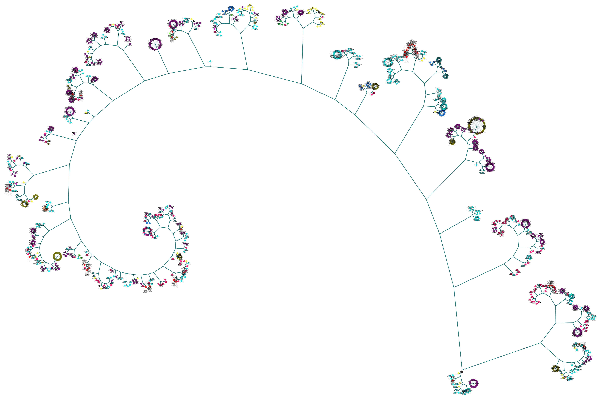

## Data Mining Algorithms (Analysis Services - Data Mining)

An *algorithm* in data mining (or machine learning) is a set of heuristics and calculations that creates a model from data. To create a model, the algorithm first analyzes the data you provide, looking for specific types of patterns or trends. The algorithm uses the results of this analysis over many iterations to find the optimal parameters for creating the mining model. These parameters are then applied across the entire data set to extract actionable patterns and detailed statistics.
The mining model that an algorithm creates from your data can take various forms, including:

+ A set of clusters that describe how the cases in a dataset are related.
+ A decision tree that predicts an outcome, and describes how different criteria affect that outcome.
+ A mathematical model that forecasts sales.
+ A set of rules that describe how products are grouped together in a transaction, and the probabilities that products are purchased together.

### Choosing the Right Algorithm
Choosing the best algorithm to use for a specific analytical task can be a challenge. While you can use different algorithms to perform the same business task, each algorithm produces a different result, and some algorithms can produce more than one type of result. For example, you can use the Microsoft Decision Trees algorithm not only for prediction, but also as a way to reduce the number of columns in a dataset, because the decision tree can identify columns that do not affect the final mining model.

#### Choosing an Algorithm by Type

+ **Classification algorithms** predict one or more discrete variables, based on the other attributes in the dataset.
+ **Regression algorithms** predict one or more continuous numeric variables, such as profit or loss, based on other attributes in the dataset.
+ **Segmentation algorithms** divide data into groups, or clusters, of items that have similar properties.
+ **Association algorithms** find correlations between different attributes in a dataset. The most common application of this kind of algorithm is for creating association rules, which can be used in a market basket analysis.
+ **Sequence analysis algorithms** summarize frequent sequences or episodes in data, such as a series of clicks in a web site, or a series of log events preceding machine maintenance.

However, there is no reason that you should be limited to one algorithm in your solutions. Experienced analysts will sometimes use one algorithm to determine the most effective inputs (that is, variables), and then apply a different algorithm to predict a specific outcome based on that data.

#### Choosing an Algorithm by Task
To help you select an algorithm for use with a specific task, the following table provides suggestions for the types of tasks for which each algorithm is traditionally used.

<table>
<tr>
<td><b>Examples of tasks</b></td>
<td width="350px"><b>Microsoft algorithms to use</b></td>
</tr>
<tr>
<td>
<b>Predicting a discrete attribute</b>:

<li>Flag the customers in a prospective buyers list as good or poor prospects.
<li>Calculate the probability that a server will fail within the next 6 months.
<li>Categorize patient outcomes and explore related factors.
</td>
<td>
<li>Microsoft Decision Trees Algorithm
<li>Microsoft Naive Bayes Algorithm
<li>Microsoft Clustering Algorithm
<li>Microsoft Neural Network Algorithm
</td>
</tr>
<tr>
<td>
<b>Predicting a continuous attribute</b>:

<li>Forecast next year's sales.
<li>Predict site visitors given past historical and seasonal trends.
<li>Generate a risk score given demographics.
</td>
<td>
<li>Microsoft Decision Trees Algorithm
<li>Microsoft Time Series Algorithm
<li>Microsoft Linear Regression Algorithm
</td>
</tr>
<tr>
<td>
<b>Predicting a sequence</b>:

<li>Perform clickstream analysis of a company's Web site.
<li>Analyze the factors leading to server failure.
<li>Capture and analyze sequences of activities during outpatient visits, to formulate best practices around common activities.
</td>
<td>
<li>Microsoft Sequence Clustering Algorithm
</td>
</tr>
<tr>
<td>
<b>Finding groups of common items in transactions</b>:

<li>Use market basket analysis to determine product placement.
<li>Suggest additional products to a customer for purchase.
<li>Analyze survey data from visitors to an event, to find which activities or booths were correlated, to plan future activities.
</td>
<td>

<li>Microsoft Association Algorithm
<li>Microsoft Decision Trees Algorithm
</td>
</tr>
<tr>
<td>
<b>Finding groups of similar items</b>:

<li>Create patient risk profiles groups based on attributes such as demographics and behaviors.
<li>Analyze users by browsing and buying patterns.
<li>Identify servers that have similar usage characteristics.
</td><td>

<li>Microsoft Clustering Algorithm
<li>Microsoft Sequence Clustering Algorithm
</td>
</tr>
</table>

## Data Visualization Gallery

### The KMeans Binary Tree Clustering Visualization



```vbnet
Imports Microsoft.VisualBasic.DataMining.KMeans.Tree

Public Shared Function TreeCluster(
                         source As IEnumerable(Of KMeans.Entity),
              Optional parallel As Boolean = False, 
              Optional [stop] As Integer = -1) As KMeans.Entity()
```

###### Summary:
二叉树聚类的路径会在Microsoft.VisualBasic.DataMining.KMeans.Entity.uid上面出现

###### Parameters:
_source_: 

_parallel_: 

_stop_: Max iteration number for the kmeans kernel

###### Returns:

### Fuzzy C-Means


```vbnet
Imports Microsoft.VisualBasic.DataMining.FuzzyCMeans

Public Shared Function FuzzyCMeans(
                                         data As IEnumerable(Of FuzzyCMeans.Entity), 
                             numberOfClusters As Integer, 
              Optional fuzzificationParameter As Double = 2, 
              Optional maxIterates As Integer = 32767, 
              Optional threshold As Double = 0.001, 
              Optional ByRef trace As Dictionary(Of Integer, List(Of FuzzyCMeans.Entity)) = Nothing) As List(Of FuzzyCMeans.Entity)

    ' Member of Microsoft.VisualBasic.DataMining.FuzzyCMeans.FuzzyCMeansAlgorithm
```

###### Summary:
**Fuzzy clustering** (also referred to as **soft clustering**) is a form of clustering in which each data point can belong to more than one cluster.

###### Parameters:
_data_: 

_numberOfClusters%_: 

_fuzzificationParameter#_: This parameter value should greater than **1.0**

_maxIterates%_: 

_threshold#_: 

_trace_: 

Returns:

### GeneticAlgorithm

Model parameter spaces analysis of the virus infection dynamics model, using the VisualBasic internal RK4 ODEs dynamics system solver, from the result of Genetic Algorithm estimates:


