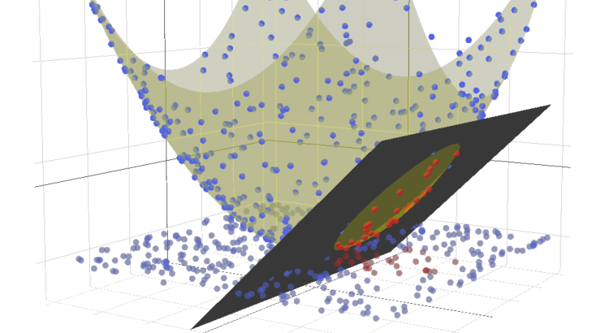

# SVM(Support Vector Machine)

> From the original works: [Android SVM](https://github.com/vRallev/SVM)

#### Support Vector Machines for classification


> To whet your appetite for support vector machines, here’s a quote from machine learning researcher Andrew Ng: **"SVMs are among the best (and many believe are indeed the best) ‘off-the-shelf’ supervised learning algorithms."**(http://efavdb.com/svm-classification/)

### Using the code

```vbnet
Imports System.Drawing
Imports Microsoft.VisualBasic.DataMining.ComponentModel
Imports Microsoft.VisualBasic.DataMining.SVM
Imports Microsoft.VisualBasic.DataMining.SVM.Model
Imports Microsoft.VisualBasic.Imaging
Imports Test_SVM.Model.ColorClass

Module Program

    Sub Main()
        Dim cs = InsertDefault()
        Call cs.Calculate(Optimizers.GradientDescent)

        With New Size(650, 500).CreateGDIDevice
            Call cs.Draw(.Graphics, .Width, .Height)
            Call .ImageResource _
                 .SaveAs("../../../SVM-plot.png")
        End With
    End Sub

    Function InsertDefault() As CartesianCoordinateSystem
        Dim toAdd As New List(Of LabeledPoint)
        Dim colors As Dictionary(Of Test_SVM.Model.ColorClass, ColorClass) = ColorClass _
            .FromEnums(Of Model.ColorClass) _
            .ToEnumsTable(Of Model.ColorClass)

        toAdd.Add(New LabeledPoint(0.4, 0.4, colors(RED)))
        toAdd.Add(New LabeledPoint(0.7, 0.6, colors(RED)))
        toAdd.Add(New LabeledPoint(0.2, 0.6, colors(BLUE)))
        toAdd.Add(New LabeledPoint(0.4, 0.9, colors(BLUE)))
        toAdd.Add(New LabeledPoint(1, 1, colors(BLUE)))
        toAdd.Add(New LabeledPoint(1, 0.75, colors(BLUE)))
        toAdd.Add(New LabeledPoint(0.6, 0.59, colors(BLUE)))
        toAdd.Add(New LabeledPoint(0.14, 0.5, colors(RED)))

        Dim line As New Line(0, 0.4, 1, 0.9)
        Dim cartesianCoordinateSystem As New CartesianCoordinateSystem(points:=toAdd) With {
            .Line = line
        }

        Return cartesianCoordinateSystem
    End Function
End Module
```

