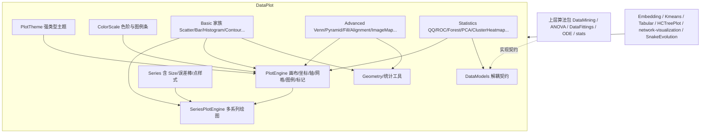

## 用户诉求

把两个即将废弃的绘图项目（`Plots/plots-netcore5.vbproj`、`Plots-statistics/plots_extensions-netcore5.vbproj`）中**全部二维绘图能力**重写迁移到新版 `DataPlot/DataPlot.vbproj`，使其成为一个自包含的图表库；旧项目在后续版本删除。

## 产品概览

DataPlot 目前已完成散点、折线、柱状、直方、箱线、小提琴、抖动、气泡、饼图、玫瑰、雷达、热图、和弦、桑基、树图等基础与高级插图。本次补齐其余两类缺口：来自 Plots 的分布/构成/轮廓类插图（轮廓图、曲面热图、人口金字塔、韦恩图、多边形填充、主曲线、序列对齐、带误差棒与气泡尺寸映射的散点家族），以及来自 Plots-statistics 的统计诊断类插图（QQ、ROC、森林图、回归拟合、碎石图、PCA 得分图、双直方图、曼哈顿图、泡泡热图、密度图、聚类热图、相关性矩阵与下三角图、树+堆叠柱联动、时间趋势、变宽条形图、Z-score、样本正态性视图）。

## 核心特性

- **家族合并**：柱状图 6 份变体、小提琴 2 份、heatmap 4 类入口、多边形填充 3 类分别收敛为单个参数化图表类，通过方向/堆叠模式/色阶/标签开关覆盖旧用法。
- **空桩补齐**：双直方图、森林图、泡泡热图、曼哈顿图按标准算法实现（划分式累积分布、效应量与置信区间、"负对数 p 值 + 建议/显著双阈值 + 峰顶标签"、成对 -log10P 分面）。
- **依赖解耦**：聚类树、回归拟合结果、KMeans 排序、相关性矩阵、PCA 得分、ODE 输出等统计算法产物，改为由 DataPlot 内定义的轻量数据模型与接口承载，DataPlot 依赖保持四个不变，统计算法仍由调用方提供。
- **消费者一并迁移**：Embedding/Kmeans/Tabular、HCTreePlot 聚类树、network-visualization 的 KD-Tree 图、SnakeEvolution 曲线查看器、test5 测试集改指向 DataPlot 并编译通过。
- **收尾清理**：旧项目、解决方案入口与文档同步更新，`Examples.vb` 为新图表补齐可运行示例。

## 技术栈

沿用 DataPlot 现状，不引入新包：`VB.NET / net10.0`，`RootNamespace = Microsoft.VisualBasic.Data.Plots`；依赖保持四项不变——`imaging.NET5`（`IGraphics`/`GraphicsData`/`d3js.scale`/`Drawing2D.Math2D`）、`Core`、`html_netcore5`（`CSSEnvirnment` 仅在必要时使用）、`Math.NET5`（`Quantile`、`Distributions.BinBox`、`Interpolation`、`LinearAlgebra`）。

## 实施方案

### 策略

采用**「统一引擎 + 轻量数据契约」**的分阶段重写：

1. 先抽出三个通用底座（色彩刻度、几何/统计工具、轻量数据模型），让后续每个新图表只需写自身绘制逻辑；
2. 按「基础家族 → 高级 2D → 统计插图」顺序逐个迁移，图表类统一继承 `PlotEngine`/`SeriesPlotEngine`，采用现有 `Public Sub Plot()` 模板（画背景/标题 → 算范围 → 画轴 → 画主体 → 画图例），不引入第二种基类风格；
3. 统计类图表通过 DataPlot 自持的接口接收算法产物，彻底切断对 DataMining/ANOVA/DataFittings/ODE/stats/hctree/Graph/dataframe 的引用；
4. 最后把 6 个消费者改指 DataPlot，再删旧项目。

### 关键技术决策与取舍

- **不搬旧 `g/Plot` 基类**：旧包存在两套风格（继承 `MustInherit Plot` 与 `g.GraphicsPlots(size, padding, bg, plotInternal)` lambda 门面），统一为 DataPlot 的 `PlotEngine` 一种，避免双主题系统（旧 `Graphic.Canvas.Theme` 的 CSS 字符串体系 vs DataPlot 的 `PlotTheme` 强类型体系）长期并存。代价是消费者里的 `Inherits Plot` 必须改写，这正是本次一并处理的范围。
- **不强依赖 GgplotTheme**：`Engine/GgplotTheme/*` 当前只被自身与 README 引用，未被任何图表使用，本次不触碰它，避免同时改变两套主题契约放大回归面。
- **扩展现有类而非新增类**：散点图家族（误差棒、气泡尺寸、样条、拟合线、凸包填充、抖动）合并进现有 `Basic/ScatterPlot.vb`；柱状图家族（分组/堆积/百分比/双向/水平/色阶/自定义笔刷标签）合并进现有 `Basic/BarPlot.vb`；聚类热图复用现有 `Advanced/HeatmapPlot.vb` 的色阶逻辑。这样对外 API 数量不膨胀，旧用法靠参数组合覆盖。
- **统计算法留在调用方**：`ClusterTreeNode`、`IRegressionFit`、`IPCAScore`、相关性矩阵等只描述「结果」，DataPlot 不实现任何算法；同时在 `DataModels.vb` 提供 `FromClusterTree`/`FromKmeans` 之类的适配器，让老调用方能就地转换。
- **3D 不迁移**：`3D/`（Scatter3D、ScatterHeatmap、PieChart3D、Element3D/RenderEngine/Camera、Serial3D）与 `Image3DMap` 保留在 Canvas3D，本次只迁 `Image2DMap` 等位图二维映射能力。

### 性能要点

- 迁移代码严格**复用现有 helper 的画笔/字体**，并把 `Pen`/`Brush`/`StringFormat` 提升到循环外；对照现有 `DrawAxisAndGrid`（每个刻度标签内部 new 一个 `StringFormat`）这类写法不再复制。
- 矩阵类图表（聚类热图、相关系数矩阵、下三角、密度图、轮廓图）先算值域再逐格 `FillRectangle`，O(m·n) 一次遍历；`DrawImage` 缩放交给 imaging 现有冲动量算。
- 密度图与轮廓图的网格分辨率默认与画布像素挂钩（建议 240×240 上限），避免函数求值成为瓶颈；`Math2D.MarchingSquares` 与 `ConvexHull` 复用 imaging 实现，不自写。
- “对外画布”场景（`New(g As IGraphics)`）保持 `_ownsGraphics=False`，不释放宿主画布。

### 兼容性控制

- 现有 `PlotEngine`/`Series`/`PlotTheme`/`Extensions` 只做**加成员**，不改既有签名；`Extensions.SavePng` 依赖 `GdiRasterGraphics` 的行为维持，另加一个 `SaveAs(path, format)` 兜底以免外部画布场景崩溃。
- Tabular 目录已自定义 `LoadDataSet`/`LoadBarData`，DataPlot 新增扩展方法时避开同名，实在需要则用 `plt.` 前缀命名，防止 Visual Basic 全局 Module 扩展冲突。

## 目录结构

```
g:/pixelArtist/src/framework/Data_science/Visualization/DataPlot/
├── DataPlot.vbproj                          # [MODIFY] 更新 Title/Description/PackageTags/PackageReleaseNotes，引用保持 4 个
├── Extensions.vb                            # [MODIFY] 增加 Save/SaveAs 统一导出、NaN 安全取值等小工具
├── Engine/
│   ├── PlotEngine.vb                        # [MODIFY] 增加受保护子类钩子：DrawColorLegend、MeasureText、DrawLabelIfNotOverlap、DrawAbline
│   ├── PlotTheme.vb                         # [MODIFY] 增加 LegendSplit/ColorBarWidth/GridMinorWidth 等少量字段，Light/Dark/Nature/Science/Grayscale 同步
│   ├── Series.vb                            # [MODIFY] 增加 Size#()、ErrorMinus/ErrorPlus、PointSize、FillColor，支持气泡/误差棒/面积填充
│   ├── ColorScale.vb                        # [NEW] 由 Advanced/HeatmapPlot.vb 抽出 ColorMapType 枚举 + GetColor/Brightness/LerpPalette + DrawColorLegend（垂直/水平）
│   ├── DataModels.vb                        # [NEW] 轻量数据模型与解耦接口：ClusterTreeNode、IRegressionFit、IPCAScore、CorrelationMatrix、CategoryGroup、VariableBarData、TimePoint、QuantileSample、BoxDatum、PolygonGroup、BarSerial、ODESeries 等 + 适配构造
│   └── Geometry.vb                          # [NEW] 共享工具：Quantile/KDE/Spline NA-safe、Jitter、数据矩阵行/列标准化、treemap squarify 布局、venn 圆求交、文字避让
├── Basic/                                   # 改造既有家族，全部 Inherits SeriesPlotEngine 或 PlotEngine
│   ├── ScatterPlot.vb                       # [MODIFY] 合并 Scatter2D/Bubble/jitter/误差棒/样条/拟合线/凸包轮廓/PlotFunction 表达式入口
│   ├── BarPlot.vb                           # [MODIFY] 合并 Simple/Alternative/Stacked/Bidirectional/Level/Styled → BarMode+Orientation+StackMode+ColorScale+ValueLabel
│   ├── HistogramPlot.vb                     # [MODIFY] 支持原始样本/DataBinBox/多组叠加/双向直方图（为 Bihistogram 提供内核）
│   ├── LinePlot.vb                          # [MODIFY] 样条与误差带、基于 ScatterPlot 复用绘制管线
│   ├── AreaPlot.vb / StackedAreaPlot.vb / StackedBarPlot.vb   # [MODIFY] 与新 Bar/Scatter 管线对齐
│   └── ContourPlot.vb                       # [NEW] 合并 ContourPlot/ContourHeatMapPlot/PlotContour：模式=等值线|填充|曲面热图，数据源=矩阵|Func(Of Double,Double,Double)|符号表达式
├── Advanced/
│   ├── HeatmapPlot.vb                       # [MODIFY] 色阶逻辑迁到 Engine/ColorScale.vb，本类改为消费方并支持行列标签、值标签、行列聚类布局
│   ├── VennPlot.vb                          # [NEW] Venn2/Venn3，含 VennSet 模型
│   ├── PyramidPlot.vb                       # [NEW] 人口金字塔
│   ├── FillPolygons.vb                      # [NEW] 合并 FillPolygons/PolygonPlot2D：多边形组填充 + 可选散点叠层
│   ├── AlignmentPlot.vb                     # [NEW] 多序列/多组信号对齐图
│   ├── PrincipalCurvePlot.vb                # [NEW] 主曲线可视化
│   ├── ImageMapPlot.vb                      # [NEW] 位图→二维高度场热图（仅 2D 入口）
│   └── BoxPlot.vb / ViolinPlot.vb / JitterPlot.vb / ChordPlot.vb / SankeyPlot.vb / TreemapPlot.vb / PiePlot.vb / RadarPlot.vb / RosePlot.vb   # [MODIFY] 视需要对齐新 Series 字段与新 ColorScale
├── Statistics/                              # [NEW] 统计诊断插图，全部消费 Engine/DataModels.vb 契约
│   ├── QQPlot.vb / ROCPlot.vb / ForestPlot.vb / RegressionPlot.vb
│   ├── ScreePlot.vb / PCAScorePlot.vb / ConfidenceEllipse.vb
│   ├── BiHistogramPlot.vb / ManhattanPlot.vb
│   ├── ClusterHeatmapPlot.vb / CorrelationHeatmapPlot.vb / CorrelationTrianglePlot.vb / BubbleHeatmapPlot.vb / TreeStackedBarPlot.vb / DensityPlot.vb
│   └── TimeTrendsPlot.vb / VariableWidthBarPlot.vb / ZScorePlot.vb / SampleViewPlot.vb
├── test/
│   └── Examples.vb                          # [MODIFY] 为每类新图表补 Demo* 方法，纳入 RunAll
└── README.md                                # [MODIFY] 更新支持图表表与“与 Plots 包的分工”段落
```

跨 ProjectReference 的改造范围（第 4、5 步）：
`gr/network-visualization/Visualizer/DrawKDTree.vb`、`Visualization/{Embedding,Kmeans,Tabular}/*`、`Visualization/Canvas3D/Canvas3D.vbproj`、`Visualization/test/test5.vbproj` 下约 14 个测试文件、`DataMining/.../HCTreePlot/*`（DendrogramPanel 三级继承链 + Dendrogram.vb + DendrogramPanelV2.Paint）、`SnakeEvolution/AI/QLearn/FormPlotViewer.vb`。

## 系统架构



## 实施要点（防回归）

- **轻量数据契约**：`DataModels.vb` 只描述结果（`ClusterTreeNode` 带 `Left/Right/Height/Leaf Names`、`IRegressionFit` 暴露 `X/Y/Yfit/EquationText/ConfidenceBand`、相关系数用 `Double(,)` + 行列名），禁止把任何包名塞进来；完成後用正则检查 DataPlot 源码不出现 `ChartPlots`、`DataMining`、`ANOVA`、`Data.Bootstrapping`、`Math.Calculus.Dynamics` 等字样。
- **编译节奏**：每完成一个图表家族立即构建 DataPlot（含 JSON schema 一致性检查），禁止跨阶段遗留不可编译状态。
- **画布局部性**：绘制相关字段共用一套 `Legend`/色阶 API；不要再写第二份 colorbar。
- **日志与异常**：入库参数做显式校验并抛出带参数名的 `ArgumentException`（沿用 `PlotEngine.New` 里 `ArgumentNullException(NameOf(g))` 的风格），静默 NP 错误比抛错更难定位。
- **不改的东西**：不动 `Engine/GgplotTheme/*`，不删除 `Engine/PlotTheme.vb` 既有字段，不改 `Extensions.SavePng` 现有签名。

## 关键结构定义

DataPlot 内用于接收外部算法产物的解耦契约（放在 `Engine/DataModels.vb`）：

```
Public Class ClusterTreeNode
    Public Property Height As Double
    Public Property Leaves As String()          ' 叶节点名集合
    Public Property Left As ClusterTreeNode
    Public Property Right As ClusterTreeNode
    Public ReadOnly Property IsLeaf As Boolean
End Class

Public Interface IRegressionFit
    ReadOnly Property X As Double()
    ReadOnly Property Y As Double()
    ReadOnly Property Yfit As Double()
    ReadOnly Property EquationText As String
    ReadOnly Property BandLower As Double()     ' 可为 Nothing
    ReadOnly Property BandUpper As Double()
End Interface

Public Interface IPCAScore
    ReadOnly Property SampleNames As String()
    ReadOnly Property Groups As String()
    ReadOnly Property PC1 As Double()
    ReadOnly Property PC2 As Double()
    ReadOnly Property Contributions As Double() ' 各主成分贡献率，供碎石图使用
End Interface
```

图表统一外观约定（沿用现有风格，不新增基类）：

```
Public Class XxxPlot : Inherits PlotEngine
    Public Sub New(width As Integer, height As Integer, Optional theme As PlotTheme = Nothing)
    Public Property <数据模型> As ...          ' 优先使用 Engine/DataModels.vb 中的类型
    Public Property <开关> As Boolean          ' 例如 Horizontal / ShowConfidenceBand / StackMode
    Public Sub Plot()                          ' DrawBackground → ComputePlotArea → DrawPlotArea → DrawTitle → DrawAxisAndGrid → 画主体 → DrawLegend/DrawColorLegend
End Class
```

## 可用扩展

### SubAgent

- **code-explorer**
- 用途：迁移每一类图表前，回读 `Plots/` 与 `Plots-statistics/` 中对应原始实现，核对坐标刻度策略、图例布局、边界处理（空数据、常量数据、单样本）等细节
- 预期产出：为每个迁移类产出「原始行为清单」，确保重写后视觉与数值行为不失真

### Skill

- **lsp-code-analysis**
- 用途：改造消费者时做符号引用/定义跳转与重构影响面分析（尤其 `Inherits Plot` 的继承链、扩展方法冲突排查）
- 预期产出：精确定位每个待改消费点，避免漏改导致编译失败