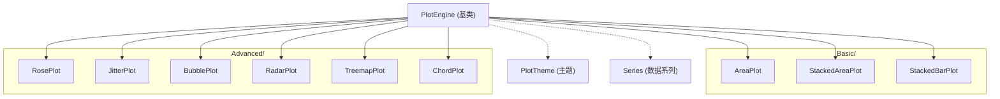

## 产品概述

在现有 VB.NET GDI+ 数据绘图框架（DataPlot）基础上，新增 9 种图表绘制 Class 模块，扩展框架的图表类型覆盖范围。所有新模块复用现有 PlotEngine 基类、PlotTheme 主题系统、Series 数据系列及 Extensions 工具方法。

## 核心功能

- **基础面积图（AreaPlot）**：在折线下方填充半透明颜色，支持多系列重叠，可选平滑曲线
- **堆叠面积图（StackedAreaPlot）**：多系列沿 Y 轴累加堆叠，各层颜色区分，展示各部分对整体贡献
- **堆叠柱状图（StackedBarPlot）**：多系列柱体沿 Y 轴堆叠（而非分组），支持横向/纵向、数值标签
- **南丁格尔玫瑰图（RosePlot）**：极坐标图，每个类别等角度扇区，半径与数值成比例
- **Jitter 散点图（JitterPlot）**：分组散点图，同组数据点在 X 轴方向添加随机抖动以避免遮挡
- **气泡图（BubblePlot）**：三维散点图，X/Y 定位，气泡大小映射第三维数据
- **雷达图（RadarPlot）**：多维度数据以蛛网图展示，多系列叠加填充对比
- **矩形树图（TreemapPlot）**：层次数据以嵌套矩形展示，使用 Squarified 布局算法优化宽高比
- **和弦图（ChordPlot）**：邻接矩阵数据以圆形布局展示，节点间用贝塞尔曲线连接，粗细映射关系强度

## 技术栈

- 语言：VB.NET（.NET 10.0）
- 绘图：GDI+（通过 `Microsoft.VisualBasic.Imaging` 的 `IGraphics` 接口）
- 基类：`PlotEngine`（提供画布管理、坐标变换 `ToPixelX/ToPixelY`、轴/网格绘制 `DrawAxisAndGrid`、图例 `DrawLegend`、标记 `DrawMarker`、刻度生成 `GenerateTicks`）
- 主题：`PlotTheme`（Palette 10 色调色板、字体、线宽、边距等）
- 项目结构：SDK 风格 `<Project Sdk="Microsoft.NET.Sdk">`，glob 自动包含 .vb 文件，无需手动注册

## 实现方案

### 整体策略

所有 9 个图表 Class 均 `Inherits PlotEngine`，遵循现有代码模式：构造函数 `New(width, height, Optional theme)` → `Plot()` 方法内依次调用 `DrawBackground` → `ComputePlotArea`/`DrawPlotArea` → `DrawTitle` → `DrawAxisAndGrid`（如需）→ 绘制数据 → `DrawLegend`（如需）。GDI 资源（Brush/Pen/GraphicsPath）均使用 `Using` 块确保释放。

### 各图表关键技术决策

**1. AreaPlot & StackedAreaPlot（面积图系列）**

- AreaPlot 复用 `IList(Of Series)` 模式（同 ScatterPlot），对每条线计算多边形顶点 = 线上点 + 基线点（Y=0 处），用 `FillPolygon` 半透明填充 + `DrawLines` 描边
- 平滑曲线采用 Catmull-Rom 样条插值：将原始控制点采样为密集折线点（每段 ~20 点），再 `FillPolygon`/`DrawLines`，仅依赖已确认可用的 API
- StackedAreaPlot 使用 `Categories` + `MultiValues[系列, 类别]` + `SeriesNames`（同 BarPlot 的多维数组模式），逐列累加得到各层上界，用 `FillPolygon` 填充相邻层之间的区域

**2. StackedBarPlot（堆叠柱状图）**

- 基于 BarPlot 的数据结构（`Categories`、`MultiValues[系列,类别]`、`SeriesNames`、`Horizontal`、`ShowValueLabels`），核心差异：同一类别内各系列柱体沿 Y 轴累加堆叠而非并排
- Y 轴最大值 = 各类别跨系列累加和的最大值 × 1.1

**3. RosePlot & RadarPlot（极坐标系列）**

- RosePlot 复用 PiePlot 的极坐标模式：每个类别等角度扇区（`sweep = 360/n`），用 `FillPie` 绘制，椭圆尺寸的半径 = `value/maxValue × maxRadius`，扇区半径不同
- RadarPlot 自定义布局：圆心 + n 条辐射轴，每轴上数据点距圆心 = `value/maxValue × radius`；多系列用 `FillPolygon`（半透明）+ `DrawPolygon`（描边）叠加；同心多边形网格 + 轴线 + 轴标签

**4. JitterPlot & BubblePlot（散点变体系列）**

- JitterPlot 复用 BoxPlot 的分组模式（`Groups: List(Of {Name, Data()})`），每个数据点 X = 组中心 + 随机偏移（`jitter = groupWidth × 0.25`），Y = 数据值，用 `DrawMarker` 绘制
- BubblePlot 复用 ScatterPlot 的 `IList(Of Series)` 模式，但 Series 扩展第三维 `Size`（通过自定义 `BubbleSeries` 或在 Plot 方法接收 `Sizes` 数组），标记半径 = `sizeNorm × Theme.MarkerSize × scale`

**5. TreemapPlot（矩形树图）**

- 输入：扁平节点列表 `TreemapNode {Label, Value, Color?}`（同 SankeyNode 模式，辅助类同文件定义）
- Squarified 算法：递归将矩形按面积比例切分，优化子矩形宽高比接近 1:1
- 无标准坐标轴，自定义 `_plotArea` 后全画布填充

**6. ChordPlot（和弦图）**

- 输入：`NodeLabels: String()` + `Matrix: Double(,)`（n×n 邻接矩阵）
- 节点排列在圆周上，各节点占弧段比例 = 该节点总流量 / 全局总流量
- 弧段用 `FillPie` 绘制节点色带；和弦用 `GraphicsPath` + `AddBezier`（同 SankeyPlot 已验证模式）穿过圆心附近连接两端
- 节点标签沿径向外侧排列

### 性能考量

- Catmull-Rom 插值每段采样 ~20 点，典型 100 点数据线产生 ~2000 顶点的多边形，GDI+ FillPolygon 可轻松处理
- TreemapPlot Squarified 算法复杂度 O(n log n)（排序）+ O(n)（递归切分），对典型几百节点无压力
- ChordPlot 和弦数量 = n²（矩阵元素数），n>50 时考虑仅绘制非零元素；贝塞尔路径填充约 O(n²) 次绘制调用
- 所有图表的 GDI 资源均 `Using` 包裹，避免泄漏

## 实现注意事项

- **导入约定**：参照 SankeyPlot/BoxPlot 使用别名导入（`Imports SolidBrush = Microsoft.VisualBasic.Imaging.SolidBrush` 等），确保 `GraphicsPath`、`DashStyle` 等类型解析正确
- **坐标变换**：极坐标图表（Rose/Radar/Chord）不调用 `DrawAxisAndGrid`，自定义布局后直接绘制；笛卡尔图表复用基类坐标轴
- **图例**：多系列图表（AreaPlot/StackedAreaPlot/StackedBarPlot/RadarPlot/BubblePlot）调用 `DrawLegend(seriesList)`，单类别图表（Rose/Treemap/Jitter）按需绘制
- **颜色透明度**：面积/雷达填充使用 `Color.FromArgb(120, color)` 半透明，避免多系列遮挡
- **向后兼容**：不修改任何现有文件，仅新增 .vb 文件；SDK 项目 glob 自动包含，无需编辑 .vbproj
- **随机抖动**：JitterPlot 使用固定随机种子（`New Random(42)`）确保可复现，或暴露 `RandomSeed` 属性

## 架构设计



## 目录结构

```
DataPlot/
├── Basic/
│   ├── BarPlot.vb              # [现有] 无修改
│   ├── LinePlot.vb             # [现有] 无修改
│   ├── ScatterPlot.vb          # [现有] 无修改
│   ├── HistogramPlot.vb        # [现有] 无修改
│   ├── AreaPlot.vb             # [新增] 基础面积图。接收 IList(Of Series)，Catmull-Rom 平滑插值，FillPolygon 半透明填充 + DrawLines 描边。支持多系列、可选平滑开关。
│   ├── StackedAreaPlot.vb      # [新增] 堆叠面积图。Categories + MultiValues[系列,类别] + SeriesNames，逐列累加，FillPolygon 填充相邻累积层间区域。
│   └── StackedBarPlot.vb       # [新增] 堆叠柱状图。复用 BarPlot 数据结构，同类别各系列沿 Y 轴累加堆叠，支持 Horizontal/ShowValueLabels。
├── Advanced/
│   ├── PiePlot.vb              # [现有] 无修改
│   ├── HeatmapPlot.vb          # [现有] 无修改
│   ├── BoxPlot.vb              # [现有] 无修改
│   ├── ViolinPlot.vb           # [现有] 无修改
│   ├── BoxGroup.vb             # [现有] 无修改
│   ├── SankeyPlot/             # [现有] 无修改
│   ├── RosePlot.vb             # [新增] 南丁格尔玫瑰图。Labels + Values，等角度扇区 FillPie，半径与值成比例，支持 Donut 模式、标签百分比。
│   ├── JitterPlot.vb           # [新增] Jitter 散点图。Groups(List of {Name, Data()})，组内点 X 加随机抖动，DrawMarker 绘制，可复现随机种子。
│   ├── BubblePlot.vb           # [新增] 气泡图。IList(Of BubbleSeries)（含 X/Y/Sizes），标记半径映射第三维，可选大小图例。
│   ├── RadarPlot.vb            # [新增] 雷达图。Categories + MultiValues[系列,类别]，辐射轴 + 同心网格，FillPolygon 半透明叠加多系列。
│   ├── TreemapPlot.vb          # [新增] 矩形树图。List(Of TreemapNode)，Squarified 布局算法递归切分，同文件定义 TreemapNode 辅助类。
│   └── ChordPlot.vb            # [新增] 和弦图。NodeLabels + Matrix(n,n)，圆周节点弧段 + GraphicsPath 贝塞尔和弦，同文件定义 ChordLink 辅助类。
├── Engine/                     # [现有] 无修改
├── Extensions.vb               # [现有] 无修改
└── DataPlot.vbproj             # [现有] 无修改（SDK glob 自动包含新文件）
```

## 关键代码结构

### BubbleSeries（气泡图数据系列，继承 Series 扩展第三维）

```
''' <summary>气泡图数据系列</summary>
Public Class BubbleSeries
    Inherits Series
    ''' <summary>气泡大小（第三维数据）</summary>
    Public Property Sizes As Double() = {}
End Class
```

### TreemapNode（矩形树图节点）

```
''' <summary>矩形树图节点</summary>
Public Class TreemapNode
    Public Property Label As String
    Public Property Value As Double
    Public Property Color As Color? = Nothing
    Public Property Group As String = ""
End Class
```

### ChordLink（和弦图连接，可选辅助结构）

```
''' <summary>和弦图连接</summary>
Public Class ChordLink
    Public Property Source As Integer
    Public Property Target As Integer
    Public Property Value As Double
End Class
```