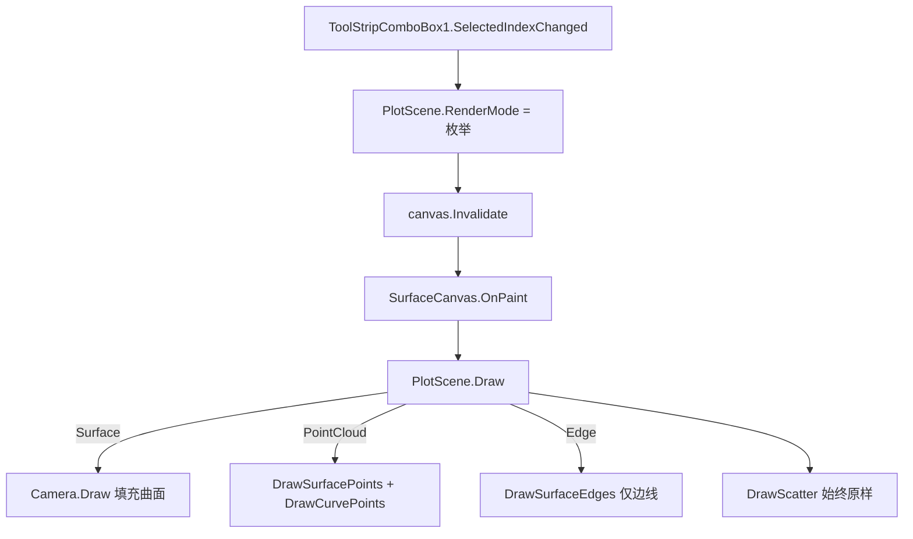

## 产品概述

为三维数学表达式绘图器新增“三维图形渲染模式”切换能力，通过 MainForm 工具栏中的 ToolStripComboBox1 下拉框（已包含 surface / point cloud / edge 三项）实时改变已生成三维图形的呈现方式，选择后立即刷新画布。

## 核心特性

- surface 模式：完整绘制 Surface 曲面（含光照填充），不对 line、scatter 产生任何影响（即保持现状）。
- point cloud 模式：仅以“点云”方式渲染三维图形顶点；影响 surface 与 line 两类图形，使用其各自既有的基色（色表/渐变色），scatter 仍按原样绘制不受影响。
- edge 模式：仅绘制 Surface 多边形边线、不做面填充；边框线颜色取自该 Surface 模型的 brush 基色；不影响 line 与 scatter。
- 通过 ToolStripComboBox1 切换模式后，画布应立即重绘当前图形（沿用 cboScheme 的“改属性→刷新”即时模式）。

## 技术栈

- 语言/框架：VB.NET + Windows Forms（GDI+ 渲染）
- 三维管线：复用现有 Microsoft.VisualBasic.Imaging.Drawing3D（Camera / PainterAlgorithm / Surface），不改动共享成像库
- 修改范围：仅 MESH 项目内的 PlotScene.vb 与 MainForm.vb，保持最小改动面

## 实现方案

新增一个枚举 `RenderMode3D`（Surface / PointCloud / Edge，枚举序与下拉框项顺序一致），在 PlotScene 上暴露 `RenderMode` 属性（默认 Surface）。核心绘制逻辑 `PlotScene.Draw` 依据该属性分派：

- Surface：维持 `Camera.Draw(g, surfaces, drawPath:=False)`。
- PointCloud：surface 与 line 改为绘制各自顶点（点云）；scatter 原样。
- Edge：surface 仅绘多边形边（无填充）；line 与 scatter 原样。

关键决策与权衡：

1. edge 模式直接复用 `Camera.PainterBuffer(surfaces, illumination:=False)`：该函数已完成投影 + Z 排序，且 illumination=False 时 `polygon.brush` 为基色（System.Drawing.SolidBrush），`polygon.points` 为已投影 PointF()，可无缝 `g.DrawPolygon(pen, points)` 绘制边线，无需重造投影/排序逻辑。
2. point cloud 的 surface 顶点绘制复用现有 `ToScreen(v)`（与当前曲面/曲线同一投影路径，坐标一致），对每个 surface 顶点 `FillEllipse`；line 点云复用 `curvePoints` + `curveColors(i)` 投影后绘制。两者均使用既有基色，满足“使用之前的颜色定义”。
3. 颜色提取统一用 `GetBrushColor(b As Brush) As Color`：对 SolidBrush 取 `.Color`，否则回退 Black，兼容色表 SolidBrush 与 PainterBuffer 重建的 SolidBrush。
4. 不额外处理 `Camera.Offset`：现有曲面渲染管线（Camera.Draw / ToScreen）本就未应用 Offset，自定义绘制保持同一约定，避免坐标错位。

性能：edge 模式走 PainterBuffer 的并行投影，复杂度 O(N)；point cloud 逐顶点 O(N)，对 120×120 网格数量级仍在交互帧预算内，可接受。点云对共享顶点重复绘制仅视觉重叠、开销可忽略。

## 实现要点

- 仅修改 PlotScene.vb（新增枚举/属性/分支/辅助方法）与 MainForm.vb（接线 SelectedIndexChanged）。
- 不改动 PlotScene.Clear()/SetSurface/SetLine/SetScatter，渲染模式随 Scene 实例保留，脚本重绘后模式不丢失。
- 即时刷新：MainForm 中 `RenderMode = CType(ToolStripComboBox1.SelectedIndex, RenderMode3D)` 后 `canvas.Invalidate()`（与 cboScheme_SelectedIndexChanged 同模式）。
- 注意：用户文字称下拉框在 ScriptEditorForm，但代码中 ToolStripComboBox1 实际定义在 MainForm，故接线在 MainForm。

## 架构设计



## 目录结构

```
g:\pixelArtist\src\framework\Data_science\Visualization\MESH\
├── PlotScene.vb      # [MODIFY] 新增 RenderMode3D 枚举与 RenderMode 属性；重构 Draw 分派三种模式；新增 DrawSurfacePoints / DrawSurfaceEdges / DrawCurvePoints / GetBrushColor 辅助方法
└── MainForm.vb       # [MODIFY] 为 ToolStripComboBox1 增加 SelectedIndexChanged 处理：设置 Scene.RenderMode 并 canvas.Invalidate 立即刷新
```

## 关键代码结构

```
Public Enum RenderMode3D
    Surface = 0
    PointCloud = 1
    Edge = 2
End Enum

' PlotScene 新增属性
Public Property RenderMode As RenderMode3D = RenderMode3D.Surface

' PlotScene.Draw 内分派（伪代码）
If hasSurf Then
    Select Case RenderMode
        Case RenderMode3D.Surface : Camera.Draw(g, surfaces, drawPath:=False)
        Case RenderMode3D.PointCloud : DrawSurfacePoints(g)
        Case RenderMode3D.Edge : DrawSurfaceEdges(g)
    End Select
End If
If hasLine Then
    If RenderMode = RenderMode3D.PointCloud Then DrawCurvePoints(g) Else DrawCurve(g)
End If
If hasScatter Then DrawScatter(g)
```