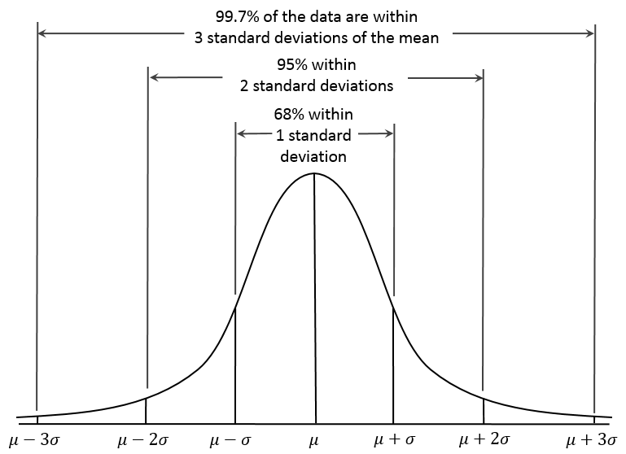

+ [DataPlot](./DataPlot/DataPlot.vbproj) is the **new unified 2D charting engine**: it reimplements all 2D plotting capabilities from the legacy `Plots` and `Plots-statistics` packages (bar/scatter/histogram family, contour, venn, pyramid, density, ROC/QQ/forest/PCA/Manhattan/cluster-heatmap and more) with statistical algorithm results injected through lightweight data contracts. New code should reference DataPlot.
+ [Plots](./Plots/plots-netcore5.vbproj) **(deprecated, kept only for the 3D plot stack)** - its 2D plotting has been migrated into DataPlot; it remains referenced by the 3D consumers (`Embedding3D`, `Kmeans` 3D helpers) until the 3D rendering is moved to [Canvas3D](./Canvas3D/Canvas3D.vbproj).
+ [Plots-statistics](./Plots-statistics/plots_extensions-netcore5.vbproj) **(deprecated)** - all of its 2D statistical charts now live in `DataPlot/Statistics`.
+ [Chart](./Chart/Plots.Charting.vbproj) project for WinForm controls.

### Standard deviation and coverage

For the normal distribution, the values less than one standard deviation away from the mean account for 68.27% of the set; while two standard deviations from the mean account for 95.45%; and three standard deviations account for 99.73%.

|n|``p = F(u + n*sigma) - F(u - n*sigma)``|``1-p``       |or 1 in p    |
|-|---------------------------------------|--------------|-------------|
|1|0.682689492137                         |0.317310507863|3.15148718753|
|2|0.954499736104                         |0.045500263896|21.9778945080|
|3|0.997300203937                         |0.002699796063|370.398347345|
|4|0.999936657516                         |0.000063342484|15787.1927673|
|5|0.999999426697                         |0.000000573303|1744277.89362|
|6|0.999999998027                         |0.000000001973|506797345.897|

> https://en.wikipedia.org/wiki/Normal_distribution