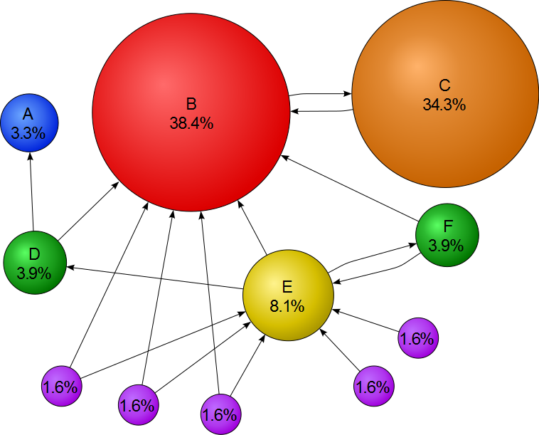

# PageRank

PageRank is an algorithm used by Google Search to rank websites in their search engine results. PageRank was named after Larry Page, one of the founders of Google. PageRank is a way of measuring the importance of website pages. According to Google:

PageRank works by counting the number and quality of links to a page to determine a rough estimate of how important the website is. The underlying assumption is that more important websites are likely to receive more links from other websites.

It is not the only algorithm used by Google to order search engine results, but it is the first algorithm that was used by the company, and it is the best-known.

> https://en.wikipedia.org/wiki/PageRank



> Mathematical PageRanks for a simple network, expressed as percentages. (Google uses a logarithmic scale.) Page C has a higher PageRank than Page E, even though there are fewer links to C; the one link to C comes from an important page and hence is of high value. If web surfers who start on a random page have an 85% likelihood of choosing a random link from the page they are currently visiting, and a 15% likelihood of jumping to a page chosen at random from the entire web, they will reach Page E 8.1% of the time. (The 15% likelihood of jumping to an arbitrary page corresponds to a damping factor of 85%.) Without damping, all web surfers would eventually end up on Pages A, B, or C, and all other pages would have PageRank zero. In the presence of damping, Page A effectively links to all pages in the web, even though it has no outgoing links of its own.


##### Code Usage

```vbnet
Dim g As New Graph

For Each label In "ABCDEFGHIJK"
    Call g.AddVertex(CStr(label))
Next

Call g.AddEdges("B", {"C"})
Call g.AddEdges("C", {"B"})
Call g.AddEdges("D", {"A", "B"})
Call g.AddEdges("E", {"D", "B", "F"})
Call g.AddEdges("F", {"E", "B"})
Call g.AddEdges("G", {"E", "B"})
Call g.AddEdges("H", {"E", "B"})
Call g.AddEdges("I", {"E", "B"})
Call g.AddEdges("J", {"E"})
Call g.AddEdges("K", {"E"})

Dim matrix As New GraphMatrix(g)
Dim pr As New PageRank(matrix)

Dim result = matrix.TranslateVector(pr.ComputePageRank)
```

###### Output

```json
{
    "A": 0.032781493159347662,
    "B": 0.38436978095287694,
    "C": 0.34294145336903575,
    "D": 0.039087092099970105,
    "E": 0.080885693234504313,
    "F": 0.039087092099970105,
    "G": 0.016169479016858928,
    "H": 0.016169479016858928,
    "I": 0.016169479016858928,
    "J": 0.016169479016858928,
    "K": 0.016169479016858928
}
```

### Weighted PageRank

```vbnet
Dim graph As New WeightedPRGraph

graph.AddEdge(1, 2, 1.0)
graph.AddEdge(1, 3, 2.0)
graph.AddEdge(2, 3, 3.0)
graph.AddEdge(2, 4, 4.0)
graph.AddEdge(3, 1, 5.0)

Dim ranks = graph.Rank(0.85, 0.000001)

Call ranks.GetJson(True).EchoLine
```

###### Output

```json
{
    "1": 0.34983779905464363,
    "2": 0.1688733284604475,
    "3": 0.32951218494838491,
    "4": 0.15177668753652385
}
```


