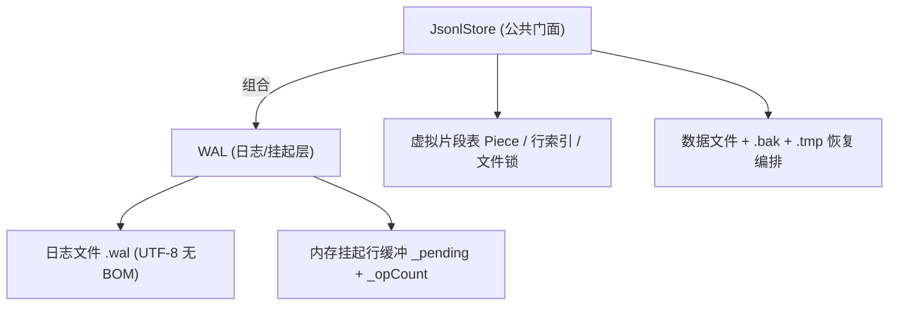

## Product Overview

将 `src/Data/Repository/TextStore/JsonlStore.vb`（约 1334 行）中与「修改数据 WAL 日志」相关的代码抽离为独立模块，填入现有空壳文件 `src/Data/Repository/TextStore/WAL.vb`，在不改变对外行为的前提下降低单文件复杂度、明确职责边界。属于纯重构，不涉及界面。

## Core Features

- **独立 WAL 日志模块**：填充 `WAL.vb` 中的 `WAL` 类，职责包括：日志文件读写、日志记录序列化与解析、撕裂尾（未以换行终止的最后一条记录）丢弃、日志保留长度计算，以及内存中待写入行缓冲与挂起操作计数的管理。
- **职责边界**：WAL 只管理日志文件与内存挂起行缓冲，不持有、不操作数据文件、`.bak`、`.idx.tmp`、`.merge.tmp`。
- **JsonlStore 保留**：虚拟片段表（Piece）、读/写/合并编排、行索引、文件锁，以及打开期「合并是否完成」的恢复决策（比对数据文件长度、截断数据文件、清理临时文件）。
- **语义不变**：先写日志（含 fsync）后改内存、合并标记立即落盘、行号从 1 开始、日志固定 UTF-8 无 BOM、异常文本与 Info 诊断消息尽量保持一致；`JsonlStore` 公共 API 签名与行为不变。
- 记录解析结果与保留长度由 WAL 返回给 JsonlStore，由其决定后续数据文件恢复动作。

## 技术选型

- 语言/运行时：VB.NET（现有 `src/Core.vbproj`，`RootNamespace=Microsoft.VisualBasic`，`AssemblyName=Microsoft.VisualBasic.Runtime`，net6.0）。
- 命名空间/文件：沿用现有 `Namespace Data.Repository`（全名 `Microsoft.VisualBasic.Data.Repository`）；填充 `WAL.vb`。
- 复用现有依赖，不引入任何新依赖：
- `src/Text/IO/BufferedLineReader.vb`（`Microsoft.VisualBasic.Text.BufferedLineReader`，按字节定位、0x0A 切行、暴露 `LastLineStartOffset/LastLineEndOffset/LastLineWasTerminated`）。
- `JsonlStoreOptions`（`FsyncEachWrite`、`LogBufferBytes`、`ReadBufferBytes`）。
- 新增 Imports：`System.Collections.Generic`、`System.Globalization`、`System.IO`、`System.Text`、`Microsoft.VisualBasic.Text`。

## 实现方案

采用**组合（Composition）+ 职责拆分**的最小侵入式重构，不改变线程模型与数据流。

1. **WAL 成为日志与内存挂起层的唯一所有者**

- 持有：`_logPath`、`_enc`(UTF8Encoding(False))、`_logStream`、`_pending`(挂起行缓冲)、`_opCount`、`_replaying`、`_opt`。
- 暴露类型化 API：拼接记录（`sp`）+ 合并标记（`mb`/`mbf`/`md`）+ 解析读取。
- 把原 `LogRec` 提升为公开嵌套类型 `WAL.Record`，并以 `WAL.RecordKind` 枚举替代 `Op` 字符串对外表达。

2. **JsonlStore 只保留文档视图与恢复编排**

- 删除 `_logStream/_logEnc/_pending/_opCount/_replaying/LogRec` 及日志序列化/解析方法，改为委托 `_wal`。
- 打开期：`_wal.ReadRecords()` 拿到「全部记录 + GoodLength」，再由 JsonlStore 执行 `mb/mbf/md` 判定、数据文件长度比对、`TruncateDataTo`、`CleanupTempFiles`、`FinishMergedState`、`SwapFile`（这部分**不迁移**）。
- 合并：`MergeFastAppend`/`MergeFullRewrite` 中以类型化方法写合并标记，保持「先落盘记录、后改数据」顺序；合并完成后调用 `_wal.ClearLog()` 与 `_wal.ResetPendingState()`。

3. **关键权衡**

- 边界按澄清结论（Q1：WAL 只管日志、恢复决策留 Store；Q2：挂起层一并移入 WAL）。这样 WAL 自洽可测，且不反向耦合数据文件路径。
- WAL 不自行加锁，全部调用继续由 JsonlStore 的 `_gate` 保护，避免锁嵌套与死锁。
- 性能与内存占用不变：日志仍为顺序读写、`sp` 记录按 `FsyncEachWrite` 决定是否 fsync、`mb/mbf/md` 强制 `Flush(True)`；`ReadRecords` 仍走单遍 `BufferedLineReader` 流式解析，时间复杂度 O(日志字节数)，与重构前一致。

4. **不引入的技术债**：不改变文件布局与磁盘格式，不调整公开 API，不做与本次无关的清理。

## 架构设计



- 数据流（写）：`JsonlStore.DoSplice` → `WAL.AppendSplice`（先落盘+fsync）→ `ApplySplice`（内存片段表 + `WAL.AddPendingLines`）→ `WAL.IncrementOperationCount`。
- 数据流（读）：`ReadLines/ReadLine` 命中 `PendingBuffer` 片段时经 `WAL.PendingLine(i)` 取值；源文件部分仍由 `JsonlStore` 读取。
- 数据流（开）：`WAL.ReadRecords` → Store 决策合并状态 → `WAL.TruncateTo(keepLen)` → `WAL.BeginReplay` + 重放 + `WAL.EndReplay`。
- 数据流（合并）：Store 重写数据文件 → `WAL.AppendMergeBegin/AppendMergeDone` → `WAL.ClearLog` + `WAL.ResetPendingState`。

## 实施要点（执行细节）

**迁移映射（务必逐条核对）**

- `LogRec` → `WAL.Record`（`Op` 映射为 `RecordKind`：`sp→Splice`、`mb→MergeAppend`、`mbf→MergeFull`、`md→MergeDone`；保留 `StartOffset`）。
- `_logEnc` → `WAL._enc`；`_pending`/`_opCount`/`_replaying`/`_logStream` → WAL 私有字段。
- `LogSplice` → `WAL.AppendSplice`；`LogRaw(record)` → `WAL.AppendMergeBegin/AppendMergeDone`；`WriteLogBytes`/`JEscape`/`TryParseRecord`/`ExpectLit`/`ReadLongTok`/`ReadJsonStringTok` → WAL 内部私有实现（仅在本类内使用）。
- `FlushLog` → `WAL.Flush`；`Merge` 中 `_logStream.SetLength(0)/Flush(True)/Position=0` → `WAL.ClearLog`；`_opCount=0` 与 `_pending.Clear()` → `WAL.ResetPendingState`。
- `ReadAndRecoverLog` 拆为：**WAL.ReadRecords()** 负责解析、`goodLen`、撕裂尾丢弃与告警；**JsonlStore** 负责 `mbIdx/mdIdx` 判定与数据文件恢复。
- 属性：`PendingOperationCount`/`PendingBufferedLineCount`/`HasPendingChanges` 改为委托 `_wal`；`LogFilePath` 改为 `_wal.LogFilePath`。
- `ReadLine`/`ReadLines(startLine,count)` 中 `_pending(CInt(...))` → `_wal.PendingLine(CInt(...))`。
- `ApplySplice` 中 `Integer.MaxValue` 上限校验与 `PieceKind.PendingBuffer` 起始索引 → `_wal.AddPendingLines(lines)` 返回起始索引。

**必须保持的不变量**

- 行号 1 基；`sp` 语义为「虚拟位置 pos 删除 delCount 行并插入 Lines」。
- `DoSplice` 顺序：先 `WAL.AppendSplice`（含 fsync）后改内存。
- 合并标记必须 `Flush(True)` 立即落盘；日志编码固定 `UTF8Encoding(False)`。
- `FsyncEachWrite=False` 时 `sp` 仅 `Flush()`，由 `WAL.Flush` 外部保证。
- 打开时未以换行终止的尾记录必须丢弃且不使打开失败；已终结但解析失败必须视为损坏并抛 `InvalidDataException`。
- WAL 不得 SyncLock（由 Store 的 `_gate` 统一保护），避免死锁。
- 不记录任何行内容到日志/告警中，仅保留既有诊断文本。

**日志与错误**

- WAL 暴露 `Event Info(message As String)`；由 JsonlStore 订阅并转发到自身 `Info` 事件，保持既有诊断文案与触发时机不变。
- 保持既有异常类型与消息（如 `InvalidDataException("WAL 在偏移 ... 处存在无法解析的记录。")`）。

## 目录结构

```
src/Data/Repository/TextStore/
├── WAL.vb               # [MODIFY] 由空壳类填充为完整 WAL 日志模块：类型定义(RecordKind/Record/ReadResult)、生命周期(Open/TruncateTo/Dispose)、写入(AppendSplice/AppendMergeBegin/AppendMergeDone/Flush/ClearLog)、读取恢复(ReadRecords 解析+撕裂尾+GoodLength)、挂起层(PendingLine/AddPendingLines/PendingOperationCount/IncrementOperationCount/ResetPendingState/BeginReplay/EndReplay)、JSON 序列化与解析私有工具、Info 事件。
├── JsonlStore.vb        # [MODIFY] 删除日志相关字段与方法，改为组合 `_wal`；重接 Open/Dispose/属性/写操作/读操作/Merge/打开期恢复编排；保持公共 API 与行为不变。
└── JsonlStoreOptions.vb # [UNCHANGED] 作为 WAL 构造参数来源（FsyncEachWrite/LogBufferBytes/ReadBufferBytes）。
```

## 关键代码结构（WAL 对外契约）

```
Namespace Data.Repository
    Public NotInheritable Class WAL
        Implements IDisposable

        Public Enum RecordKind            ' 对应磁盘令牌 "sp"/"mb"/"mbf"/"md"
            Splice, MergeAppend, MergeFull, MergeDone
        End Enum

        Public NotInheritable Class Record
            Public Kind As RecordKind
            Public Pos As Long                 ' sp: 虚拟起始行号(1 基)
            Public Del As Long                 ' sp: 删除行数
            Public OldLen As Long              ' mb/mbf: 合并前数据文件长度
            Public NewLen As Long              ' mb/mbf: 合并后数据文件长度
            Public Lines As List(Of String)    ' sp: 插入行
            Public StartOffset As Long         ' 记录在日志文件中的起始偏移
        End Class

        Public NotInheritable Class ReadResult
            Public ReadOnly Records As List(Of Record)
            Public ReadOnly GoodLength As Long  ' 可保留的日志长度（尾部残缺/被丢弃记录之前）
        End Class

        Public Event Info(message As String)

        Public Sub New(logFilePath As String, options As JsonlStoreOptions)
        Public Sub Open()
        Public Sub TruncateTo(length As Long)
        Public Function ReadRecords() As ReadResult

        Public Sub AppendSplice(pos As Long, delCount As Long, lines As List(Of String))
        Public Sub AppendMergeBegin(isFullRewrite As Boolean, oldLen As Long, newLen As Long)
        Public Sub AppendMergeDone()
        Public Sub Flush()
        Public Sub ClearLog()

        Public Function AddPendingLines(lines As List(Of String)) As Long  ' 返回起始索引
        Public Function PendingLine(index As Integer) As String
        Public Sub IncrementOperationCount()
        Public Sub ResetPendingState()
        Public Sub BeginReplay()
        Public Sub EndReplay()

        Public ReadOnly Property Length As Long
        Public ReadOnly Property LogFilePath As String
        Public ReadOnly Property PendingOperationCount As Long
        Public ReadOnly Property PendingBufferedLineCount As Long

        Public Sub Dispose() Implements IDisposable.Dispose
    End Class
End Namespace
```

## 验证要点

- 编译：PowerShell 执行 `dotnet build g:/pixelArtist/src/framework/Microsoft.VisualBasic.Core/src/Core.vbproj -c Debug`，须 0 错误 0 新增警告。
- 无现成单测覆盖 `JsonlStore/WAL`，以「编译通过 + 逐条映射核对 + 公共 API 引用检查」保证等价性。
- 重点回归路径：打开含日志文件（正常重放 / 撕裂尾 / `mb` 未完成 / `md` 已完成）、`Merge` 快路径与全量重写路径、`PendingLine` 随机读与顺序读。

## Agent Extensions

### SubAgent

- **code-explorer**
- Purpose: 全仓扫描 `JsonlStore`/`WAL`/`LogRec`/`_pending` 等符号的引用，确认除 `WAL.vb`、`JsonlStore.vb`、`JsonlStoreOptions.vb` 外无其他调用点，避免抽离后遗漏引用导致编译失败。
- Expected outcome: 输出完整的引用清单与「无遗漏、无外部破坏」的结论，作为重构完整性验证依据。

### Skill

- **lsp-code-analysis**
- Purpose: 在重构后分析 `JsonlStore` 公共成员的引用与调用层次，核对抽离后公共 API 签名、可见性与调用关系未发生非预期变化。
- Expected outcome: 输出公共 API 引用/调用层次报告，确认对外契约保持不变（无破坏性变更）。