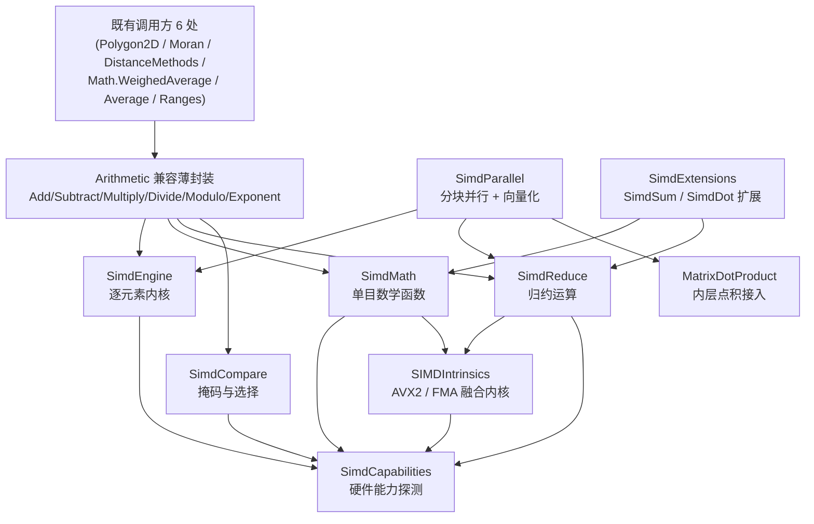

## 产品概述

对 `Extensions/Math/SIMD/` 中的数学计算代码进行性能优化与架构重构，在不破坏既有调用接口的前提下，构建一个功能更完整、可跨平台的通用 SIMD 加速计算模块。

## 核心功能

- 性能优化：消除现有实现中"逐元素构造向量/逐元素回写"的低效写法，改为批量向量装载与存储；移除每次调用都新建广播临时数组的开销；取消硬编码的 10000 元素阈值。
- 硬件自适应：自动探测当前处理器能力并分派到最佳计算路径，不再依赖手工切换；保留原有的模式配置属性作为兼容与强制标量回退的开关。
- 逐元素运算：加法、减法、乘法、除法、取模、最小值、最大值，支持向量间与向量与标量的混合形式，并要求结果与纯标量计算完全一致。
- 单目数学函数：平方根、绝对值、取负、平方、幂、指数、对数、倒数、区间钳制。
- 归约运算：求和、均值、最小/最大、点积、L1/L2 范数、最大值索引。
- 比较与掩码选择：大小与相等比较生成掩码，支持按掩码在两组数据间做条件选择，以及任意/全部/计数判断。
- 全数值类型覆盖：在双精度之外补齐单精度、32 位整数、64 位整数、16 位整数的向量化实现。
- 并行与向量混合：对超出缓存的大数组做分块并行，每块内部再执行向量化计算，并接入现有矩阵乘法热点。
- 边界与容错修正：长度为 0 的输入安全返回空结果（修复现有的越界异常），长度不能被向量宽度整除时正确处理尾部元素。
- 兼容性保持：现有对外函数名与配置属性全部保留，现有 6 处调用点无需任何改动。
- 可验证性：提供标量与加速结果的一致性校验，并输出不同数据规模下的性能对比。

## 技术栈

- 语言与运行时：VB.NET，目标框架 `net10.0`（`Core.vbproj` 已确认仅此单一框架），根命名空间 `Microsoft.VisualBasic`。
- 向量化基础：`System.Numerics.Vector(Of T)`（跨平台、由 JIT 映射到 SSE2/AVX/NEON，ARM64 上自动退化到 NEON）。
- 指令级加速：`System.Runtime.Intrinsics` / `System.Runtime.Intrinsics.X86`（AVX/AVX2/FMA），仅在确实带来收益的融合运算上使用。
- 并行：复用项目既有 `Microsoft.VisualBasic.Parallel.VectorTask`（`ApplicationServices/Parallel/ConcurenceRunner.vb`）与 `System.Threading.Tasks.Parallel`。
- 泛型数学：`INumber(Of T)` / `IFloatingPointIeee754(Of T)` 等接口用于统一各数值类型的归约与单目函数实现。

## 实现方案

### 核心策略

以 `Vector(Of T)` 作为**唯一可移植的加速主干**（x86 与 ARM 均被硬件加速），在其之上叠加按需的 `Vector256` + FMA 融合内核。所有既有公开函数改写为**零逻辑的薄封装**，委托到新内核，从而同时满足"性能提升"与"调用方零改动"。

### 关键技术决策与取舍

1. **不再为纯二元运算写 Vector256 专用路径**。对 `Double` 而言 `Vector256(Of Double)` 宽度为 4，与 `Vector(Of Double).Count` 完全一致，额外的 256 位路径只增加代码量而无宽度收益。`Vector256` 仅用于 **FMA 融合**场景（点积、平方和、AXPY），此处 FMA 可将指令数减半，是真实收益点。现有 `VectorAddAvx`/`VectorAddAvx2` 对 `Double` 而言两者完全等价（`Avx2` 只对整数有意义），属冗余。
2. **消除每次调用的临时分配**。标量与向量运算改用 `New Vector(Of T)(scalar)` 广播构造，取代现行"新建并填充 `countDouble` 长度数组"的写法（该写法每次调用都会分配一个小数组）。
3. **正确的循环边界**。改用 `For i = 0 To len - count Step count` 形式，循环体内不再做 `remaining` 减法；尾部用标量补齐；`len = 0` 直接返回 `Array.Empty(Of T)()`。
4. **整数除法与取模保持标量**。x86/ARM 均无 SIMD 整数除法指令，`Vector.Divide` 对整数类型会抛异常；`Double` 取模同样无硬件指令。这两类保留标量实现并在文档中说明，避免"看似向量化实则更慢"。
5. **`SIMDEnvironment.config` 语义收敛**。保留属性与枚举以兼容旧代码；`auto`/`enable`/`legacy` 统一走自动分派，仅 `disable` 作为"强制标量"的逃生口保留实际作用（同时供一致性测试作标量参照）。
6. **特殊语义精确保留**。`Divide.f64_op_divide_f64` 中"分子为 0 时结果置 0（规避 0/0 产生 NaN）"的语义必须等价实现：先向量除，再用掩码将分子为 0 的通道覆盖为 0。
7. **数值精度**。除幂/指数/对数外，其余算子均为逐元素等价变换，结果与标量逐位一致。`Exp`/`Log` 默认走与 `System.Math` 一致的精确路径；提供可选的基于 FMA 多项式逼近的快速版本（精度约 1e-15 相对误差）作为独立入口，需显式调用，避免静默精度损失。
8. **命名空间不新增层级**。所有新类型统一放在既有 `Namespace Math.SIMD`（全限定名 `Microsoft.VisualBasic.Math.SIMD`），仅文件夹分层；这保证现有 `SIMD.Add.xxx` 的名称解析行为完全不变，是控制影响面的关键。
9. **扩展方法命名避让**。不重载 `Sum`/`Min`/`Max` 等同名 LINQ 扩展（会与 `Microsoft.VisualBasic.Linq` 产生二义性编译错误），改用 `SimdSum`/`SimdDot`/`SimdMax` 等独立命名，静态方法保持不变。

### 性能与复杂度

- 逐元素运算：O(n)，每 `Vector(Of T).Count` 个元素一条指令，理论吞吐为标量的 4~8 倍（Double/AVX 为 4，Single 为 8）。
- 点积/平方和：O(n)，FMA 路径每 4 个 Double 组一次乘加，约为朴素实现的 4~6 倍。
- 分块并行：O(n / threads) 墙钟时间，瓶颈在内存带宽；分块粒度取 `max(65536, n / (threads * 8))` 以避免伪共享与线程调度开销。

## 架构设计



## 目录结构

```
Microsoft.VisualBasic.Core/src/Extensions/Math/SIMD/
├── SIMD.vb                                   # [MODIFY] SIMDEnvironment。保留 config 属性、SIMDConfiguration 枚举与
│                                             #   countDouble/countFloat/countInteger/countLong/countShort（兼容契约）；
│                                             #   新增 IsHardwareAccelerated、IsAvx2/IsAvx/IsFma/IsSse42/IsAdvSimd 等能力只读属性；
│                                             #   config 语义收敛为：disable 强制标量，其余模式统一自动分派。补充 XML 文档。
├── Intrinsics.vb                             # [REWRITE] SIMDIntrinsics。移除整个类的 #If NETCOREAPP 包裹（永远成立）与
│                                             #   从未使用的 Delegate Function Math（与 Math 命名空间冲突的死代码）。
│                                             #   用基于 ref/Unsafe 的批量装载与存储替换 Vector256.Create/GetElement 的反模式；
│                                             #   新增 FMA 融合内核：DotFma、SumSquaresFma、Axpy、MultiplyAdd；
│                                             #   保留 VectorAddAvx/VectorAddAvx2 名称（内部改走向量主干），并补充 Single 版本。
│                                             #   所有 Vector256 调用需先经 IsSupported 判定。
├── Arithmetic/
│   ├── Add.vb                                # [MODIFY] 改为薄封装：f64_op_add_f64 -> SimdEngine.Add，
│   │                                         #   f64_op_add_f64_scalar -> SimdEngine.AddScalar；
│   │                                         #   删除 Select Case/GoTo 标签与 #If NET48 死分支；补 f32/int32/int64 新重载。
│   ├── Subtract.vb                           # [MODIFY] 三个既有函数全部改为薄封装（现为纯标量循环）；
│   │                                         #   补齐 f32/int32/int64 重载。
│   ├── Multiply.vb                           # [MODIFY] 四个既有函数改为薄封装（现 enable 分支为纯占位 GoTo legacy）；
│   │                                         #   补齐整数重载。
│   ├── Divide.vb                             # [MODIFY] 保留全部 4 个函数名与签名；f64_op_divide_f64 必须保留
│   │                                         #   "分子为 0 则结果 0" 语义（掩码实现）；int32_op_divide_int32_scalar 返回 Double()；
│   │                                         #   整数除法与取模走标量路径（无硬件指令）。
│   ├── Modulo.vb                             # [MODIFY] 三个函数改为薄封装；Double 保留标量回退（无 SIMD 指令），
│   │                                         #   整数类型走逐元素内核；禁止用 Math.IEEERemainder 替换 VB 的 Mod 语义。
│   └── Exponent.vb                           # [MODIFY] 四个函数改为薄封装；f64_op_exponent_f64_scalar 增加指数为 2.0 时
│                                             #   走 SimdMath.Square 的快速路径（DistanceMethods 的主要热路径）；f64_exp -> SimdMath.Exp。
├── Engine/
│   ├── SimdCapabilities.vb                   # [NEW] 硬件能力探测。基于 RuntimeInformation.ProcessArchitecture 与
│   │                                         #   Vector.IsHardwareAccelerated / X86.*.IsSupported 计算一次并缓存（Shared ReadOnly）；
│   │                                         #   提供 VectorSize(Of T) 与 IsSupported(Of T) 判断，供全局分派与快速失败。
│   ├── SimdEngine.vb                         # [NEW] 核心逐元素内核，全部为 (Of T As Structure) 泛型实现，统一放在 Namespace Math.SIMD：
│   │                                         #   Add/Subtract/Multiply/Divide/Min/Max/Modulo 的向量-向量、向量-标量、就地三种形态；
│   │                                         #   DivideZeroSafe（带分子为 0 掩码）；统一使用 New Vector(Of T)(arr, offset) 装载、
│   │                                         #   .CopyTo(arr, offset) 存储、New Vector(Of T)(scalar) 广播；
│   │                                         #   循环边界统一为 len - count，len=0 返回 Array.Empty；元素级运算维持类文档所述的
│   │                                         #   "不作长度校验"契约，但归约与点积必须校验长度相等并抛出 ArgumentException。
│   ├── SimdMath.vb                           # [NEW] 单目数学函数：Abs/Negate/Square/Sqrt/Reciprocal/Pow/PowScalar/
│   │                                         #   Exp/ExpFast/Log/LogFast/Clamp/ClampScalar。Sqrt/Abs/Negate/Clamp 走 Vector 原语；
│   │                                         #   Pow 中指数为常量 2/0.5 时特化为 Square/Sqrt；ExpFast/LogFast 为基于 FMA 的
│   │                                         #   多项式逼近，精度与适用范围在 XML 文档与测试中明确标注；默认 Exp/Log 保持精确等价。
│   ├── SimdReduce.vb                         # [NEW] 归约运算：Sum/Mean/Min/Max/Dot/SumSquares/L1Norm/L2Norm/
│   │                                         #   ArgMax/ArgMin。Sum/Min/Max/Dot 优先使用 Vector 静态原语并按块累加；
│   │                                         #   Double 且 Fma.IsSupported 时切换到 SimdIntrinsics 的融合内核；
│   │                                         #   尾部标量补齐；空数组返回中性元或抛出明确异常（在文档中约定）。
│   └── SimdCompare.vb                        # [NEW] 比较与掩码：GreaterThan/LessThan/GreaterOrEqual/LessOrEqual/
│                                             #   Equals/NotEquals 返回 Boolean()；Select/Where(mask, a, b) 基于
│                                             #   Vector.ConditionalSelect；Any/All/CountTrue 统计掩码命中数（尾部标量补齐）。
├── Parallel/
│   └── SimdParallel.vb                       # [NEW] 分块并行 + 向量化混合驱动。沿用 Namespace Math.SIMD；
│                                             #   提供 Environment.Enable 开关（与 Math.Parallel.ParallelEnvironment 一致风格）、
│                                             #   Map（元素级映射）、Reduce（分块局部归约后合并）、DotGather、MatrixDot；
│                                             #   分块粒度 max(65536, len / (threads * 8))；小数组（< 2 * 分块粒度）自动退化为单线程向量路径，
│                                             #   避免并行调度开销；复用 Microsoft.VisualBasic.Parallel.VectorTask 与 n_threads。
└── SimdExtensions.vb                         # [NEW] 面向数组的扩展方法门面（Namespace Math.SIMD，Imports System.Runtime.CompilerServices）：
                                              #   SimdSum/SimdMean/SimdMin/SimdMax/SimdDot/SimdL2Norm/SimdAbs/SimdSqrt/SimdAdd/
                                              #   SimdMultiply/SimdClamp 等。命名刻意加 Simd 前缀，避免与 Microsoft.VisualBasic.Linq
                                              #   的同名扩展产生二义性；每个方法委托到 SimdReduce/SimdMath/SimdEngine。

Microsoft.VisualBasic.Core/src/Extensions/Math/Parallel/
└── MatrixDotProduct.vb                       # [MODIFY] Solve 内层 `For k: s += Arowi(k) * Bcolj(k)` 替换为
                                              #   SimdReduce.Dot(Arowi, Bcolj)（必要时走 FMA 融合内核）；
                                              #   这是"并行 + 向量"混合模式的既有落地范例，属于热路径改造。

Microsoft.VisualBasic.Core/test/
├── Program.vb                                # [MODIFY] 新增 `--simd` 参数门控（沿用既有 --ftp/--markdown/--jsonl 范式）；
                                              #   移除第 98 行无条件执行的 SIMDTest.Main1()，避免默认运行 9000 万 × 3 × 100 次运算。
└── test/SIMDTest.vb                          # [REWRITE] 正确性 + 基准验证：
                                              #   1) 逐算子/逐类型 标量参照 vs 加速结果一致性（精确算子用严格相等，Exp/Log 用容差）；
                                              #   2) 边界用例：长度 0、1、向量宽度 ±1、不整除长度；
                                              #   3) Divide 的分子为 0 语义、Modulo 语义回归；
                                              #   4) 规模基准：1e3 / 1e5 / 1e7 下标量与加速耗时及加速比；
                                              #   5) 并行 + 向量混合与单线程向量结果一致性；
                                              #   6) 输出机器能力探测结果（是否 AVX2/FMA/NEON）。
```

## 关键代码结构

仅固定最高风险的"兼容契约"部分，其余以文字描述：

```
Namespace Math.SIMD

    ''' <summary>
    ''' 硬件能力探测结果（进程内计算一次）。
    ''' </summary>
    Public NotInheritable Class SimdCapabilities
        Public Shared ReadOnly IsHardwareAccelerated As Boolean = Vector.IsHardwareAccelerated
        Public Shared ReadOnly IsFma As Boolean = X86.Fma.IsSupported
        Public Shared ReadOnly IsAvx2 As Boolean = X86.Avx2.IsSupported
        Private Sub New()
        End Sub
    End Class

    ''' <summary>
    ''' 兼容薄封装：函数名与签名保持不变，逻辑全部委托到新内核。
    ''' </summary>
    Public Class Divide
        Public Shared Function f64_op_divide_f64(v1 As Double(), v2 As Double()) As Double()
            Return SimdEngine.DivideZeroSafe(v1, v2)   ' 保留 “分子为 0 则结果 0” 语义
        End Function
    End Class
End Namespace
```

## 实施注意事项

- **向后兼容**：`Arithmetic/*.vb` 中所有既有 `Public Shared Function` 的名称、参数类型与返回类型一字不改；`SIMDConfiguration` 枚举成员不增删改名。改动前后用 LSP 引用分析核验 6 处调用点无需修改即可编译通过。
- **死代码清理**：`#If NET48` / `#If Not NET48` / `#If NETCOREAPP` 在单一 `net10.0` 目标下恒为同一分支，一并移除，避免误导后续维护。
- **影响面控制**：新类型全部落在 `Namespace Math.SIMD` 且使用独立类名（`SimdEngine`/`SimdMath`/`SimdReduce`/`SimdCompare`/`SimdParallel`/`SimdExtensions`/`SimdCapabilities`），不改动任何既有公共类型签名；不触碰 SIMD 文件夹以外的逻辑（`MatrixDotProduct` 仅替换内层循环体）。
- **风险回退**：`SIMDEnvironment.config = SIMDConfiguration.disable` 可一键退回纯标量路径，作为性能或精度问题的兜底。
- **文档与告警**：项目开启 `GenerateDocumentationFile` 且 `WarningLevel=4`，所有新公共成员需带 XML 文档注释，保持与既有文件一致的注释风格。
- **新增文件无需改工程文件**：`Core.vbproj` 为 SDK 默认通配编译（未显式列出 `Compile` 项），新 `.vb` 自动纳入编译。

## Agent Extensions

### SubAgent

- **code-explorer**
- Purpose: 在重构开始前，跨 `sciBASIC#` 整个仓库（含 `cuda/`、`gr/`、`Data_science/`、`nlp/` 等可能引用该运行时的子项目）全量检索 `Math.SIMD`、`SIMDEnvironment`、`SIMDConfiguration` 及 `f64_op_*` 系列公开 API 的调用点与继承/实现关系。
- Expected outcome: 得到一份完整的、可核验的外部调用清单，锁定必须保持不变的兼容接口集合，确保重构后不破坏任何下游消费者。

### Skill

- **lsp-code-analysis**
- Purpose: 在改写 `Arithmetic/*.vb` 兼容薄封装前后，对每个既有公开函数执行语义级引用查找、调用层次与影响面分析，确认签名保持、无遗漏引用、无名称解析变化。
- Expected outcome: 每个旧 API 的引用集合被逐一核对通过，编译级兼容性得到确认，并定位到可安全替换的实现点。