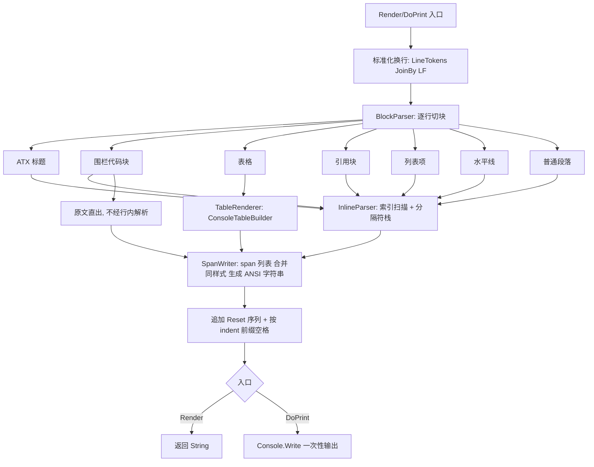
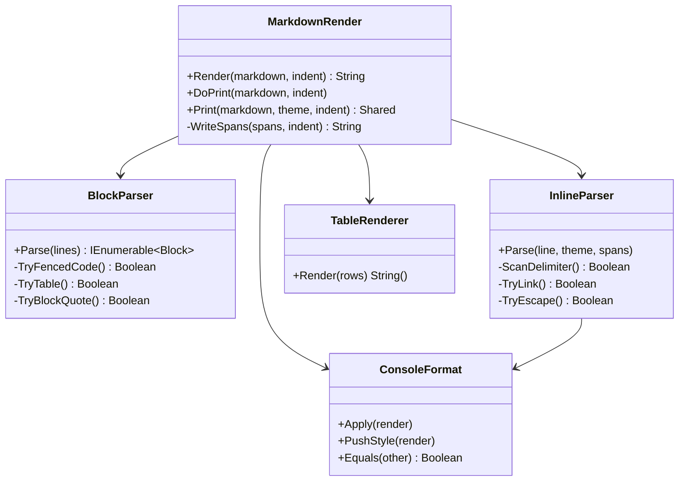

## 产品概述

对 `ApplicationServices/Terminal/MarkdownRender` 目录下基于 ANSI escape sequence 的 console markdown 渲染模块做一次完整代码审查，并修复发现的渲染问题。模块最终效果：在终端中按主题着色输出 markdown 文本——标题、引用块、代码块、表格、列表、行内代码、加粗、斜体、删除线、链接各有独立的前景色/背景色，且打印结束后终端颜色必须干净复位，不污染后续输出。

## 核心功能

1. **修复行内标记误判**：解决控制字符缓冲残留导致的问题——普通文本中的 `*`、`、` 等字符会污染后续判定（`a * b * c` 中的 `c` 被误加粗；` ``` ` 之后整段行内样式失效）。
2. **补全已声明但未生效的元素**：单反引号行内代码 `` `code` ``、单星号/下划线斜体 `*em*`、``` 围栏代码块（带 `CodeBlock` 背景色）、列表标记 `-` / `+` / `*`。
3. **新增语法**：`[text](url)` 链接（文本按 `LinkText` 样式、URL 按 `Url` 样式）、`~~删除线~~`、`\*` 反斜杠转义。
4. **修复表格渲染**：多张表之间状态串味、文末表格被静默丢弃、空表越界崩溃、`|a|b|` 首尾多出两个空列、表格行继承上一段文字的颜色、多余空行与换行符不统一。
5. **修复样式栈与终端状态**：样式栈无限增长、打印结束后终端停留在最后一个 span 的颜色、输出重定向时 `CursorLeft` 抛异常。
6. **抽出可验证的渲染输出**：提供返回完整 ANSI 字符串的 `Render(markdown)` 纯函数，`DoPrint` 复用它，便于用控制台验证脚本逐项核对修复效果。

## 技术栈

- 语言/框架：VB.NET，单目标框架 `net10.0`（`Microsoft.VisualBasic.Core/src/Core.vbproj`）
- 依赖：仅 .NET BCL + 本仓库现有基础设施，不引入新包
- `Microsoft.VisualBasic.Language.List(Of T)` 运算符（`+` 追加 / `*0` 清空 / `= n` 比较 Count / `PopAll`）
- `Text.Parser.CharPtr` + `Pointer(Of T)` 一元 `+`（`++ptr` 恰好前进一位取字符，语义已验证正确）
- `Microsoft.VisualBasic.Text.StringHelpers`（`LineTokens`、`StringEmpty`、`RegexICSng`）、`RegexExtensions.StartsWith(pattern, opts)`
- `ApplicationServices.Terminal.TablePrinter` 的 `ConsoleTableBaseData` / `ConsoleTableBuilder` / `WithFormat` / `Export`
- 工程约定：`Core.vbproj` 使用默认 glob（无显式 `<Compile Include>`），**新增 .vb 文件无需改工程文件**；各文件顶部 `#Region` + GPL3 头 + `Code Statistics` 注释块必须原样保留

## 实现思路

### 总体策略：从「单遍字符机 + 隐式控制缓冲」改为「块级切分 + 行内扫描」两阶段

现有 `WalkChar`（MarkdownRender.vb 284-408）是逐字符状态机，用 `controlBuf` 做前瞻。根本缺陷是 **`controlBuf` 没有明确的生命周期**——只在命中  ``` ` / `**` 时才清空，普通字符、空格、换行都不清空（A1），于是任何孤立的标记字符都会永久污染后续判定。这既是"误加粗"的直接原因，也让单反引号/单星号无法与双写标记区分（A2）。

改为两阶段后，每个阶段各自持有明确作用域的局部状态，缓冲泄漏在结构上就不可能发生：



### 关键技术决策

**决策 1：`Render(markdown, indent) As String` 作为唯一出口，`DoPrint` 退化为 `Console.Write(Render(...))`**

- 收益一：C1（终端颜色不复位）在结构上被消除——`Render` 末尾无条件 append `AnsiEscapeCodes.Reset`，`applyGlobal()` 不再承担"写字节"的职责。
- 收益二：`Console.CursorLeft = indent`（C3，重定向时抛 `IOException`）被替换成在每行起始处拼接 `New String(" "c, indent)`，输出从"多次 `Console.Write` + 光标定位"降为"一次 `Console.Write`"，I/O 次数从 O(span 数) 降到 1。
- 收益三：可验证。仓库的 `test.vbproj` 是 net10.0 控制台程序（无 MSTest/xunit 包），`Render` 返回字符串正好适合用控制台断言脚本核对。
- 代价：整篇文档会在内存中构建一个字符串。markdown 文档量级（KB 级）下可忽略。

**决策 2：`ConsoleFormat.SetConfig` 拆成「应用」与「入栈」两个动作**

- 现状（`ConsoleFormat.vb` 121-124）`SetConfig` 同时 `currentStyle = Me` 和 `styleStack.Push(Me)`，而 `restoreStyle`（MarkdownRender.vb 196-206）pop 后又调 `Peek.SetConfig(Me)` 再压一次 → 嵌套场景每换行栈多一层，无限增长（C2）。
- 改为：`Apply(render)` 只赋值 `currentStyle`；`PushStyle(render)` 压栈 + 应用；`restoreStyle` 只 pop + `Apply` 不再压栈。
- 兼容性：先用 `[subagent:code-explorer]` 做 `SetConfig` 的全仓引用分析；若存在外部调用者，保留 `SetConfig` 作为等价 `PushStyle` 的兼容包装，不破坏公开 API。

**决策 3：行内解析用「索引扫描 + 显式分隔符栈」，不用正则逐条替换**

- 需要处理 `code` 与 `**bold**`/`*em*`/`~~del~~` 的优先级（行内代码内容不得再被解析）、`[text](url)` 的两段结构、`\` 转义的提前退出——这些用正则串联难以正确表达优先级，扫描器更直接。
- 优先级顺序（先到先服务）：`\` 转义 > 反引号行内代码 > `**`/`__` 加粗 > `*`/`_` 斜体 > `~~` 删除线 > `[text](url)` > 裸 URL。
- 复杂度：单行 O(n)，每字符最多一次前瞻；`_em_` 需额外做词内判断（`my_var_name` 不转斜体）。

**决策 4：表格修复要点**

- `tableBuf` 改为 `BlockParser` 的局部变量（而不是实例字段），从结构上消除 B1 跨表/跨 `DoPrint` 泄漏；`buildTableSimple` 结束时清空。
- 块扫描结束后必须 flush 尾部表格（B2）。
- `tableBuf.Count = 0` 时直接 `Return`（B3）。
- 单元格 `Split("|"c)` 后 `Trim` 并去除首尾空列（B4）；内部空单元格保留。
- 表格行统一用 `ASCII.LF`，去掉末尾多余的 `vbLf` span（B5）。
- 表格行 span 显式带上 global 样式而非 `Nothing`（B6）。

**决策 5：span 合并**

- 现状每个空格切一个 span（C4，约 20 字节转义序列/词）。`SpanWriter` 在生成字符串时合并相邻同 `ConsoleFormat`（用已实现的 `ConsoleFormat.Equals`）的 span，既缩小输出体积，又减少 `StringBuilder` 追加次数。

**决策 6：`UnicodeWidth` 模块接入**

- 该 13KB 模块（`GetWidth(Char)` 341 行 / `GetWidth(String)` 399 行）全仓零引用。中文/全角内容下，引用块前缀填充、表格列宽、代码块边框对齐都需要按显示宽度而非 `String.Length` 计算，正好接上它，避免 CJK 文本对齐错乱。

### 性能与可靠性

- 热路径：`InlineParser` 逐字符扫描，单行 O(n)，全篇 O(N)；`SpanWriter` 单次线性遍历做相邻合并，O(S)（S = span 数）。
- 瓶颈：表格渲染委托 `ConsoleTableBuilder`，其内部已有 `GetCadidateColumnLengths` 缓存列宽，行数 × 列数可接受，无需改动。
- 健壮性：所有 `theme.Xxx` 在使用前判空（当前 `EndSpan` 的 `styleStack.Peek.Equals(theme.CodeBlock)` 在 `theme.CodeBlock` 为 Nothing 时抛 NRE，C5）；`ConsoleFormat.Equals` 增加 `other Is Nothing` 短路；`AnsiColor.GetHashCode` 修掉默认结构体的 NRE（D1）。
- 兜底：`Render` 内对解析异常做保护，异常时退化为"按 global 样式直出原文"，保证终端颜色仍被复位——渲染器不应因为一段畸形 markdown 让整个终端色彩失控。

## 执行要点（防止回归）

1. **不要动 `mime/text%markdown/` 下的同名类**：那里是产出 HTML 的 `MIME.text.markdown.MarkdownRender`，与本模块无关；`mime/text%markdown/test/MarkdownRender.Tests/` 里的 InlineTests.vb / BlockTests.vb 全文被注释掉，也不要启用或改写它们。
2. **公开签名保持不变**：`MarkdownRender.Print(markdown, theme, indent)`、`DefaultStyleRender()`、实例方法 `DoPrint(markdown$, indent%)` 的签名与语义不得改变；`tutorials/Marked/FormMarkWeb.vb` 与 `mime/text%markdown/test/Program.vb` 涉及同名符号，改动前用引用分析确认不误伤。
3. **换行统一**：`DoPrint` 已用 `LineTokens.JoinBy(ASCII.LF)` 归一为 `\n`（`LineTokens` 已验证保留空行，空行驱动的表格终止/段落分隔可靠）；新增代码中不要再混入 `vbCrLf`。
4. **不要删除 `#Region` 头**：`Code Statistics` 里的行数是工具生成的，可留旧值，但 GPL3 头与 Region 结构必须保留。
5. **回归基线**：以 `Microsoft.VisualBasic.Core/test/test/markdownDisplayTest.vb` 中现有的 `Main1()` 用例（标题、行内代码、加粗、表格、`+` 列表、含空行的引用块、裸 URL、indent=10）作为回归基线，修复后该用例的输出必须完整且颜色正确。

## 架构设计

改造后模块内部四层，对外仍只有 `MarkdownRender` 一个门面：



## 目录结构

```
g:/GCModeller/src/runtime/sciBASIC#/Microsoft.VisualBasic.Core/src/
├── ApplicationServices/Terminal/MarkdownRender/
│   ├── MarkdownRender.vb              # [MODIFY] 门面。保留 Print/DefaultStyleRender/DoPrint 公开签名；新增 Public Function Render(markdown, indent) As String；DoPrint 改为 Console.Write(Render(...))。移除旧 WalkChar/DoParseSpans/EndSpan/PrintSpans，改为编排 BlockParser + InlineParser + WriteSpans。新增 Private Function WriteSpans：合并相邻同样式 span、每行拼 indent 空格、末尾无条件 append AnsiEscapeCodes.Reset。
│   ├── BlockParser.vb                 # [NEW] 块级切分。定义 Friend Enum BlockType（Paragraph/AtxHeader/SetextHeader/FencedCode/BlockQuote/Table/ListItem/HorizontalRule/Blank）与 Friend Structure Block（type/level/lines/language）。逐行判定块边界；tableBuf 作为局部变量而非实例字段以杜绝跨表泄漏；扫描结束必须 flush 尾部表格；tableBuf.Count=0 直接 Return。
│   ├── InlineParser.vb                # [NEW] 行内扫描器。按优先级处理 \` 转义 > 反引号代码 > **/__ 加粗 > */_ 斜体（含词内 _ 判断）> ~~ 删除线 > [text](url) > 裸 URL。所有前瞻缓冲为局部变量、用完即弃，从结构上杜绝 controlBuf 残留；行内代码内容不再二次解析。
│   ├── TableRenderer.vb               # [NEW] 表格渲染封装。Split("|"c) 后 Trim 并去首尾空列、Skip(1) 跳过分隔行、内部空单元格保留；统一用 ASCII.LF；产出带 global 样式的 span 而非 style=Nothing；可选接入 UnicodeWidth.GetWidth 做列宽校正。
│   ├── Theme.vb                       # [MODIFY] MarkdownTheme 新增 StrikeThrough、LinkText、ListMarker、HorizontalRule 样式属性（默认主题同步补值）；Table 属性保留。
│   └── ANSI/
│       ├── ConsoleFormat.vb           # [MODIFY] SetConfig 拆为 Apply（只设 currentStyle）+ PushStyle（压栈并应用）；Equals 增加 other Is Nothing 短路；Clone 保持。若引用分析发现外部调用者，保留 SetConfig 作为兼容包装。
│       ├── AnsiColor.vb               # [MODIFY] GetHashCode 修 NRE（处理 foregroundCode 为 Nothing）；TryParse 移除 #Else 分支的 Throw New NotImplementedException，使命名色查找在任意 TFM 下可用；FromConsoleColor 改为直接映射到 Black/Red/.../BrightWhite 16 个标准常量，而非 Color.FromName 转 24bit RGB（修复 DarkMagenta 等非常规色名变黑、并改用标准 4bit 码提升终端兼容性）。
│       ├── AnsiEscapeCodes.vb         # [MODIFY] 新增 Strikeout 代码（SGR 9）；修复 Inverted 分支丢弃 Foreground/Background/Bold/Underline 的问题。
│       ├── TextSpan.vb                # [MODIFY] 保持现有契约；ToString 在 style 为 Nothing 时仍直出文本（由上层保证表格 span 已带样式）。
│       └── UnicodeWidth.vb            # [MODIFY] 接入使用（引用块前缀填充、表格/代码块显示宽度计算），使 CJK 全角文本对齐正确；保留 GetWidth(Char)/GetWidth(String) 签名不变。
└── Microsoft.VisualBasic.Core/test/test/
    └── markdownDisplayTest.vb         # [MODIFY] 保留原 Main1 用例作为回归基线；补充覆盖：单反引号代码、*斜体*、_下划线_、~~删除线~~、[text](url)、\* 转义、``` 围栏代码块、- 列表、多张连续表格、文末无空行的表格、输出结束后颜色复位断言。
```

## 关键代码结构

```
' BlockParser.vb —— 块级模型（Friend，不对外暴露）
Friend Enum BlockType
    Blank
    Paragraph
    AtxHeader        ' # … ######
    SetextHeader     ' 下划线的 === / ---
    FencedCode       ' ```lang … ```
    BlockQuote       ' > …（支持嵌套层深）
    Table            ' | a | b |
    ListItem         ' - / + / * item
    HorizontalRule   ' --- / *** / ___
End Enum

Friend Structure Block
    Public Property type As BlockType
    Public Property level As Integer    ' 标题级别 1-6 / 引用嵌套深度 / 列表缩进
    Public Property lines As String()   ' 原始内容行（标记尚未剥离）
    Public Property language As String  ' 围栏代码块的 info string
End Structure
```

```
' ConsoleFormat.vb —— 拆开「应用」与「入栈」，修复栈无限增长
Public Sub Apply(render As MarkdownRender)          ' 仅 render.currentStyle = Me，不压栈
Public Function PushStyle(render As MarkdownRender) As ConsoleFormat   ' 压栈 + 应用，返回 Me 便于链式
Public Overrides Function Equals(other As ConsoleFormat) As Boolean    ' other Is Nothing 时返回 False
Public Function Clone() As ConsoleFormat
' 兼容：若引用分析确认存在外部调用者，保留 Public Sub SetConfig(render) 作为 PushStyle 的等价包装
```

```
' MarkdownRender.vb —— 公开契约（新增 Render，其余签名不变）
Public Function Render(markdown As String, Optional indent% = 0) As String
Public Sub DoPrint(markdown$, indent%)                                  ' 签名不变，内部 Console.Write(Render(...))
Public Shared Sub Print(markdown As String,
                        Optional theme As MarkdownTheme = Nothing,
                        Optional indent% = 0)                           ' 签名不变
Public Shared Function DefaultStyleRender() As MarkdownRender           ' 签名不变
```

## Agent Extensions

### SubAgent

- **code-explorer**
- 用途：在动手修改 `ConsoleFormat.SetConfig` / `MarkdownRender` 公开成员之前，做全仓符号引用与调用点影响分析，确认是否存在外部调用者（重点排查 `tutorials/Marked/FormMarkWeb.vb`、`mime/text%markdown/test/Program.vb` 等涉及同名符号的文件），以决定是否需要保留兼容包装。
- 预期结果：产出一份明确的调用点清单；无外部调用者则直接拆分 `SetConfig`，有则保留兼容包装，确保重构不破坏既有 API。