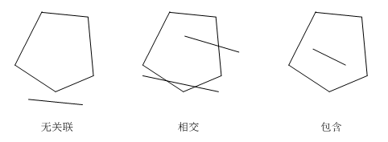
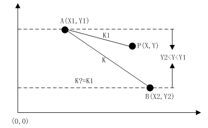
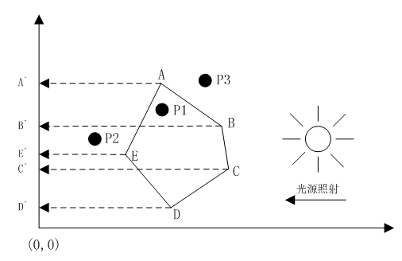

# [线段与多边形关系的算法](http://www.cnblogs.com/xiaozhi_5638/p/4165353.html)

## 介绍

最近项目中要用到有关几何（Geometry）方面的知识，程序需要判断给定的一条线段（Segment）与指定多边形（Polygon）的位置关系。这种关系分为三种：多边形包含线段、多边形与线段相交以及多边形与线段无关联。

起初我以为.NET类库中已经包含此种判定功能的API，比如类似``System.Drawing.Region``这些类型，后来等到实际要用的时候才发现根本就没这种“高级”算法。

没办法，只能自己去写代码实现。后来在stackoverflow（链接）上找到了一个解决方案，不过都是源代码，并没有详细的说明。本文参照原作者提供的源码，进行详细的说明。如果你只需要最终答案，可以不用阅读本文所有内容，文章最后会给出判断源代码，很简答使用，就一个方法，代入参数直接调用即可，但如果你想搞清楚怎么回事，那么可以静下心来看看本文全部内容，虽然比较复杂，但是相信一定会有所收获的。

## 解决思路

线段与多边形的关系只有三种：无关联、相交以及包含。我们可以分以下两步来进行分析：

+ 判断线段与多边形的各条边是否相交，若是，则线段与多边形属于“相交”关系；
+ 如果线段与多边形的任何边都不相交，那么我们接着判断线段的任意一个端点是否在多边形内部，若是，则整条线段肯定在多边形内（即“包含”关系）；若不是，则整条线段肯定都在多边形外部（即“无关联”关系）。

上面两步看似简单，实质相当复杂。判断线段与多边形各条边的关系涉及到了“线段与线段关系的判断”、判断线段任意一个端点是否在多边形内部涉及到了“点与线段关系的判断”，总之，要解决大问题必须先解决一些小问题：

+ 点与线段的关系
+ 线段与线段的关系
+ 点与多边形的关系

下面依次介绍以上三个小问题和整个大问题的解决方法。

### 问题一：点与线段的关系

点与线段只有两种关系：

+ 点在线段上
+ 点与线段无关联

这种判断方法很简单，只要我们能确保给定点P的Y坐标在线段AB两个端点的Y坐标之间（或者点P的X坐标在两个端点的X坐标之间也行），并且点P与线段AB任意端点间的斜率与AB线段斜率相等即可说明点P在线段AB上。

如上图，如果``Y2<Y<Y1``且``K==K1``，则说明点P在线段AB上；否则，点P与线段AB无关联。

### 问题二：线段与线段的关系

线段与线段也只有两种关系：

+ 两线段相交
+ 两线段无关联

这种判断稍微复杂一些，为了更方便计算，涉及到了“平移”、“旋转”等操作。给定线段AB和CD，先将两线段整体平移（注意是整体），让线段AB的A端点与原点（0,0）重合，接着将两线段整体旋转（注意是整体），让线段AB与X轴的正方向重合。

如上图，将任意两线段AB和CD按照“先整体平移，再整体旋转”的顺序操作一遍，最终让线段AB的A端点与原点（0,0）重合，并让线段AB与X轴正方向重合。很显然，任意线段均可以进行以上操作。接下来，再在此基础上进行判断就比较简单了，如果线段CD的两个端点C和D的Y坐标均大于零（分布在第一、二象限）或者均小于零（分布在第三、四象限），那么AB与CD肯定不相交，换句话说，CD的两个端点必须一个在X轴上方另一个在X轴下方时，两条线段才有可能相交。如果线段CD的端点确实是一个在X轴上方一个在X轴下方，接下来再计算直线AB和直线CD（注意这里说的是直线）的交点（这时候两条直线一定有交点，并且交点在X轴上），这里暂定交点为P，如果P在X轴的负方向上（``P.X<0``），那么说明线段AB和CD不相交，如果P在X轴正方向但是P的X坐标大于线段AB的长度，那么说明线段AB和CD也不相交，其他情况下，线段AB和CD才属于“相交”关系。

### 问题三：点与多边形的关系

点与多边形有三种关系：

+ 点与多边形无关联
+ 点在多边形上（某条边上）
+ 点在多边形内部

判断点是否在多边形上需要用到解决问题一的方法，即判断点与线段的关系。如果点不在多边形上，那么需要判断它在多边形内部还是外部，这个判断方法说难也不难，说不难也挺难的。事实上，只需要判断点在多边形每条边的左边还是右边（注意这里的左边和右边定义，见下图）

如上图，多边形ABCDE在右侧光源的照射下，它的每条边（如AB、BC等）都会与Y轴上各自的投影（如A`B`、B`C`等）之间形成一个梯形区域，如ABB`A`、BCC`B`等。我们只需要统计给定点P在这些梯形区域中的次数，若点P在某条边对应的梯形区域内，那么计数N加1，最后看N是否为偶数，如果N为偶数（包括0），那么说明点P不在多边形内部；否则，点P在多边形内部。上图中P1的计数N==1（只在ABB`A`内部），所以点P1在多边形ABCDE内部，而点P2的计数N==2（同时在AEE`A`和BCC`B`内部），所以点P2不在多边形ABCDE内部，同理，点P3的计数N==0，所以它也不在多边形内部。

由上可以看出，解决问题三需要依赖问题一的解决方法。以上三个小问题都已经有解决方案了，那么我们再来看看最开始那个问题“线段与多边形关系”怎么解决。

### 问题四：线段与多边形关系

前三个问题解决了，这个问题其实已经很简单了。再看一遍【解决思路】中的两个步骤：

+ 判断线段与多边形的各条边是否相交，若是，则线段与多边形属于“相交”关系；
+ 如果线段与多边形的任何边都不相交，那么我们接着判断线段的任意一个端点是否在多边形内部，若是，则整条线段肯定在多边形内（即“包含”关系）；若不是，则整条线段肯定都在多边形外部（即“无关联”关系）。

我们可以使用问题二的解决方法去判断线段是否与多边形的各条边相交，如果都不相交，那么我们可以使用问题三的解决方法去判断线段的某个端点是否在多边形内部，如果在，那么整个线段必然在多边形内部；否则，整个线段必然在多边形外部。

是的，问题四就是这么简单！只要我们弄懂了前三个问题的解决思路。