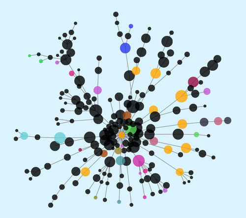
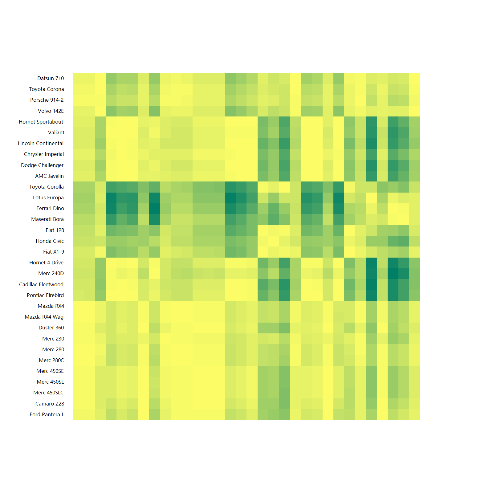

# Microsoft VisualBasic App Runtime


[]()
[](https://opensource.org/licenses/GPL-3.0/)
[](https://doi.org/10.5281/zenodo.160492)

###### [WARNING] This project is a work in progress and is not recommended for production use.


#### Directory Structure

###### 1. source projects

+ **[/CLI_tools](./CLI_tools/)** : Some small utilities and example tools
+ **[/Data](./Data/)** : VisualBasic data framework system for data science, includes data frame, data I/O and data object search framework.
+ **[/Data_science](./Data_science/)** : VisualBasic mathmatica system, data graphics plot system & Data Mining library
+ **[/Microsoft.VisualBasic.Architecture.Framework](./Microsoft.VisualBasic.Architecture.Framework/)** : Microsoft VisualBasic App Runtime core
+ **[/mime](./mime/)** : VisualBasic various mime-types doc parsers
+ **[/gr](./gr/)** : VisualBasic data graphics system
+ **[/win32_api](./win32_api/)** : Win32 API collection
+ **[/www](./www/)** : Web related codes

###### 2. docs for User

+ **[/guides](./guides/)** : This framework code usage example and manual documents
+ **[/vb_codestyle](./vb_codestyle/)** : Coding style standard document


---------------------------------------------------------------------------------------------------------------

A language feature runtime library for CLI architecture applications. This framework project includes a lot of utility tools and the utility code extension functions for the data sciences programming for VisualBasic, and extends the VisualBasic programming language syntax. Makes the VisualBasic programming style more modernization by using this runtime library framework.

> Abount VisualBasic code style guidelines:
> + https://github.com/xieguigang/VisualBasic_AppFramework/tree/master/vb_codestyle

> Guides for using this framework, you can found the document and content index at the [README.md](./guides/README.md)(This guidelines document is currently compiling for users):
> + https://github.com/xieguigang/VisualBasic_AppFramework/blob/master/guides/


##### Install this framework via nuget package

+ https://www.nuget.org/packages/VB_AppFramework/

```bash
# For install latest stable release version:
PM> Install-Package VB_AppFramework
# For install latest unstable beta version:
PM> Install-Package VB_AppFramework -Pre
```

+ For .NET framework 4.0, install package
https://www.nuget.org/packages/VB_AppFramework_40/

>  PM> Install-Package VB_AppFramework_40

## Microsoft VisualBasic Mathematics System for Data Science

+ **[Mathematics System](./Data_science/Mathematical/)** <<<
+ **[DataFrame System for VisualBasic Data Science](./Data/DataFrame/)** <<<
+ **[Network Visualization Interface](./gr/Datavisualization.Network/)** <<<



##### Plots System
```vbnet
Imports Microsoft.VisualBasic.Mathematical.Plots
```


###### Histogram Plot of beta-PDF
<a href="./Data_science/Mathematical/data/beta-PDF/"></a>


> ###### Microsoft.VisualBasic.Mathematical.Plots.Heatmap::Plot(IEnumerable(Of NamedValue(Of Dictionary(Of String, Double))), Color(), Integer, String, Boolean, Size, Size, String, String, String) As Bitmap
>
> Heatmap data source from R dataset [``mtcars``](./Data_science/Mathematical/Quick_correlation_matrix_heatmap/mtcars.csv) and calculates [the Pearson correlations](./Microsoft.VisualBasic.Architecture.Framework/Extensions/Math/Correlations.vb):
> ```R
data(mtcars)
write.csv(mtcars, "./Data_science/Mathematical/Quick_correlation_matrix_heatmap/mtcars.csv")
```

## What's new of VisualBasic language Syntax from this runtime library?

###### 1. Inline value assign

Old:

```vbnet
Dim s As String = ""

Do While Not s Is Nothing
   s = blablabla

   ' Do other staff
Loop
```

New:

```vbnet
Imports Microsoft.VisualBasic.Language

Dim s As New Value(Of String)

Do While Not (s = blablabla) Is Nothing
   ' Do other staff
Loop
```

###### 2. List(Of )

Old:

```vbnet
Dim l As New List(Of String)

Call l.Add("123")
Call l.AddRange(From x In 100.Sequence Select CStr(x))
```

New:

```vbnet
Imports Microsoft.VisualBasic

Dim l As New List(Of String)

l += "123"
l += From x As Integer
     In 100.Sequence
     Select CStr(x)
```

###### int Type

```vbnet
Imports Microsoft.VisualBasic.Language

Dim min As int = 1
Dim max As int = 200
Dim x As Integer = 199

Console.WriteLine(min <= x < max) ' True
x += 10 ' 209
Console.WriteLine(min <= x < max) ' False
x = -1
Console.WriteLine(min <= x < max) ' False
```

## Framework Gallery
Simple 3D Graphics by [Microsoft.VisualBasic.Imaging](./gr/Microsoft.VisualBasic.Imaging) 3D engine.


===================================================================

###### Modules that Includes in this Framework:

> 1. A data frame system for read/write csv data more easily.
> 2. ODEs solver system and data plots system
> 3. Various linq extensions for the data science programming on large amount data processing
> 4. VisualBasic language Feature: Unix bash command supports in under development which parts of the API is available at namespace ``Microsoft.VisualBasic.Language``
> 5. Image graphics system in namespace ``Microsoft.VisualBasic.Imaging``

###### Image fast binarization using VisualBasic extension API
[``Sub Binarization(ByRef curBitmap As Bitmap, Optional style As BinarizationStyles = BinarizationStyles.Binary)``](./Microsoft.VisualBasic.Architecture.Framework/Extensions/Image/Bitmap/hcBitmap.vb)

```vbnet
Imports Microsoft.VisualBasic.Imaging

Dim bitmap As Image = Image.FromFile("./etc/lena/f13e6388b975d9434ad9e1a41272d242_1_orig.jpg")

Call bitmap.GetBinaryBitmap
     .SaveAs("./etc/lena/lena.binary.png", ImageFormats.Png)
Call bitmap.GetBinaryBitmap(BinarizationStyles.SparseGray)
     .SaveAs("./etc/lena/lena.gray.png", ImageFormats.Png)
```

|Normal|Binary|Gray|
|------|------|----|
||||
