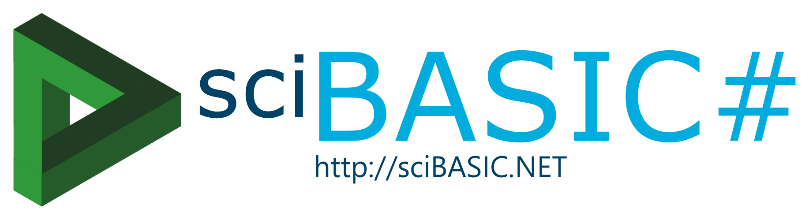
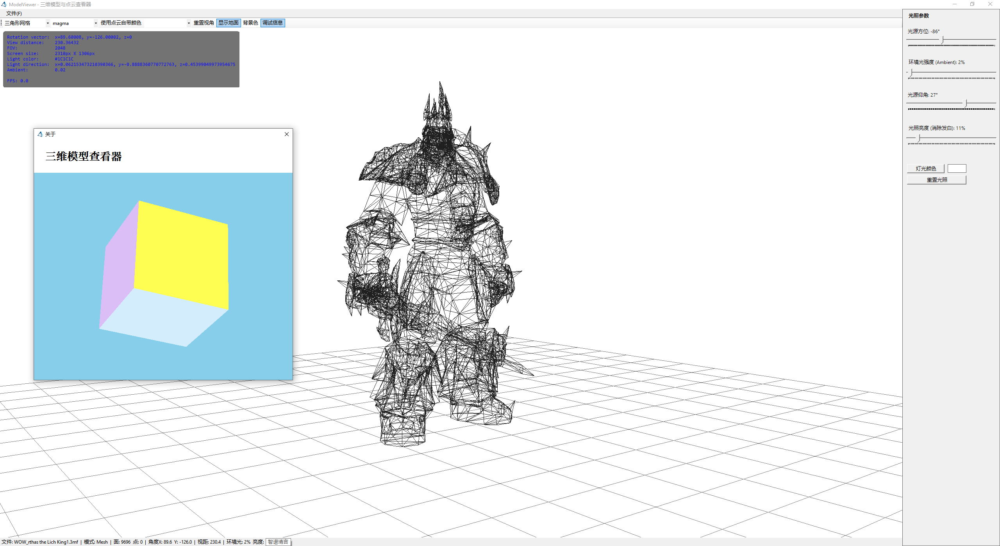
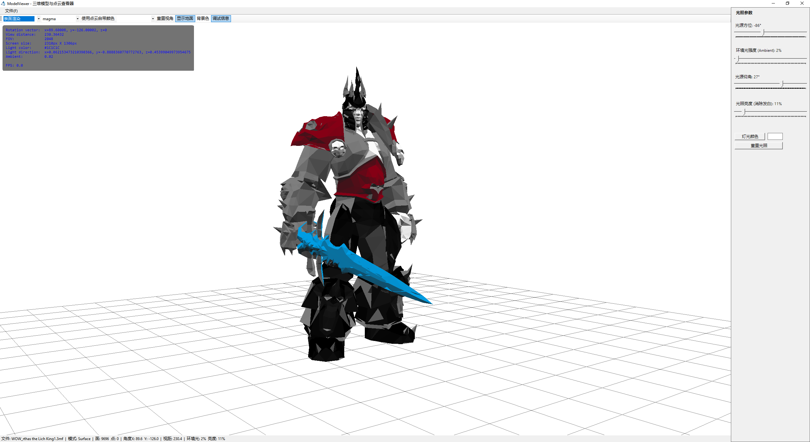

# sciBASIC#: Microsoft VisualBasic for Scientific Computing

[](https://github.com/xieguigang/sciBASIC/releases)
[](https://ci.appveyor.com/project/xieguigang/scibasic)
[](https://www.gnu.org/licenses/gpl-3.0.html)
[](https://gitter.im/xieguigang/sciBASIC)

> A VisualBasic(.NET) language kernel and runtime for scientific data computing, deep learning, LLM inference, GPU acceleration, visualization and command-line data-science applications — running on .NET (`net10.0`) across Windows, Linux and macOS. Write your analysis as a plain `.vb` script and run it directly with the built-in **`vbs` script engine**.



---

## Table of Contents

- [Introduction](#introduction)
- [What's New](#whats-new)
- [Features](#features)
- [Installation & Build](#installation--build)
- [Quick Start](#quick-start)
- [NumericTable — One Data Model for the Whole Data-Science Pipeline](#numerictable--one-data-model-for-the-whole-data-science-pipeline)
- [Deep Learning Suite](#deep-learning-suite)
- [LLM Engine (Decoder-Only Transformer)](#llm-engine-decoder-only-transformer)
- [GPU Acceleration — ILCuda & ILCudaTensor](#gpu-acceleration--ilcuda--ilcudatensor)
- [SIMD Math Acceleration](#simd-math-acceleration)
- [The VBS Script Engine](#the-vbs-script-engine)
- [Module & Namespace Overview](#module--namespace-overview)
- [Extended VisualBasic Language](#extended-visualbasic-language)
- [Examples by Domain](#examples-by-domain)
- [FAQ](#faq)
- [Documentation & Contacts](#documentation--contacts)

---

## Introduction

**sciBASIC#** is a cross-platform framework, written entirely in Microsoft VisualBasic.NET, that brings the
productivity of the BASIC language to scientific computing. It bundles a large, cohesive set of reusable
libraries (100+ projects in `nuget.slnx`) that together form the foundation for building data-science
**command-line tools** on Windows, Linux and macOS — on modern .NET (`net10.0`).

The runtime is organized into cooperating layers:

| Layer | Source root | Purpose |
| --- | --- | --- |
| **Core runtime** | `Microsoft.VisualBasic.Core/` | Extended VB language syntax, LINQ-style collections, a CLI application framework, the `NumericTable` unified data model, serialization, networking and **SIMD-accelerated math**. |
| **Data framework** | `Data/`, `mime/` | Tabular data (`DataFrame`), scientific file I/O (NetCDF, HDF5, Feather, SQLite3, HDSPack), MIME / text & XML parsing (JSON, xlsx, docx, pdf, markdown, yaml), and NLP (word2vec, KnowledgeGraph). |
| **Math & data science** | `Data_science/` | Numerical math, statistics, ODE solvers, **deep learning (CNN / RNN / Transformer / GNN / LNN / SNN)**, classic ML, dimension reduction (UMAP / PaCMAP / t-SNE), evolutionary algorithms (`Darwinism`) and machine vision. |
| **LLM engine** | `llm/` | A pure-managed **decoder-only LLM** implementation: MoE, KV cache, RoPE, function calling with constrained decoding. |
| **GPU acceleration** | `cuda/` | **NVIDIA CUDA computing framework** (`ILCuda`) and a **GPU tensor runtime** (`ILCudaTensor`) — native heterogeneous computing without any third-party NuGet dependency. |
| **Graphics & visualization** | `gr/`, `Data_science/Visualization` | The "sciBASIC# Artists" imaging engine that produces publication-quality 2D/3D plots, SVG / d3js export, network layouts and color palettes. |
| **Script engine** | `vs_solutions/VBS/` | The **`vbs` scripting host**: run VB.NET scripts directly without creating a project — with vectorized syntax, dynamic types and more. |

The design philosophy is **CLI-first / script-first**: instead of drag-and-drop controls, sciBASIC# emphasizes
headless, scriptable, reproducible data-science programs that read files, compute, and emit figures or
tables — the kind of artifacts that end up in a scientific manuscript.

#### 3D Graphics Example From sciBASIC#





---

## What's New

The framework has been extended substantially in the recent releases:

1. **Deep learning model zoo** (`Data_science/MachineLearning/`) — modern neural architectures
   implemented in pure managed code: **CNN, RNN, Transformer, ANN** (in the `DeepLearning` package),
   plus dedicated packages for **GNN** (graph neural networks: GCN / GAT / temporal graphs),
   **LNN** (liquid neural networks with ODE-solver cells), **SNN** (spiking neural networks: LIF
   neurons, surrogate gradients, STDP), **VAE**, **RBM**, **DBN** and **Deep-Q-Network**.
2. **LLM engine** (`llm/`) — a decoder-only language model built on the Transformer architecture:
   DeepSeek-style **MoE** routing, **KV cache** incremental decoding, RoPE, RMSNorm, SwiGLU,
   GQA/MQA, **function calling** with schema-constrained decoding and a full agent loop.
3. **`NumericTable` unified data model** (`Microsoft.VisualBasic.Core/src/Data/NumericTable.vb`) —
   one table model (row names + feature columns + label columns) shared by *every* machine-learning
   algorithm in the framework, enabling **chain-style** data-science pipelines:
   `NumericTableIO.ReadCsv(...).kmeans(3).pca(2).ScoreTable()` …
4. **SIMD math acceleration** (`Microsoft.VisualBasic.Core/src/Math/SIMD/`) — hardware-vectorized
   arithmetic (SSE2/AVX/ARM Advanced SIMD) for element-wise math, matrix kernels and reductions,
   plus a `Vec*` operator vocabulary used by the script engine's auto-vectorization.
5. **CUDA GPU framework** (`cuda/`) — `ILCuda` (P/Invoke of the CUDA Driver API + NVRTC runtime
   compilation, zero third-party dependencies, and an **IL → CUDA** translator that compiles your
   .NET methods to GPU kernels) and `ILCudaTensor` (a `double`-precision GPU tensor runtime whose
   `CudaTensor` transparently switches the whole `Tensor`/`nn` operator family to the GPU).
6. **The VBS script engine** (`vs_solutions/VBS/`) — run VB.NET scripts **directly**:
   no project, no compilation step, no deployment. The engine parses, restructures, compiles
   in memory via Roslyn and executes the assembly — and adds scripting-only syntax extensions
   (vectorized array math, `let` dynamic typing, tuple destructuring, `@` array projection,
   `#include` of dlls/scripts/NuGet packages).

---

## Features

- **Extended VisualBasic syntax** — `Value(Of T)` inline assignment, `List(Of T)` with a `+` append
  operator and rich indexers, LINQ helpers (`Sequence`, `Iterates`, `which`, `sentinel`) and Unix-shell
  style helpers (`UnixBash.ls`, `cat`).
- **Command-line application framework** — attribute-driven (`<ExportAPI>`, `<Usage>`) CLIs, automatic
  help generation, and `InteropService` to host external command-line tools.
- **VB.NET script engine (`vbs`)** — top-level statements, `?"--arg"` parameters, `#include`
  (assembly / script / NuGet), magic methods (`Here()`, `ScriptDir()`), auto-vectorized numeric
  array math, `print` data inspection in GNU R style, and `make-project` to promote a debugged
  script into a real `.vbproj` project.
- **Unified tabular model — `NumericTable`** — row names + feature columns + label columns, with
  chainable extension methods shared across K-Means, PCA, hierarchical clustering, linear/polynomial
  fitting, UMAP/PaCMAP, SHAP and more.
- **Deep learning** — CNN (Conv2D/Pooling/Dropout/… + Softmax/SVM/Regression losses), char-level RNN,
  encoder–decoder **Transformer** with multi-head attention, feed-forward ANN, GCN/GAT graph networks,
  liquid time-constant networks, spiking neural networks, VAE/RBM/DBN, DQN reinforcement learning.
- **LLM inference & training** — decoder-only Transformer with MoE experts, KV cache prefill +
  incremental decoding, RoPE positional embedding, AdamW trainer, sampling strategies and
  **schema-constrained function calling** (agent loop).
- **Classic machine learning** — K-Means, hierarchical clustering, SVM, decision trees / random forest
  (Bonsai), Naïve Bayes, HMM, XGBoost-style gradient boosting, association rules, sequence alignment,
  SHAP value explanation.
- **Dimension reduction & manifold learning** — PCA, UMAP, PaCMAP, t-SNE.
- **GPU heterogeneous computing** — CUDA Driver API interop, NVRTC kernel compilation, device memory
  & streams, BLAS/reduction/element-wise kernels, IL→CUDA source translation, and a
  GPU tensor runtime with automatic backend switching.
- **SIMD vectorized math** — `System.Numerics.Vector`-based element-wise arithmetic, matrix kernels
  (`SimdMatrix`), reductions (`SimdReduce`) and math functions (`SimdMath`) for `float`/`double` data.
- **Scientific file I/O** — NetCDF, HDF5, Feather, SQLite3, HDSPack, msgpack and other binary formats,
  plus MIME text/XML and Excel (OpenXML) parsing.
- **Mathematics** — linear algebra, statistics & hypothesis testing (ANOVA), data fitting /
  bootstrapping, Gibbs sampling, signal processing, symbolic math and **ODE solvers** (Runge–Kutta,
  SUNDIALS CVODE bindings).
- **Evolutionary algorithms** — genetic algorithms and differential evolution under
  `Microsoft.VisualBasic.MachineLearning.Darwinism`.
- **Natural-language processing** — word2vec, TextRank keyword extraction, KnowledgeGraph and the
  `GraphQuery` object query DSL.
- **Visualization / "Graphics Artist"** — scatter, line, bar, histogram, heatmap, volcano and 3-D
  plots; network/force-directed layouts; SVG / d3js / PDF export; `colorbrewer` palettes; isometric 3-D
  engine; AVI video writing; Gaussian splatting 3D. Figures are tuned for **printable,
  publication-quality** output.
- **LLM proxy** — bridge a local model (e.g. Ollama) or any `Func(Of String, String)` endpoint into the
  runtime via `Microsoft.VisualBasic.LLMs`.

---

## Installation & Build

### Prerequisites

- [.NET 10 SDK](https://dot.net) (the libraries target `net10.0`; graphics/imaging projects additionally
  target `net10.0-windows`).
- Visual Studio 2022 (Windows) or any editor with the VB.NET / .NET workload (Visual Studio Code +
  the C#/VB dev kit, or JetBrains Rider) on Linux / macOS.
- Optional: an NVIDIA GPU + driver for the `cuda/` acceleration layer (everything else runs CPU-only).

### Consume the packages

The individual libraries are published as NuGet packages under the `Microsoft.VisualBasic.*` family
(e.g. the core runtime assembly `Microsoft.VisualBasic.Runtime`). Add them to your project with:

```bash
dotnet add package Microsoft.VisualBasic.Runtime
```

### Build from source

Clone the repository and build the NuGet solution, which references every library project:

```bash
git clone https://github.com/xieguigang/sciBASIC.git
cd sciBASIC
dotnet build nuget.slnx -c Release
```

To build a single library, open its `.vbproj` (for example
`Microsoft.VisualBasic.Core/src/Core.vbproj`, `llm/llm.vbproj` or `vs_solutions/VBS/VBS.vbproj`)
or the relevant solution under `vs_solutions/`.

---

## Quick Start

### A. Classic sciBASIC# console application

```vbnet
Imports Microsoft.VisualBasic.ApplicationServices
Imports Microsoft.VisualBasic.CommandLine
Imports Microsoft.VisualBasic.CommandLine.Reflection

Module Program

    Public Function Main() As Integer
        ' Standard sciBASIC# CLI entry point: dispatches /switch based on
        ' <ExportAPI> methods and auto-generates the help screen.
        Return GetType(Program).RunCLI(App.CommandLine)
    End Function

    <ExportAPI("/hello")>
    <Usage("/hello /name <string>")>
    Public Function Hello(args As CommandLine) As Integer
        Call Console.WriteLine($"Hello, {args("/name")}!")
        Return 0
    End Function

End Module
```

```bash
yourapp.exe /hello /name "sciBASIC#"
# -> Hello, sciBASIC#!
```

### B. Or just write a script — no project needed

Save `hello.vb`:

```vbnet
' No Module, no Sub Main — top-level statements just work.
Dim name As String = ?"--name"      ' read a command-line argument

Call Console.WriteLine($"Hello, {name}!")

Dim x = {1, 2, 3, 4, 5}
Call print(x * 2 + 1)               ' vectorized array math, R-style output
' [1]  3  5  7  9 11
```

Run it with the `vbs` host (see [The VBS Script Engine](#the-vbs-script-engine)):

```bash
dotnet build vs_solutions/VBS/VBS.vbproj -c Release
.nuget/net10.0/vbs.exe hello.vb --name "sciBASIC#"
```

---

## NumericTable — One Data Model for the Whole Data-Science Pipeline

`Microsoft.VisualBasic.Core/src/Data/NumericTable.vb` defines the framework's unified 2-D data model:
**row names + feature columns + label columns** (labels are the `label:`-prefixed columns). Every
machine-learning algorithm in sciBASIC# understands this model, so data flows between algorithms
**without conversion glue code** — you simply chain the steps.

```vbnet
Imports Microsoft.VisualBasic.Data

' 1. Load a csv (row names + D1..D4 feature columns; text class column ignored)
Dim table = NumericTableIO.ReadCsv("bezdekIris.csv", columns := {"D1","D2","D3","D4"})

' 2. K-Means clustering writes its result back into the table's label matrix
Dim result = table.kmeans(k := 3)

' 3. PCA on the clustered table -> project to the first two components
Dim score = result.pca(maxPC := 2).ScoreTable()

' 4. Pull columns for plotting
Dim pc1 = score.Feature("PC1")
Dim pc2 = score.Feature("PC2")
```

*(excerpt from `tutorials/VBS/scripts/kmeans/kmeans.vb` — a complete Iris clustering + PCA + scatter-plot demo)*

Regression works the same way:

```vbnet
Dim model = table.LinearFit(y := "y")          ' linear regression on the label column
Dim quad  = table.PolyFit(poly_n := 2)         ' polynomial comparison model
Dim out   = table.SetPrediction(model, withResidual := True)   ' new table + prediction/residual labels

Call out.WriteCsv("fit.csv")
```

*(excerpt from `tutorials/VBS/scripts/linear_regression/linear_regression.vb`)*

Key API surface: `nsamples` / `nfeatures` / `nlabels`, `Feature(name)`, `GetLabel(name)`,
`SetLabel(name, values)`, `Slice(rows)`, `Select(cols)`, `Clone()`, plus IO helpers
(`NumericTableIO.ReadCsv`, `WriteCsv`) and R-style `print(tbl)` table rendering.

---

## Deep Learning Suite

All models are implemented in **pure managed VB.NET** on a shared tensor runtime — no PyTorch/TensorFlow
native runtime required, while the GPU can be layered on through `ILCudaTensor`.

| Package (`Data_science/MachineLearning/…`) | Models | Highlights |
| --- | --- | --- |
| `DeepLearning` (`DeepLearning.NET6.vbproj`) | **CNN** (`CNN`: Conv2D, Conv2DTranspose, Pooling, Dropout, Maxout, LRN, Fourier-feature, Gaussian layers; Softmax/SVM/Regression loss layers; model save/load), **RNN** (char-level), **Transformer** (encoder/decoder stacks, multi-head attention), **ANN** (`NeuralNetwork`) | SGD / AdaGrad / **Adam** optimizers, trainer loops, CeNiN model import |
| `GNN` (`GNN.vbproj`) | **GCN layer**, **Graph attention (GAT)**, GRU/RNN recurrent graph layers, temporal graph models, graph classification | message-passing on graphs, dynamic-graph snapshots |
| `LNN` (`LNN.vbproj`) | **Liquid neural networks** — `LiquidCell`/`LiquidLayer`, ODE-solver based continuous-time units | time-series utilities, liquid trainer |
| `SNN` (`SNN.vbproj`) | **Spiking neural networks** — LIF / recurrent-LIF / sparse-LIF layers, rate & temporal encoders/decoders, surrogate gradients, STDP learning | third-generation neural networks with spike trains |
| `VAE` / `RestrictedBoltzmannMachine` / `DBNCode` | Variational autoencoder, RBM, deep belief networks | unsupervised representation learning |
| `DeepQNetwork` (`DeepQNetwork.vbproj`) | DQN reinforcement learning | Q-learning on neural function approximators |
| `xgboost` / `XGBoostDataSet` | gradient-boosted trees | tabular learning with the `NumericTable` dataset format |
| `ML_SHAP` | SHAP value explanation | model-agnostic feature attribution |
| `MLDataStorage` / `MachineLearning.Data.Extensions` | ML data packing & `NumericTable` bridges | interop glue between packages |

Minimal CNN example:

```vbnet
Imports Microsoft.VisualBasic.MachineLearning
Imports Microsoft.VisualBasic.MachineLearning.CNN
Imports Microsoft.VisualBasic.MachineLearning.CNN.trainers

Dim net As New ConvolutionalNetwork()
Call net.AddLayer(New ConvolutionLayer(filters:=32, kernelSize:=3))
Call net.AddLayer(New PoolingLayer(size:=2))
Call net.AddLayer(New DenseLayer(units:=10))
Call net.Compile(loss:=New SoftmaxCrossEntropy())

Dim trainer As New SGDTrainer(optimizer:=Optimizer.Adam, learningRate:=0.001)

For epoch As Integer = 1 To 20
    Call trainer.TrainEpoch(net, trainData)
Next
```

---

## LLM Engine (Decoder-Only Transformer)

`llm/llm.vbproj` provides a pure-managed **decoder-only language model** covering three main lines
beside the classic encoder–decoder `Transformer` in `DeepLearning`:

| Line | Types | What it does |
| --- | --- | --- |
| **Mixture of Experts** | `MoELayer` | DeepSeekMoE: fine-grained expert splitting + shared expert isolation + Sigmoid Top-K routing + auxiliary-loss-free load balancing + node-limited routing |
| **KV Cache** | `KVCache`, `CausalSelfAttention` | prefill + incremental decoding — per-step attention cost drops from `O(t²)` to `O(t)`; `nKvHeads < nHeads` gives GQA/MQA |
| **Function calling** | `ToolCallProtocol`, `JsonSchema`, `ConstrainedDecoder`, `ToolRegistry`, `AgentLoop` | tool schema injection → constrained decoding (schema compiled to a finite-state machine, illegal tokens masked to `-inf`) → parse → execute → feed back → multi-turn loop |

Supporting modules: `RmsNorm`, `RotaryEmbedding` (RoPE), `SwiGLUFeedForward`, `LLMBlock`, `LLMModel`,
`Sampler`, `LMTrainer` (AdamW, warmup + cosine schedule, gradient clipping), `ParameterSet`,
`TokenStream`, `TokenizerVocabulary`. No automatic differentiation framework — backprop is hand-written
per component against cached forward snapshots, keeping the whole engine readable and debuggable.

```vbnet
' Build & train (see TalkBuddy/test/Program.vb for the full walkthrough:
' pretraining -> instruction SFT -> tool-call SFT -> MoE routing stats
' -> sampling comparison -> KV-cache consistency -> multi-turn tool calling)
Dim model As New LLMModel(New LLMModelConfig With {.dModel = 512, .nLayers = 8, ...})
Dim trainer As New LMTrainer(model, New AdamW(model.Parameters, lr:=0.0003))
Call trainer.TrainStep(batch)
```

---

## GPU Acceleration — ILCuda & ILCudaTensor

The `cuda/` root brings **native NVIDIA GPU heterogeneous computing** to sciBASIC# — with **zero
third-party NuGet dependencies** (it P/Invokes `nvcuda.dll` and `nvrtc64_*.dll` directly).

| Project | Role |
| --- | --- |
| `cuda/ILCuda/ILCuda.vbproj` | CUDA compute framework: device/context/stream management, device memory & pinned host buffers, NVRTC multi-pass kernel compilation, kernel registry & launch planning, built-in reduction / element-wise / BLAS (GEMM, GEMV) kernels, structured diagnostics. Includes **`IL2Cuda`**: an IL → AST → CUDA-C translator with `<CudaKernel>`/`<CudaInput>`/`<CudaOutput>` attributes that turns ordinary .NET methods into GPU kernels. |
| `cuda/ILCudaTensor/ILCudaTensor.vbproj` | GPU tensor runtime: device-resident `CudaTensor` (dense + CSR sparse storage) and a set of double-precision kernels (GEMM, softmax, reductions, conv/pool, sparse×dense). **One `Register()` call switches the whole TensorFlow-style `Tensor`/`Math`/`nn` operator family to the GPU backend** — operators without a GPU kernel silently fall back to the CPU implementation, so nothing ever breaks. |

```vbnet
' After one registration, tensor math runs on the GPU automatically:
Call CudaTensor.Register()

Dim a = Tensor.Random(2048, 2048)
Dim b = Tensor.Random(2048, 2048)
Dim c = a * b      ' GEMM on the GPU, double precision
```

The `ILCuda` test project doubles as a demo CLI:

```bash
dotnet ILCuda.Demo.dll info        # device & NVRTC environment probe (with memory info)
dotnet ILCuda.Demo.dll demo        # pearson-correlation + euclidean-distance matrices on GPU
dotnet ILCuda.Demo.dll selftest    # kernel-logic self-check (no GPU required)
```

---

## SIMD Math Acceleration

`Microsoft.VisualBasic.Core/src/Math/SIMD/` is the CPU-side high-performance math core, used by the
machine-learning packages and by the script engine's auto-vectorizer:

```
SIMD/
├── SimdEngine.vb          # capability detection & dispatch (SSE2 / AVX / ARM Advanced SIMD)
├── SimdMath.vb            # vectorized math functions (sqrt, exp, log, abs, ...)
├── SimdMatrix.vb          # matrix kernels
├── SimdReduce.vb          # sum / min / max / mean reductions (sequential, reproducible floats)
├── SimdCompare.vb / SimdCapabilities.vb
├── SimdExtensions.vb      # Simd* extension vocabulary
├── Vectorized.vb          # the Vec* operator vocabulary (VecAdd / VecMultiply / VecSum / ...)
├── Arithmetic/            # Add / Subtract / Multiply / Divide / Modulo / Exponent facades
└── Parallel/              # block-parallel variants
```

Script authors rarely call these directly — when a script performs arithmetic on numeric arrays, the
VBS engine rewrites the expression tree into `Vec*` calls (see below), which resolve to these SIMD
kernels at runtime.

---

## The VBS Script Engine

`vs_solutions/VBS/VBS.vbproj` builds the **`vbs`** scripting host: run a `.vb` file directly, without
creating a VS project or compiling an exe. The engine textually parses and restructures the script,
compiles it **in memory** through Roslyn, executes it via reflection inside a collectible
`AssemblyLoadContext` (fully unloaded afterwards), and never touches disk.

```bash
vbs ./run.vb --a=123 --flag          # run a script with arguments
vbs ./run.vb --verbose               # print the generated compilable code + debug build
vbs ./run.vb --no-vectorize          # disable auto-vectorization
vbs make-project ./run.vb            # promote the script into a real vbproj project
```

### Scripting syntax extensions

| Feature | Example |
| --- | --- |
| Top-level statements & functions | no `Module`/`Sub Main` boilerplate; top-level functions become local lambdas automatically |
| Command-line arguments | `Dim a As Integer = ?"--a"` → rewritten to `args("--a")` with automatic type conversion |
| `#include` | reference a **dll** (`#include "Microsoft.VisualBasic.Drawing.dll"`), another **script** (`#include "./lib/Helper.vb"`), or a **NuGet package** (`#include "Newtonsoft.Json@13.0.3"`, with transitive dependency resolution and the local `~/.nuget/packages` cache) |
| Magic methods | `ScriptDir()`, `ScriptFile()`, `Here(relpath)`, `Includes()`, `Locate(name)`, `Package()`/`Author()`/`Version()` … |
| Dynamic typing | `let b = 456` → `Object` variable, re-bindable at runtime (`b = New With {.a = 123}` … `b.a`) |
| Tuple destructuring | `Dim (a, b) = (1, 2)`, `For Each (str, int) In tuples`, nested & named forms |
| Vectorized array math | `Dim z = (x * y + 6) / (x + y)` on numeric arrays → auto-expanded to SIMD `Vec*` calls |
| `@` array projection | `list@x` → `list.Select(Function(o) o.x).ToArray()` (Perl style, chainable, vectorizable) |
| Default parameter expressions | `Optional c = If(b, New testdata(a), New testdata("default"))` — arbitrary expressions as defaults |
| `print` | GNU R-style vector/table/`NumericTable` printing with wrapping, `NA`/`NULL` handling and `width`/`digits` options |

### A complete data-science script

`tutorials/VBS/scripts/kmeans/kmeans.vb` — Iris clustering + PCA + chart export, runnable as-is:

```vbnet
#include "Microsoft.VisualBasic.DataMining.Framework.dll"
#include "Microsoft.VisualBasic.Data.Framework.dll"
#include "Microsoft.VisualBasic.Data.DataPlot.dll"
#include "Microsoft.VisualBasic.Math.Statistics.ANOVA.dll"
#include "Microsoft.VisualBasic.Drawing.dll"

imports microsoft.visualbasic.data
imports microsoft.visualbasic.datamining.kmeans
imports microsoft.visualbasic.data.plots
imports microsoft.visualbasic.drawing

dim file = here("../../data/bezdekIris.csv")      ' magic method: relative to the script
dim k = 3

dim table = NumericTableIO.ReadCsv(file, columns := {"D1","D2","D3","D4"})
dim result = table.kmeans(k := k)                  ' clustering via the unified table model
dim score = result.pca(maxPC := 2).ScoreTable()    ' PCA projection

dim pc1 = score.Feature("PC1")
dim pc2 = score.Feature("PC2")
' ... build a ScatterPlot and save a PNG next to the script ...
```

Run it:

```bash
cd .nuget/net10.0
vbs.exe G:\GCModeller\src\runtime\sciBASIC#\tutorials\VBS\scripts\kmeans\kmeans.vb
```

The `tutorials/VBS/scripts/` folder contains many more runnable demos, most with expected output
(`stdout.txt`) and generated figures: `linear_regression`, `word2vec` (word vectors + UMAP + K-Means),
`hola_layout` (orthogonal network layout), `mnist_cnn`, `spiking_nn`, `tf-idf`,
`hierarchical_clustering`, `mnist_umap`, `dynamic_type`, `tuple`.

`VBS.vbproj` can also be embedded as a class library:

```vbnet
Imports VBScriptHost.Script

Dim vbs As ScriptParseResult = VBScript.ParseScript("./run.vb")

Using runtime As ScriptRuntime = vbs.CompileScript()
    Dim exitCode As Integer = runtime.Run({"--a", "123"})
End Using   ' the dynamic assembly is unloaded here
```

---

## Module & Namespace Overview

The framework exposes a large, consistent set of namespaces. The tables below group them by layer
(each row corresponds to a library project in `nuget.slnx`). Names marked with **\*** ship from the
*data-science runtime* (the `Data/`, `Data_science/`, `gr/`, `cuda/`, `llm/`, `nlp/` and `mime/`
roots) rather than the general core.

### Core runtime — `Microsoft.VisualBasic.Core` (`Core.vbproj`)

| Namespace | Description |
| --- | --- |
| `Microsoft.VisualBasic.Language` | Extended VB syntax: `Value(Of T)`, `List(Of T)`, `Vector`, `UnixBash` shell helpers. |
| `Microsoft.VisualBasic.Language.Linq` | LINQ-style collection helpers (`Sequence`, `Iterates`, `which`, `sentinel`). |
| `Microsoft.VisualBasic.CommandLine` | CLI application framework, `InteropService`, `POSIX` helpers. |
| `Microsoft.VisualBasic.ApplicationServices` | `App` host, logging, `println`, debug port (8081). |
| `Microsoft.VisualBasic.Data` | **`NumericTable`** — the unified data model for machine learning + `NumericTableIO`. |
| `Microsoft.VisualBasic.Math.SIMD` | **SIMD math acceleration**: `SimdEngine`/`SimdMath`/`SimdMatrix`/`SimdReduce` + the `Vec*` operator vocabulary. |
| `Microsoft.VisualBasic.ComponentModel` | Component model: `Collection`, `DataSourceModel`, `Range`, settings. |
| `Microsoft.VisualBasic.Scripting` | Symbol tables and dynamic math-expression evaluation. |
| `Microsoft.VisualBasic.Serialization` | JSON / XML (de)serialization. |
| `Microsoft.VisualBasic.Net` | HTTP / networking utilities. |
| `Microsoft.VisualBasic.Text` | `StringBuilder` helpers and CSV/text utilities. |
| `Microsoft.VisualBasic.Drawing` | Color and 2-D drawing primitives. |
| `Microsoft.VisualBasic.LLMs` | LLM proxy: `HookOllama`, `LLMsTalk`. |
| `Microsoft.VisualBasic.Printing` | GNU R-style data printing (`print`, `ToText`). |

### Data framework — `Data/` & `mime/` **

| Namespace | Description |
| --- | --- |
| `Microsoft.VisualBasic.Data.Framework` * (`dataframework`) | In-memory `DataFrame`, CSV / TSV I/O and reflection-based `EntityObject` storage. |
| `Microsoft.VisualBasic.Data.Framework.Extensions` * | DataFrame extension utilities. |
| `Microsoft.VisualBasic.Data.BinaryData` * (`binarydata`) | Binary scientific formats, including `NetCDF`. |
| `Microsoft.VisualBasic.Data.HDF5` / `Feather` / `SQLite3` / `HDSPack` / `msgpack` / `DataStorage` * | Scientific storage: HDF5, Feather, embedded SQLite3, packed binary datasets, msgpack. |
| `Microsoft.VisualBasic.Data.Trinity` * | In-memory triple-store / key-value storage. |
| `Microsoft.VisualBasic.Data.MyersDiff` * | Myers diff algorithm. |
| `Microsoft.VisualBasic.Data.GraphQuery` * | `GraphQuery` object query DSL and engine. |
| `Microsoft.VisualBasic.MIME.Markup` * | JSON / HTML / XML / Markdown text parsing. |
| `Microsoft.VisualBasic.MIME.Office.Excel` * (`xlsx`) | Excel (OpenXML / .xlsx) reading & writing. |
| `mime/text%yaml`, `text%html`, `application%pdf`, `application%rdf+xml`, `application%rtf`, `...wordprocessingml.document` * | YAML, HTML, PDF, RDF/XML, RTF and DOCX parsers/writers. |

### Math & data science — `Data_science/` **

| Namespace | Description |
| --- | --- |
| `Microsoft.VisualBasic.Math` * (`Math`) | Core numerical math (root namespace of the Mathematica library). |
| `Microsoft.VisualBasic.Math.LinearAlgebra` * | Vectors, matrices, matrix decomposition. |
| `Microsoft.VisualBasic.Math.Statistics` * (`ANOVA`, `stats`) | Descriptive statistics, distributions, hypothesis tests (ANOVA). |
| `Microsoft.VisualBasic.Math.Calculus.Dynamics` * (`ODE`) | ODE system solver (`ODEs`, Runge–Kutta). |
| `Microsoft.VisualBasic.Math.Sundials.CVODE` * | SUNDIALS CVODE stiff/non-stiff ODE bindings. |
| `Microsoft.VisualBasic.Math.DataFrame` * | Math-side dataframe utilities. |
| `Microsoft.VisualBasic.Math.SignalProcessing` * | Signal processing (+ `Signal.IO`, `wav`). |
| `Microsoft.VisualBasic.Math.GibbsSampling` * | Gibbs sampling. |
| `Microsoft.VisualBasic.Math.Symbolic.GeneticProgramming` * / `MathLambda` * | Symbolic / genetic programming math, lambda symbolic engine. |
| `Microsoft.VisualBasic.Math.Randomizer` * | Random number helpers. |
| `Microsoft.VisualBasic.Math.mHG` / `KaplanMeierEstimator` * | mHG statistics, Kaplan–Meier estimator. |
| `Microsoft.VisualBasic.DataMining` * | Data mining: clustering, Association Rules, sequence alignment, `NumericTable` integration. |
| `Microsoft.VisualBasic.DataMining.BinaryTree` / `Bonsai` / `HMM` / `DynamicProgramming` / `DensityQuery` / `FeatureFrame` * | Decision trees, random forest, HMM, DP algorithms, density queries, feature frames. |
| `Microsoft.VisualBasic.DataMining.UMAP` / `PaCMAP` / `t-SNE` / `hierarchical-clustering` * | Dimension reduction & manifold learning (all consume `NumericTable`). |
| `Microsoft.VisualBasic.MachineLearning` * (`machine_learning`) | Machine learning: SVM, decision tree, Naïve Bayes, PCA, `NumericTable` extensions (`kmeans`, `LinearFit`, `PolyFit`, `SetPrediction`...). |
| `Microsoft.VisualBasic.MachineLearning.Darwinism` * | Evolutionary algorithms (genetic algorithm, differential evolution). |
| `Microsoft.VisualBasic.MachineLearning.Convolutional` / `RNN` / `Transformer` / `NeuralNetwork` * (`DeepLearning`) | **Deep learning**: CNN, char-level RNN, encoder–decoder Transformer, feed-forward ANN. |
| `Microsoft.VisualBasic.DeepLearning.GNN` * | **Graph neural networks**: GCN, GAT, temporal graphs, graph classification. |
| `Microsoft.VisualBasic.DeepLearning.LNN` * | **Liquid neural networks** (ODE-solver cells, time-series). |
| `Microsoft.VisualBasic.DeepLearning.SNN` * | **Spiking neural networks** (LIF, STDP, surrogate gradients). |
| `Microsoft.VisualBasic.MachineLearning.VAE` / `RestrictedBoltzmannMachine` / `DBNCode` * | VAE / RBM / deep belief networks. |
| `Microsoft.VisualBasic.MachineLearning.DeepQNetwork` * | DQN reinforcement learning. |
| `Microsoft.VisualBasic.MachineLearning.xgboost` * / `XGBoostDataSet` | Gradient-boosted trees + dataset format. |
| `Microsoft.VisualBasic.MachineLearning.ML_SHAP` * | SHAP feature attribution. |
| `Microsoft.VisualBasic.MachineLearning.CellularAutomaton` * | Cellular automata (Game of Life). |
| `Microsoft.VisualBasic.Math.MachineVision` * / `GaussianSplatting3D` | Machine vision; 3D Gaussian splatting. |
| `Data_science/Graph` * | Graph algorithms (PageRank etc.). |

### LLM & GPU **

| Namespace | Description |
| --- | --- |
| `llm/llm.vbproj` * | **Decoder-only LLM engine**: `LLMModel`, `MoELayer`, `KVCache`, `CausalSelfAttention`, `RotaryEmbedding`, `RmsNorm`, `SwiGLUFeedForward`, `ConstrainedDecoder`, `AgentLoop`, `LMTrainer`, `AdamW`, `Sampler`. |
| `Microsoft.VisualBasic.Computing.ILCuda.*` * (`ILCuda`) | **CUDA framework**: driver interop, NVRTC compilation, device memory/streams, BLAS & reduction kernels, `IL2Cuda` IL→CUDA translator. |
| `Microsoft.VisualBasic.Computing.ILCuda.GPUTensor` * (`ILCudaTensor`) | **GPU tensor runtime**: `CudaTensor`, dense/CSR storage, GEMM/softmax/conv/pool kernels, transparent CPU fallback. |

### Visualization & graphics — `Data_science/Visualization` & `gr/` **

| Namespace | Description |
| --- | --- |
| `Microsoft.VisualBasic.Data.ChartPlots` * (`plots`) | Plotting: scatter, line, bar, histogram, heatmap, volcano, 3-D. |
| `Microsoft.VisualBasic.Data.Plots` * (`DataPlot`) | Plot abstraction + `NumericTable`-driven plotting. |
| `Microsoft.VisualBasic.Imaging` * | "Graphics Artist" device: `GraphicsData`, drawing primitives. |
| `Microsoft.VisualBasic.Imaging.Drawing2D` * | 2-D vector graphics, colors, styles. |
| `Microsoft.VisualBasic.Data.visualize.Network` * | Force-directed network layout & rendering. |
| `Microsoft.VisualBasic.Data.visualize.Network.Layouts` * (`network_layout`) | Layout algorithms incl. HOLA orthogonal layout. |
| `Microsoft.VisualBasic.Data.visualize.Network.IO` * / `NetworkCanvas` / `Visualizer` | Network I/O extensions, interactive canvas, visualizer. |
| `Microsoft.VisualBasic.Imaging.colorbrewer` * | Publication color palettes. |
| `gr/physics` * | Physics simulation helpers. |
| `gr/Landscape` * | Procedural landscape rendering. |
| `gr/avi` * | AVI video writing. |
| `Microsoft.VisualBasic.Drawing` (`DXApi`, `DxCanvas`, `TrueType`) | GDI+/Skia drawing devices, TrueType fonts. |
| `gr/Drawing-net4.8` | Classic .NET Framework drawing backend. |

### NLP — `nlp/` **

| Namespace | Description |
| --- | --- |
| `Microsoft.VisualBasic.Data.NLP.Word2Vec` * | word2vec training (CBOW / Skip-gram). |
| `Microsoft.VisualBasic.Data.NLP` * | NLP model types, segmentation. |
| `Microsoft.VisualBasic.Data.NLP.TextRank` * | `TextRank` keyword extraction. |
| `nlp/KnowledgeGraph` * | Knowledge graph construction. |

### Tooling & services

| Project | Description |
| --- | --- |
| `vs_solutions/VBS/VBS.vbproj` | The **`vbs` script engine** (see above). |
| `vs_solutions/dev/VisualStudio` | VB project tooling + the `VBProj.NuGet` client used by `#include` NuGet resolution. |
| `vs_solutions/dev/vs_PDB` | PDB utilities. |
| `vs_solutions/PkgVersionUpgrade` | Package version migration tool. |
| `www/axel`, `www/Microsoft.VisualBasic.Webservices.Bing` | HTTP client utilities, web services. |
| `docs/guides`, `tutorials/` | Language guides (`LanguageSyntax`, `VectorDemo`, `parameter_expression`) and demos (`MESH`, `ModelViewer`, `logo`). |

---

## Extended VisualBasic Language

sciBASIC# extends the VB.NET surface so that small data-science scripts read almost like a domain-specific
language. All of the helpers below live in `Microsoft.VisualBasic.Language` (core runtime) unless noted.

### Inline value assignment — `Value(Of T)`

```vbnet
Imports Microsoft.VisualBasic.Language

Dim line As Value(Of String) = ""

' inline assignment
Do While (line = stream.ReadLine) IsNot Nothing
    ' ...
Loop
```

### `List(Of T)` append operator and rich indexers

The core `List(Of T)` overloads `+`, so `l += item` appends, and it exposes Python-like
slice/negative indexers:

```vbnet
Imports Microsoft.VisualBasic.Language

Dim l As New List(Of String)
l += "a"
l += "b"
l += "c"

Dim last = l(-1)          ' "c"
Dim slice = l(0, 2)       ' { "a", "b" }
```

### LINQ-style sequence helpers

```vbnet
Imports Microsoft.VisualBasic.Language
Imports Microsoft.VisualBasic.Linq

' 100.Sequence -> 0 .. 99
Dim squares = 100.Sequence _
    .Select(Function(i) i * i) _
    .ToArray

For Each x In New List(Of Integer)({1, 2, 3}).IteratesALL
    Call Console.WriteLine(x)
Next
```

### Unix-shell style helpers — `UnixBash`

```vbnet
Imports Microsoft.VisualBasic.Language

' list files, recursively, long format — mirroring the `ls -l -r` shell command
Dim files = (ls - l - r)  _
    .Select(Function(path) path.FullName) _
    .ToArray

Dim text = cat("data/notes.txt")   ' read a whole file as one string
```

### `println` and the application host

```vbnet
Imports Microsoft.VisualBasic.App

Call println("hello from sciBASIC#")
```

### Vectorized array math (scripts & runtime)

Numeric vectors participate in arithmetic directly; the runtime dispatches to the SIMD kernels:

```vbnet
Dim x = {1, 2, 3, 4, 5}
Dim y = {2, 3, 4, 5, 1}

Dim sum = x + 5                  ' => VecAddScalar(Of Integer)(x, 5)
Dim z = (x * y + 6) / (x + y)    ' whole expression tree expanded element-wise

Call print(x.Average())          ' [1] 3
```

Inside a `vbs` script this rewriting is automatic; in a compiled project the same operators are
available through the `Microsoft.VisualBasic.Math.SIMD.Vectorization` vocabulary.

---

## Examples by Domain

### Tabular data & file I/O (`Data/`)

```vbnet
Imports Microsoft.VisualBasic.Data.Framework.IO
Imports Microsoft.VisualBasic.Data.Framework.StorageProvider

' Load a CSV into an in-memory dataframe resolver:
Dim df = DataFrameResolver.Load("data.csv")

' Strongly-typed loading into entity objects (confirmed API):
Dim people = EntityObject.LoadDataSet(Of Person)("people.csv")
```

Reading a `NetCDF` scientific file:

```vbnet
Imports Microsoft.VisualBasic.Data.BinaryData

Dim nc = netCDFReader.Open("model.nc")
Dim v = nc.getDataVariable("temperature")   ' ICDFDataVector
Dim data = v.genericValue                   ' System.Array of the variable
```

### The chain-style data-science pipeline (`NumericTable`)

See [NumericTable](#numerictable--one-data-model-for-the-whole-data-science-pipeline) above —
load → cluster → reduce → plot → export in a single fluent chain, shared by every ML package.

### Deep learning training (`Data_science/MachineLearning/`)

See [Deep Learning Suite](#deep-learning-suite) for the CNN snippet; GNN, LNN and SNN follow the
same add-layer → compile → train pattern (SGD/Adam), each with its own focused package.

### LLM inference (`llm/`)

See [LLM Engine](#llm-engine-decoder-only-transformer) — MoE routing, KV-cache decoding and
schema-constrained function calling with a complete agent loop.

### GPU kernels (`cuda/`)

See [GPU Acceleration](#gpu-acceleration--ilcuda--ilcudatensor) — either hand-written `.cu` kernels
registered via `KernelSources`, or plain .NET methods translated to CUDA through `IL2Cuda`.

### Natural-language processing

**TextRank** keyword extraction (`Microsoft.VisualBasic.Data.NLP.TextRank` + `NLPExtensions`):

```vbnet
Imports Microsoft.VisualBasic.Data.NLP.TextRank
Imports Microsoft.VisualBasic.Data.NLP.NLPExtensions

' Build the TextRank word graph, then rank it with PageRank:
Dim doc As String = IO.File.ReadAllText("paper.txt")
Dim graph = doc.TextGraph()          ' WeightedPRGraph (a GraphMatrix)
Dim keywords = graph.KeyWords()      ' Dictionary(Of String, Double): word -> score
```

**GraphQuery** — a GraphQL-like DSL over your .NET objects
(`Microsoft.VisualBasic.Data.GraphQuery`):

```vbnet
Imports Microsoft.VisualBasic.Data.GraphQuery

<GraphQuery("gene")>
Public Class Gene
    <GraphQuery("symbol")> Public symbol As String
    <GraphQuery("length")> Public length As Integer
End Class

' Project only the requested fields from any object graph:
Dim q = GraphQuery.DoQuery("gene { symbol length }")
Dim out = q.From(myGene)
```

See [`Data/GraphQuery/README.md`](Data/GraphQuery/README.md) and
[`Data/TextRank/README.md`](Data/TextRank/README.md) for the full reference.

### Mathematics & ODEs (`Data_science/Mathematica`)

Solve a system of ordinary differential equations by subclassing `ODEs`
(namespace `Microsoft.VisualBasic.Math.Calculus.Dynamics`):

```vbnet
Imports Microsoft.VisualBasic.Math.Calculus.Dynamics
Imports Microsoft.VisualBasic.Math.LinearAlgebra

Public Class Lorenz : Inherits ODEs
    Public x, y, z As var
    Public a As Double = 10
    Public b As Double = 8 / 3
    Public c As Double = 28

    ' Initial values of the state variables.
    Protected Overrides Function y0() As var()
        Return {New var("x", 0), New var("y", 1), New var("z", 0)}
    End Function

    ' The differential equations: dy/dt = f(t, y).
    Protected Overrides Sub func(dx#, ByRef dy As Vector)
        dy(0) = a * (y - x)
        dy(1) = x * (c - z) - y
        dy(2) = x * y - b * z
    End Sub
End Class

' Integrate for 10000 steps over t in [0, 30]:
Dim result = New Lorenz().Solve(10000, 0, 30)
' result.x -> time grid;  result.y -> Dictionary(name -> trajectory)
```

### Machine learning & data mining (`Data_science/`)

```vbnet
Imports Microsoft.VisualBasic.DataMining.KMeans

' source: IEnumerable(Of T) where T carries a numeric feature vector
' (T : EntityBase(Of Double)).
Dim clusters = New KMeans().ClusterDataSet(source, k:=3)

For i As Integer = 0 To clusters.NumOfCluster - 1
    Dim centroid = clusters(i).ClusterMean()   ' centroid of cluster i
    Console.WriteLine($"cluster {i}: {String.Join(",", centroid)}")
Next
```

Evolutionary search with `Darwinism` (genetic algorithm):

```vbnet
Imports Microsoft.VisualBasic.MachineLearning.Darwinism.GAF

' 1. Implement the fitness function (smaller value == better):
Public Class MyFitness : Implements Fitness(Of MyChromosome)
    Public ReadOnly Property Cacheable As Boolean = False
    Public Function Calculate(c As MyChromosome, parallel As Boolean) As Double _
        Implements Fitness(Of MyChromosome).Calculate
        Return -EvaluateModel(c)
    End Function
End Class

' 2. Build a Population(Of MyChromosome) and evolve it generation by generation:
Dim ga As New GeneticAlgorithm(Of MyChromosome)(population, New MyFitness())
For i As Integer = 1 To 500
    ga.Evolve()          ' advance one generation
Next
Dim best = ga.Best       ' the fittest chromosome
```

### Visualization & "Graphics Artist" (`Data_science/Visualization`, `gr/`)

```vbnet
Imports Microsoft.VisualBasic.Data.ChartPlots
Imports Microsoft.VisualBasic.Imaging

' 3-D scatter heatmap -> saved as a high-resolution raster image.
Call Plot3D.ScatterHeatmap _
    .Plot(data, size:=New Size(1200, 800)) _
    .Save("scatter3d.png")

' 2-D scatter heatmap.
Call ScatterHeatmap.Plot(points, gridSize:=20).Save("heatmap.png")

' Bar plot directly from a CSV.
Dim bars = csv.LoadBarData("counts.csv")
Call BarPlot.Plot(bars).Save("bars.png")
```

Network / force-directed layouts and SVG/d3js export are provided by the
`Microsoft.VisualBasic.Data.visualize.Network` and `colorbrewer` modules — see
[`gr/network-visualization/README.md`](gr/network-visualization/README.md).

#### Example for Draw sciBasic Logo

```vbnet
Dim logo As Image, fontName$ = FontFace.Verdana
Dim color1 As New SolidBrush(Color.FromArgb(0, 65, 102))
Dim color2 As New SolidBrush(Color.FromArgb(0, 172, 221))

Using g As IGraphics = DriverLoad.CreateDefaultRasterGraphics(New Size(900, 800), fill_color:=Color.Transparent)
    Dim isometricView As New IsometricEngine(ambientStrength:=0.05, lightIntensity:=0.1)

    isometricView.Add(New Knot(New Point3D(1, 1, 1), scale:=1), GREEN)
    isometricView.Draw(g)

    logo = DirectCast(g, GdiRasterGraphics).ImageResource.CorpBlank(blankColor:=Color.Transparent)
End Using

Using g As IGraphics = DriverLoad.CreateDefaultRasterGraphics(New Size(2400, 500), fill_color:=Color.Transparent)
    Call g.DrawImageUnscaled(logo, New Point(50, 50))

    Call g.DrawString("sci", New Font(fontName, 140), color1, New PointF(430, 90))
    Call g.DrawString("BASIC#", New Font(fontName, 200), color2, New PointF(670, 60))
    Call g.DrawString("http://sciBASIC.NET", New Font(FontFace.SegoeUI, 48), color1, New PointF(720, 350))

    Call g.Flush()

    Call DirectCast(g, GdiRasterGraphics).ImageResource _
        .CorpBlank(blankColor:=Color.Transparent, margin:=30) _
        .SaveAs("logo.png")
End Using
```

### LLM proxy (`Microsoft.VisualBasic.LLMs`, core)

```vbnet
Imports Microsoft.VisualBasic.LLMs

' Bridge a local Ollama (or any Func(Of String, String)) endpoint in:
HookOllama(Function(prompt) MyLocalModel.Ask(prompt))

' Prompt the hooked model from anywhere in your code:
Dim answer As String = Await LLMsTalk("Explain principal component analysis")
```

---

## FAQ

**Why VisualBasic for scientific computing?**
Because the language is concise and readable, and sciBASIC# turns it into a
productive environment for writing headless, reproducible data-science
programs — without giving up the .NET ecosystem.

**Are the figures usable in a paper?**
Yes. The `Imaging` / `ChartPlots` engines are tuned for **printable,
publication-quality** output and can export SVG, PDF and high-DPI raster
images, which is why sciBASIC# is often described as the "Graphics Artist"
for scientific plotting.

**Is it cross-platform?**
Yes. The core and math libraries target `net10.0` and run on .NET under
Windows, Linux and macOS. The graphics/imaging projects additionally target
`net10.0-windows`. The `cuda/` layer requires an NVIDIA GPU and is compiled
for x64; everything else runs CPU-only.

**Do the deep-learning models need PyTorch/TensorFlow installed?**
No. All neural networks (CNN/RNN/Transformer/GNN/LNN/SNN) and the LLM engine
are pure managed implementations. If an NVIDIA GPU is present,
`ILCudaTensor` can transparently move tensor math to the GPU; otherwise
everything runs on the SIMD-accelerated CPU path.

**CLI or GUI?**
CLI-first and script-first. sciBASIC# is designed for command-line data-science
applications — and with the `vbs` script engine you can even skip the project
entirely and just run a `.vb` file.

---

## Documentation & Contacts

- Source & issues: <https://github.com/xieguigang/sciBASIC>
- Module guides: [`docs/guides`](docs/guides), project documentation: [`docs`](docs/README.md)
- Tutorials: [`tutorials/`](tutorials) — script-engine demos live in [`tutorials/VBS/`](tutorials/VBS)
- Author / contact: xieguigang — xie.guigang@live.com

> sciBASIC# is licensed under the **GNU GPLv3**. See the headers in each source
> file for authorship and copyright details.
