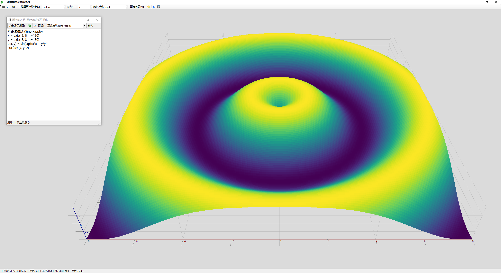

# sciBASIC#: Microsoft VisualBasic for Scientific Computing

[](https://github.com/xieguigang/sciBASIC/releases)
[](https://ci.appveyor.com/project/xieguigang/scibasic)
[](https://www.gnu.org/licenses/gpl-3.0.html)
[](https://gitter.im/xieguigang/sciBASIC)

> A VisualBasic(.NET) language kernel and runtime for scientific data computing, machine learning, visualization and command-line data-science applications — running on .NET (`net10.0`) across Windows, Linux and macOS.



---

## Table of Contents

- [Introduction](#introduction)
- [Features](#features)
- [Installation & Build](#installation--build)
- [Quick Start](#quick-start)
- [Module & Namespace Overview](#module--namespace-overview)
- [Extended VisualBasic Language](#extended-visualbasic-language)
- [Examples by Domain](#examples-by-domain)
- [FAQ](#faq)
- [Documentation & Contacts](#documentation--contacts)

---

## Introduction

**sciBASIC#** is a cross-platform framework, written entirely in Microsoft VisualBasic.NET, that brings the
productivity of the BASIC language to scientific computing. It bundles a large, cohesive set of reusable
libraries that together form the foundation for building data-science **command-line tools** on Windows,
Linux and macOS — on modern .NET (`.NET 10`) as well as the classic .NET Framework / mono.

The runtime is organized into a few cooperating layers:

| Layer | Source root | Purpose |
| --- | --- | --- |
| **Core runtime** | `Microsoft.VisualBasic.Core/` | Extended VB language syntax, LINQ-style collections, a CLI application framework, component model, serialization, networking and text utilities. |
| **Data framework** | `Data/` | Tabular data (`DataFrame`), scientific file I/O (CSV, NetCDF, …), MIME / text & XML parsing, and natural-language processing (TextRank, GraphQuery). |
| **Math & data science** | `Data_science/` | Numerical math, statistics, ODE solvers, machine learning & data mining, evolutionary algorithms (`Darwinism`) and machine vision. |
| **Graphics & visualization** | `gr/`, `Data_science/Visualization` | The "sciBASIC# Artists" imaging engine that produces publication-quality 2D/3D plots, SVG / d3js export, network layouts and color palettes. |
| **Web / MIME helpers** | `www/`, `mime/` | HTTP client utilities and MIME-type text/XML parsers (JSON, OpenXML / xlsx). |

The design philosophy is **CLI-first**: instead of drag-and-drop controls, sciBASIC# emphasizes
headless, scriptable, reproducible data-science programs that read files, compute, and emit figures or
tables — the kind of artifacts that end up in a scientific manuscript.

---

## Features

- **Extended VisualBasic syntax** — `Value(Of T)` inline assignment, `List(Of T)` with a `+` append
  operator and rich indexers, LINQ helpers (`Sequence`, `Iterates`, `which`, `sentinel`) and Unix-shell
  style helpers (`UnixBash.ls`, `cat`).
- **Command-line application framework** — attribute-driven (`<ExportAPI>`, `<Usage>`) CLIs, automatic
  help generation, and `InteropService` to host external command-line tools.
- **Tabular data** — a `DataFrame` model, CSV / TSV I/O, and strongly-typed `EntityObject` loading.
- **Scientific file I/O** — `NetCDF` readers/writers and other binary formats, plus MIME text/XML and
  Excel (OpenXML) parsing.
- **Mathematics** — linear algebra, statistics & hypothesis testing (ANOVA), data fitting /
  bootstrapping, Gibbs sampling, signal processing, symbolic math and **ODE solvers** (Runge–Kutta,
  SUNDIALS CVODE bindings).
- **Machine learning & data mining** — clustering (K-Means, …), SVM, decision trees, Naïve Bayes, PCA,
  association rules and sequence alignment.
- **Evolutionary algorithms** — genetic algorithms and differential evolution under
  `Microsoft.VisualBasic.MachineLearning.Darwinism`.
- **Natural-language processing** — `TextRank` keyword extraction and the `GraphQuery` object query DSL.
- **Visualization / "Graphics Artist"** — scatter, line, bar, histogram, heatmap, volcano and 3-D
  plots; network/force-directed layouts; SVG / d3js / PDF export; `colorbrewer` palettes; isometric 3-D
  engine. Figures are tuned for **printable, publication-quality** output.
- **LLM proxy** — bridge a local model (e.g. Ollama) or any `Func(Of String, String)` endpoint into the
  runtime via `Microsoft.VisualBasic.LLMs`.

---

## Installation & Build

### Prerequisites

- [.NET 10 SDK](https://dot.net) (the libraries target `net10.0`; graphics/imaging projects additionally
  target `net10.0-windows` because they use `System.Drawing` / GDI+).
- Visual Studio 2022 (Windows) or any editor with the VB.NET / .NET workload (Visual Studio Code +
  the C#/VB dev kit, or JetBrains Rider) on Linux / macOS.

### Consume the packages

The individual libraries are published as NuGet packages under the `Microsoft.VisualBasic.*` family
(e.g. the core runtime assembly `Microsoft.VisualBasic.Runtime`). Add them to your project with:

```bash
dotnet add package Microsoft.VisualBasic.Runtime
```

### Build from source

Clone the repository and build the NuGet solution, which references every library project:

```bash
git clone https://github.com/xieguigang/sciBASIC.git
cd sciBASIC
dotnet build nuget.slnx -c Release
```

To build a single library, open its `.vbproj` (for example
`Microsoft.VisualBasic.Core/src/Core.vbproj`) or the relevant solution under `vs_solutions/`.

---

## Quick Start

A minimal sciBASIC# console application that exposes a CLI command:

```vbnet
Imports Microsoft.VisualBasic.ApplicationServices
Imports Microsoft.VisualBasic.CommandLine
Imports Microsoft.VisualBasic.CommandLine.Reflection

Module Program

    Public Function Main() As Integer
        ' Standard sciBASIC# CLI entry point: dispatches /switch based on
        ' <ExportAPI> methods and auto-generates the help screen.
        Return GetType(Program).RunCLI(App.CommandLine)
    End Function

    <ExportAPI("/hello")>
    <Usage("/hello /name <string>")>
    Public Function Hello(args As CommandLine) As Integer
        Call Console.WriteLine($"Hello, {args("/name")}!")
        Return 0
    End Function

End Module
```

```bash
yourapp.exe /hello /name "sciBASIC#"
# -> Hello, sciBASIC#!
```

---

## Module & Namespace Overview

The framework exposes a large, consistent set of namespaces. The tables below group them by layer.
Names marked with **\*** ship from the *data-science runtime* (the `Data/`, `Data_science/`, `gr/`
and `mime/` roots) rather than the general core.

### Core runtime — `Microsoft.VisualBasic.Core`

| Namespace | Description |
| --- | --- |
| `Microsoft.VisualBasic.Language` | Extended VB syntax: `Value(Of T)`, `List(Of T)`, `Vector`, `UnixBash` shell helpers. |
| `Microsoft.VisualBasic.Language.Linq` | LINQ-style collection helpers (`Sequence`, `Iterates`, `which`, `sentinel`). |
| `Microsoft.VisualBasic.CommandLine` | CLI application framework, `InteropService`, `POSIX` helpers. |
| `Microsoft.VisualBasic.ApplicationServices` | `App` host, logging, `println`, debug port (8081). |
| `Microsoft.VisualBasic.ComponentModel` | Component model: `Collection`, `DataSourceModel`, `Range`, settings. |
| `Microsoft.VisualBasic.Scripting` | Symbol tables and dynamic math-expression evaluation. |
| `Microsoft.VisualBasic.Serialization` | JSON / XML (de)serialization. |
| `Microsoft.VisualBasic.Net` | HTTP / networking utilities. |
| `Microsoft.VisualBasic.Text` | `StringBuilder` helpers and CSV/text utilities. |
| `Microsoft.VisualBasic.Drawing` | Color and 2-D drawing primitives. |
| `Microsoft.VisualBasic.LLMs` | LLM proxy: `HookOllama`, `LLMsTalk`. |

### Data framework — `Data/` & `mime/` **

| Namespace | Description |
| --- | --- |
| `Microsoft.VisualBasic.Data.Framework` * | In-memory `DataFrame`, CSV / TSV I/O and reflection-based `EntityObject` storage. |
| `Microsoft.VisualBasic.Data.BinaryData` * | Binary scientific formats, including `NetCDF`. |
| `Microsoft.VisualBasic.Data.NLP.TextRank` * | `TextRank` keyword extraction (modules `TextRank` + `NLPExtensions`). |
| `Microsoft.VisualBasic.Data.GraphQuery` * | `GraphQuery` object query DSL and engine. |
| `Microsoft.VisualBasic.MIME.Markup` * | JSON / HTML / XML / Markdown text parsing. |
| `Microsoft.VisualBasic.MIME.Office.Excel` * | Excel (OpenXML / .xlsx) reading & writing. |

### Math & data science — `Data_science/` **

| Namespace | Description |
| --- | --- |
| `Microsoft.VisualBasic.Math` * | Core numerical math (root namespace of the Mathematica library). |
| `Microsoft.VisualBasic.Math.LinearAlgebra` * | Vectors, matrices, matrix decomposition. |
| `Microsoft.VisualBasic.Math.Statistics` * | Descriptive statistics, distributions, hypothesis tests (ANOVA). |
| `Microsoft.VisualBasic.Math.Calculus.Dynamics` * | ODE system solver (`ODEs`, Runge–Kutta). |
| `Microsoft.VisualBasic.Math.Sundials.CVODE` * | SUNDIALS CVODE stiff/non-stiff ODE bindings. |
| `Microsoft.VisualBasic.Math.SignalProcessing` * | Signal processing. |
| `Microsoft.VisualBasic.Math.GibbsSampling` * | Gibbs sampling. |
| `Microsoft.VisualBasic.Math.Symbolic.GeneticProgramming` * | Symbolic / genetic programming math. |
| `Microsoft.VisualBasic.DataMining` * | Data mining: clustering, Association Rules, sequence alignment. |
| `Microsoft.VisualBasic.MachineLearning` * | Machine learning: SVM, decision tree, Naïve Bayes, PCA. |
| `Microsoft.VisualBasic.MachineLearning.Darwinism` * | Evolutionary algorithms (genetic algorithm, differential evolution). |
| `Microsoft.VisualBasic.Math.MachineVision` * | Machine vision utilities. |

### Visualization & graphics — `Data_science/Visualization` & `gr/` **

| Namespace | Description |
| --- | --- |
| `Microsoft.VisualBasic.Data.ChartPlots` * | Plotting: scatter, line, bar, histogram, heatmap, volcano, 3-D. |
| `Microsoft.VisualBasic.Imaging` * | "Graphics Artist" device: `GraphicsData`, drawing primitives. |
| `Microsoft.VisualBasic.Imaging.LayoutModel` * | Layout models for plots and diagrams. |
| `Microsoft.VisualBasic.Imaging.Drawing2D` * | 2-D vector graphics, colors, styles. |
| `Microsoft.VisualBasic.Data.visualize.Network` * | Force-directed network layout & rendering. |
| `Microsoft.VisualBasic.Imaging.colorbrewer` * | Publication color palettes. |

---

## Extended VisualBasic Language

sciBASIC# extends the VB.NET surface so that small data-science scripts read almost like a domain-specific
language. All of the helpers below live in `Microsoft.VisualBasic.Language` (core runtime) unless noted.

### Inline value assignment — `Value(Of T)`

```vbnet
Imports Microsoft.VisualBasic.Language

Dim x As New Foo With {
    .a = Value(Of Integer)(100),   ' inline assignment of a property
    .b = Value(Of String)("test")
}
```

### `List(Of T)` append operator and rich indexers

The core `List(Of T)` overloads `+`, so `l += item` appends, and it exposes Python-like
slice/negative indexers:

```vbnet
Imports Microsoft.VisualBasic.Language

Dim l As New List(Of String)
l += "a"
l += "b"
l += "c"

Dim last = l(-1)          ' "c"
Dim slice = l(0, 2)       ' { "a", "b" }
```

### LINQ-style sequence helpers

```vbnet
Imports Microsoft.VisualBasic.Language
Imports Microsoft.VisualBasic.Linq

' 100.Sequence -> 0 .. 99
Dim squares = 100.Sequence _
    .Select(Function(i) i * i) _
    .ToArray

For Each x In New List(Of Integer)({1, 2, 3}).IteratesALL
    Call Console.WriteLine(x)
Next
```

### Unix-shell style helpers — `UnixBash`

```vbnet
Imports Microsoft.VisualBasic.Language

' list files, recursively, long format — mirroring the `ls -l -r` shell command
Dim files = ls("-l -r") _
    .Select(Function(path) path.FullName) _
    .ToArray

Dim text = cat("data/notes.txt")   ' read a whole file as one string
```

### `println` and the application host

```vbnet
Imports Microsoft.VisualBasic.App

Call println("hello from sciBASIC#")
```

---

## Examples by Domain

### Tabular data & file I/O (`Data/`)

```vbnet
Imports Microsoft.VisualBasic.Data.Framework.IO
Imports Microsoft.VisualBasic.Data.Framework.StorageProvider

' Load a CSV into an in-memory dataframe resolver:
Dim df = DataFrameResolver.Load("data.csv")

' Strongly-typed loading into entity objects (confirmed API):
Dim people = EntityObject.LoadDataSet(Of Person)("people.csv")
```

Reading a `NetCDF` scientific file:

```vbnet
Imports Microsoft.VisualBasic.Data.BinaryData

Dim nc = netCDFReader.Open("model.nc")
Dim v = nc.getDataVariable("temperature")   ' ICDFDataVector
Dim data = v.genericValue                   ' System.Array of the variable
```

### Natural-language processing

**TextRank** keyword extraction (`Microsoft.VisualBasic.Data.NLP.TextRank` + `NLPExtensions`):

```vbnet
Imports Microsoft.VisualBasic.Data.NLP.TextRank
Imports Microsoft.VisualBasic.Data.NLP.NLPExtensions

' Build the TextRank word graph, then rank it with PageRank:
Dim doc As String = IO.File.ReadAllText("paper.txt")
Dim graph = doc.TextGraph()          ' WeightedPRGraph (a GraphMatrix)
Dim keywords = graph.KeyWords()      ' Dictionary(Of String, Double): word -> score
```

**GraphQuery** — a GraphQL-like DSL over your .NET objects
(`Microsoft.VisualBasic.Data.GraphQuery`):

```vbnet
Imports Microsoft.VisualBasic.Data.GraphQuery

<GraphQuery("gene")>
Public Class Gene
    <GraphQuery("symbol")> Public symbol As String
    <GraphQuery("length")> Public length As Integer
End Class

' Project only the requested fields from any object graph:
Dim q = GraphQuery.DoQuery("gene { symbol length }")
Dim out = q.From(myGene)
```

See [`Data/GraphQuery/README.md`](Data/GraphQuery/README.md) and
[`Data/TextRank/README.md`](Data/TextRank/README.md) for the full reference.

### Mathematics & ODEs (`Data_science/Mathematica`)

Solve a system of ordinary differential equations by subclassing `ODEs`
(namespace `Microsoft.VisualBasic.Math.Calculus.Dynamics`):

```vbnet
Imports Microsoft.VisualBasic.Math.Calculus.Dynamics
Imports Microsoft.VisualBasic.Math.LinearAlgebra

Public Class Lorenz : Inherits ODEs
    Public x, y, z As var
    Public a As Double = 10
    Public b As Double = 8 / 3
    Public c As Double = 28

    ' Initial values of the state variables.
    Protected Overrides Function y0() As var()
        Return {New var("x", 0), New var("y", 1), New var("z", 0)}
    End Function

    ' The differential equations: dy/dt = f(t, y).
    Protected Overrides Sub func(dx#, ByRef dy As Vector)
        dy(0) = a * (y - x)
        dy(1) = x * (c - z) - y
        dy(2) = x * y - b * z
    End Sub
End Class

' Integrate for 10000 steps over t in [0, 30]:
Dim result = New Lorenz().Solve(10000, 0, 30)
' result.x -> time grid;  result.y -> Dictionary(name -> trajectory)
```

### Machine learning & data mining (`Data_science/`)

```vbnet
Imports Microsoft.VisualBasic.DataMining.KMeans

' source: IEnumerable(Of T) where T carries a numeric feature vector
' (T : EntityBase(Of Double)).
Dim clusters = New KMeans().ClusterDataSet(source, k:=3)

For i As Integer = 0 To clusters.NumOfCluster - 1
    Dim centroid = clusters(i).ClusterMean()   ' centroid of cluster i
    Console.WriteLine($"cluster {i}: {String.Join(",", centroid)}")
Next
```

Evolutionary search with `Darwinism` (genetic algorithm):

```vbnet
Imports Microsoft.VisualBasic.MachineLearning.Darwinism.GAF

' 1. Implement the fitness function (smaller value == better):
Public Class MyFitness : Implements Fitness(Of MyChromosome)
    Public ReadOnly Property Cacheable As Boolean = False
    Public Function Calculate(c As MyChromosome, parallel As Boolean) As Double _
        Implements Fitness(Of MyChromosome).Calculate
        Return -EvaluateModel(c)
    End Function
End Class

' 2. Build a Population(Of MyChromosome) and evolve it generation by generation:
Dim ga As New GeneticAlgorithm(Of MyChromosome)(population, New MyFitness())
For i As Integer = 1 To 500
    ga.Evolve()          ' advance one generation
Next
Dim best = ga.Best       ' the fittest chromosome
```

### Visualization & "Graphics Artist" (`Data_science/Visualization`, `gr/`)

```vbnet
Imports Microsoft.VisualBasic.Data.ChartPlots
Imports Microsoft.VisualBasic.Imaging

' 3-D scatter heatmap -> saved as a high-resolution raster image.
Call Plot3D.ScatterHeatmap _
    .Plot(data, size:=New Size(1200, 800)) _
    .Save("scatter3d.png")

' 2-D scatter heatmap.
Call ScatterHeatmap.Plot(points, gridSize:=20).Save("heatmap.png")

' Bar plot directly from a CSV.
Dim bars = csv.LoadBarData("counts.csv")
Call BarPlot.Plot(bars).Save("bars.png")
```

Network / force-directed layouts and SVG/d3js export are provided by the
`Microsoft.VisualBasic.Data.visualize.Network` and `colorbrewer` modules — see
[`gr/network-visualization/README.md`](gr/network-visualization/README.md).

### LLM proxy (`Microsoft.VisualBasic.LLMs`, core)

```vbnet
Imports Microsoft.VisualBasic.LLMs

' Bridge a local Ollama (or any Func(Of String, String)) endpoint in:
HookOllama(Function(prompt) MyLocalModel.Ask(prompt))

' Prompt the hooked model from anywhere in your code:
Dim answer As String = LLMsTalk("Explain principal component analysis")
```

---

## FAQ

**Why VisualBasic for scientific computing?**
Because the language is concise and readable, and sciBASIC# turns it into a
productive environment for writing headless, reproducible data-science
programs — without giving up the .NET ecosystem.

**Are the figures usable in a paper?**
Yes. The `Imaging` / `ChartPlots` engines are tuned for **printable,
publication-quality** output and can export SVG, PDF and high-DPI raster
images, which is why sciBASIC# is often described as the "Graphics Artist"
for scientific plotting.

**Is it cross-platform?**
Yes. The core and math libraries target `net10.0` and run on .NET under
Windows, Linux and macOS. The graphics/imaging projects additionally target
`net10.0-windows` because they rely on `System.Drawing` / GDI+.

**CLI or GUI?**
CLI-first. sciBASIC# is designed for command-line data-science applications
that read inputs, compute, and write figures/tables — not interactive
controls.

---

## Documentation & Contacts

- Source & issues: <https://github.com/xieguigang/sciBASIC>
- Module guides: [`docs/guides`](docs/guides), project documentation: [`docs`](docs/README.md)
- Tutorials: [`tutorials/`](tutorials)
- Author / contact: xieguigang — xie.guigang@live.com

> sciBASIC# is licensed under the **GNU GPLv3**. See the headers in each source
> file for authorship and copyright details.
