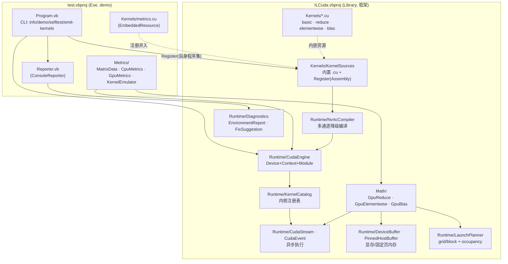

## 产品概述

将 `ILCuda` 解决方案拆分为「通用 CUDA 计算框架（ILCuda.vbproj）」与「演示/验证程序（test\test.vbproj）」两层：框架只提供设备、上下文、显存、流、内核编译与通用数值算子等能力，不依赖控制台；demo 的皮尔逊相关系数矩阵与欧氏距离矩阵全部代码（数据容器、CPU 参考实现、GPU 流水线、内核源码、结果输出）迁至 test 工程，test 通过项目引用调用框架并运行演示。

## 核心功能

### 一、demo 代码迁移（ILCuda → test）

- 迁移 `Math/MatrixData.vb`（MatrixData、MetricResult、MatrixMetricsResult，含随机合成矩阵与 CSV/TSV 载入）、`Math/CpuMetrics.vb`（CPU 两遍算法参考实现 + 最大绝对误差比对）、`Math/GpuMetrics.vb`（rowStats → gram → finalize 的 GPU 流水线）、`Math/KernelEmulator.vb`（内核索引/公式的 CPU 精确模拟自检）。
- 迁移 `Kernels/metrics.cu` 到 test 并作为 test 的内嵌资源，运行时由 test 主动注册进框架参与 NVRTC 编译。
- 迁移 `Diagnostics.vb` 的 `ConsoleReporter` 到 test（设备信息打印、矩阵预览、耗时对比、修复建议格式化输出）。
- test 保留并适配已有 CLI（info / demo / selftest / emit-kernels），支持 `--rows --cols --seed --csv --device --nvrtc --cubin --elements --preview --cpu-only --force-image`。

### 二、ILCuda 框架化重构

- **内核源码可编程注册**：外部程序集可把自带的 `.cu` 内嵌资源注入框架，并入 NVRTC 编译单元；提供去重与稳定合并顺序。
- **内核注册表 KernelCatalog**：统一管理内核名、来源、默认 block 尺寸与共享内存需求，缺失内核给出明确错误。
- **Stream 与异步执行**：新增 `CudaStream`、`CudaEvent`，支持内核在指定流启动、异步 H↔D 拷贝、流同步与事件计时。
- **通用数值内核库**：新增归约（sum/max/min）、elementwise 算子族（add/sub/mul/div/scale/relu/exp/log/sqrt/abs）、GEMM 分块矩阵乘的 `.cu` 内核与对应 VB 封装。
- **显存与启动配置增强**：固定页内存（pinned host buffer）、显存信息查询（总/可用）、按 SM 数量与 occupancy 自动推导 grid/block 的启动规划器。
- **结构化诊断**：框架提供 `EnvironmentReport` / `DeviceReport` / `FixSuggestion` 等纯数据诊断对象（驱动版本、设备列表、NVRTC 候选、修复建议），不含任何 `Console` 调用。

## 边界与非目标

- 不引入任何第三方 NuGet 包，继续只用 BCL 的 `System.Runtime.InteropServices` 做 P/Invoke。
- 不改变既有算法的数值语义（皮尔逊/欧氏公式、对角线直接赋值 1/0 的舍入修复、上三角对称优化均保持原样）。
- 不做大规模无关重构，保留 `Interop`、`CudaDevice`、`CudaModule`、`NvrtcCompiler` 多通道降级、`CubinInspector` 防崩溃预检等已验证逻辑。

## 技术栈

- 语言/平台：VB.NET（`LangVersion=latest`）、.NET 10.0（`net10.0`）、`PlatformTarget=x64`、`OptionExplicit=On` / `OptionInfer=On`
- P/Invoke：`System.Runtime.InteropServices.DllImport`（nvcuda.dll）+ `NativeLibrary` / `Marshal.GetDelegateForFunctionPointer`（nvrtc64_*.dll 动态绑定），零 NuGet 依赖
- 内核编译：NVRTC 运行时编译（`-arch=sm_XX` 优先出 cubin，`compute_XX` 出 PTX），预编译 `.ptx/.cubin` 兜底
- 项目关系：`ILCuda.vbproj`（Library，`RootNamespace=Enigma.ILCuda`）；`test\test.vbproj`（Exe，`RootNamespace=test`）通过 `ProjectReference` 引用 ILCuda

## 实现思路

总体策略是「先建扩展点、再搬迁、最后补齐能力」，以最小回滚成本完成拆分：

1. **先做能力 1（源码注册 + 内核注册表）**，因为它是 metrics.cu 能迁出 ILCuda 的前提——没有它，test 的内嵌 `.cu` 无法被 `NvrtcCompiler` 发现。
2. **再搬迁 demo**：把 `Math/*`、`Kernels/metrics.cu`、`Diagnostics.vb` 整体移到 test，并让 test 在 `Main` 开头做一次 `KernelSources.Register(自身程序集)`。此时功能与搬迁前等价，可编译可跑，风险可控。
3. **最后叠加框架能力**（Stream/异步、通用内核库、显存与启动配置增强、结构化诊断），并把 test 的 demo 切换到新 API（如用 `LaunchPlanner` 算 grid/block），形成「框架完备 + demo 引用」的终态。

### 关键技术决策与权衡

- **注册式内核源码而非「扫描所有已加载程序集」**：扫描 `AppDomain` 会引入不确定性（顺序、重复、加载时机），改为显式 `Register(Assembly)` / `RegisterSource(name, text)`。缺点是使用方需多写一行注册代码，换来可预测性与可测试性。用 `程序集名:资源名` 作为唯一键去重，保证 `CombinedSource()` 输出稳定（否则 NVRTC 会因重复定义报错）。
- **内置源码读取改用 `GetType(KernelSources).Assembly`**：现有 `Assembly.GetExecutingAssembly()` 在 VB 模块中等价于调用方所在程序集，搬迁后语义不可靠；改为类型所在程序集更稳。
- **`CudaKernel.Launch` 保留原重载 + 新增带 `stream` 的重载**：避免破坏 `GpuMetrics` 等既有调用点，把「默认流」语义保留在旧重载里。
- **occupancy 优先使用 `cuOccupancyMaxPotentialBlockSize`，失败回退启发式**（`SM 数 × 固定 blocksPerSM`，并夹在 `MaxThreadsPerBlock` 与 warp 对齐范围内）：老驱动/老 CUDA 版本可能没有该入口，回退保证可用性；`Bind(required:=False)` 的模式项目中已有先例（NvrtcLibrary 的 `nvrtcGetCUBIN`）。
- **归约采用「两阶段 block 归约 + 单 block 收尾」**：第一阶段每 block 出一个部分和，第二阶段 1 个 block 汇总，避免 host 同步；与已有 `rowStatsKernel` 的共享内存树形归约风格一致。
- **框架不依赖 Console**：`ConsoleReporter` 迁走后，框架侧新增纯数据诊断对象；诊断日志仍沿用 `List(Of String)`（`EngineOptions.Diagnostics` 语义不变），避免改动 `NvrtcCompiler.TryBuild` 签名。
- **P/Invoke 声明风格保持一致**：`CudaDriverApi` 是无 Namespace 的 `Public Module`，新增成员同样用 `Friend` + `<DllImport(CudaLib, EntryPoint:="...")>`，并统一走 `CudaDriverApi.Check(...)`。

### 性能与可靠性

- 热路径是 `cuLaunchKernel` 与 `cuMemcpy`：异步拷贝 + 流可让拷贝与计算重叠；`PinnedHostBuffer` 避免每次拷贝的 `GCHandle.Alloc` 固定开销并提升 DMA 带宽。
- `CudaModule.GetKernel` 已有字典缓存；`KernelCatalog` 只做元数据查找，不在启动路径上做字符串拼接或反射。
- 归约/elementwise/GEMM 均按「grid-stride 或分块共享内存」实现，避免为超大矩阵启动过多 block。
- 失败路径保持现状的「多通道降级 + 自动回退 CPU」，`CubinInspector` 的跨大版本拦截必须保留（否则驱动在 `cuModuleLoadData` 内崩溃 0xC0000005）。

## 实施要点（执行细节）

- `KernelSources` 新增：`Register(asm As Assembly)`、`RegisterSource(name$, text$)`、`RegisterFile(file As KernelSourceFile)`、`Reset()`、`All()`（内置 + 已注册，去重后稳定排序）；`CombinedSource()` 改为基于 `All()`；`ExportTo()` 的文件名解析需兼容外部资源名（现逻辑 `LastIndexOf("Kernels.")+8` 对 `test.Kernels.metrics.cu` 同样有效，但要避免同名覆盖）。
- `NvrtcCompiler.TryBuild` 中 `KernelSources.CombinedSource()` 调用点不变，自动获得注册源码；诊断日志需标注来源程序集，便于定位重复定义。
- `KernelNames.vb` 只保留通用内核常量（`VecAdd`/`Saxpy` + 新增的 reduce/elementwise/gemm）；`RowStats`/`Gram`/`FinalizeMetrics` 三个常量随 metrics 迁到 test。
- `CudaEngine` 增加默认流属性与 `Synchronize` 保持不变；`GetKernel(name)` 在内核缺失时抛出带 `KernelCatalog` 提示的异常。
- 新增 P/Invoke：`cuStreamCreate`、`cuStreamDestroy_v2`、`cuStreamSynchronize`、`cuStreamQuery`、`cuMemcpyHtoDAsync_v2`、`cuMemcpyDtoHAsync_v2`、`cuMemcpyDtoDAsync_v2`、`cuMemAllocHost_v2`/`cuMemFreeHost`、`cuMemGetInfo_v2`、`cuOccupancyMaxPotentialBlockSize`（按 x64/Windows 声明，`CUdeviceptr` 用 `ULong`）。
- `test/Program.vb` 的 `emit-kernels` 命令在导出时也应包含已注册源码（可选），并在 `demo` 前完成注册。
- 搬迁后需复核：ILCuda 与 test 对 3 个 sciBASIC# 项目引用是否仍被使用，未使用则从对应 vbproj 移除；`ILCuda.vbproj` 的 `<StartupObject>` 已无意义应删除；`My Project\launchSettings.json` 的启动参数应迁到 test。
- 日志与诊断保持现有风格（中文、逐条追加 `List(Of String)`），不打印大段 PTX/镜像内容。

## 架构设计



数据流：test 启动时先把自身 `.cu` 注册进 `KernelSources` → `CudaEngine.TryCreate` 触发 `NvrtcCompiler` 把「内置源码 + 注册源码」合并成单个编译单元 → NVRTC 编译并 `cuModuleLoadData` → `GpuMetrics` 通过 `KernelCatalog` / `LaunchPlanner` 拿到内核与启动配置，在流上执行 rowStats → gram → finalize → 回读结果与 `CpuMetrics` 比对误差与加速比，由 `Reporter` 输出。

## 目录结构

```
g:/GCModeller/src/runtime/enigma/src/ILCuda/
├── ILCuda.vbproj                          # [MODIFY] 移除 <StartupObject>；内嵌资源改为 basic/reduce/elementwise/blas.cu，去掉 metrics.cu；复核并清理未使用的 sciBASIC# 项目引用
├── My Project/launchSettings.json         # [MODIFY] 启动参数配置迁至 test（或删除本文件）
├── README.md                              # [MODIFY] 更新为「框架 + demo 工程」双层结构与新 API 说明
├── Interop/
│   └── CudaDriverApi.vb                   # [MODIFY] 新增 stream / async memcpy / pinned host / meminfo / occupancy 的 DllImport（保持 Friend + Check 风格）
├── Kernels/
│   ├── basic.cu                           # [KEEP] vecAddKernel / saxpyKernel，作为框架自带冒烟内核
│   ├── reduce.cu                          # [NEW] 通用归约内核：reduceSum/Max/Min 两阶段（block 归约 + 收尾）
│   ├── elementwise.cu                     # [NEW] 一元/二元 elementwise 算子族（add/sub/mul/div/scale/relu/exp/log/sqrt/abs）
│   ├── blas.cu                            # [NEW] 分块共享内存 GEMM 与 GEMV 内核
│   ├── metrics.cu                         # [MOVE→test] 皮尔逊/欧氏专用内核，随 demo 迁出
│   ├── KernelSourceFile.vb                # [KEEP] 增加 Source(来源标识) 字段便于去重与诊断
│   └── KernelSources.vb                   # [MODIFY] 内置源改用类型所在程序集；新增 Register(Assembly)/RegisterSource/RegisterFile/Reset/All；CombinedSource 与 ExportTo 基于 All
├── Math/                                  # 目录改为「框架级通用数值算子」
│   ├── GpuReduce.vb                       # [NEW] GpuReduce.Sum/Max/Min(Of Single)：两阶段启动封装 + 可选 stream
│   ├── GpuElementwise.vb                  # [NEW] GpuElementwise：向量-向量/向量-标量算子，支持流与原地输出
│   └── GpuBlas.vb                         # [NEW] GpuBlas.Gemm/Gemv：行主序矩阵乘封装，含维度校验
├── Runtime/
│   ├── CudaStream.vb                      # [NEW] 流封装：Create/Synchronize/Query/Dispose，暴露 Handle
│   ├── CudaEvent.vb                       # [NEW] 事件封装：Record(stream)/Synchronize/ElapsedMs/Dispose
│   ├── PinnedHostBuffer.vb                # [NEW] 固定页主机内存（cuMemAllocHost），实现异步拷贝的主机端
│   ├── DeviceBuffer.vb                    # [MODIFY] 增加 WriteAsync/ReadAsync(stream)、CopyTo(DeviceBuffer)、Fill、Slice 视图
│   ├── CudaKernel.vb                      # [MODIFY] 新增带 CudaStream 的 Launch 重载；WriteArgument 复用，必要时扩展 Byte/Short/UShort/UInteger
│   ├── LaunchConfig.vb                    # [NEW] LaunchConfig 结构 + LaunchPlanner（For1D/For2D、warp 对齐、occupancy 计算）
│   ├── KernelCatalog.vb                   # [NEW] KernelInfo（名称/来源/默认 block/共享内存）注册与查询；内置内核预置
│   ├── NvrtcCompiler.vb                   # [MODIFY] 诊断日志标注源码来源；CombineSource 自动含注册源码
│   ├── CudaEngine.vb                      # [MODIFY] 增加默认流、KernelCatalog 校验与友好错误
│   ├── CudaEngine/EngineOptions.vb        # [MODIFY] 增加 EnableTiming 等可选项（保持向后兼容）
│   ├── CudaEngine/KernelNames.vb          # [MODIFY] 仅保留通用内核常量 + 新增 reduce/elementwise/gemm 常量
│   ├── CudaDevice.vb                      # [KEEP]（可补 MemoryInfo 静态查询）
│   ├── CudaContext.vb                     # [KEEP]
│   ├── CudaModule.vb                      # [KEEP]
│   ├── CudaTimer.vb                       # [KEEP]（内部可复用 CudaEvent）
│   ├── DeviceMemory.vb                    # [KEEP]
│   ├── KernelImage.vb                     # [KEEP]
│   └── CubinInspector.vb                  # [KEEP]
├── Runtime/Diagnostics/                   # [NEW] 框架结构化诊断（不依赖 Console）
│   ├── EnvironmentReport.vb               # [NEW] 驱动版本文本/键、设备快照列表、NVRTC 候选路径与版本
│   ├── DeviceReport.vb                    # [NEW] 设备属性纯数据快照（名称/CC/SM/显存/线程/共享内存等）
│   ├── FixSuggestion.vb                   # [NEW] 修复建议枚举 + 建议项（升级驱动/装匹配工具包/离线编译/指定 nvrtc）
│   └── CudaEnvironment.vb                 # [NEW] Probe() 生成 EnvironmentReport；FixAdvisor.Suggest(report)
├── Diagnostics.vb                         # [MOVE→test] ConsoleReporter 随 demo 迁出后删除
├── Math/MatrixData.vb                     # [MOVE→test] MatrixData/MetricResult/MatrixMetricsResult
├── Math/CpuMetrics.vb                     # [MOVE→test] CPU 参考实现
├── Math/GpuMetrics.vb                     # [MOVE→test] demo GPU 流水线（改用框架新 API）
├── Math/KernelEmulator.vb                 # [MOVE→test] 内核逻辑 CPU 模拟自检
└── test/
    ├── test.vbproj                        # [MODIFY] 新增 <EmbeddedResource Include="Kernels\metrics.cu" />；清理未使用的 sciBASIC# 引用
    ├── Program.vb                         # [MODIFY] Main 开头调用 KernelSources.Register(自身程序集)；改用新框架 API
    ├── Reporter.vb                        # [NEW] 由原 Diagnostics.vb 的 ConsoleReporter 迁入，消费 EnvironmentReport/DeviceReport/FixSuggestion
    ├── Metrics/
    │   ├── MatrixData.vb                  # [NEW] 由 ILCuda/Math/MatrixData.vb 迁入
    │   ├── CpuMetrics.vb                  # [NEW] 由 ILCuda/Math/CpuMetrics.vb 迁入
    │   ├── GpuMetrics.vb                  # [NEW] 由 ILCuda/Math/GpuMetrics.vb 迁入并改用 LaunchPlanner/stream
    │   └── KernelEmulator.vb              # [NEW] 由 ILCuda/Math/KernelEmulator.vb 迁入
    └── Kernels/
        └── metrics.cu                     # [NEW] 由 ILCuda/Kernels/metrics.cu 迁入，作为 test 内嵌资源
```

## 关键代码结构

```
' Kernels/KernelSources.vb —— 外部内核源码注册契约（metrics.cu 得以迁出 ILCuda 的前提）
Namespace Kernels
    Public Module KernelSources
        ' 读取框架自身内嵌的 *.cu（改用类型所在程序集，避免 GetExecutingAssembly 语义漂移）
        Public Function LoadFromAssembly() As IReadOnlyList(Of KernelSourceFile)

        ' 注册：来自外部程序集的全部 *.cu 内嵌资源 / 单个源码项
        Public Sub Register(asm As Assembly)
        Public Sub RegisterSource(name As String, text As String)
        Public Sub RegisterFile(file As KernelSourceFile)
        Public Sub Reset()

        ' 内置 + 已注册，按 "程序集名:资源名" 去重后的稳定序列
        Public Function All() As IReadOnlyList(Of KernelSourceFile)

        Public Function CombinedSource() As String          ' 基于 All()，顺序稳定
        Public Function ExportTo(folder As String) As IReadOnlyList(Of String)
    End Module
End Namespace
```

```
' Runtime/KernelCatalog.vb —— 内核注册表（元数据，不在启动热路径做反射/拼接）
Namespace Runtime
    Public Class KernelInfo
        Public Property Name As String            ' 与 .cu 中 extern "C" 名称一致
        Public Property Source As String          ' 来源 .cu（内置 / 外部注册）
        Public Property DefaultBlock As Integer   ' 默认 block 尺寸
        Public Property SharedMemory As Integer   ' 每 block 共享内存字节数（0 表示不需要）
    End Class

    Public Module KernelCatalog
        Public Sub Register(info As KernelInfo)
        Public Function TryGet(name As String, ByRef info As KernelInfo) As Boolean
        Public Function Require(name As String) As KernelInfo   ' 缺失时抛出带候选列表的异常
        Public Function All() As IReadOnlyList(Of KernelInfo)
    End Module
End Namespace
```

```
' Runtime/LaunchConfig.vb —— 启动配置推导（occupancy 失败时回退启发式）
Namespace Runtime
    Public Structure LaunchConfig
        Public Property GridX As Integer
        Public Property GridY As Integer
        Public Property BlockX As Integer
        Public Property BlockY As Integer
        Public Property SharedMemBytes As Integer
    End Structure

    Public Module LaunchPlanner
        Public Function For1D(totalElements As Integer, Optional blockSize As Integer = 256) As LaunchConfig
        Public Function For2D(rows As Integer, cols As Integer,
                              Optional tileX As Integer = 16, Optional tileY As Integer = 16) As LaunchConfig
        ' 优先 cuOccupancyMaxPotentialBlockSize，失败回退 SM*blocksPerSM 并对齐 warp
        Public Function SuggestBlock(device As CudaDevice, kernel As CudaKernel,
                                     Optional maxBlock As Integer = 256) As Integer
    End Module
End Namespace
```

## Agent Extensions

### SubAgent

- **code-explorer**
- 目的：在搬迁前全量扫描 `ConsoleReporter`、`GpuMetrics`、`CpuMetrics`、`MatrixData`、`KernelEmulator`、`KernelNames`、`metrics.cu` 的所有引用点（含 `ILCuda.slnx` 之外的可能调用方），确认无遗漏调用点。
- 预期结果：得到完整的「被引用符号 → 引用文件:行号」清单，作为搬迁与改名（如 `KernelNames` 常量拆分、命名空间调整）的依据，避免编译期断链。

- **code-explorer**
- 目的：核实 `ILCuda.vbproj` 与 `test\test.vbproj` 对 3 个 sciBASIC# 项目引用（`dataframework-netcore5`、`Math.NET5`、`Microsoft.VisualBasic.Core/src/Core`）是否真实被代码使用。
- 预期结果：明确哪些引用可安全移除，避免误删导致编译失败，同时让两个工程的依赖保持最小。

- **code-explorer**
- 目的：确认 `Interop/NvrtcApi.vb`、`Interop/CUresult/*.vb` 中已有委托与枚举定义，以及 `NativeSearchPath` 等辅助类型的位置，供新增 P/Invoke 与 occupancy 绑定时复用。
- 预期结果：新增的 stream / async / occupancy 声明与现有命名风格、可见性（`Friend`）和错误处理（`CudaDriverApi.Check`）完全一致。