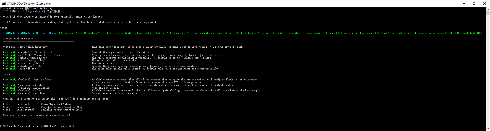
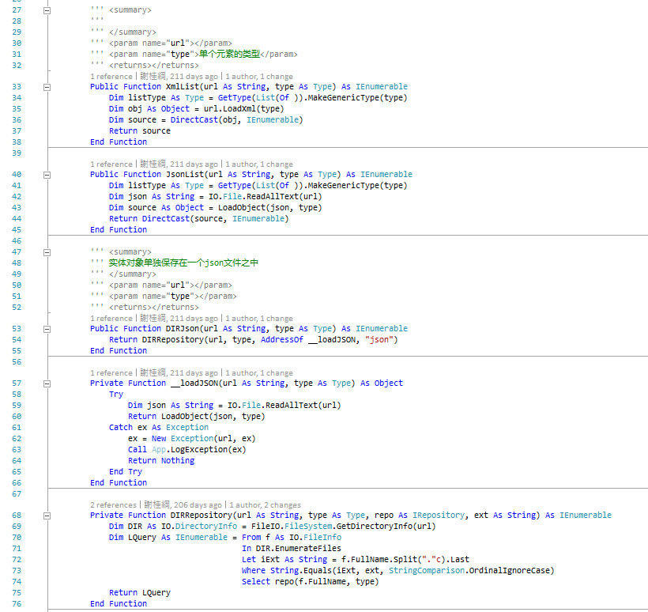

# Code style guidelines for Microsoft VisualBasic

# ----======= TOC =======----


<!-- vscode-markdown-toc -->
* 1. [Architecture of VisualBasic CLI program](#ArchitectureofVisualBasicCLIprogram)
	* 1.1. [How to define the CLI module?](#HowtodefinetheCLImodule)
	* 1.2. [How to expose the CLI API in your application?](#HowtoexposetheCLIAPIinyourapplication)
		* 1.2.1. [Auto document feature from VisualBasic CLI framework](#AutodocumentfeaturefromVisualBasicCLIframework)
	* 1.3. [Using the VisualBasic CommandLine Parser](#UsingtheVisualBasicCommandLineParser)
* 2. [List(Of T) operation in VisualBasic](#ListOfToperationinVisualBasic)
* 3. [The VisualBasic inline assign syntax](#TheVisualBasicinlineassignsyntax)
* 4. [Default Value in VisualBasic](#DefaultValueinVisualBasic)
* 5. [The Unix bash syntax for listing files](#TheUnixbashsyntaxforlistingfiles)
* 6. [VB specific ``With`` anonymous variable](#VBspecificWithanonymousvariable)
* 7. [Type char coding style](#Typecharcodingstyle)
* 8. [VisualBasic identifer names](#VisualBasicidentifernames)
		* 8.1. [1. Directory type](#Directorytype)
		* 8.2. [2. Module variable](#Modulevariable)
		* 8.3. [3. Local varaible and function parameter](#Localvaraibleandfunctionparameter)
		* 8.4. [4. Function And Type name](#FunctionAndTypename)
		* 8.5. [Using underline in namming](#Usingunderlineinnamming)
* 9. [String manipulate](#Stringmanipulate)
		* 9.1. [Linq Expression](#LinqExpression)
		* 9.2. [Instantiation](#Instantiation)
		* 9.3. [Extension Method And Linq](#ExtensionMethodAndLinq)
* 10. [Appendix](#Appendix)

<!-- vscode-markdown-toc-config
	numbering=true
	autoSave=true
	/vscode-markdown-toc-config -->
<!-- /vscode-markdown-toc -->

##  1. <a name='ArchitectureofVisualBasicCLIprogram'></a>Architecture of VisualBasic CLI program

There is a VisualBasic application helper module that define in the namespace:
[Microsoft.VisualBasic.App](../../Microsoft.VisualBasic.Architecture.Framework/Extensions/App.vb)

**A special function named _main_ is the starting point of execution for all VisualBasic programs**. A VisualBasic CLI application should define the **Main** entry point in a Module which is named _Program_ and running from a ``Integer`` state code returns Function ``Main``. By using the name of Program for the entry point module, this will makes more easily recognize of your program's entry point.

```vb.net
Module Program

    ''' <summary>
    ''' This is the main entry point of your VisualBasic application.
    ''' </summary>
    ''' <returns></returns>
    Public Function Main() As Integer
        Return GetType(CLI).RunCLI(App.CommandLine)
    End Function
End Module
```

By using a **Integer** _Function_ instead of _Sub_ in VisualBasic, this makes your code style is more standard compare with the ``main`` function from C++.

```c
int main(int argc, char *argv[]) {
	// blablabla...
}
```

In the above example, Where, the type **CLI** is the CLI interface which it is a module that contains all of the CLI command of your application. And the extension function **RunCLI** is a CLI extension method from the VisualBasic App helper: [Microsoft.VisualBasic.App](https://github.com/xieguigang/VisualBasic_AppFramework/blob/master/Microsoft.VisualBasic.Architecture.Framework/Extensions/App.vb). The property value of **App.CommandLine** is the commandline argument of current application that user used for start this application and calling for some _CLI_ command which is exposed in your application's **CLI** module.


###  1.1. <a name='HowtodefinetheCLImodule'></a>How to define the CLI module?

A **Module** is a static _Class_ type in the VisualBasic, and it usually used for _the API exportation and common method definition for a set of similarity or functional correlated utility functions_.

And then so that the CLI module in the VisualBasic can be explained as: **A module for exposed the CLI interface API to your user.**

Here is an example:

```vb.net
Partial Module CLI

    <ExportAPI("/Print")>
    <Usage("/Print /in <inDIR> [/ext <ext> /out <out.Csv>]")>
    <Description("Help info")>
    Public Function Print(args As CommandLine.CommandLine) As Integer
        Dim ext$ = (args <= "/ext") Or "*.*".AsDefault
        Dim inDIR As String = args <= "/in"
        Dim out As String = args.GetValue("/out", inDIR.TrimDIR & ".contents.Csv")
        Dim files As IEnumerable(Of String) = ls - l - r - ext <= inDIR
        Dim content = LinqAPI.Exec(Of NamedValue(Of String)) _
_
            () <= From file As String
                  In files
                  Let name As String = file.BaseName
                  Let genome As String = file.ParentDirName
                  Select New NamedValue(Of String) With {
                      .Name = name,
                      .Value = genome
                  }

        Return content _
            .SaveTo(out) _
            .CLICode
    End Function
End Module
```

This example code can be found at: [github](../../docs/guides/Example/Language.sln)

###  1.2. <a name='HowtoexposetheCLIAPIinyourapplication'></a>How to expose the CLI API in your application?

A wrapper for parsing the commandline from your user is already been defined in namespace: [**Microsoft.VisualBasic.CommandLine**](https://github.com/xieguigang/VisualBasic_AppFramework/tree/master/Microsoft.VisualBasic.Architecture.Framework/CommandLine)

And the **CLI** interface should define as in the format of this example:

```vb.net
Imports Microsoft.VisualBasic.CommandLine
Imports Microsoft.VisualBasic.CommandLine.Reflection

<ExportAPI("/Print")>
<Usage("/Print /in <inDIR> [/ext <ext> /out <out.Csv>]")>
<Group("Function Group Name")>
<Argument("/in", AcceptTypes:={GetType(String)}, Description:="The input directory path.")>
<Argument("/out", True, AcceptTypes:={GetType(NamedValue(Of String))}, Description:="The output csv data.")>
Public Function CLI_API(args As CommandLine) As Integer
```

+ ``ExportAPI`` attribute that flag this function will be exposed to your user as a CLI command.
+ ``Group`` attribute that can grouping this API into a function group
+ ``Argument`` attribute that records the help information of the parameter in the CLI.
+ ``Usage`` attribute tells your user how to using your CLI API
+ ``Description`` attribute give the brief function description about this CLI command.

####  1.2.1. <a name='AutodocumentfeaturefromVisualBasicCLIframework'></a>Auto document feature from VisualBasic CLI framework

Once you have defined these five attribute for your CLI API, then you can using the ``App ? command`` command for get the API summary from the auto document feature, example as:


Can generates such well formatted auto document:



###  1.3. <a name='UsingtheVisualBasicCommandLineParser'></a>Using the VisualBasic CommandLine Parser
For learn how to using the ``CommandLine`` Parser, we first lean the syntax of the VisualBasic commandline arguments.
A typical commandline arguments in VisualBasic is consist of two parts:

1. _Command Name_
2. _Arguments_

Here is a simple example:

	App.exe /API1 /test /msg "Hello World!!!" /test2-enable /test3-enable

Where in this CLI, token **App.exe** is the executable file name of your application; And **/API1** token, is the **Command Name**; And then the last tokens are the parameter arguments, using the commandline in VisualBasic just like function programming in VisualBasic:

```vb.net
Module App
    Public Function API1(test As Boolean, 
                         msg As String, 
    			 test2Enable As Boolean, 
    			 test3Enable As Boolean) As Integer
End Module
```

You call your CLI command in the console terminal is just like call a function in the VisualBasic Code:

```vb.net
Dim code As Integer = App.API1(True, "Hello World!!!", True, True)
```

**_NOTE:_ There is no order of the VisualBasic CLI arguments**, so that all of these CLI examples are equals to each other:

```bash
#!/bin/bash

App.exe /API1 /msg "Hello World!!!" /test2-enable /test3-enable /test
App.exe /API1 /msg "Hello World!!!" /test /test2-enable /test3-enable
App.exe /API1 /test /test2-enable /test3-enable /msg "Hello World!!!"
App.exe /API1 /test2-enable /test /test3-enable /msg "Hello World!!!"
```

Simple Example of VisualBasic CLI application(Example source code at [here](https://github.com/xieguigang/VisualBasic_AppFramework/tree/master/Example/CLI_Example)):

```vb.net
Imports Microsoft.VisualBasic.CommandLine
Imports Microsoft.VisualBasic.CommandLine.Reflection

Module Program

    Public Function Main() As Integer
        Return GetType(CLI).RunCLI(App.CommandLine)
    End Function
End Module

Module CLI

    <ExportAPI("/API1",
         Info:="Puts the brief description of this API command at here.",
         Usage:="/API1 /msg ""Puts the CLI usage syntax at here""",
         Example:="/API1 /msg ""Hello world!!!""")>
    Public Function API1(args As CommandLine) As Integer
        Call Console.WriteLine(args("/msg"))
        Return 0
    End Function
End Module
```

Here are some mostly used function in VisualBasic CLI parser
Example CLI is:

	App.exe /Test-Example /b /n 52 /xml "~/test.Xml" /num_threads 96 /path "~/tmp/test.log"

|Function|Usage|Example|
|--------|-----|-------|
|``GetBoolean(String) As Boolean``|Get a boolean flag argument from the CLI|``Dim b As Boolean = args.GetBoolean("/b")``|
|``GetInt32(String) As Integer``|Get a parameter value as Integer|``Dim n As Integer = args.GetInt32("/n")``|
|``GetObject(Of T)(String, System.Func(Of String, T)) As T``|Get a parameter string value and then apply a string parser on it for load an .NET object|``Dim x As T = args.GetObject(of T)("/xml", AddressOf LoadXml)``|
|``GetValue(Of T)(String, T, System.Func(Of String, T)) As T``|Get a parameter value, if the parameter is not exist, then default value will be returns, this method is usually used on optional value|``Dim n As Long = args.GetValue("/num_threads", 100L)``|
|``Item(String) As String``|Default readonly property for read string value of a specific parameter|``Dim path As String = args("/file")``|


##  2. <a name='ListOfToperationinVisualBasic'></a>List(Of T) operation in VisualBasic

For enable this language syntax feature and using the list feature in this section, you should imports the namespace **Microsoft.VisualBasic.Language** at first

```vb.net
Dim source As IEnumerable(Of <Type>)
Dim list As New List(of <Type>)(source)
```

For Add a new instance

```vb.net
list += New <Type> With {
    .Property1 = value1,
    .Property2 = value2
}
```

For Add a sequence of new elements
```vb.net
list += From x As T
    	In source
    	Where True = <test>
        Select New <Type> With {
            .Property1 = <expression>,
            .Property2 = <expression>
        }
```

if want to removes a specific element in the list

```vb.net
list -= x
```
Or batch removes elements:
```vb.net
list -= From x As T
    	In source
        Where True = <test>
        Select x
```

Here is some example of the list **+** operator
```vb.net
' This add operation makes the code more easily to read and understand:
' This function returns a list of RfamHit element and it also merge a
' list of uncertainly elements into the result list at the same time
Public Function GetDataFrame() As RfamHit() Implements IRfamHits.GetDataFrame
    Return hits.ToList(Function(x) New RfamHit(x, Me)) + From x As Hit
                                                         In Uncertain
                                                         Select New RfamHit(x, Me)
End Function
```
And using the **+** operator for add a new object into the list, this syntax can makes the code more readable instead of the poorly readable code from by using method **List(of T).Add**:

```vb.net
genomes += New GenomeBrief With {
    .Name = title,
    .Size = last.Size,
    .Y = h1
}

' Using the + operator to instead of this poorly readable function code
genomes.Add(New GenomeBrief With {
    .Name = title,
    .Size = last.Size,
    .Y = h1
})
```

##  3. <a name='TheVisualBasicinlineassignsyntax'></a>The VisualBasic inline assign syntax

Like other C family language, VB is also have the inline assign operation syntax, here is how to enable this language syntax in VB:

```vbnet
Imports Microsoft.VisualBasic.Language

Dim line As New Value(Of String)

Do While Not (line = reader.ReadLine) Is Nothing
    ' blablabla
Loop
```

Enable this language syntax just very easy, wrapping your variable object type with ``Value(Of T)`` in VB language.

##  4. <a name='DefaultValueinVisualBasic'></a>Default Value in VisualBasic

```vbnet
' using default value is more elegant than using If expression
' and much more natural english language way: 
Public Sub Print(Optional device As TextWriter = Nothing)

    ' using device object or console output as default if device is nothing
    With device Or Console.Out.AsDefault
    
        ' blablabla
    End With
End Sub

Public Sub Print(Optional device As TextWriter = Nothing)
    With If(device Is Nothing, Console.Out, device)
    
        ' blablabla
    End With
End Sub
```

##  5. <a name='TheUnixbashsyntaxforlistingfiles'></a>The Unix bash syntax for listing files

Here is how to using this bash syntax that you can used for listing files/folders in VisualBasic language:

```vbnet
Imports Microsoft.VisualBasic.Language.UnixBash

Return (ls - l - r - wildcards("*.csv") <= DIR) _
      .Select(AddressOf ODEsOut.LoadFromDataFrame) _
      .Sampling(eigenvector, partN)

' Or used in For Loop
For Each file As String In ls - l - r - wildcards("*.csv") <= DIR
    ' blablabla
Next
```
In the newer version of this VB runtime, the wildcards can be simplify as a string or string array if you are not feeling confused with this syntax example:

```vbnet
Imports Microsoft.VisualBasic.Language.UnixBash

' A more simple version of the syntax 
Return (ls - l - r - "*.csv" <= DIR) _
      .Select(AddressOf ODEsOut.LoadFromDataFrame) _
      .Sampling(eigenvector, partN)

' Or used in For Loop
For Each file$ In ls - l - r - {"*.csv", "*.tsv"} <= DIR
    ' blablabla
Next
```

##  6. <a name='VBspecificWithanonymousvariable'></a>VB specific ``With`` anonymous variable

When you are dealing the variable with an array, usually you are going to do in this style:

```vbnet
Dim array As <Class>()

For i% = 0 To array.Length - 1
    Dim o = array(i)

    If <blablabla(o)> Is True Then
        Return i%
    End If
Next
```

But by using the ``With`` anonymous variable syntax, the code would be more brief and better:

```vbnet
Dim array As <Class>()

For i% = 0 To array.Length - 1
    With array(i)

        If <blablabla(.Property)> Is True Then
            Return i%
        End If
    End With
Next
```

###### Example

```vbnet
Public Function IndexOf(Id As Char) As Integer
    For i As Integer = 0 To Catalogs.Length - 1
        With Catalogs(i)
            If .SubClasses.ContainsKey(Id) Then
                Return i
            End If
        End With
    Next

    Return -1
End Function
```

And also you can combine ``With`` with function returns value. And so how to reference this anonymous variable, and get itself? Just using a very simple extension method ``ref()``, which is located at namespace ``Microsoft.VisualBasic.Language``.

```vbnet
With function_calls()
    ' blablabla
    Return .ref
End With

''' <summary>
''' Extension method for VisualBasic ``With`` anonymous variable syntax source reference helper
''' </summary>
''' <typeparam name="T"></typeparam>
''' <param name="x"></param>
''' <returns></returns>
<Extension> Public Function ref(Of T)(x As T) As T
    Return x
End Function
```

##  7. <a name='Typecharcodingstyle'></a>Type char coding style

The type char code just working on the .NET primitive type, like ``String``, ``Integer``, ``Long``, ``Double``, ``Char``, etc. Using the type char code can makes your code more brief and readable, give your code more VisualBasic-ish.

###### Recommended
It is recommended that using type char in the parameter declaring of a function or method, local variable in a method/function, internal module fields.

###### Not Recommended
Not recommended that using type char for ``Class/Structure Property``.

##  8. <a name='VisualBasicidentifernames'></a>VisualBasic identifer names

####  8.1. <a name='Directorytype'></a>1. Directory type
If possible, then all of the directory path variable can be **UPCASE**, such as:

```vb.net
Dim DIR As String = "/home/xieguigang/Downloads"
Dim EXPORT As String = "/usr/lib/GCModeller/"
```

####  8.2. <a name='Modulevariable'></a>2. Module variable

+ All of the module variable should in format like **_lowerUpper** if the variable is _private_
+ But if the variable is _Public_ or _Friend_ visible, then it should in format like **UpperUpper**

Here is some example:

```vb.net
' Private
Dim _fileName As String
Dim _inDIR As Directory

' Public
Public ReadOnly Property FileName As String
Public ReadOnly Property InDIR As Directory
```

####  8.3. <a name='Localvaraibleandfunctionparameter'></a>3. Local varaible and function parameter

If possible, all of the local varaible within a function or sub program and the parameters of a function, should be in format **lowerUpper**

####  8.4. <a name='FunctionAndTypename'></a>4. Function And Type name

For **_Public_** member function, the function name is recommended in formats **UpperUpper**, but if the function is **_Private, Friend, or Protected_** visible, then your function is recommended start with two underlines, likes **\_\_lowerUpper**. The definition of the _Class, Structure_ names is in the same rule as function name.

Here is some function name examples(Example picked from [here](https://github.com/SMRUCC/GCModeller.Core/Bio.Assembly/GenomicsContext/TFDensity.vb)):
```vb.net
' Private
Private Function __worker(Of T As I_GeneBrief)(
                        genome As IGenomicsContextProvider(Of T),
                         getTF As Func(Of Strands, T()),
                    getRelated As Func(Of T, T(), Integer, T()),
                      numTotal As Integer,
                        ranges As Integer) As Density()
' Public
Public Function DensityCis(Of T As I_GeneBrief)(
                         genome As IGenomicsContextProvider(Of T),
                             TF As IEnumerable(Of String),
                Optional ranges As Integer = 10000) As Density()
```


+ Interface type name should start with a upcase character **I**, like _IEnumerable_, _IList_, etc
+ Enum type name should end with a lower case character **s**, like _MethodTypes_, _FormatStyles_

####  8.5. <a name='Usingunderlineinnamming'></a>Using underline in namming

When the identifier name require of the underline symbol ``_``, then it is recommended that first word should be an all **UPCASE** brief code and the next word is an all **lowcase** word. For example,

```vbnet
Dim GO_term$

' this would be better and more balance than
' Dim go_term$
' or
' Dim Go_term$
```

At last, for improves of the code readable, try _**Make your identifier name short enough as possible**_



##  9. <a name='Stringmanipulate'></a>String manipulate

###### 1. String.Format

For formatted a string output, then recommended used **String.Format** function or string interpolate syntax in VisualBasic language.
And by using the **String.Format** function, then format control string is recommended puts in a constant variable instead of directly used in the format function:

```vb.net
Const OutMsg As String = "Hello world, {0}, Right?"
' blablabla.......
Dim msg As String = String.Format(OutMsg, name)
```

###### 2. String contacts

For contacts a large amount of string tokens, the **StringBuilder** is recommended used for this job, **not recommend directly using _& operator_ to contacts a large string collection due to the reason of performance issue**.

```vb.net
' Convert the input string to a byte array and compute the hash.
Dim data As Byte() = md5Hash.ComputeHash(input)

' Create a new Stringbuilder to collect the bytes
' and create a string.
Dim sBuilder As New StringBuilder()

' Loop through each byte of the hashed data
' and format each one as a hexadecimal string.
For i As Integer = 0 To data.Length - 1
	sBuilder.Append(data(i).ToString("x2"))
Next i

Return sBuilder.ToString() ' Return the hexadecimal string.
```

If you just want to contact the string, then a shared method **String.Join** is recommended used.
If the string tokens will be join by a specific delimiter, then using **String.Join** instead of **StringBuilder.Append**

```vb.net
Dim tokens As String()
Dim sb As New StringBuilder

For Each s As String In tokens
	Call sb.Append(s & " ")
Next
Call sb.Remove(sb.Length -1)
```

Or just use **String.Join**, this method is more clean and readable than **StringBuilder.Append**:

```vb.net
Dim tokens As String()
Dim out As String = String.Join(" ", tokens)
```

###### 3. String interpolate
The string interpolate syntax in VisualBasic language is recommended used for **build _SQL_ statement and _CLI_ arguments as this syntax is very easily for understand and code readable**:

```vb.net
Dim SQL As String = $"SELECT * FROM table WHERE id='{id}' AND ppi>{ppi}"
Dim CLI As String = $"/start /port {port} /home {PathMapper.UserHOME}"
```

So, using this syntax feature makes your code very easy for reading and understand the code meaning, right?

####  9.1. <a name='LinqExpression'></a>Linq Expression
All of the Linq Expression is recommended execute using [**LinqAPI**](https://github.com/xieguigang/VisualBasic_AppFramework/blob/master/Microsoft.VisualBasic.Architecture.Framework/Language/Linq.vb) if the output type of the expression is a known type:


####  9.2. <a name='Instantiation'></a>Instantiation

For define a new object, a short format is recommended:

```vb.net
Dim x As New <Type>
```

If the type you want to create object instance can be initialize from its property, then the ``With`` keyword is recommended to used:

```vb.net
Dim MyvaCog As MyvaCOG() = LinqAPI.Exec(Of MyvaCOG) <= 
_
	From gene As GeneDumpInfo
        In GenomeBrief
        Select New MyvaCOG With {
            .COG = gene.COG,
            .QueryName = gene.LocusID,
            .QueryLength = gene.Length
        }
```

####  9.3. <a name='ExtensionMethodAndLinq'></a>Extension Method And Linq
With the extension method, then you can implementes a Fully Object-Oriented coding style, as you can add extend any method or function onto any type of object.

For example:

```vbnet
''' <summary>
''' Make directory
''' </summary>
''' <param name="DIR"></param>
<Extension> Public Sub MkDIR(DIR As String)
    Call FileIO.FileSystem.CreateDirectory(DIR)
End Sub
```

This string object extension method will makes the string working as a directory object:

```vbnet
Call "D:\MyData\".MkDIR
```

If another Linq expression is internal inner your Linq expression, then these two staggered linq expression will messing up your coding style, and then using the Linq extension instead of the Linq expression for your internal linq expression that would be good.

Example:

```vbnet

```

Try avoid the style like ``(Linq Expression).Method``, you should folding the extension to the next line, and this would be more clear for the reading.

```vbnet
Call (From x In data Select x.Properties.Length Distinct) _
    .ToArray _
    .GetJson _
    .__DEBUG_ECHO
```

###### Javascript like style
The Javascript like coding style is recommended combined with the extension method style. If the extension calling is very long, then folding in the javascript style that would be great. For example:

This is the **bad** style:

```vbnet
For Each line$ In lines

    Yield New WordTokens With {
        .name = line.Trim(" "c, ASCII.TAB),
        .tokens = line.Trim.StripSymbol.Split.Distinct.Where(Function(s) Not String.IsNullOrEmpty(s.Trim(ASCII.TAB))).ToArray
    }
Next
```

This is great style:

```vbnet
For Each line$ In lines

    Yield New WordTokens With {
        .name = line.Trim(" "c, ASCII.TAB),
        .tokens = line.Trim _
            .StripSymbol _
            .Split _
            .Distinct _
            .Where(Function(s) Not String.IsNullOrEmpty(s.Trim(ASCII.TAB))) _
            .ToArray
    }
Next
```

Another great style example:

```vbnet
Dim exp As Expression = expression _
    .Split(__dels) _
    .Select(Function(s) s.Trim(" "c, ASCII.TAB)) _
    .Where(Function(s) Not String.IsNullOrEmpty(s)) _
    .JoinBy(" AND ") _
    .Build()

Return Function(text) If(exp.Match(text), 1.0R, 0R)
```

##  10. <a name='Appendix'></a>Appendix

Here are tables of names that i used in my programming, and continues updated....

###### 1.Some common used name for common types
<table>
	<tr><td>System.Type</td><td>Recommend Name</td><td>Example</td></tr>
	<tr><td>System.Text.StringBuilder</td>
    	<td>sb</td>
        <td><pre>Dim sb As New StringBuilder</pre>
</td>
    </tr>
	<tr><td>System.String</td>
    	<td>s, str, name, sId, id, x</td>
        <td>
<pre>Dim s As String
Dim str As String
Dim name As String
Dim sId As String
Dim id As String
Dim x As String</pre>
</tr>
	<tr><td>System.Integer, System.Long</td>
    	<td>i, j, n, x</td>
        <td><pre>Dim i As Integer
Dim j As Integer
Dim n As Integer
Dim x As Integer</pre>
</tr>
	<tr><td>System.Object</td>
    	<td>x, o, obj, value</td>
        <td><pre>Dim x As Object
Dim o As Object
Dim obj As Object
Dim value As Object</pre>
</td>
	</tr>
</table>

###### 2.Name for some meaning

<table>
   <tr><td>Meaning</td><td>Recommend Name</td><td>Example</td></tr>
   <tr><td>Commandline arguments</td>
       <td>args, CLI</td>
       <td>
<pre>Dim args As CommandLine
Dim CLI As String
Dim args As String()</pre>
</td></tr>
	<tr><td>SQL query</td>
    	<td>SQL, sql, query</td>
        <td>
<pre>Dim SQL As String = "SELECT * FROM table LIMIT 1;"</pre>
</td>
    </tr>
	<tr><td>Iterator</td>
    	<td>i, j, k, l</td>
        <td>
<pre>For i As Integer = 0 to [stop]
    For j As Integer = i to [stop]
        For k As Integer = j to [stop]
        Next
    Next
Next

Dim l As Integer = 100

Do while l = 100
    ' blablabla...
Loop</pre>
</td>
    </tr>
    <tr><td>Linq query expression</td><td>LQuery</td><td>
<pre>Dim LQuery = From path As String
             In ls -l -r -wildcards("*.Xml") <= DIR
             Where InStr(path.BaseName, "xcb") = 1
             Select path.LoadXml(Of KEGG.DBGET.Module)</pre>
</td>
</tr>
    <tr>
    	<td>Query Result/Function Returns</td><td>result, rtvl</td><td>
<pre>Dim result As [Module]() = LinqAPI.Exec(Of [Module]) <= 
_
    From path As String
    In ls -l -r -wildcards("*.Xml") <= DIR
    Where InStr(path.BaseName, "xcb") = 1
    Select path.LoadXml(Of KEGG.DBGET.Module)
        
Return result</pre>
</td>
</tr>
    <tr><td>Directory</td><td>DIR, out, inDIR</td><td>
<pre>Dim files As IEnumerable(Of String) = 
    ls -l -r -wildcards("*.Xml") <= DIR
</pre>
</td>
</tr>
    <tr><td>json</td><td>json, JSON</td><td>
<pre>Dim JSON As String = (ls -l -r -"*.json" <= DIR).GetJson</pre>
</td>
</tr>
    <tr><td>data frame</td><td>df, ds, data</td><td>
<pre>Dim df As DataFrame = DataFrame.CreateObject(path)</pre>
</td>
</tr>
    <tr><td>Network objects</td><td>net, network, node, nodes, edge, edges</td><td>
<pre>Dim net As Network = Network.Load(DIR)

net += New Node With {
    .Identifier = "Linq"
}
net += New Edge With {
    .FromNode = "Linq",
    .ToNode = "SQL"
}
Return net >> Open("./test.net/")
</pre>
</td>
</tr>
<tr>
<td>A line of text in a text file</td>
<td>line</td>
<td><pre>Dim line$ = path.ReadFirstLine</pre></td>
</tr>
<tr>
<td>Lambda expression parameter</td>
<td><li>For generic object, using name: <pre>x, o;</pre></li>
<li>For numeric object, using name: <pre>x, y, z, a, b, c, n, i;</pre></li>
<li>For string and char, using name: <pre>s, c;</pre></li>
<li>For System.Type, using name: <pre>t</pre></li></td>
<td><pre>Dim result = array.Select(Function(x) x.Name)
Dim value = array _
    .Select(Function(x) x.value) _
    .Select(Function(t) t.FullName) _
    .JoinBy("+")
</pre></td>
</tr>
</table>
