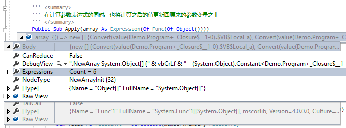
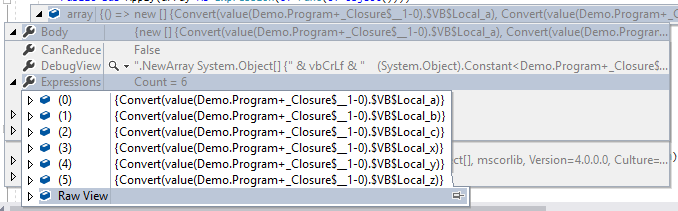
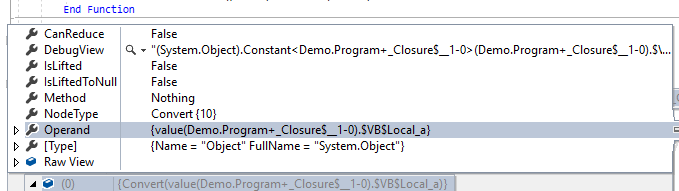
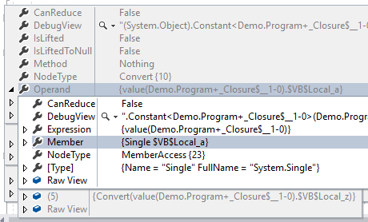

# Optional Parameter Expression in VisualBasic

You can install this VisualBasic runtime from nuget package:

```bash
# https://www.nuget.org/packages/sciBASIC#
# For install latest stable release version:
PM> Install-Package sciBASIC
```

## Background

Due to the reason of the limitation in .NET compiler, the optional parameter its default value just allowed constant value, not allow a math expression, even this math expression produce constant value result. For example,

```vbnet
' We can define the optional parameter its default value using a constant value
Optional n% = 111%
Optional s$ = "123" & "456"

' But the math expression is not allowed
Optional n% = 1+1
' Or statics function
Optional n% = Math.Log(2, 2)
```

For example, if we develop a graphic plot function, and want our program adjust the point size parameter automatic with the image resolution, so that we can define it as:

```vbnet
Public Sub Plot(..., Optional width% = 1000, Optional ptSize% = "log(width)/2")

' Adjust the ptSize parameter its value automatic
' ptSize = log(width)/2 = log(2000)/2
Call Plot(...., width:= 2000)

' We don't want the program adjust the ptSize automatic
' So that we just needs overrides the ptSize parameter its default value expression, like
Call Plot(...., width:= 2000, ptSize = 20)
```

So that this parameter expression language feature is much convenient to our programming.

### R language example

The R language is a kind of a popular math computation language. And like the .NET language function, the R language function is also have the optional parameter, and its optional parameter is not only a constant, and also it allows user using the R expression as its optional parameter default value. For example:

```R
# heatmap.2 {gplots}
heatmap.2 (x,
    ...
    Colv=if(symm)"Rowv" else TRUE,
    reorderfun = function(d, w) reorder(d, w),
    notecex=1.0,
    notecol="cyan",
    na.color=par("bg"),
    tracecol="cyan",
    cexRow = 0.2 + 1/log10(nr),
    cexCol = 0.2 + 1/log10(nc),
    ...
    symkey = any(x < 0, na.rm=TRUE) || symbreaks,
    ...
)
```

Example as the ``heatmap.2`` function have the optional parameter like ``cexRow`` or ``cexCol``, both of them have the R expression as the optional parameter default value.

## How to implements in VisualBasic?

For implements this R language like optional parameter expression in VisualBasic, that we can done in simply 3 steps:

1. Get parameter value using Linq Expression
2. Evaluate parameter expression using math expression engine
3. Set evaluated prameter numeric value using Linq Expression

### The math expression engine

First of all, for implements this new optional parameter expression language feature, an expression evaluation engine is required for the parameter expression string evaluation. Here is my previous job about development a math expression evaluation engine:

> [A complex Mathematics expression evaluation module in Visual Basic](https://www.codeproject.com/Articles/646391/A-complex-Mathematics-expression-evaluation-module)

And here is the rewrite updated version of this engine:

> [sciBASIC# math scripting](https://github.com/xieguigang/sciBASIC/tree/52285009eebf91ee2f2cd34be999feaf76fa993d/Data_science/Mathematical/Math/Scripting) which is avaliable in dll module: ``Microsoft.VisualBasic.Mathematical.dll``.

Here is the example code about how to use this math expression engine:

```vbnet
Imports Microsoft.VisualBasic.Mathematical.Scripting

Dim math As New Expression
' Using this math expression evaluation engine just super easy! 
Dim result# = math.Evaluation("(cos(x/33)+1)^2-3")

Call "x <- 123 + 3^3!                 ".Evaluate
Call "     log((x+699)*9/3!)          ".Evaluate
Call "x <- log((x+699)*9/3!) + sin(99)".Evaluate
Call "x!                              ".Evaluate
Call "(1+2)! / 5                      ".Evaluate
```

### Using Linq Expressions

For evaluate the parameter expression, we should gets the parameter that required for the evaluation. A very easy method is set up the parameter expression manually, like this example:

```vbnet
' Evaluate parameter expression manually
Dim math As New Expression

Call Math.SetVariable(NameOf(a), a)
Call Math.SetVariable(NameOf(b), b)
```

And this manually evaluation of the prameter expression is easy and works fine, but still not so handy, as we must write additional code lines and manual setup the expression and variables. From the search of CodeProject, and then I found Mr DiponRoy's post [&lt;Log All Parameters that were Passed to Some Method in C#>](https://www.codeproject.com/tips/795865/log-all-parameters-that-were-passed-to-some-method) is what I want, we can do such job automatic by using the ``Linq Expression``:

#### 1. Passing our parameter array

Fortunately we have a very powerful tool in .NET to look inside our program: using **Linq Expression or reflection**. For gets the optional parameter expression values, all we needs to do just create an array of these parameters that required of the expression evaluation using the lambda:

```vbnet
Dim array As Expression(Of Func(Of Object())) = Function() {a, b, c, x, y, z}
```

And then we can gets the parameters' linq expression by converts this array source into the ``NewArrayExpression`` in Linq:

```vbnet
Dim unaryExpression As NewArrayExpression = DirectCast(array.Body, NewArrayExpression)
Dim arrayData As UnaryExpression() = unaryExpression _
    .Expressions _
    .Select(Function(e) DirectCast(e, UnaryExpression)) _
    .ToArray
```



#### 2. Gets the parameter variable

And we can using a simple ``For Each`` loop to extract each parameter from the array input:

```vbnet
For Each expr As UnaryExpression In arrayData
    Dim member = DirectCast(expr.Operand, MemberExpression)
    Dim constantExpression As ConstantExpression = DirectCast(member.Expression, ConstantExpression)
    ' ...
Next
```


#### 3. Gets the parameter value and parameter name

```vbnet
Dim name As String = member.Member.Name.Replace("$VB$Local_", "")
Dim field As FieldInfo = DirectCast(member.Member, FieldInfo)
Dim value As Object = field.GetValue(constantExpression.Value)
```


Probably you have notice that we are getting the parameter from a member field, as the linq expression is comes from an anonymous function of an anonymous type. From the debug view of the code we can know that, actually when we create a lambda, we also creates an anonymous type and using the anonymous function in this dynamics created anonymous type. Here is the entire function code that you can using the Linq Expression for gets the parameters' value. 

```vbnet
<Extension>
Public Function InitTable(caller As MethodBase, array As Expression(Of Func(Of Object()))) As Dictionary(Of Value)
    Dim unaryExpression As NewArrayExpression = DirectCast(array.Body, NewArrayExpression)
    Dim arrayData As UnaryExpression() = unaryExpression _
        .Expressions _
        .Select(Function(e) DirectCast(e, UnaryExpression)) _
        .ToArray
    Dim out As New Dictionary(Of Value)
    Dim trace As New NamedValue(Of MethodBase) With {
        .Name = caller.Name,
        .Value = caller
    }

    For Each expr As UnaryExpression In arrayData
        Dim member = DirectCast(expr.Operand, MemberExpression)
        Dim constantExpression As ConstantExpression = DirectCast(member.Expression, ConstantExpression)
        Dim name As String = member.Member.Name.Replace("$VB$Local_", "")
        Dim field As FieldInfo = DirectCast(member.Member, FieldInfo)
        Dim value As Object = field.GetValue(constantExpression.Value)

        out += New Value With {
            .Name = name,
            .Type = value.GetType,
            .value = value,
            .Trace = trace
        }
    Next

    Return out
End Function
```

### Math expression evaluates

Once we get the parameter value by using the linq expression, then we are able to evaluate the parameter expression using the math expression that we've mentioned before: for a numeric type parameter, we can directly update its value to the math expression engine, for a string type parameter, it will be treated as an math function expression, once it has been evaluated for the numeric result, the evaluation value will be updated to the math expression engine too. 

```vbnet
''' <summary>
''' 进行参数计算的时候只会接受数值类型以及字符串类型的参数
''' </summary>
''' <param name="params">假若参数是不需要进行计算的，则在生成字典的时候不放进去就行了</param>
''' <returns></returns>
<Extension>
Private Function Evaluate(params As Dictionary(Of Value), caller As MethodBase) As Dictionary(Of String, Double)
    Dim callerParameters As ParameterInfo() = caller _
        .GetParameters _
        .Where(Function(n) params.ContainsKey(n.Name)) _
        .ToArray   ' 按顺序计算
    Dim out As New List(Of String)
    Dim expression As New Expression

    For Each name As ParameterInfo In callerParameters
        Dim value As Value = params(name.Name)

        If value.IsNumeric Then
            Call expression.SetVariable(name.Name, CDbl(value.value))
        ElseIf value.IsString Then
            Call expression.SetVariable(name.Name, CStr(value.value))
        Else
            ' 忽略掉其他的类型
            Continue For
        End If

        out += name.Name
    Next

    Dim values As Dictionary(Of String, Double) = out _
        .ToDictionary(Function(name) name,
                      Function(name) expression(name))
    Return values
End Function
```

### String Evaluation

This optional parameter expression not only allow the math expression, and also it works for the string interpolation expression, example as:

```vbnet
Optional ylabel$ = "@Plots of the experiment data with \np-value cutoff: $pvalue, \nand z-value: $z (km/s)."
```

+ Where the first character ``@`` indicates that this parameter its string value should be translated as the string interpolation expression
+ Using ``$var`` for specific the parameter variable in this string interpolation
+ Using ``\$`` for escaping the character ``$``, so that ``\$var`` will only represent the text ``$var``, while ``$test`` will represent the parameter variable reference.
+ ``\n`` for ascii line feed and ``\t`` for ascii tab.

### Update parameter value

If you have noticed that in the previous article section, there is a local variable in the ``For Each`` loop which its definition is:

```vbnet
Dim field As FieldInfo = DirectCast(member.Member, FieldInfo)
```

And if you are familiar with the .NET reflection operation, and then you are already know how to update the expression value back to your parameters. Due to the reason of we just concern about the math expression for this optional parameter expression, so that our type conversion for set back the parameter value just limited to several numeric types.

```vbnet
Dim values As Dictionary(Of String, Double)

For Each expr As UnaryExpression In arrayData
    ' ...
    Dim target As Object = constantExpression.Value
    Dim value As Object = values(name)

    Select Case field.FieldType
        Case GetType(String)
            value = CStr(value)
        Case GetType(Integer)
            value = CInt(value)
        Case GetType(Long)
            value = CLng(value)
        Case GetType(Byte)
            value = CByte(value)
        Case GetType(Single)
            value = CSng(value)
        Case GetType(Decimal)
            value = CDec(value)
        Case GetType(Short)
            value = CShort(value)
    End Select

    Call field.SetValue(target, value)
```

## Reference links

+ Parameter logger tools: https://www.codeproject.com/tips/795865/log-all-parameters-that-were-passed-to-some-method
+ Roslyn language feature discussion: https://github.com/dotnet/roslyn/issues/16767
+ sciBASIC# demo: https://github.com/xieguigang/sciBASIC/tree/master/docs/guides/parameter_expression

## Demo

```vbnet
Imports Microsoft.VisualBasic.Language
Imports Microsoft.VisualBasic.Mathematical.Scripting
Imports Microsoft.VisualBasic.Serialization.JSON

Module Program

    Sub Main()
        Test(1, 2, 3, z:="a+b")
        Test(2, 3, 1, y:="(a+b)*c", z:="x+y")
        Pause()
    End Sub

    Function Test(a!, b&, c#,
                  Optional x$ = "(A + b^2)! * 100",
                  Optional y$ = "(cos(x/33)+1)^2 -3",
                  Optional z$ = "log(-Y) + 9") As (before As Object(), after As Object())

        Dim before As New Value(Of Object()), after As New Value(Of Object())

        Call $"Parameter before the expression evaluation is: { (before = {a, b, c, x, y, z}).GetJson }".__DEBUG_ECHO
        Call ParameterExpression.Apply(Function() {a, b, c, x, y, z})
        Call $"Parameters after the expression evaluation is: { (after = {a, b, c, x, y, z}).GetJson }".__DEBUG_ECHO

        Return (+before, +after)
    End Function

    Sub StringTest(z#,
                   Optional pvalue# = 0.005,
                   Optional title$ = "@This is title string interpolate test: \$z value is $z",
                   Optional ylabel$ = "@Plots of the experiment data with \np-value cutoff: $pvalue, \nand z-value: $z (km/s).")

        Call $"Parameter before the expression evaluation is: { ({z, pvalue, title, ylabel}).GetJson }".__DEBUG_ECHO
        Call ParameterExpression.Apply(Function() {z, pvalue, title, ylabel})
        Call $"Parameters after the expression evaluation is: { ({z, pvalue, title, ylabel}).GetJson(True) }".__DEBUG_ECHO

    End Sub
End Module
```