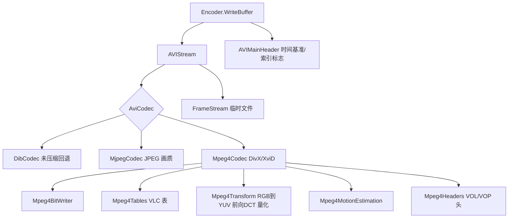

## User Requirements

- 在现有 AVI 视频写入能力的基础上，为视频流新增 **MJPEG 压缩** 与 **DivX/XviD 压缩** 两种输出方式。
- 压缩方式按 **每条视频流独立选择**，同一文件内不同流可以使用不同方式。
- **默认输出改为 MJPEG**（体积优先，属破坏性变更，原有调用方需可显式回退到未压缩输出）。
- DivX/XviD 必须 **完全自主实现**，不依赖任何第三方组件、外部程序或本机已安装的编解码器。
- 同步更新使用说明文档、示例代码与包元数据；并修复既有的索引与填充不一致缺陷。

## Product Overview

现有能力是把一幅幅未压缩的位图帧依次装进 AVI 容器，输出体积与帧数、画面尺寸成正比，长时间动画的导出文件非常大。本次优化在保持"零依赖、单文件直写"这一产品特质不变的前提下，为写入器增加可插拔的压缩通道：调用方在创建视频流时选择压缩方式，写入器自动完成画面对该方式的编码，并正确声明流的编码标识、建议缓冲大小与索引信息。默认走 MJPEG，文件体积显著下降且所有主流播放器可直接回放；选择 DivX/XviD 则可获得更高的压缩比。既有代码只需补一个参数即可继续得到原有的未压缩输出。

## Core Features

- **按流选择压缩方式**：创建视频流时可指定未压缩 / MJPEG / DivX / XviD，未指定时默认 MJPEG；同时支持画质/码率等参数。
- **MJPEG 压缩输出**：每帧以标准 JPEG 图片形式写入，画质参数可调，输出的视频流带正确的编码标识，可被主流播放器直接识别与回放。
- **DivX/XviD 压缩输出**：自主完成的帧间压缩，首帧为完整帧、后续帧仅记录相对前一帧的变化，输出码流以 DivX / XviD 标识写入，两种标识共用同一套压缩实现。
- **兼容性可控**：默认 MJPEG 的变更对既有调用方透明可选回退；未显式指定压缩方式之外，原有接口调用形态尽量保持不变。
- **容器正确性修复**：统一帧数据的奇偶填充处理，使索引中的偏移与大小与实际写入布局严格一致；修正视频主头中写死的帧间隔时间，并正确声明"文件含索引"标记。
- **配套交付**：更新包说明文档（压缩方式选择与参数说明）、示例程序（MJPEG 与 DivX/XviD 两组调用示例）以及包标题/描述/标签。

## Tech Stack

| 项 | 选型 | 说明 |
| --- | --- | --- |
| 语言 | **VB.NET** | 项目内全部为 `.vb`，沿用现有命名与排版风格（`Public Property`、`Sub New`、4 空格缩进） |
| 目标框架 | `net10.0` | 沿用 `AVI.NET5.vbproj` 现有 `TargetFrameworks` |
| 已有依赖 | `System.Drawing.Common` 10.0.12 + `Microsoft.VisualBasic.Core` 项目引用 | **不新增任何 NuGet 依赖** |
| MJPEG 编码 | `ImageCodecInfo.GetImageEncoders()` + `EncoderParameters` / `Encoder.Quality` | 由已有 `System.Drawing.Common` 提供，无需新依赖 |
| MPEG-4 编码 | 纯托管自研（位写入、VLC 表、DCT、量化、运动估计全部从零实现） | 已全仓确认不存在可复用的 `BitWriter`/`Huffman`/`ZigZag`/`FDCT`/`Quantiz*` 实现，也不存在 ffmpeg/xvid/divx 引用 |
| 约束 | 禁止外部进程、禁止 VFW/ICM 系统编解码器 | 保持 README 与 vbproj 强调的 dependency-free 定位 |


## Implementation Approach

核心策略是**引入一层编解码器抽象，把"帧如何变成字节"从容器写入逻辑中剥离**，容器侧只关心帧字节序列、编码标识与建议缓冲大小。

1. **codec 抽象层**：新增 `AviCodec` 枚举（`DIB` / `MJPEG` / `DivX` / `XviD`）与 `AviVideoCodec` 抽象基类，暴露 `FourCC`、`BitCount`、`HeightSign`、`SuggestedBufferSize`、`CodecPrivate`、`Encode(bitmap)`。`AVIStream` 持有 codec 实例，构造时按枚举解析；`writeHeaderBuffer` 中的 `strh.fccHandler`、`strf.biCompression`、`biBitCount`、`biHeight` 正负、建议缓冲大小全部改为由 codec 描述符驱动，不再写死 `DIB ` / 32bpp / `-height`。
2. **三条帧入口统一走 codec**：`addFrame(Bitmap)` 直接交给 codec；`addFrame(Color())` 与 `addRGBFrame(Byte())` 先组装为 `Bitmap` 再编码。现有 `addRGBFrame` 中无条件的 RGB→BGR 交换下沉到 `DibCodec`，仅在未压缩方式下执行。
3. **MJPEG codec**：缓存 `ImageCodecInfo`（JPEG），用 `Encoder.Quality`（0..100，默认 90）输出标准 JFIF 字节流；`FourCC = "MJPG"`、`BitCount = 24`、`HeightSign = +1`。
4. **MPEG-4 ASP 编码器（工作量主体）**：实现 Simple Profile 兼容的 I 帧 + 简单 P 帧码流（**不使用 B 帧、GMC、QPel、隔行**，以确保 DivX/XviD 解码器可正确回放）。

- `time_increment_resolution` / `fixed_vop_time_increment` 由流 `fps` 推导；`vop_quant` 由画质参数映射。
- 首帧前置 `visual_object_sequence_start_code` + `video_object_layer` 私有头字节流（`CodecPrivate`），这是 MPEG-4 在 AVI 中的通行做法（私有数据随首个 I 帧写入，不放进 `strf`）。
- 关键取舍：**量化采用 H.263 型（`quant_type = 0`）**，其逆量化公式简单、无需额外量化矩阵传输，且与 Simple Profile 兼容性最好；**I 帧宏块统一 `ac_pred_flag = 0`**，避免 DC/AC 预测方向判定的复杂度，代价是压缩比略低但码流合法性更易保证。
- **码率控制**：默认固定量化器；当调用方给出目标码率时，使用最简可行策略——维护每帧比特预算，按累计偏差在 `[2, 31]` 区间自适应调整 `vop_quant`（不做跳帧）。

5. **填充与索引一致性修复**：统一为"数据写入时补 1 字节 pad；索引 `dwSize` 计入 pad；长度估算与二者一致"，使 `indx` 偏移与 `movi` 实际布局严格对应。
6. **主头修复**：`dwMicroSecPerFrame` 由流 `fps` 推导（`1_000_000 / fps`，多流取第一路视频流），`dwFlags` 置位 `AVIF_HASINDEX (0x10)`，并同步 `dwMaxBytesPerSec` / `dwSuggestedBufferSize`。

**性能与可靠性**

- JPEG 编码复杂度 `O(W*H)`，与帧数线性相关，属既有逐帧落盘流程的可接受增量。
- MPEG-4 运动估计是全链路热点：采用**有界搜索（建议 ±8 像素）+ 分层/提前终止**，复杂度由朴素全搜索的 `O(W*H*R^2)` 降到实际可用范围；半像素细化仅在最优整像素邻域内做。
- 每帧复用 Y/U/V 平面缓冲、DCT 系数块与量化输出缓冲，避免逐帧大数组分配导致 GC 抖动；帧数据仍经 `FrameStream` 落盘到临时文件，内存占用不随帧数增长（既有机制不变）。
- 错误处理：编码失败时抛出带帧序号的明确异常，不产生半截文件；`UInt8Array`/`FileStream` 严格走 `Using`/`Dispose`。

**避免技术债**：优先复用现有 `UInt8Array`、`FrameStream`、`BitmapBuffer`、`TempFileSystem` 等基础设施；`AVIStream.writeHeaderBuffer` 保持现有绝对偏移布局不变，仅把写死的常量替换为 codec 描述符取值，避免无关重构扩大影响面。`AVIStreamHeader.vb` 目前是未被调用的空壳类，本次保持不动（已知死代码，不在本次范围）。

## Architecture Design



数据流：调用方 `addFrame` → codec `Encode` → 压缩字节 → `FrameStream` 落盘 → `WriterBuffer` 时按 codec 描述符写 `strh`/`strf`，并统一按填充规则写 `movi` 数据与 `indx` 索引。

## Implementation Notes

- **填充规则必须三处一致**：`Encoder.getVideoDataLength`、`AVIStream.writeHeaderBuffer` 的索引项、`AVIStream.writeDataBuffer` 的字节写入。未压缩帧长度恒为 `4*W*H`（偶数）从未暴露，但 JPEG/MPEG-4 帧长经常为奇数，一旦不一致 `indx` 偏移即错位。
- **索引项写法保持现状**：当前用 `writeLong` 写 8 字节（高 4 字节随后被 `writeInt` 的 size 覆写）等价于标准 8 字节条目，且规避了 32 位溢出，不要改写这个写法，只需让 offset/size 递增包含 pad。
- **`movi` 数据偏移基准**：`indx.dwOffset` 由 `moviOffset + dataOffset(i)` 得出、索引项内 offset 从 0 起累加，改造后必须保证两者与实际写入位置完全一致（偏移不再等距）。
- **`AVIStream.width/height` 为 `Short`**：`writeInt(88, width)` 等依赖 VB 隐式拓宽，替换为 codec 取值时保持同样的调用形式，避免引入显式窄化。
- **Blast radius**：默认改为 MJPEG 会改变 `avi/test/Module1.vb` 这类既有调用方的输出结果，必须在实现前用工具确认全仓调用点（见 extensions），并在文档中给出 `New AVIStream(fps, w, h, AviCodec.DIB)` 的回退写法。
- **日志**：现有这几个文件均未引入日志设施，本次不新增，避免引入不一致的日志依赖。
- **临时文件命名**：`TempFileSystem.GetAppSysTempFile(".rgb_frames", ...)` 的扩展名已不再贴切，可在改动 `AVIStream` 构造时一并调整为中性后缀（低风险项，可选）。

### 包元数据文案（建议）

- `Title`：`AVI Video Encoder With MJPEG And MPEG-4 (DivX/XviD) Compression`
- `Description`：`A dependency-free AVI (RIFF) writer that compresses rendered animation frames into MJPEG, MPEG-4 Part 2 (DivX/XviD) or uncompressed DIB video streams, with per-stream codec selection and no external codec dependency.`
- `PackageTags`：`scibasic;avi;video-encoder;riff;animation;mjpeg;mpeg4;divx;xvid`

## Directory Structure

本次在既有扁平布局（`avi/` 目录下所有类同处 `Microsoft.VisualBasic.Imaging.AVIMedia` 根命名空间，不写 `Namespace` 语句）中新增文件，新文件同样不声明命名空间，以零命名空间歧义的方式被自动纳入编译。

```
gr/avi/
├── AVI.NET5.vbproj              # [MODIFY] 更新 Title / Description / PackageTags，体现压缩能力；不新增任何 PackageReference
├── AVIStream.vb                 # [MODIFY] 核心改造点。新增 codec 字段与 AviCodec/画质参数构造重载；addFrame(Bitmap)/addFrame(Color())/addRGBFrame(Byte()) 三条入口统一走 codec.Encode；RGB→BGR 交换下沉到 DibCodec；writeHeaderBuffer 的 fccHandler/biCompression/biBitCount/biHeight 正负/建议缓冲大小改由 codec 描述符驱动；索引项 offset/size 递增计入偶数填充
├── Encoder.vb                   # [MODIFY] getVideoDataLength 与索引/数据写入的填充规则统一（三处一致）
├── AVIMainHeader.vb             # [MODIFY] dwMicroSecPerFrame 由流 fps 推导；dwFlags 置位 AVIF_HASINDEX；同步 dwMaxBytesPerSec / dwSuggestedBufferSize
├── README.md                    # [MODIFY] 补充 codec 选择、MJPEG 画质、DivX/XviD 用法与未压缩回退写法；更新标题与 Key Types 列表
├── AviCodec.vb                  # [NEW] AviCodec 枚举（DIB/MJPEG/DivX/XviD）及枚举到 fourCC、位深、HeightSign、默认参数的映射；Create(codec, fps, w, h, options) 工厂
├── AviVideoCodec.vb             # [NEW] 编解码器抽象基类（MustInherit），定义 FourCC / BitCount / HeightSign / SuggestedBufferSize / CodecPrivate / Encode(Bitmap) 契约，作为三个 codec 与容器之间的唯一耦合面
├── DibCodec.vb                  # [NEW] 未压缩回退实现。承载原 addRGBFrame 的 RGB→BGR 交换逻辑；FourCC="DIB "、BitCount=32、HeightSign=-1、CodecPrivate=Nothing
├── MjpegCodec.vb                # [NEW] MJPEG 实现。缓存 JPEG 的 ImageCodecInfo，用 EncoderParameters+Encoder.Quality 输出 JFIF 字节流；画质参数 0..100（默认 90）；FourCC="MJPG"、BitCount=24、HeightSign=+1
├── Mpeg4Tables.vb               # [NEW] MPEG-4 VLC 与常量表。TCOEFF（intra/inter、luma/chroma）、DC size、MCBPC（I/P-VOP）、CBPY、MV 各套表均以显式 (code, bits) 对声明，附反向查找表供自检
├── Mpeg4BitWriter.vb            # [NEW] MSB-first 位写入器。支持任意位宽写入、字节对齐、起始码写入与缓冲输出，是码流合法性的最底层保证
├── Mpeg4Transform.vb            # [NEW] 像素与变换。RGB→YUV 4:2:0（BT.601，整数近似带舍入）、8x8 整数前向 DCT、H.263 型量化（intra DC 步长 8）、zig-zag 扫描与反量化公式推导
├── Mpeg4Headers.vb              # [NEW] 头序列化。visual_object_sequence / visual_object / video_object_layer(VOL) / VOP 头；time_increment_resolution 由 fps 推导、fixed_vop_time_increment、vop_coding_type、vop_quant、vop_fcode_forward；字段顺序严格按 ISO/IEC 14496-2 video_object_layer() 语法
├── Mpeg4MotionEstimation.vb     # [NEW] P 帧运动估计。整像素有界搜索（建议 ±8）+ 半像素细化 + MV 预测（中值）与差分编码，输出 CBP 与残差供宏块编码使用
└── Mpeg4Codec.vb                # [NEW] MPEG-4 编码器主体与 AviVideoCodec 实现。宏块编码（I 帧 intra_dc_vlc_thr + DC 差分 + AC TCOEFF；P 帧 MCBPC/CBPY/MV/残差）、I/P 帧决策、码率控制（固定量化器或按每帧比特预算自适应）、CodecPrivate 私有头生成；DivX 与 XviD 共用本实现，仅 fourCC 不同
```

## Key Code Structures

编解码器契约是三个 codec 与容器之间的唯一耦合面，必须先固定：

```
Public Enum AviCodec
    DIB = 0
    MJPEG = 1
    DivX = 2
    XviD = 3
End Enum

''' <summary>
''' AVI 视频流编解码器契约，由 AVIStream 按流持有。
''' </summary>
Public MustInherit Class AviVideoCodec

    ''' <summary>写入 strh.fccHandler 与 strf.biCompression 的四字符编码</summary>
    Public MustOverride ReadOnly Property FourCC As String

    ''' <summary>strf.biBitCount</summary>
    Public MustOverride ReadOnly Property BitCount As Short

    ''' <summary>strf.biHeight 的符号：DIB 为 -1（top-down），压缩格式为 +1</summary>
    Public MustOverride ReadOnly Property HeightSign As Integer

    ''' <summary>strh.dwSuggestedBufferSize / strf.biSizeImage</summary>
    Public MustOverride ReadOnly Property SuggestedBufferSize As Integer

    ''' <summary>编解码器私有数据：MPEG-4 为 VOL 头字节流，需前置到首个 I 帧；其余返回 Nothing</summary>
    Public Overridable ReadOnly Property CodecPrivate As Byte()
        Get
            Return Nothing
        End Get
    End Property

    ''' <summary>把一帧画面编码为写入 movi 的原始载荷字节</summary>
    Public MustOverride Function Encode(bitmap As Bitmap) As Byte()

End Class
```

## Agent Extensions

### Skill

- **lsp-code-analysis**
- Purpose: 在改造 `AVIStream` / `Encoder` 的公开契约前，用语义分析精确定位 `AVIStream`、`Encoder`、`addFrame`、`addRGBFrame`、`writeHeaderBuffer` 的定义、全部引用与实现关系，避免仅靠文本搜索漏掉调用点。
- Expected outcome: 得到完整的符号依赖与调用点清单，明确哪些调用方会因"默认 codec 改为 MJPEG"而改变输出结果，并据此确认接口重载的兼容性设计无遗漏。

### SubAgent

- **code-explorer**
- Purpose: 在 `g:/pixelArtist/src`（500+ VB 文件）范围内做一次中等深度的全仓排查，确认所有引用 `Microsoft.VisualBasic.Imaging.AVIMedia` / `Encoder` / `AVIStream` 的项目与文件；同时复核仓库内确实不存在可复用的 DCT / Huffman / BitWriter / 位流写入实现以及任何 ffmpeg / xvid / divx 依赖。
- Expected outcome: 输出受影响的项目与文件清单（用于评估破坏性变更影响面并在文档中说明），以及"无现成可复用实现、必须从零编写 MPEG-4 编码"的确认结论，作为编码任务拆分的依据。