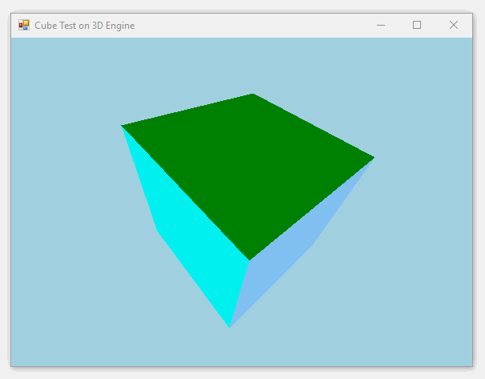

## 3D rotation math

> About the math algorithm of how to rotate 3D point, you can read this article: &lt;[**3D Rotation**](../Microsoft.VisualBasic.Imaging/Drawing3D/README.md)>

## 3D Projection

```vbnet
''' <summary>
''' Project the 3D point to the 2D screen.
''' </summary>
''' <param name="x!"></param>
''' <param name="y!"></param>
''' <param name="z!">Using for the painter algorithm.</param>
''' <param name="viewWidth%"></param>
''' <param name="viewHeight%"></param>
''' <param name="fov%"></param>
''' <param name="viewDistance%">View distance to the model from the view window.</param>
Public Sub Project(ByRef x!, ByRef y!, z!, viewWidth%, viewHeight%, viewDistance%, Optional fov% = 256)
    Dim factor! = fov / (viewDistance + z)

    ' 2D point result (x, y)
    x = x * factor + viewWidth / 2
    y = y * factor + viewHeight / 2
End Sub
```

## The surface model

##### How to draw surface?

This is just super easy, using the ``FillPolygon`` method in the **gdi+** object.

```vbnet
' Summary:
'     Fills the interior of a polygon defined by an array of points specified by System.Drawing.Point
'     structures.
'
' Parameters:
'   brush:
'     System.Drawing.Brush that determines the characteristics of the fill.
'
'   points:
'     Array of System.Drawing.Point structures that represent the vertices of the polygon
'     to fill.
'
' Exceptions:
'   T:System.ArgumentNullException:
'     brush is null.-or-points is null.
Public Sub System.Drawing.Graphics.FillPolygon(brush As Brush, points() As Point)
```

##### Surface model

The surface data model just define 2 property that using as the parameter of the ``FillPolygon`` method:

```vbnet
Public Structure Surface

    ''' <summary>
    ''' 请注意，在这里面的点都是有先后顺序分别的
    ''' </summary>
    Public vertices() As Point3D
    Public brush As Brush

End Structure
```

## The surface painter

```vbnet
''' <summary>
''' 请注意，这个并没有rotate，只会利用camera进行project
''' </summary>
''' <param name="canvas"></param>
''' <param name="camera"></param>
''' <param name="surfaces"></param>
<Extension>
Public Sub SurfacePainter(ByRef canvas As Graphics, camera As Camera, surfaces As IEnumerable(Of Surface))
    Dim sv As New List(Of Surface), order As New List(Of Integer)

    For Each s As Surface In surfaces
        Dim v As Point3D() = camera _
            .Project(s.vertices) _
            .ToArray

        sv += New Surface With {
            .vertices = v,
            .brush = s.brush
        }
    Next

    ' Compute the average Z value of each face.
    Dim avgZ#() = New Double(sv.Count) {}

    For i As Integer = 0 To sv.Count - 1
        avgZ(i) = sv(i).vertices.Average(Function(z) z.Z)
        order.Add(i)
    Next

    Dim iMax%
    Dim tmp#

    ' Next we sort the faces in descending order based on the Z value.
    ' The objective is to draw distant faces first. This is called
    ' the PAINTERS ALGORITHM. So, the visible faces will hide the invisible ones.
    ' The sorting algorithm used is the SELECTION SORT.
    For i% = 0 To sv.Count - 1
        iMax = i

        For j = i + 1 To sv.Count - 1
            If avgZ(j) > avgZ(iMax) Then
                iMax = j
            End If
        Next

        If iMax <> i Then
            tmp = avgZ(i)
            avgZ(i) = avgZ(iMax)
            avgZ(iMax) = tmp

            tmp = order(i)
            order(i) = order(iMax)
            order(iMax) = tmp
        End If
    Next

    Call order.Reverse()

    ' Draw the faces using the PAINTERS ALGORITHM (distant faces first, closer faces last).
    For i As Integer = 0 To sv.Count - 1
        Dim index As Integer = order(i)
        Dim s As Surface = sv(index)
        Dim points() As Point = s _
            .vertices _
            .Select(Function(p3D) p3D.PointXY(camera.screen)) _
            .ToArray

        Call canvas.FillPolygon(s.brush, points)
    Next
End Sub
```