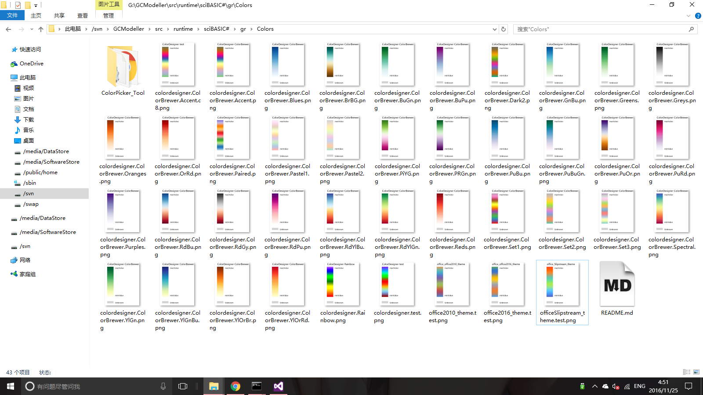

```vbnet
Sub ColorBrewer()

    For Each key$ In Designer.ColorBrewer.Keys
        On Error Resume Next

        Dim s = Designer.ColorBrewer(key)
        Dim colors = Designer _
            .CubicSpline(
            If(s.c10.IsNullOrEmpty,
            If(s.c9.IsNullOrEmpty,
            If(s.c8.IsNullOrEmpty,
            If(s.c7.IsNullOrEmpty,
            If(s.c6.IsNullOrEmpty, s.c5, s.c6), s.c7), s.c8), s.c9), s.c10) _
            .ToArray(AddressOf ToColor), 30)
    
        Call Legends.ColorMapLegend(
            colors, $"ColorDesigner ColorBrewer:{key}", "minValue", "maxValue", bg:="white") _
            .SaveAs($"./colordesigner.ColorBrewer.{key}.png")
    Next
End Sub
```
