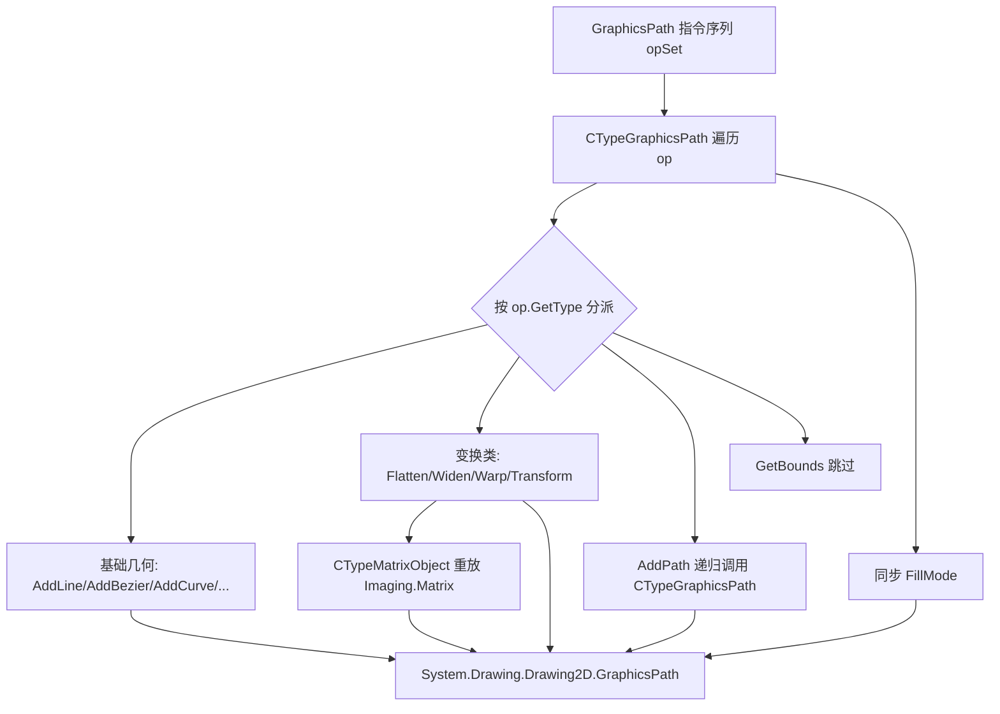

## 用户需求

完善 `Drawing-net4.8` 项目 `Interop\DrawingInterop.vb` 中的 `CTypeGraphicsPath` 扩展方法，将 `Microsoft.VisualBasic.Imaging.GraphicsPath`（定义于 Microsoft.VisualBasic.Core 的 `netcore8.0\GraphicsPath.vb`）记录的绘图指令，逐条转换为 `System.Drawing.Drawing2D.GraphicsPath` 的真实 GDI+ 操作。

## 产品概述

`CTypeGraphicsPath` 目前仅处理了 `op_AddArc`、`op_AddBezier`、`op_CloseFigure` 三个分支，其余指令在 `Case Else` 中抛出 `NotImplementedException`。本任务补全其余全部指令，使任意 `GraphicsPath` 都能被精确还原为可绘制的 GDI+ 路径对象。

## 核心功能

- 覆盖 `GraphicsPath.op` 定义的全部 24 种指令，映射至 `GraphicsPath` 对应 GDI+ 方法：AddLine、AddBezier、AddBeziers、AddCurve、AddLines、AddRectangle、AddEllipse、AddPolygon、AddPie、AddClosedCurve、AddPath、AddString、StartFigure、CloseFigure、CloseAllFigures、Reset、Flatten、Widen、Warp、Transform、Reverse。
- 处理包装类型转换：`Pen` 用既有 `CTypePenObject`；`FontFamily/StringFormat/FontStyle` 重新构造；`WarpMode/FillMode` 因枚举值一致直接 `CType`；`Matrix` 通过新增只读访问器忠实重放变换。
- 递归处理 `op_AddPath`（嵌套子路径），`op_GetBounds` 为查询指令不修改几何故跳过。
- 将顶层 `GraphicsPath.FillMode` 同步至 GDI+ 路径的 `FillMode` 属性。

## 技术栈与约束

- 语言：Visual Basic (.NET)，目标框架 `net10.0-windows`（`Drawing-net4.8.vbproj`），因此 `NET8_0_OR_GREATER` 为真，`GraphicsPath`/`Matrix` 等 netcore8.0 类型在编译期可用。
- 输入类型 `Microsoft.VisualBasic.Imaging.GraphicsPath` 位于 `Namespace Imaging`，其 op 子类中引用的 `Pen`、`Matrix`、`FontFamily`、`StringFormat`、`FontStyle`、`WarpMode`、`FillMode` 实际解析为 `Microsoft.VisualBasic.Imaging` 的包装类型（当前命名空间优先于 `Imports System.Drawing`），必须转换为 `System.Drawing` 对应类型。
- 复用既有模式：`DrawingInterop.vb` 已存在 `CTypePenObject`/`CTypeFontObject`/`CTypeBrushObject`，均读取包装类型的**公开属性**返回 GDI+ 对象；新增转换方法沿用同一扩展方法风格。

## 实现方案

在现有 `CTypeGraphicsPath` 的 `Select Case op.GetType` 循环中补齐全部 `Case GetType(GraphicsPath.op_*)`，并新增若干转换辅助扩展方法。核心映射（op → `System.Drawing.Drawing2D.GraphicsPath` 方法）：

| op 子类 | GDI+ 调用 |
| --- | --- |
| op_AddLine(a,b) | `g.AddLine(op.a, op.b)` |
| op_AddCurve(points) | `g.AddCurve(op.points)` |
| op_AddLines(points) | `g.AddLines(op.points)` |
| op_Reset | `g.Reset()` |
| op_CloseAllFigures | `g.CloseAllFigures()` |
| op_AddRectangle(rect) | `g.AddRectangle(op.rect)` |
| op_AddPolygon(points) | `g.AddPolygon(op.points)` |
| op_AddEllipse(x,y,r1,r2) | `g.AddEllipse(op.x, op.y, op.r1*2, op.r2*2)`（r1/r2 为半轴长，宽高需乘 2） |
| op_AddString(...) | 转换 FontFamily/StringFormat/FontStyle 后 `g.AddString(op.s, family, style, op.size, op.pos, format)` |
| op_AddPie(rect,...) | `g.AddPie(op.rect, op.startAngle, op.sweepAngle)` |
| op_AddClosedCurve(points,tension) | `g.AddClosedCurve(op.points, op.tension)` |
| op_AddPath(path,connect) | `g.AddPath(op.path.CTypeGraphicsPath(), op.connect)`（递归） |
| op_AddBeziers(points) | `g.AddBeziers(op.points)` |
| op_AddEllipseRect(rect) | `g.AddEllipse(op.rect)` |
| op_StartFigure | `g.StartFigure()` |
| op_Flatten(matrix,flatness) | `g.Flatten(CTypeMatrixObject(op.matrix), op.flatness)` |
| op_Widen(pen,matrix,flatness) | `g.Widen(op.pen.CTypePenObject, CTypeMatrixObject(op.matrix), op.flatness)` |
| op_Warp(...) | `g.Warp(op.destPoints, op.srcRect, CTypeMatrixObject(op.matrix), CType(op.warpMode, WarpMode), op.flatness)` |
| op_Transform(matrix) | `g.Transform(CTypeMatrixObject(op.matrix))` |
| op_Reverse | `g.Reverse()` |
| op_GetBounds | 跳过（查询指令，不改变路径几何） |


在循环前：`g.FillMode = CType(path.FillMode, System.Drawing.Drawing2D.FillMode)`。

### 类型转换细节

- `FontStyle`（`[Flags]`，Regular=0/Bold=1/Italic=2/Underline=4/Strikeout=8）、`WarpMode`（Perspective=0/Bilinear=1）、`FillMode`（Alternate=0/Winding=1）与 `System.Drawing.Drawing2D` 同名枚举值完全一致，直接 `CType` 转换。
- `Imaging.FontFamily` 仅含 `Name` → `New System.Drawing.FontFamily(op.fontFamily.Name)`。
- `Imaging.StringFormat` 含 `Alignment`/`LineAlignment`（`StringAlignment`：Center/Far/Near，值与 `System.Drawing.StringAlignment` 一致）→ 重新构造 `System.Drawing.StringFormat`；`format` 为 `Nothing` 时传 `Nothing`。
- `Pen` 用既有 `CTypePenObject`（参数为 `Microsoft.VisualBasic.Imaging.Pen`）。

### Matrix 忠实转换（已确认方案）

`Imaging.Matrix` 将 Rotate/RotateAt/Scale/Shear/Translate/Multiply/Invert 存于私有字段，`Elements` 仅反映构造参数（单位阵或显式元素）。需在核心库 `Matrix.vb` 增加只读公开访问器：RotateAngle、RotateAtPoint（可空 PointF）、ScaleX、ScaleY、ScaleOrder、ShearX、ShearY、ShearOrder、TranslateX、TranslateY、TranslateOrder、MultiplyMatrix、MultiplyOrder、IsInverted、HasCustomInit、SrcRect、DstPoints。然后在 `DrawingInterop.vb` 新增扩展方法 `CTypeMatrixObject`：

- `Nothing` → 返回 `Nothing`；
- `HasCustomInit` 为真 → 用 `New System.Drawing.Drawing2D.Matrix(srcRect, dstPoints)` 构造透视矩阵；
- 否则从 `Elements` 构造仿射矩阵 `New Matrix(m11,m12,m21,m22,dx,dy)`；
- 然后按字段重放：RotateAt/Rotate、Scale、Shear、Translate（均带 MatrixOrder）、Multiply（递归转换嵌套 Matrix）、Invert。

## 实现注意事项

- 复用既有 `CTypePenObject`，不重复实现 Pen 转换；保持 `DrawingInterop.vb` 扩展方法命名一致性（CType*Object）。
- `op_AddEllipse` 的 r1/r2 为半轴，必须乘 2 作为 GDI+ AddEllipse 的 width/height，否则椭圆尺寸错误。
- `op_AddPath` 递归调用 `CTypeGraphicsPath`，循环与递归均基于 op 子类列表，无额外集合遍历，复杂度 O(总指令数)。
- 仅修改目标文件与必要的核心库访问器，避免无关重构；`op_GetBounds` 明确跳过并加注释说明其为只读查询。
- 给 `Matrix.vb` 仅追加只读属性，不改变既有字段语义与任何写入方法，控制改动爆炸半径。

## 架构设计

保持现有 `DrawingInterop` 模块职责：纯函数式 GDI+ 组件转换层。新增 `CTypeMatrixObject` 等辅助方法与已有 `CType*` 并列，形成“包装类型 → System.Drawing”的对称转换集合。核心库 `Matrix.vb` 仅补充只读访问器，不引入新依赖。



## 目录结构

```
Microsoft.VisualBasic.Core/src/Drawing/netcore8.0/
└── Matrix.vb                 # [MODIFY] 为 Imaging.Matrix 增加只读访问器属性
                              # （RotateAngle/RotateAtPoint/ScaleX/ScaleY/ScaleOrder/
                              #  ShearX/ShearY/ShearOrder/TranslateX/TranslateY/TranslateOrder/
                              #  MultiplyMatrix/MultiplyOrder/IsInverted/HasCustomInit/
                              #  SrcRect/DstPoints），仅返回既有私有字段，不改写逻辑。
gr/Drawing-net4.8/Interop/
└── DrawingInterop.vb         # [MODIFY] 新增 CTypeMatrixObject / CTypeFontFamilyObject /
                              #  CTypeStringFormatObject 扩展方法；补全 CTypeGraphicsPath
                              #  的 Select Case 全部分支，递归处理 AddPath，同步 FillMode。
```

## 关键代码结构

新增扩展方法契约（仅接口级，便于集成）：

- `Function CTypeMatrixObject(matrix As Microsoft.VisualBasic.Imaging.Matrix) As System.Drawing.Drawing2D.Matrix`
- `Function CTypeFontFamilyObject(f As Microsoft.VisualBasic.Imaging.FontFamily) As System.Drawing.FontFamily`
- `Function CTypeStringFormatObject(f As Microsoft.VisualBasic.Imaging.StringFormat) As System.Drawing.StringFormat`
- `Imaging.Matrix` 需新增只读属性：`Property RotateAngle As Single`、`Property RotateAtPoint As PointF?`、`Property ScaleX/ScaleY As Single`、`Property ScaleOrder As MatrixOrder`、`Property ShearX/ShearY As Single`、`Property ShearOrder As MatrixOrder`、`Property TranslateX/TranslateY As Single`、`Property TranslateOrder As MatrixOrder`、`Property MultiplyMatrix As Matrix`、`Property MultiplyOrder As MatrixOrder`、`Property IsInverted As Boolean`、`Property HasCustomInit As Boolean`、`Property SrcRect As RectangleF`、`Property DstPoints As PointF()`。