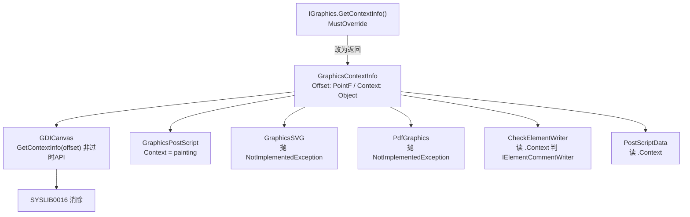

## 产品概述

清除 `Drawing-net4.8` 项目编译时产生的全部警告消息，且**不使用** `SuppressMessage` 特性、`#pragma warning disable` 或 `<NoWarn>` 等抑制手段，而是通过修改源代码与项目配置从根本上消除警告成因。

## 核心功能

- **修复 CA2022（4 条）**：`GifEncoder.vb` 中 4 处 `Stream.Read` 忽略返回值，改用 .NET 7+ 提供的 `Stream.ReadExactly`，使"读取不足"从静默错误变为显式异常，属于真实正确性修复。
- **修复 SYSLIB0016（1 条）**：`GDICanvas.vb` 调用的 GDI+ 无参 `Graphics.GetContextInfo()` 自 .NET 6 起过时。微软推荐的替代重载为 `GetContextInfo(out PointF)` / `GetContextInfo(out PointF, out Region)`，二者是 **Sub**（通过 out 参数返回、不返回对象），因此无法通过简单替换满足现有 `Function GetContextInfo() As Object` 契约。按用户选定的方案**改造 `IGraphics.GetContextInfo` 抽象契约**，并同步调整 SVG / PDF / PostScript 等全部驱动实现与调用点。
- **修复 NU1510（当前项目自身 1 条）**：按微软文档 Scenario 1，删除触发它的直接 `PackageReference`（`System.Drawing.Common`），重新构建验证；**若编译失败则回滚该改动并如实报告**，不降级为 NoWarn 抑制。

## 边界与约束

- 修复范围**仅限当前项目 `Drawing-net4.8`**；来自依赖项目（`Core.vbproj` / `Math.NET5.vbproj` / `html_netcore5.vbproj`）的 NU1510 不在本次范围内，构建后仍会出现，属预期。
- 因 SYSLIB0016 采用抽象改造方案，会连带修改 `Microsoft.VisualBasic.Core`、`Microsoft.VisualBasic.Imaging`、`PdfImage` 三个项目中的驱动实现与调用点（用户已确认接受此影响面）。
- 项目当前不存在任何 NoWarn / Suppress 设置，无需清理历史抑制。

## 技术栈

- 语言：Visual Basic .NET（SDK 风格 vbproj，默认全局包含 `.vb`，新增源文件无需改项目文件）
- 目标框架：`Drawing-net4.8.vbproj` → `net10.0-windows`；`Core.vbproj` → `net10.0`（**非** windows，故新共享类型只能用 `System.Drawing.Primitives` 的 `PointF`/`RectangleF`/`SizeF`，不得使用 GDI+ 专有类型如 `System.Drawing.Region`）
- 构建验证工具：`dotnet build`（PowerShell 下需重定向到日志文件后读取，`tail` 不可用）

## 实现方案

### 1. CA2022 —— 用 `ReadExactly` 替代忽略返回值的 `Read`

`GifEncoder.vb` 中 4 处 `sourceGif.Read(buffer, 0, len)` 的返回值被丢弃，短读会静默留下零字节。TFM 为 net10.0-windows，可直接使用 .NET 7+ 的 `Stream.ReadExactly(Byte(), Int32, Int32)`：读满指定长度，否则抛 `EndOfStreamException`。这同时满足分析器要求并提升健壮性，非抑制。

### 2. SYSLIB0016 —— 改造 `IGraphics.GetContextInfo` 契约

根因：GDI+ 已无任何非过时 API 能返回"累积上下文对象"。因此把契约从"返回一个含义不明的 `Object`"改为"返回一个结构化上下文描述"。

新增共享类型（Core，`Namespace Imaging`，紧邻 `IGraphics`）：

- `GraphicsContextInfo`
- `Offset As PointF` —— 累积变换偏移（GDI+ 可由非过时 API 提供）
- `Context As Object` —— 驱动专属上下文（PostScript 的 `PostScriptBuilder`；其余为 `Nothing`）

契约变更：`Public MustOverride Function GetContextInfo() As Object` → `As GraphicsContextInfo`。

四个实现同步调整：

| 实现 | 行号 | 改法 |
| --- | --- | --- |
| `GDICanvas` | 2304 | 调用 `Graphics.GetContextInfo(offset)`，返回 `New GraphicsContextInfo With {.Offset = offset}`（**消除过时调用**） |
| `GraphicsPostScript` | 863 | 返回 `New GraphicsContextInfo With {.Context = painting}`（语义不变） |
| `GraphicsSVG` | 697 | 仅改签名，保留 `Throw New NotImplementedException()`（保持既有行为） |
| `PdfGraphics` | 567 | 仅改签名，保留 `Throw New NotImplementedException()`（保持既有行为） |


两个调用点同步调整（均在 `CreateGraphicsDriver.vb`）：

- 第 90 行：`Dim context As Object = g.GetContextInfo.Context`（`CheckElementWriter` 后续仅判断是否实现 `IElementCommentWriter`，行为等价）
- 第 217 行：`New PostScriptData(g.GetContextInfo.Context, g.Size, New Padding(padding))`（`PostScriptData` 构造器首参本就是 `Object`，兼容）

### 3. NU1510 —— 删除触发的直接 PackageReference

`Drawing-net4.8.vbproj` 第 222-224 行仅有的一条 `PackageReference`（`System.Drawing.Common` 10.0.11）导致 `System.Drawing.Primitives` 无法被修剪。按官方解法删除该引用后重新构建；若出现类型缺失等编译错误则**回滚**并在结论中说明。

## 实现注意事项

- **先建立基线**：首次执行必须做一次干净构建并完整记录警告清单，确认与既有认知一致（CA2022 ×4 / SYSLIB0016 ×1 / NU1510），避免遗漏增量构建未暴露的警告。
- **验证面必须覆盖被波及项目**：`Drawing-net4.8` 的 `ProjectReference` 只含 Math.NET5、Core、html_netcore5，**不会**编译到 `Microsoft.VisualBasic.Imaging` 与 `PdfImage`；而 `GraphicsSVG`/`GraphicsPostScript`/`CreateGraphicsDriver` 位于前者、`PdfGraphics` 位于后者。故最终验证须分别构建三个项目：
- `g:\pixelArtist\src\framework\gr\Drawing-net4.8\Drawing-net4.8.vbproj`
- `g:\pixelArtist\src\framework\gr\Microsoft.VisualBasic.Imaging\imaging.NET5.vbproj`
- `g:\pixelArtist\src\framework\gr\PdfImage\PdfImage.vbproj`
- **跨项目 API 变更风险**：`GetContextInfo` 返回类型是破坏性变更。已通过全仓库检索确认框架内仅 4 处重写、2 处调用（另有一处是构建日志文本），但仍应在执行时用 LSP 语义检索复核，防止文本搜索漏掉晚期绑定或多态调用。
- **膨胀半径控制**：SVG/PDF 现状即抛 `NotImplementedException`，改造时保留该行为，不擅自改为返回 `Nothing`；`GraphicsPostScript` 返回值语义保持不变；共用 `Offset` 而非 `Region`，以兼容 Core 的跨平台 TFM。
- **不使用任何抑制**：全程不引入 `NoWarn`、`<Suppress>`、`#Disable Warning` 或 `SuppressMessage` 特性。

## 架构设计



## 目录结构

```
Microsoft.VisualBasic.Core/src/Drawing/GDI+/
├── GraphicsContextInfo.vb          # [NEW] 新增共享上下文描述类型（Namespace Imaging）。
│                                   #   含 Offset As PointF（累积变换偏移）与 Context As Object
│                                   #   （驱动专属上下文）。仅用 System.Drawing.Primitives 类型，
│                                   #   不使用 Region 等 GDI+ 专有类型以兼容 net10.0。
│                                   #   按仓库既有文件头（Region/许可证/Summaries 注释）风格编写；
│                                   #   Core.vbproj 为 SDK 风格且无显式 Compile 项，自动纳入编译。
└── Interface.vb                    # [MODIFY] 第 1751-1758 行：GetContextInfo 返回类型由 Object
                                    #   改为 GraphicsContextInfo，并同步更新 XML 文档注释。

gr/Drawing-net4.8/
├── Graphics/GDICanvas.vb           # [MODIFY] 第 2304-2306 行：改用非过时重载
│                                   #   Graphics.GetContextInfo(offset)，返回
│                                   #   New GraphicsContextInfo With {.Offset = offset}。
├── FileEncoder/GifEncoder.vb       # [MODIFY] 第 173/181/201/231 行：四处 sourceGif.Read 改为
│                                   #   sourceGif.ReadExactly，修复 CA2022。
└── Drawing-net4.8.vbproj           # [MODIFY] 第 222-224 行：删除触发 NU1510 的
                                    #   PackageReference System.Drawing.Common 10.0.11；
                                    #   若构建失败则回滚。

gr/Microsoft.VisualBasic.Imaging/
├── PostScript/GraphicsPostScript.vb    # [MODIFY] 第 863-865 行：签名改返回 GraphicsContextInfo，
│                                       #   返回 New GraphicsContextInfo With {.Context = painting}。
├── SVG/GraphicsSVG.vb                  # [MODIFY] 第 697-699 行：仅改签名，保留抛 NotImplementedException。
└── Drivers/CreateGraphicsDriver.vb     # [MODIFY] 第 90 行改为 g.GetContextInfo.Context；
                                        #   第 217 行 PostScriptData 首参改为 g.GetContextInfo.Context。

gr/PdfImage/
└── PdfGraphics.vb                  # [MODIFY] 第 567-569 行：仅改签名，保留抛 NotImplementedException。
```

## 关键代码结构

新增共享类型与变更后的抽象契约（接口级）：

```
Namespace Imaging

    ''' <summary>
    ''' Describes the cumulative graphics context of an <see cref="IGraphics"/> driver.
    ''' </summary>
    Public Class GraphicsContextInfo

        ''' <summary>
        ''' The cumulative transform offset of the graphics surface.
        ''' </summary>
        Public Property Offset As PointF

        ''' <summary>
        ''' The driver specific graphics context, e.g. the postscript builder
        ''' or the svg element writer.
        ''' </summary>
        Public Property Context As Object

    End Class

End Namespace
```

```
' Interface.vb — 契约变更
Public MustOverride Function GetContextInfo() As GraphicsContextInfo

' GDICanvas.vb — 消除 SYSLIB0016
Public Overrides Function GetContextInfo() As GraphicsContextInfo
    Dim offset As PointF
    Call Graphics.GetContextInfo(offset)   ' 非过时重载（out PointF）
    Return New GraphicsContextInfo With {.Offset = offset}
End Function
```

## Agent Extensions

### Skill

- **lsp-code-analysis**
- 用途：在改造 `IGraphics.GetContextInfo` 契约时，用语义级导航复核 `GetContextInfo` 的**全部**重写实现、调用点以及 `IGraphics` 的全部子类，弥补纯文本检索可能遗漏晚期绑定/多态调用的风险。
- 预期结果：确认改动面精确等于已定位的 4 处重写 + 2 处调用，无遗漏引用；若发现额外引用则一并纳入本次同步修改。