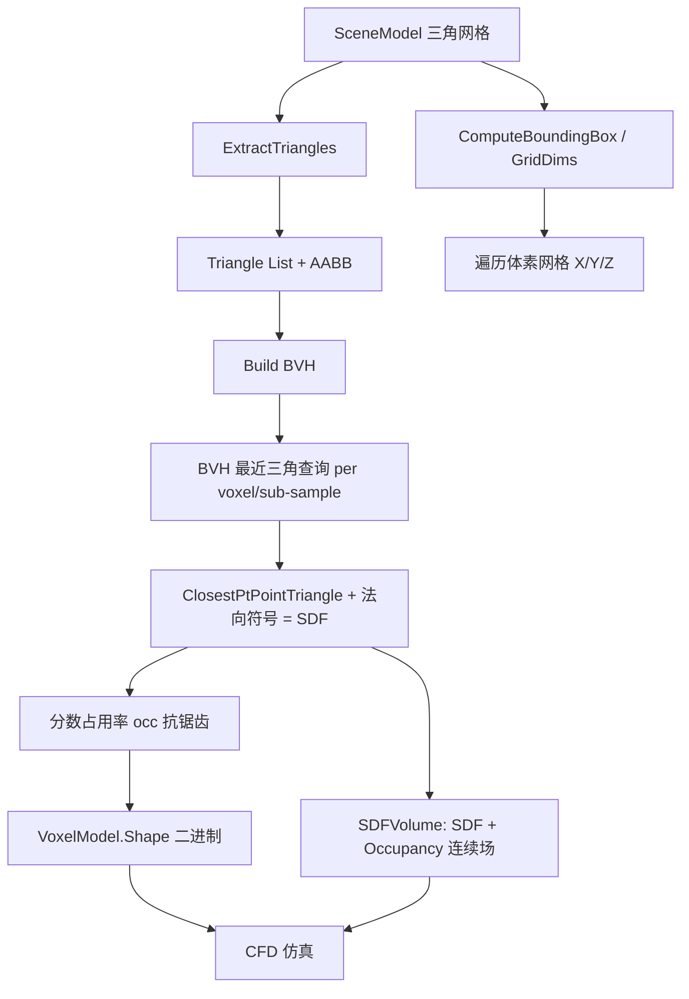

## 用户需求

在现有 VB.NET 三维模型体素化项目（Landscape / Voxelization）中，新增一套基于符号距离场（SDF）的体素化算法模块，替代/补充现有粗糙的射线投射列扫描算法，生成用于 CFD 高精度流体仿真计算的三维体素模型。

## 产品概览

新增 SDF 体素化能力：将任意格式（STL/OBJ/glTF/COLLADA/3DS/3MF）解析后的 `SceneModel` 三角网格，转换为

1. 与现有 API 完全一致的二进制 `VoxelModel`（布尔 `Shape`），可直接替换现有体素模型用于 CFD；
2. 同时导出的连续符号距离场 `SDFVolume`（双精度 `Double()` 与抗锯齿占用率），供 CFD 在边界处做高精度处理。

## 核心特性

- **精确 SDF 计算**：对每个体素中心计算到网格最近三角面的最近点与欧几里得距离，并用最近三角面法向判定内外符号（Baerentzen & Aanaes 法），得到连续带符号距离。
- **BVH 空间加速**：构建三角形包围盒层次结构，将"每体素找最近三角形"从 O(体素数 × 三角形数) 降至近似 O(体素数 × log 三角形数)，保证高分辨率（如 256³/512³）可用。
- **亚体素采样抗锯齿**：每个体素内部按 N×N×N（默认 2³）子网格采样 SDF 符号，统计分数占用率，显著平滑表面、消除阶梯伪影（粗糙度根源）。
- **双输出 API**：提供 `Voxelize`（二进制 `VoxelModel`）与 `ComputeSDF`（连续 `SDFVolume`）两套扩展方法，并支持 `SDFVolume.ToVoxelModel(threshold)` 便捷阈值化。
- **零侵入**：新增文件位于 `Voxelization/` 目录，沿用现有命名空间与一维索引 `index=(x*Height+y)*Depth+z`，不改动已测试的 `Voxelizer.vb` / `VoxelModel.vb`，仅最小化重复必要几何辅助函数。

## 技术栈

- 语言/运行时：VB.NET，目标框架 `net10.0`（沿用 `Landscape.vbproj`，SDK-style 工程新增 `.vb` 自动编译，无需改 vbproj）
- 复用依赖：`Microsoft.VisualBasic.Imaging.Drawing3D.Point3D`（提供 `Add/Subtract/Multiply/Divide/Length/Normalize/Distance/Dot/Cross`、`New Point3D(x,y,z)`）；`Microsoft.VisualBasic.Imaging.Landscape.Data`（输入 `SceneModel/Surface/Vertex`）
- 空间加速：自实现三角形 BVH（中位数分割 + AABB 剪枝），不引入第三方库，与现有工程零额外依赖

## 实现方案

采用"基于最近三角面法向的符号距离场"体素化（参考 Baerentzen & Aanaes 2002；最近点算法参考 Ericson《Real-Time Collision Detection》`ClosestPtPointTriangle`），并在体素内部做子采样抗锯齿。整体流程：

1. 提取三角形 `List(Of (a,b,c As Point3D))`（沿用 `Voxelizer` 同款逻辑，独立实现以避免改动已测试代码）。
2. 计算包围盒与等轴测网格维度（复用 `Voxelizer` 的 `ComputeBoundingBox`/`ComputeVoxelGridDimensions` 思路）。
3. 用三角形质心 AABB 构建 BVH。
4. 对每个体素：以 BVH 查询最近三角形及最近点，得到无符号距离 d；用最近三角面法向 n 判定符号：`sgn = ((p-closest)·n < 0) ? -1 : +1`，SDF = sgn × d。
5. 亚体素抗锯齿：体素内 N³ 子点采样 SDF 符号，occ = 内部子点数 / 总数；二进制 `Shape(i) = occ ≥ threshold`（默认 0.5）。
6. 同时保存体素中心连续 `SDF(i)` 与 `Occupancy(i)`，封装为 `SDFVolume`；二进制结果封装为 `VoxelModel`。

**关键技术决策**：

- 符号判定选"最近面法向法"而非射线奇偶法：局部、仅需最近三角（BVH 一次查询即得），无需逐体素全网格射线；代价是要求网格尽量水密/定向一致（文档注明）。
- BVH 选质心中位数分割（非 SAH）：实现简单、构建 O(N log N)、查询剪枝稳定，足够本场景；叶子阈值 ≤16 三角形。
- 抗锯齿选固定 N³ 子网格（非蒙特卡洛）：确定性、可复现、实现简单；默认 N=2，分辨率已足够平滑，开销仅 8×查询（BVH 下可控）。

**性能与可靠性**：

- 复杂度：BVH 构建 O(T log T)，查询 O(log T + k)；整体 O(V·(log T + k))，V=体素数，T=三角形数，k=剪枝后访问叶子数。相比朴素 O(V·T) 在高分辨率下数量级提升。
- 瓶颈：高分辨率 + 大网格内存（如 512³ 布尔约 1GB）。缓解：默认 resolution=128 与现有一致；`SDFVolume.SDF` 用 `Double()` 但仅窄带（|SDF|≤bandWidth）存储可选——首版存全量，文档提示按需降采样。
- 数值：距离用 `Double`，法向归一化防 NaN；最近点退化（p 在三角面内）时 d=0、符号依法向。

## 实现注意事项

- **索引对齐**：`SDFVolume` 与 `VoxelModel` 必须使用同一一维索引 `(x*Height+y)*Depth+z`，否则 CFD 边界错位。
- **包围盒边距**：沿用 `Voxelizer` 的 0.1% 边距，避免表面体素因浮点误差被判在外。
- **不改动现有文件**：`Voxelizer.vb`/`VoxelModel.vb` 保持不变；几何辅助（`ComputeBoundingBox`/`ComputeVoxelGridDimensions`/`ExtractTriangles`/最近点）在 `SDFVoxelizer.vb` 内私有实现，保持单一职责。
- **日志/异常**：输入非法（Nothing / 无 Surface）返回 Nothing，沿用 `Voxelizer` 风格；不新增日志依赖。
- **浮点安全**：`RayTriangleIntersect` 现有 EPSILON 不复用（SDF 用最近点法，非射线），但子采样 threshold 默认 0.5 避免边界抖动。

## 架构设计



## 目录结构

```
gr/Landscape/
└── Voxelization/
    ├── VoxelModel.vb        # [保持不动] 现有二进制体素模型（Shape / 索引 / VoxelToWorld）
    ├── Voxelizer.vb         # [保持不动] 现有射线投射算法（参考，不改）
    ├── SDFVolume.vb         # [NEW] 连续 SDF 场数据模型。属性：SDF As Double()、Occupancy As Double()、
    │                        #       Width/Height/Depth/MinX/MinY/MinZ/VoxelSize。方法：GetIndex(x,y,z)、
    │                        #       VoxelToWorld(x,y,z)、SampleSDF(世界点) 三线性插值、ToVoxelModel(threshold) 阈值化为 VoxelModel。
    ├── BVH.vb               # [NEW] 三角形 BVH 加速结构。Triangle 记录（a,b,c,AABB,centroid）；节点含 AABB 与
    │                        #       左右子/叶子索引；Build(三角形列表) 按最长轴质心中位数递归分割（叶子≤16）；
    │                        #       QueryNearest(p) 返回最近三角形索引与最近点；辅助 PointAABBDistance 剪枝。
    └── SDFVoxelizer.vb      # [NEW] SDF 体素化主模块（Namespace Voxelization）。私有几何辅助：ComputeBoundingBox、
                             #       ComputeVoxelGridDimensions、ExtractTriangles、ClosestPtPointTriangle、
                             #       三角形法向、体素/子采样 SDF 计算。扩展方法：
                             #       Voxelize(model, resolution, subSamples, threshold) As VoxelModel、
                             #       ComputeSDF(model, resolution, subSamples) As SDFVolume。
```

## 关键代码结构

```
' SDFVolume.vb —— 连续符号距离场（与 VoxelModel 同索引对齐）
Public Class SDFVolume
    Public Property SDF As Double()          ' 体素中心符号距离，负=内部
    Public Property Occupancy As Double()    ' 抗锯齿分数占用率 [0,1]
    Public Property Width, Height, Depth As Integer
    Public Property MinX, MinY, MinZ, VoxelSize As Double
    Public Function GetIndex(x As Integer, y As Integer, z As Integer) As Integer
    Public Function VoxelToWorld(x As Integer, y As Integer, z As Integer) As (Double, Double, Double)
    Public Function SampleSDF(p As Point3D) As Double   ' 三线性插值查询
    Public Function ToVoxelModel(Optional threshold As Double = 0.5) As VoxelModel
End Class

' SDFVoxelizer.vb —— 扩展方法入口（与现有 Voxelize 重载风格一致）
Public Module SDFVoxelizer
    <Extension>
    Public Function Voxelize(model As Data.SceneModel,
                             Optional resolution As Integer = 128,
                             Optional subSamples As Integer = 2,
                             Optional threshold As Double = 0.5) As VoxelModel

    <Extension>
    Public Function ComputeSDF(model As Data.SceneModel,
                               Optional resolution As Integer = 128,
                               Optional subSamples As Integer = 2) As SDFVolume
End Module
```