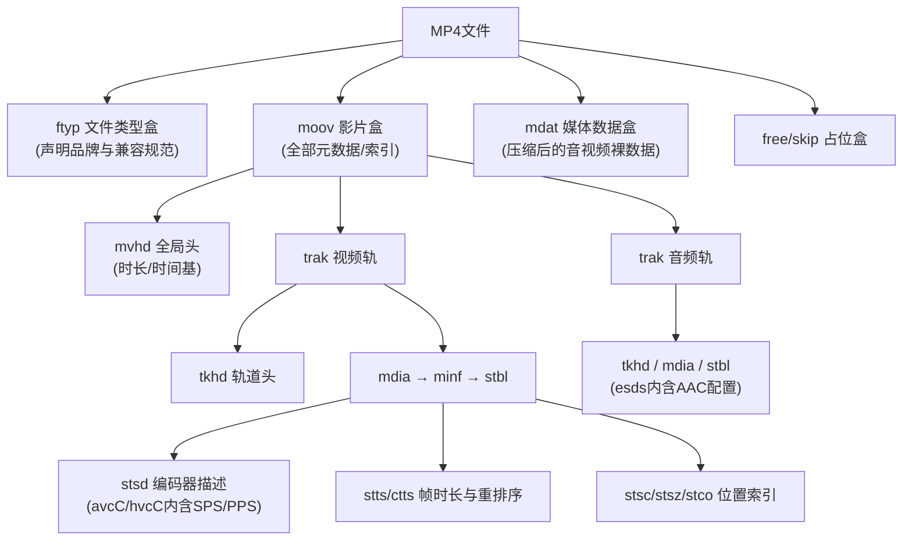

# MP4文件格式与其中的视频压缩方法
**MP4（MPEG-4 Part 14，ISO/IEC 14496-14）本身是一种容器格式而非压缩算法**，它基于ISO基础媒体文件格式（ISO BMFF，ISO/IEC 14496-12）构建，与苹果QuickTime的.mov同源，负责把编码后的视频流（通常是H.264、H.265或AV1）、音频流（通常是AAC）、字幕、章节等打包为单一文件，并附带完整的"装箱单"元数据告诉播放器如何定位、解码和同步这些内容；至于采用何种压缩方案，由moov中每个trak的编码器描述（如avc1、hvc1、av01）决定。
## 一、MP4的容器结构：层层嵌套的Box
ISO BMFF的设计哲学是"一切皆为Box（早期QuickTime术语称Atom）"。每个Box由固定的头部+可变负载构成：4字节大端序size（含自身头部，size=1时启用随后的8字节largesize字段处理>4GB超大Box，size=0表示延续到文件末尾）、4字节类型FourCC（如ftyp、moov、mdat），负载既可以是原始数据也可以是更多嵌套子Box，形成树状结构；解析器遇到不认识的Box可直接按size跳过，保证了良好的前向兼容性。
一个标准MP4文件的骨架由三大顶级Box构成：

**ftyp是"身份证"**：必须出现在文件最开头，声明主品牌（如isom、mp42、avc1）与兼容品牌列表，播放器据此判断能否解析。
**moov是"大脑"**：所有播放所需的元数据都在这里，内部嵌套结构为moov → mvhd（全局时长、timescale时间基）→ trak（每条媒体轨道一个，视频/音频/字幕各自独立）→ tkhd（轨道头）→ mdia（媒体信息）→ minf → stbl（样本表）。
**mdat是"仓库"**：存放压缩后的音视频帧二进制数据，通常体积最大。mdat内部数据不具备自描述性，必须依赖moov的样本表才能定位。
moov与mdat的顺序对流媒体至关重要：普通下载文件常为ftyp-mdat-mdat顺序（moov在尾部），但播放器必须先拿到moov才能播放，网络边下边播场景下需通过"faststart"将moov前置为ftyp-moov-mdat，这也是"视频缓冲很久才开播"时首先应检查的问题。
### 样本表：moov如何索引mdat
MP4的基本播放单位是**Sample（样本）**——对视频轨而言是一帧压缩图像，对音频轨而言是一段AAC编码包（典型为1024采样点）。多个Sample聚合为Chunk，交错分布于mdat中，使播放器顺序读取时能同时喂给视频和音频解码器。
定位第n个样本需联合四张样本表：stsc（sample-to-chunk，说明每个chunk含多少sample）、stco/co64（每个chunk在文件中的绝对字节偏移）、stsz（每个sample的字节长度）、stts（每个sample的解码时长）；播放器先由stsc找到sample所在chunk，再由stco定位chunk起点，累加前面stsz得到sample精确字节区间，同时累积stts得出其解码时间戳DTS。
stss（sync sample）列出可作为随机访问点的关键帧，用于seek；stsd则存放编码器类型及初始化配置——H.264轨道的stsd内嵌avcC子盒（含SPS/PPS），HEVC轨道内嵌hvcC（含VPS/SPS/PPS），AAC轨道内嵌esds（含AudioSpecificConfig）。
## 二、解码顺序与显示顺序：B帧重排序
这是MP4容器设计中最精妙的一环。由于现代编码器大量使用B帧（双向预测帧，同时参考前后帧），**帧在码流中的存储顺序（解码顺序DTS）与实际显示顺序（显示时间戳PTS）不一致**：编码器必须先编码B帧所依赖的后向参考帧，因此显示顺序为I₀ B₁ B₂ P₃的帧序列，在mdat中实际存储为I₀ P₃ B₁ B₂。
MP4通过stts与ctts两张表配合处理这一重排序：stts记录每个sample的解码时长，播放器累积得出DTS；ctts记录composition offset（PTS−DTS偏移），播放器将DTS加上该偏移得到PTS，再按PTS排序输出，画面才恢复正常显示顺序。ctts盒存在的根本原因正是B帧乱序解码。
音画同步则由各轨道独立的timescale（时间基，如视频24000、音频44100）加统一时间戳体系保证，mvhd定义全局时间基，各track的mdhd定义本轨时间基，播放器将两条流的时间戳归一到同一时间轴对齐播放。
## 三、MP4中使用的视频压缩方法
MP4容器本身不限定编解码器，但实际使用中三大主流标准占据绝对主导地位。所有现代视频编码器都遵循"预测→变换→量化→熵编码→环路滤波"的混合编码框架，区别在于各环节的工具箱规模与精细程度。
### 三大主流编码器的技术演进
**H.264/AVC（2003年）**采用16×16宏块的混合编码框架：帧内预测对亮度分量提供4×4块9种模式、16×16块4种模式；帧间预测支持可变块划分（16×16至4×4共7种模式）、1/4像素精度运动矢量、多参考帧（最多32帧）；残差经4×4整数DCT变换（避免浮点误差）与量化后，用CAVLC或CABAC熵编码；并首次引入环路去块滤波器消除块效应。其分层设计将视频编码层（VCL）与网络抽象层（NAL）分离，码流结构网络友好，这是它能在IP网络上普及的关键。
**H.265/HEVC（2013年）**在同等画质下码率较H.264降低约50%，代价是编码复杂度提升5–10倍。其核心改进：用最大64×64的编码树单元（CTU）取代固定16×16宏块，CTU按四叉树递归分割为64×64至8×8的编码单元（CU），平坦区域用大块、细节区域用小块，大幅减少高分辨率内容的块数量；帧内预测模式从9种扩展到35种（33种角度+DC+Planar）；帧间预测引入Merge模式（直接继承邻块运动矢量）与AMVP高级运动矢量预测；环路滤波在去块滤波基础上增加SAO（采样自适应偏移）进一步抑制振铃。
**AV1（2018年，开放媒体联盟AOMedia制定，免版税）**在VP9/HEVC思路上进一步强化各环节：超级块最大128×128（HEVC为64×64）；帧内角度预测模式达56种，并提供调色板预测、色度亮度相关预测（CfL）、块内复制等工具；帧间预测支持最多7参考帧复合预测、扭曲/全局运动补偿、OBMC（重叠块运动补偿）；变换支持DCT、ADST（非对称离散正弦）、恒等变换等多种选择；环路滤波三重叠加——去块、CDEF（方向性约束增强滤波）、环路恢复滤波。AV1还内置胶片颗粒合成，可在解码端重建编码时剥离的噪点以保留电影质感。
### 编码器技术对比
| 特性 | H.264/AVC | H.265/HEVC | AV1 |
|---|---|---|---|
| 发布年份 | 2003 | 2013 | 2018 |
| 最大编码块 | 16×16宏块 | 64×64 CTU | 128×128超级块 |
| 帧内预测模式 | 9种 | 35种（33角度+DC+Planar） | 56种角度+调色板+CfL |
| 运动补偿精度 | 1/4像素，多参考帧 | 1/4亮度/1/8色度，Merge/AMVP | 复合预测、扭曲运动、OBMC |
| 变换类型 | 4×4/8×8整数DCT | 4×4至32×32整数DCT | DCT/ADST/恒等多种可选 |
| 熵编码 | CAVLC/CABAC | CABAC | 多符号自适应算术编码 |
| 环路滤波 | 去块滤波 | 去块+SAO | 去块+CDEF+环路恢复 |
| 同画质码率（相对MPEG-2基准） | ~1/2–1/3 | ~1/4（比H.264再省50%） | ~1/8以上（比HEVC再省约30%） |
| 授权费用 | 需付MPEG LA许可 | 复杂，含HEVC Advance | 完全免版税 |
| 典型应用 | 蓝光、流媒体、监控、视频会议 | 4K流媒体、UHD蓝光、HEIF照片 | YouTube、Netflix 4K、Web流媒体 |
（数据综合自各标准技术文档与编码器实测。）
早期MP4文件也大量采用MPEG-4 Part 2（即DivX/XviD所属标准），它基于DCT+运动补偿，是H.264之前的主流方案；但效率远低于H.264，如今已基本退场。
## 四、MP4如何存储编码器参数：avcC与NAL单元
H.264/H.265的原始码流由一串NAL单元构成，SPS（序列参数集，含分辨率、档次、级别等）、PPS（图像参数集）与图像片数据统一封装。在MP4中，SPS/PPS被从码流中提取出来，存放在moov轨道的stsd→avcC（AVC配置盒）或hvcC（HEVC配置盒）中，而mdat只存放图像片数据；同时将原始码流的起始码前缀（Annex B格式的0x000001）替换为4字节长度前缀（长度由avcC的lengthSizeMinusOne字段指定，通常为4）。解码器初始化时先从avcC读取SPS/PPS配置解码器，再按长度前缀切分mdat中的NAL单元进行解码。
这种参数集与数据分离的设计，使解码器无需扫描整个文件即可获取配置，也避免了Annex B起始码在二进制流中的歧义问题。
## 五、fMP4：面向流媒体的碎片化扩展
标准MP4将全部索引集中在一个moov中，适合下载后播放，但无法用于直播——moov不可能索引尚未产生的数据。**碎片化MP4（fMP4）**将内容切分为一系列独立可解码的片段，每段由一对moof（影片片段盒，含本段sample数量、时长、偏移）+ mdat（本段媒体数据）组成，播放器收到一段即可解码一段。
fMP4还引入一个独立的初始化段（init segment，仅含ftyp+只带全局配置不含样本数据的moov），播放器下载一次后即可复用于所有后续媒体段。这套结构正是DASH自适应流媒体的native格式，也是HLS自2016年后逐步从MPEG-TS切换到的格式；CMAF（通用媒体应用格式）是同时兼容DASH与HLS的fMP4统一规范，Netflix、YouTube、Disney+等主流流媒体平台均采用CMAF-fMP4分发内容。
用FFmpeg生成流媒体MP4时需使用`-movflags +frag_keyframe+empty_moov`，而非用于渐进下载的`+faststart`，两者面向不同场景。
## 六、MP4与AVI：为何MP4最终胜出
从容器能力看，MP4取代AVI是结构性的必然：AVI基于RIFF的简单块结构缺乏流媒体支持（索引固定在尾部、需下载完整个文件才能播放）、原生不支持VBR音频且易出现音画不同步、对B帧的重排序处理粗糙、有2GB文件大小限制需依赖OpenDML扩展；而MP4基于ISO BMFF的层次化Box结构支持元数据前置实现边下边播、通过ctts精确处理B帧重排序、通过stts/stts时间基体系保证任意轨道精确音画同步、原生支持fMP4碎片化直播与自适应码率切换、并通过stsd/avcC等机制原生承载H.264/H.265/AV1等现代编码器的参数集。
从编码器演进看，AVI时代的DivX/XviD（MPEG-4 Part 2）压缩效率远低于H.264，而MP4与H.264/HEVC/AV1的组合在同等画质下将码率进一步降低了一个数量级，这正是4K流媒体时代得以实现的技术基础。
---
综上，MP4之所以成为现代视频生态的通用容器，在于ISO BMFF的层次化Box结构提供了足够的灵活性去承载从下载到直播、从H.264到AV1的各类工作流；而其内部实际使用的视频压缩方法——无论是H.264的宏块混合编码、H.265的CTU四叉树、还是AV1的超级块与免版税开放路线——本质上都是在"预测去冗余、变换去相关性、量化去精度、熵编码去统计冗余"这一统一框架下的持续精细化，容器与编码器的分工协作共同构成了从二进制字节到流畅画面的完整技术链路。
