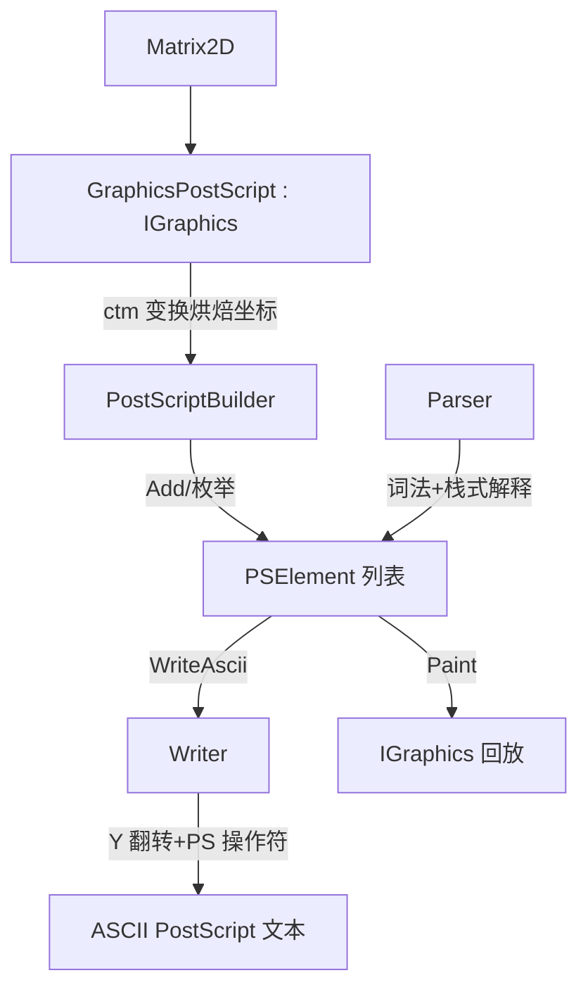

## 用户需求概述

重构 VB.NET 绘图模块中 `PostScript` 文件夹的代码，使其在 Linux 环境下生成与 GDI+ 视觉一致的 PostScript 文件，并将现有模块完善为可用的、与 `System.Drawing.Graphics` 体验兼容的绘图后端。

## 核心功能

1. **完善 PostScript 文件生成逻辑**：修正底层 `Writer` 的操作符输出（坐标 Y 轴翻转、矩形填充/描边、圆弧、圆、多边形填充等），修正 `BuildString` 文件头畸形格式字符串并补齐 `showpage`。
2. **补全 GraphicsPostScript 未实现方法**：实现 `DrawEllipse/FillEllipse`、`DrawBezier/DrawBeziers`、`DrawCurve`（张力/分段重载）、`DrawImage` 系列、`DrawImageUnscaled` 系列、`DrawPath/FillPath`、`DrawPie`、`FillClosedCurve` 等；审查并修正现有绘制方法（如布局翻转、类型误用）的错误。
3. **实现仿射变换**：在 GraphicsPostScript 中通过内置跨平台仿射矩阵实现 `RotateTransform/ScaleTransform/TranslateTransform/ResetTransform`，将变换烘焙进元素坐标，与 `Paint(IGraphics)` 回放保持一致（裁剪/IsVisible/GetStringPath 暂略）。
4. **实现通用 ASCII PostScript 解析器**：用词法分析 + 栈式解释器解析任意 ASCII PostScript 图形子集，重建为 `PSElement`（Line/Poly/Circle/Arc/Pie/Rectangle/Text/ImageData）列表。
5. **代码审查与逻辑修正**：修正 `Polygon.GetSize` 计算恒为 0、`SpatialLookup` 负坐标哈希 `CUInt` 溢出、透明度 `gs` 误写等逻辑错误。

## 技术栈

- 语言/框架：VB.NET，多目标框架 `net10.0` 与 `net10.0-windows`（需保证两种配置均可编译）。
- 依赖（已有，复用不新增）：`Microsoft.VisualBasic.Core`（IGraphics/Interface 抽象）、`mime/text%html`（Stroke/CSSFont/CSSEnvirnment）、`Drawing2D.Shapes`（Box/Circle/Line）。
- 无新增第三方库；解析器与变换矩阵均自实现以保证跨平台（Linux netcore 无 `System.Drawing.Drawing2D.Matrix`）。

## 实现方案

### 1. 坐标系修正（核心布局错误）

PostScript 原点在左下、Y 轴向上；GDI+ 原点在左上、Y 轴向下。方案：在 `Writer` 中保存画布高度 `canvasHeight`，提供 `Yf(y)=canvasHeight-y` 并对所有几何坐标（`moveto/lineto/line/circle/rectangle/text/image`）在做 Y 翻转；文字因不依赖缩放变换而保持正立。变换矩阵（GraphicsPostScript 层）与 Y 翻转处于不同阶段、相互正交、可叠加。

### 2. Writer 重构

- 修正 `rectangle(rect, fillColor As String, border As Stroke)`：仅当 `fillColor` 非空时 `closepath fill`；仅当 `border` 非空时 `closepath stroke`（删除末尾无条件 `closepath stroke` 的 bug）。`Rectangle.WriteAscii` 改为传颜色字符串与 `Stroke` 而非 `Boolean`。
- `Arc.WriteAscii`：舍弃语义错误的 `arct`（圆角算子），改为按 GDI+ 椭圆参数采样为折线（`moveto`+`lineto`+`stroke`），自动经 Y 翻转。
- `Circle/Polygon/Pie` 的 `WriteAscii`：基于 `newpath ... arc/closepath fill [stroke]` 实现填充与描边（用 `gsave/grestore` 分离填充与描边）。
- 新增/修正操作符：`gsave/grestore`、`translate/rotate/scale`、`setmatrix`、`curveto`、`setgray`；修正 `beginTransparent` 中误写的 `gs`（应 `gsave`）。

### 3. GraphicsPostScript 几何方法补全

- `DrawEllipse`→`Elements.Arc(start=0,sweep=360)`；`FillEllipse`→`Elements.Pie(fill,0,360)`。
- `DrawBezier/DrawBeziers`→三次贝塞尔采样为 `Elements.Poly`（折线）。
- `DrawCurve` 张力/分段重载→基数样条采样为 `Elements.Poly`。
- `DrawImage/Unscaled/UnscaledAndClipped`→`Elements.ImageData`（Image 转 `DataURI` base64，按目标矩形缩放）。
- `DrawPath/FillPath`→`GraphicsPath.Flatten` 取点 → `Poly`/`Polygon`。
- `DrawPie`→`Elements.Pie(fill=Nothing,stroke=pen)`；`FillClosedCurve`→闭合样条采样 → `Polygon(fill)`。
- 修正 `Rectangle.WriteAscii` 颜色字符串误传入 `Boolean` 形参问题。

### 4. 仿射变换（内置 Matrix2D）

新增 `PostScript/Matrix2D.vb`（轻量 2D 仿射矩阵：a,b,c,d,e,f），提供 `TransformPoint`、`Multiply`、`Rotate/Scale/Translate/Reset`。GraphicsPostScript 维护 `ctm`，各 Draw 方法在构造元素前对点/矩形做 `ctm` 变换（Y 翻转由 Writer 处理）。`Paint(IGraphics)` 回放路径同步应用同一 `ctm`，保证一致。

### 5. 通用 PostScript 解析器

`Parser.Load` 实现：词法扫描（空白、`()` 字符串、`<<>>` 字典、`{}` 过程、`%` 注释）+ 操作数栈 + 图形状态（当前点、路径、颜色、线宽、字体）+ 过程 `def` 展开。识别 `newpath/moveto/lineto/curveto/arc/arcn/closepath/stroke/fill/show/setrgbcolor/setlinewidth/setfont/findfont/scalefont/gsave/grestore/translate/rotate/scale/image/rectfill/rectstroke` 以及本模块 `rectangle/circle/line/text/arct` 助手，遇绘制算子时按当前路径重建 `PSElement`。从 DSC `%%BoundingBox` 解析画布尺寸。明确范围限制：支持常见 2D 绘制子集，不实现完整 PS 控制流。

### 6. 逻辑审查修正

- `Polygon.GetSize`：用 `points` 实际坐标计算包围盒宽高（当前空列表导致恒为 0）。
- `SpatialHashing`：负坐标 `CUInt` 溢出 → 改用 `CInt` 钳制或平移偏移避免下溢。

## 实现要点

- 复用现有 `fprintf`/`CSSEnvirnment.GetPen`/`GetFont` 与 `Shapes` 模式，不破坏 SVG/GDI 等 driver。
- `Writer` 构造增加 `size` 参数以感知画布高度做 Y 翻转；`BuildString` 同步传入。
- 性能：解析器按行流式读取，元素数量线性；采样点数取合理默认值（弧 64、贝塞尔 32、样条按段），避免过密。
- 向后兼容：保留 `PSElement` 抽象契约；`PsComment` 行为不变。

## 架构设计



现有元素继承链 `PSElement` / `PSElement(Of Shape)` 保持不变，新增 `Matrix2D` 为独立工具类型。

## 目录结构

```
PostScript/
├── Matrix2D.vb            # [NEW] 跨平台 2D 仿射矩阵，提供点变换与 Rotate/Scale/Translate/Reset/Multiply
├── Writer.vb              # [MODIFY] 增加 size(画布高度)参数做 Y 翻转；修正 rectangle/arc 逻辑；新增 gsave/grestore/translate/rotate/scale/curveto/setgray；修正 beginTransparent 的 gs
├── PostScriptBuilder.vb   # [MODIFY] BuildString 修正头部畸形格式串、补 showpage、向 Writer 传入 size
├── GraphicsPostScript.vb  # [MODIFY] 实现几何绘制方法与 Rotate/Scale/Translate/ResetTransform（ctm 烘焙）；审查并修正现有方法
├── Parser.vb              # [MODIFY] 实现通用 ASCII PS 词法扫描+栈式解释器，Load 返回 PSElement 列表
├── PSElement.vb           # [MODIFY] 按需补充元素契约（如 Pie 增加 stroke 属性）
├── SpatialLookup.vb       # [MODIFY] 修正负坐标 CUInt 哈希溢出
└── PSElements/
    ├── Arc.vb             # [MODIFY] 重写 Arc.WriteAscii 采样为折线；实现 Pie.WriteAscii（填充+描边）
    ├── Circle.vb          # [MODIFY] 实现 Circle.WriteAscii（填充+描边）
    ├── Poly.vb            # [MODIFY] 实现 Polygon.WriteAscii；修正 Polygon.GetSize 包围盒计算
    ├── Rectangle.vb       # [MODIFY] WriteAscii 修正为传颜色字符串+Stroke（非 Boolean）
    ├── Text.vb            # [MODIFY] 处理 rotation（按 Y 翻转取负以保持 GDI+ 朝向）
    └── Line.vb            # [MODIFY] 修正透明度 beginTransparent 的 gs→gsave
```