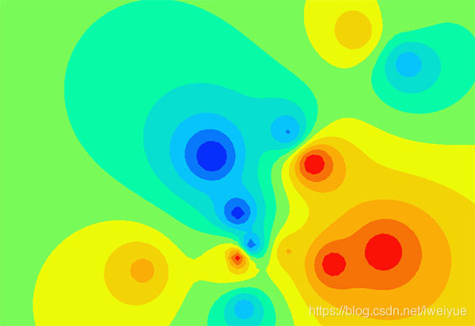
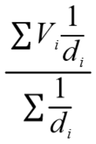
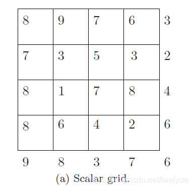
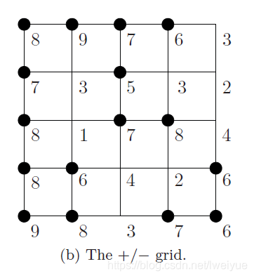
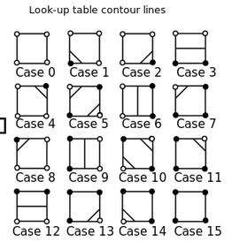

# 绘制等高线图的算法
> https://blog.csdn.net/lweiyue/article/details/91490460

假设我们在一个矩形范围内，有一些离散的高度数据，形如(x,y,height)这样的数据集，然后我们要得到一张这样的等高线图：



我们描述一下生成等高线图的算法。

## 一、图形概述

实际地图上实用的单位是米，但我们显示时使用的单位是像素，这里面有一个转换的关系。而且，显示的图形有可能需要缩放。所以我们收集的数据，x和y统一使用相对值。我们把总长和总宽都定为1，实际的坐标相对于单位1来定。例如地图长8km，然后我们的坐标点x为1km，那么x就是``1/8=0.125``。

实际上，等高线图是分成一个一个网格的，我所使用的网格大小是10*10。每个网格里的线和颜色组成了整张的等高线图。

## 二、插值

我们的数据都是形如(x,y,height)这样的格式，如``(0.85f, 0.05f, 0.49f)``、``(0.75f, 0.1f, 0.7f)``、``(0.5f, 0.65f, 0.04f)``。

假如我们要显示的图形大小是800*600，切成网格后，就会有80*60=4800个网格。一般情况下，我们收集到的数据量远远小于这个数，所以我们就需要插值。

我们用比较简单的距离反比策略进行插值。我们知道，跟某个点的距离越近，受它的影响就越大。所以，跟点V(x1,y1)相距d的点P(x,y)，它受V的影响可按以下公式计算：

```
P-V=V/d
```

其中``d=(x-x1)^2+(y-y1)^2``

而P的最终值，由平面上所有已知值的点确定。



代码如下：

```c
double D = 0;
double DV = 0;

foreach (IntMeasureData imd in measure_data)
{
    double d = 1.0 / ((imd.X - i) * (imd.X - i) + (imd.Y - j) * (imd.Y - j));
    D += d;
    DV += imd.Z * d;
}

value = (float)(DV / D);
```

## 三、Marching squares算法

这就是生成等高线图的一种算法，我们来描述一下。

我们上面提到过，把800*600的图切成了80*60个网格，而在第二步里面，我们把这些网格都填满数据了。我们假设数据如下：



图中的数据就是高度。我们现在要画一条高度值为5的线。我们把5跟表格中的数据比较，比5大的为1，用实心黑点表示，比5小的为0，化为一个二值的表格，如下图所示：



然后如果我们把每个格子取出来，就会发现有以下的16种情况：



只要我们把上图的线画出来，就会拼出一张等高线图。

## 四、算法细节

+ 问题1，我们可能需要的是有颜色的图，而不是只有线条的图。
  我们只要把上图中格子里的线和实心黑点围成的区域填充颜色即可。

+ 问题2，不同的高度值，如何绘图。
  先画低阈值的，再画高阈值的，一层层往上叠即可。

+ 问题3，有没有办法把所有格子的线条围成一个区域，然后对这个区域进行一次性颜色的填充。
  如果有，就不会用这种分成一格一格的方法去做了。只能一格一格地填充颜色。