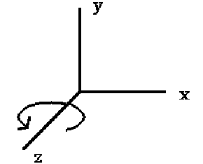
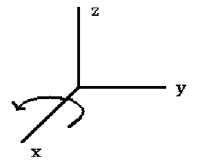
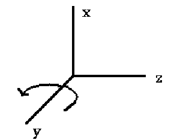

> https://www.siggraph.org/education/materials/HyperGraph/modeling/mod_tran/3drota.htm


# 3D Rotation

3D Rotation is more complicated than 2D rotation since we must specify an axis of rotation. In 2D the axis of rotation is always perpendicular to the **x,y** plane, i.e., the Z axis, but in 3D the axis of rotation can have any spatial orientation. We will first look at rotation around the three principle axes **(X, Y, Z)** and then about an arbitrary axis. Note that for Inverse Rotation: **replace q with -q and then R(R-1) = 1**

> 1. Z-Axis Rotation
> 2. X-Axis Rotation
> 3. Y-Axis Rotation
> 4. Rotation about an Arbitrary Axis

# Z-Axis Rotation

Z-axis rotation is identical to the 2D case:


```
x' = x*cos q - y*sin q
y' = x*sin q + y*cos q
z' = z

         | cos q  sin q  0  0|
Rz (q) = |-sin q  cos q  0  0|
         |     0      0  1  0|
         |     0      0  0  1|
```

# X-Axis Rotation

X-axis rotation looks like Z-axis rotation if replace:

> X axis with Y axis
> Y axis with Z axis
> Z axis with X axis



So we do the same replacement in the equations:
```
y' = y*cos(q) - z*sin(q)
z' = y*sin(q) + z*cos(q)
x' = x

        |1      0       0   0|
Rx(q) = |0  cos(q)  sin(q)  0|
        |0 -sin(q)  cos(q)  0|
        |0      0       0   1|
```

# Y-Axis Rotation

Y-axis rotation looks like Z-axis rotation if replace:

> X axis with Z axis
> Y axis with X axis
> Z axis with Y axis



So we do the same replacement in equations :

```
z' = z*cos(q) - x*sin(q)
x' = z*sin(q) + x*cos(q)
y' = y

        |cos(q)  0  -sin(q)  0|
Ry(q) = |    0   1       0   0|
        |sin(q)  0   cos(q)  0|
        |    0   0       0   1|
```

# Rotation about an Arbitrary Axis

This is similar to 2D rotation about an arbitrary point. The general procedure is as follows:

1. Perform transformations which align rotation axis with one of coordinate axis **(x, y, z)**
2. Perform rotation about the axis
3. Do inverse of (1)

Special case: The rotation axis is parallel to a principle coordinate axis. This is directly analogous to the 2D case of rotation about a point. The steps are:

1. Translate rotation axis to coordinate axis
2. Perform rotation
3. Do inverse translation


In the general case, rotation about an arbitrary axis is more complicated. First we must define **the axis of Rotation by 2 points - P1, P2** then do the following:

1. Translate so that rotation axis passes through origin.
2. Rotate so that the rotation axis is aligned with one of the principle coordinate axes.
3. Perform rotation of object about coordinate axis.
4. Perform inverse rotation of 2.
5. Perform iInverse translation of 1.

We will arbitrarily choose the Z axis to map the rotation axis onto. The rotation axis is defined by 2 points: **P1(x1,y1,z1) and P2(x2,y2,z2.)**. These 2 points define a vector:

> V = (x2 - x1 , y2 - y1 , z2 - z1) = (dx, dy, dz)

which has a unit vector

> **U = V \* |V|** where |V| is the length of **V = (VxV) = (dx^2 + dy^2 + dz^2)^1/2**

Now **U = (a,b,c)** where

> a = dx/|V|
> b = dy/|V|
> c = dz/|V| (these are called the direction cosines of x, y, and z)

(Note: the direction cosine of **x = cos A** where **A = angle** of V with respect to x axis)

Now we can perform the first translation (of the rotation axis to pass through the origin) by using the matrix **T (-x1, -y1, -z 1)**, i.e., move the point P1 to the origin. Next we want to rotate to align V with Z axis. We do this in 2 steps:

1. Rotate V about X axis to put V in XZ plane.
2. Rotate V about Y to align with Z.

For rotation about X axis we need to find **cos(A), sin(A) where A = angle** between projection of U (in YZ plane) and Z axis.
Note: **U'** is no longer a unit vector, i.e.

> |U'| =/ 1
> Uz = unit vector along z axis = (0,0,1)

now

> (U)' \* (Uz ) = |U'| \* |Uz| cos A = d \* cos A
> |Uz| = (1)1/2 = 1
> (U')(Uz) = 0 \* 0 + b \* 0 + c \* 1 = c

therefore **c = d \* (cos A) => cos A = c/d**

Now the cross product of 2 vectors

> (V1) X (V2) = W |V| \* |V2|sin(q) where W is perpendicular to plane of V1, V2

so

```
(U') X (Uz) = Ux|U'| * |Uz|sin(A) = Ux d * sin(A)

           |0   0    0    0|
So Rx(a) = |0   c/d  b/a  0|
           |0  -b/a  c/a  0|
           |0   0    0    1|
```
**Rx(a) --> Rotates U into XZ plane**

Now compute ``Ry(B)`` for rotation to z-axis.

After rotation about x-axis the vector is as below:

> ``Uy" = 0`` since in XZ plane
> ``Uz" = d = |U'|`` since just rotated U' into XZ plane

again from dot product:

```
cos(B) = U" * (Uz) / |U"|
|Uz|   = 0 * a + 0 * 0 + 1 * d = d
```

Note: **|U"|\*|Uz| = 1** since both are unit vectors from the cross product **U" x Uz = Uz|U"||Uz|sin B(from matrix) = Uy x (-a)**
therefore **sin(B) = - a**
```
        | d  0  a  0|
Ry(B) = | 0  1  0  0|
        |-a  0  d  0|
        | 0  0  0  1|
```
The result of this transformation is that V (= Rotation axis) is coincident with z axis.

Then apply
```
        | cos(q) sin(q)  0  0|
Rz(q) = |-sin(q) cos(q)  0  0|
        |     0      0   1  0|
        |     0      0   0  1|
```

Then we must apply inverse transformations to get R.A. back to original position. Therefore, the complete composite transformation matrix is as follows:

```
R(q) = T * Rx(A) * Ry(B) * Rz(q) * RY-1(B) * Rx-1(A) * T-1
n1 = a(x)
n2 = b(y)
n3 = c(z)

[R] =
Row1    n12 + (1 - n12)cosq         n1n2(1 - cosq) + n3sinq     n1n3(1 - cosq) - n2sinq    0
Row2	n1n2(1 - cosq) - n3sinq     n22 + (1 - n22)cosq         n2n3(1 - cosq) + n1sinq    0
Row3	n1n3(1 - cosq) + n2sinq     n2n3(1 - cosq) - n1sinq     n32 + (1 - n32)cosq        0
Row4	0                           0                           0                          1
```
