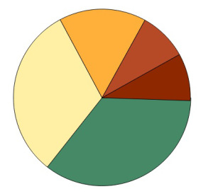
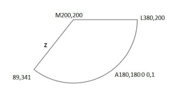
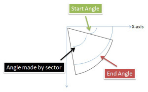

## Creating a SVG Pie Chart-HTML5

> http://www.cnblogs.com/vivianma/p/3678619.html

To create a simple pie chart kind of structure in SVG(Scalable Vector Graphics) Based on values given in an array. So if the array has five values in it then the pie chart will have five slice,here is how it looks,



### Calculating angles swiped by each slice

the values are supplied by an array

```javascript
var pieData = [113,100,50,28,27];
```

Each value will cover some angle in the circular space. as we know the circular space is a complete 360 degrees. So the first value in the array e.e113 will cover ``(113*360)/(113+100+50+28+27)`` which is approximately 128 degrees. So simiarly by looping the array you can calculate the angles swiped by each value and store them in a new array for later use.

### The Approach

The critical part is to generate a circular arc (a pie slice in this case) in SVG. For that  I am using the SVG path element.  SVG path has an option for generating elliptical arcs and that is what we need. I will not go into the details of the SVG shape elements and paths. You can have a look at them here. The important part is to determine the data string that needs to be defined for the SVG path.

```javascript
var dataString = "M200,200  L380,200  A180,180 0 0,1 89,341 z";
var arc = paper.path(dataString);
```

Here dataString is holding a string value which might baffle you. Quickly going over it lets see what each term means.

**Mx,y - Move to**: move your pencil or drawing point to x,y position in the co-ordinate space. Remember no line is drawn.

**Lx,y - Line to**: draw a straight line till x,y. So your line will be drawn from the co-ordinates you specified with Move to.

**Arx,ry  x-axis-rotation large-arch-flag,sweepflag  x,y - Arc to**: Draws an elliptical arch from the current point to the point x,y. rx and ry are the elliptical radius in x and y direction. The x-rotation determines how much the arch is to be rotated around the x-axis. It only seems to have an effect when rx and ry have different values. The large-arch-flag doesn't seem to be used (can be either 0 or 1). Neither value (0 or 1) changes the arch.  The sweep-flag determines the direction to draw the arch in, it can be either 0 or 1. I have used 1 which means clockwise direction. 0 is for anticlockwise rotation.

**z**: Closes the path. A line is drawn from the last point to the first.

I have specified the values in the data string. My drawing starts from x=200 and y=200, so this will be the center point. From there I am drawing a line to a point in the circumference of the circle (138,369) which we will calculate. 180,180 specified with A means that my arc will be a part of a circular ellipse of x-radius = 180 and y-radius=180. 89,341 is the point till which the arc will be drawn. Again we will calculate it. And then z closes the path. See the figure for an understanding.



### Start Angle, End Angle, Finding points on the circumference of the circle

Now, how to calculate the coordinates on the circumference, the points that the arc will be drawn with (380,200 to 89,341). A little bit of trigonometry will help us here. Since I am using clockwise direction to draw the arcs so I am considering all the angles from the x-axis. Lets look at the equations below,

```javascript
x1 = 200 + 180*Math.cos(Math.PI*startAngle/180); //for eg. 380
y1 = 200 + 180*Math.sin(Math.PI*startAngle/180); //for eg. 200

x2 = 200 + 180*Math.cos(Math.PI*endAngle/180); //for eg. 89
y2 = 200 + 180*Math.sin(Math.PI*endAngle/180); //for eg. 341
```

One thing to note is that cos and sin takes angles in radians. Till now we have calculated the angles in degrees. So wee need to convert this to radians. You can do it this way,

```javascript
angle in radians = Math.PI*(your angle in degrees)/180
```

To calculate points of the circumaference I have used trigonometric equations for a point on a circle which is pretty straight,

```javascript
x = rx + radius * cos(theta) and y = ry + radius * sin(theta)
```

where rx is the x-coordinate of center and ry is the y-coordinate of the center of the circle. As you can see the x1,y1 and x2,y2 points follow this pattern. To calculate startAngle and endAngle I have used these equations,

```javascript
startAngle = 0;
endAngle = startAngle + angleSwipedByASlice;
```

To start with my startAngle is zero since I am starting to draw from the x-axis. And then calculate the endAngle by adding the start angle and the angle swiped by that arc or slice. These equations are used inside a loop so I am adding the previous angle to get new value of angle. The figure will make things clear.



###### Full code

```html
<!DOCTYPE html>
<html xmlns="http://www.w3.org/1999/xhtml">
<head>
    <title>Simple SVG Pie Chart</title>
    <script type="text/javascript" src="js/raphael-min.js"></script>
    <script type="text/javascript">
        var paper;
        var arc;
        var colorArr = ["#468966","#FFF0A5","#FFB03B","#B64926","#8E2800"];
        var pieData = [113,100,50,28,27];
        var sectorAngleArr = [];
        var total = 0;
        var startAngle = 0;
        var endAngle = 0;
        var x1,x2,y1,y2 = 0;
 
        function init(){
            paper = Raphael("holder");
            //CALCULATE THE TOTAL
            for(var k=0; k < pieData.length; k++){
                total += pieData[k];
            }
            //CALCULATE THE ANGLES THAT EACH SECTOR SWIPES AND STORE IN AN ARRAY
            for(var i=0; i < pieData.length; i++){
                var angle = Math.ceil(360 * pieData[i]/total);
                sectorAngleArr.push(angle);
            }
            drawArcs();
        }

        function drawArcs(){
            for(var i=0; i <sectorAngleArr.length; i++){
                startAngle = endAngle;
                endAngle = startAngle + sectorAngleArr[i];

                x1 = parseInt(200 + 180*Math.cos(Math.PI*startAngle/180));
                y1 = parseInt(200 + 180*Math.sin(Math.PI*startAngle/180));

                x2 = parseInt(200 + 180*Math.cos(Math.PI*endAngle/180));
                y2 = parseInt(200 + 180*Math.sin(Math.PI*endAngle/180));

                var d = "M200,200  L" + x1 + "," + y1 + "  A180,180 0 0,1 " + x2 + "," + y2 + " z"; //1 means clockwise
                alert(d);
                arc = paper.path(d);
                arc.attr("fill",colorArr[i]);
            }
        }
    </script>
</head>
<body onload="init();">
    <div id="holder" style="width:600px; height:400px;">
    </div>
</body>
</html>
```

###### Add ons

You can make this simple chart into something much more interactive...

1. You can add interactivity to the chart, say on clicking a pie slice it shows some relevant data.
2. You can use the code to generate some cool dashboard kind of application
3. You can use animations as well to move out the slice clicked on.

In fact Raphael has methods for all these. You can try it out.
Hope it helps...
