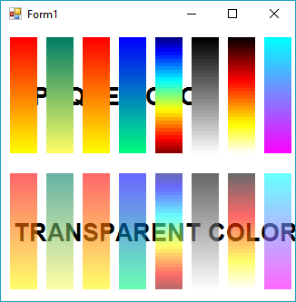
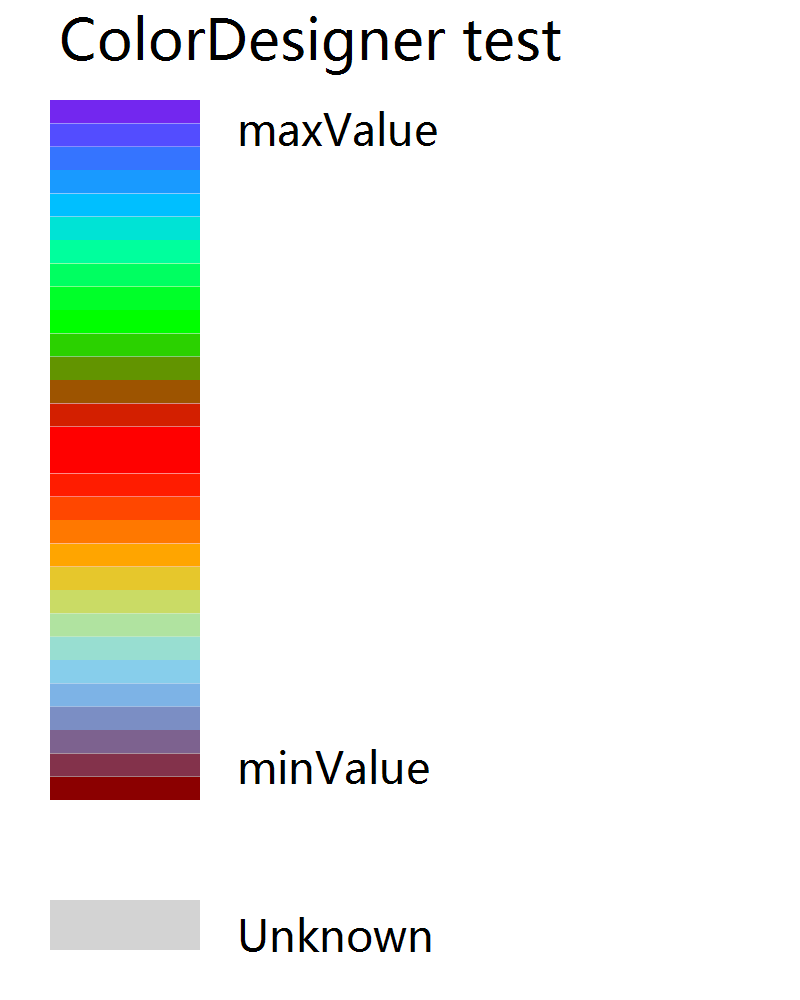
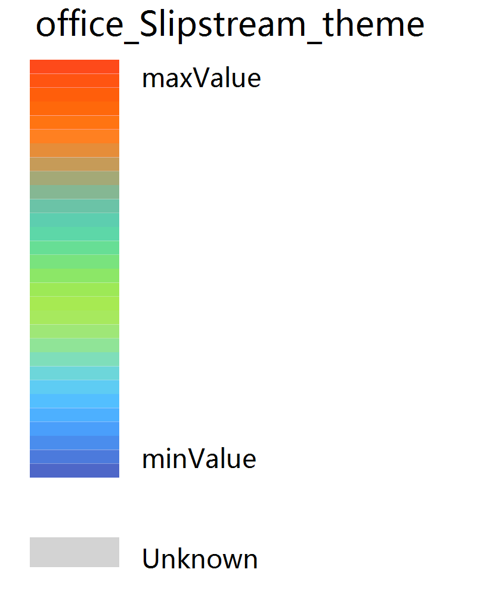
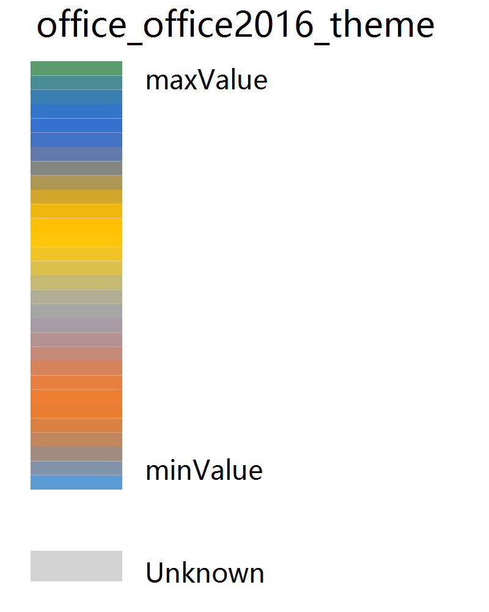
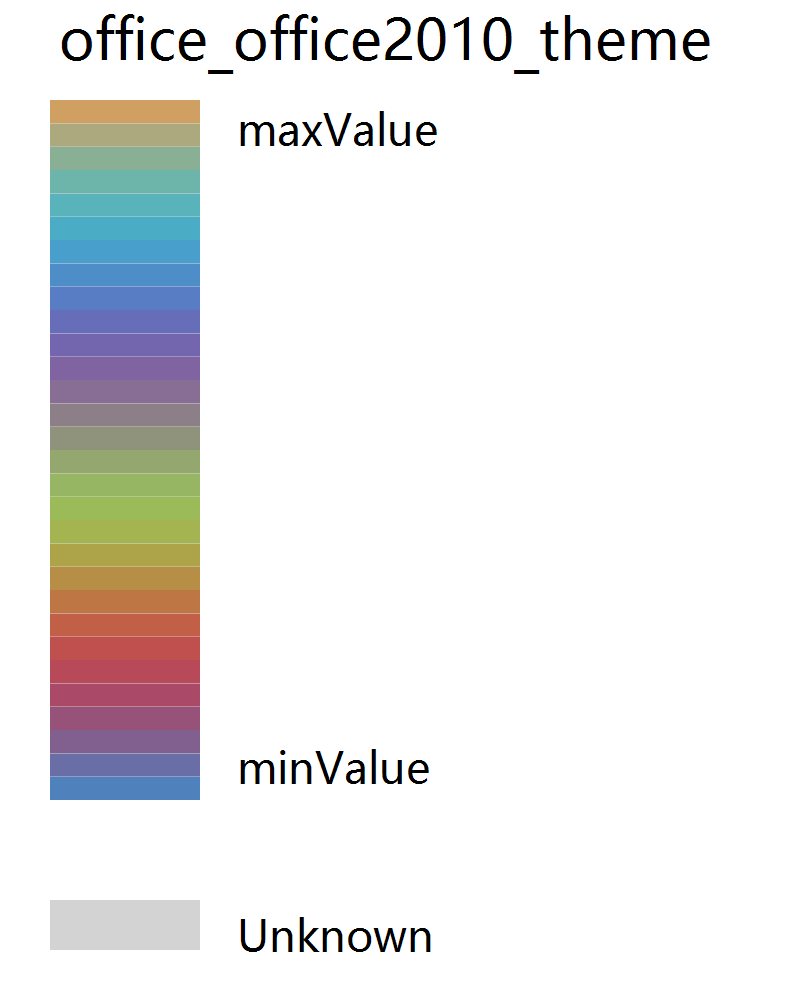

# VB.NET Graphics Artist


### Internal Build in ColorMaps

+ **[Microsoft.VisualBasic.Imaging.ColorMap](../Microsoft.VisualBasic.Architecture.Framework/Extensions/Image/ColorMap.vb)**
+ **[Microsoft.VisualBasic.Imaging.ColorMap](../Microsoft.VisualBasic.Architecture.Framework/Extensions/Image/)**.**[ColorMapsExtensions](../Microsoft.VisualBasic.Architecture.Framework/Extensions/Image/ColorMap.vb)**.``ColorSequence(Microsoft.VisualBasic.Imaging.ColorMapsExtensions.MapsFunc, Microsoft.VisualBasic.Imaging.ColorMap, Integer) As System.Drawing.Color()``

> 

From left to right, the map names are:

```vbnet
Public Const PatternSpring As String = "Spring"
Public Const PatternSummer As String = "Summer"
Public Const PatternAutumn As String = "Autumn"
Public Const PatternWinter As String = "Winter"
Public Const PatternJet As String = "Jet"
Public Const PatternGray As String = "Gray"
Public Const PatternHot As String = "Hot"
Public Const PatternCool As String = "Cool"
```

###### Usage

```vbnet
Imports Microsoft.VisualBasic.Imaging

Dim maps As New ColorMap(mapLevels)
Dim clSequence As Color() = ColorSequence(maps.GetMaps("Jet"), maps).Reverse.ToArray
```

### Color Designer

```vbnet
Imports System.Drawing
Imports Microsoft.VisualBasic.Imaging
Imports Microsoft.VisualBasic.Imaging.Drawing2D.Colors

Dim colors As Color() = {
    Color.DarkRed,
    Color.SkyBlue,
    Color.Orange,
    Color.Red,
    Color.Lime,
    Color.DeepSkyBlue,
    Color.DarkViolet
}

colors = Designer _
    .CubicSpline(colors, 30)
Call Legends.ColorMapLegend(
    colors, "ColorDesigner test", "minValue", "maxValue", bg:="white") _
    .SaveAs("./colordesigner.test.png")
```

> 

```vbnet
colors = OfficeColorThemes _
    .GetAccentColors("Slipstream") _
    .CubicSpline(30)
Call Legends.ColorMapLegend(
    colors, "office_Slipstream_theme", "minValue", "maxValue", bg:="white") _
    .SaveAs("./officeSlipstream_theme.test.png")
```
> 

```vbnet
colors = OfficeColorThemes _
    .GetAccentColors("office2016") _
    .CubicSpline(30)
Call Legends.ColorMapLegend(
    colors, "office_office2016_theme", "minValue", "maxValue", bg:="white") _
    .SaveAs("./office2016_theme.test.png")
```
> 

```vbnet
colors = OfficeColorThemes _
    .GetAccentColors("office2010") _
    .CubicSpline(30)
Call Legends.ColorMapLegend(
    colors, "office_office2010_theme", "minValue", "maxValue", bg:="white") _
    .SaveAs("./office2010_theme.test.png")
```
> 
