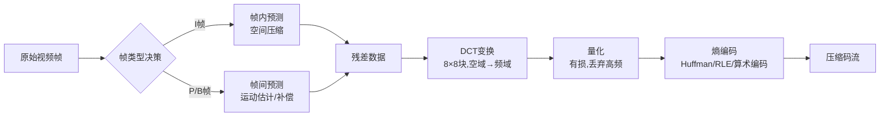

# AVI视频文件中的数据压缩算法
**AVI（Audio Video Interleave）本身是一种容器格式而非压缩算法**，它由微软于1992年随Windows推出、基于RIFF文件结构，将音频流与视频流交错封装；至于采用何种压缩方案，完全取决于文件头中通过FourCC四字符码所指定的编解码器。换句话说，同一个`.avi`扩展名背后可能封装着从完全不压缩的RGB裸数据、仅帧内压缩的Motion-JPEG，到具备完整帧间预测的MPEG-4 Part 2等截然不同的压缩算法。
## 一、AVI容器与编解码器的协作机制
AVI文件由一系列RIFF块构成：`LIST "hdrl"`存放全局与流信息，`strh`/`strf`块中的FourCC字段（如DIVX、XVID、MJPG、CVID）告诉播放器应加载哪个解码器；所有压缩后的帧数据放在`LIST "movi"`块中，视频帧标记为`00dc`、音频块为`01wb`，两者交错排列；可选的`idx1`块提供帧偏移索引以便快速定位与拖动播放。FourCC机制源自微软的Video for Windows框架，是AVI专属的编解码器标识体系——MP4、MKV等现代容器使用的是各自的编解码器标记方式。
## 二、视频压缩的通用技术原理
无论采用哪种编解码器，绝大多数视频压缩算法都围绕三类冗余展开：**空间冗余**（单帧内部相邻像素相似）、**时间冗余**（相邻帧内容相似）与**统计冗余**（量化后数据分布不均）。典型的有损视频编码遵循"预测→变换→量化→熵编码"的流水线结构。

### 帧内压缩：去除空间冗余
帧内压缩只处理单独一帧，原理与静态图像压缩（如JPEG）一致。
**色彩空间转换与子采样**：先将RGB转为YCbCr（亮度+色度），利用人眼对亮度敏感、对色度迟钝的视觉特性，对色度通道做4:2:0或4:2:2子采样，从源头减少约一半数据量。
**分块与帧内预测**：把画面划分为8×8（JPEG/MJPEG）或16×16宏块（MPEG系列），在块内利用左侧和上方已编码像素进行方向性预测（水平、垂直、对角、均值等模式），只存储实际像素值与预测值之间的残差。
**DCT离散余弦变换**：对每个残差块做二维DCT，将空域像素值转换为频域系数。变换后能量集中于左上角的少量低频系数，高频系数大多接近零，这为后续量化丢弃创造了条件。
**量化**：这是压缩流程中最主要的有损环节。用量化表（或量化步长）除以DCT系数并取整，步长越大，越多高频系数被截断为零，文件越小但细节损失越多；量化表的设计依据人眼对不同空间频率的敏感度差异。
**熵编码**：量化后的系数先经Zig-Zag扫描把零值聚拢到一起，再用游程编码（RLE）合并连续零、用哈夫曼编码给高频符号短码、低频符号长码，或采用效率更高的算术编码，在不损失任何信息的前提下进一步压低码率。
### 帧间压缩：去除时间冗余
帧间压缩利用相邻帧画面的高度相似性，是视频区别于静态图像压缩的核心所在。
**I/P/B帧结构**：I帧（关键帧）独立完整编码，是随机访问与错误恢复的基准；P帧只参考前一个I/P帧，记录运动矢量与残差，压缩率高于I帧；B帧可同时参考前后帧做双向预测，压缩率最高，但需要编码缓冲、引入延迟。
**运动估计与运动补偿**：编码器将当前帧划分为宏块，在参考帧中搜索最相似的块，计算位移得到运动矢量。解码时只需把参考块"搬移"到新位置再叠加残差即可重建画面；运动矢量远小于像素块本身，因此能大幅节省码率。对静止区域（如背景）可整体跳过不编码，解码器直接复用上一帧对应内容。
## 三、AVI中常见编解码器的对比
不同编码器在压缩策略、帧结构与应用场景上差异显著，这正是"AVI文件大小差异巨大"的根本原因——同样时长的视频，未压缩可能是几百MB，用DivX压可能只有几十MB。
| 编码器 | FourCC | 压缩原理 | 压缩类型 | 帧结构 | 典型压缩比（量级） | 典型场景 |
|---|---|---|---|---|---|---|
| 未压缩RGB | 0x00000000 | 裸像素数据 | 无 | — | 1:1 | 视频采集暂存、后期编辑中间格式 |
| Microsoft Video 1 | CRAM/MSVC | 调色板量化+简单帧内压缩 | 有损 | 帧内为主 | ~10:1 | 早期256色时代，画质差已淘汰 |
| Cinepak | CVID | 矢量量化（VQ），基于码本查表 | 有损 | 帧内+条件补充 | 20-30:1 | 早期CD-ROM游戏与过场动画（Sega CD、3DO） |
| Indeo 3/4/5 | IV31-IV50 | DCT/混合小波变换 | 有损 | 帧内为主 | 10-25:1 | 90年代Intel平台的软件视频播放 |
| Motion-JPEG | MJPG | 每帧独立JPEG（DCT+量化+Huffman） | 有损 | 仅帧内 | 20-50:1 | 数码摄像机、非线性编辑、早期IP监控 |
| DivX / XviD | DIVX/XVID/DX50 | MPEG-4 Part 2（DCT+运动补偿+熵编码） | 有损 | 帧内+帧间 | 100-500:1 | 早期网络电影分发、DVDRIP |
| HuffYUV | HFYU | 帧内预测+Huffman | 无损 | 仅帧内 | ~2:1 | 高质量编辑中间格式 |
| Lagarith | LAGS | 中值预测+RLE+算术编码 | 无损 | 仅帧内（含空帧） | 2-3:1 | Windows平台编辑与存档 |
| DV | dvsd | 帧内DCT+固定量化 | 有损 | 仅帧内 | ~5:1 | 民用/专业数码摄像机 |
（压缩比为量级参考，实际数值取决于画面内容、分辨率、码率与编码参数。）
**MJPEG**将每一帧当作独立的静态图像按JPEG标准压缩，完全不使用帧间预测。其优点是任意帧可独立解码、支持精确到帧的编辑且对网络丢包不敏感；缺点是压缩效率较低，主要用于早期IP监控摄像头、数码相机短片录制与非线性编辑系统。
**DivX/XviD**基于MPEG-4 Part 2标准，是AVI容器历史上最主流的网络分发编码器，充分利用I/P/B帧的帧间预测与运动补偿，在可接受画质下把一部DVD电影压进一两张CD。
**Cinepak**采用独特的矢量量化而非DCT：为每个4×4像素块在预生成的码本中查找最匹配的向量索引，解码时只需查表，因此能在25MHz的Motorola 68030等极慢CPU上流畅播放，代价是低码率下块状伪影明显，这在当年Sega CD等FMV游戏过场动画中广受诟病。
**HuffYUV、Lagarith**等无损编码器服务于专业编辑流程：先做像素级预测（如中值预测）产生小差值流，再经Huffman或算术编码无损压缩，解码结果与原始帧逐比特一致，用于避免多代转码造成画质损失，是VirtualDub等工具时代的主流中间格式。
## 四、AVI的局限与现状
AVI的RIFF设计过于简单：索引固定在文件尾部导致流式播放困难、原生不支持变比特率VBR音频、B帧的显示顺序与存储顺序不一致容易引发音画不同步、2GB文件大小限制需依赖OpenDML扩展突破，且缺乏HDR、10bit色深、字幕轨等现代特性。
这些结构性短板加上H.264/H.265/AV1等更高效编码标准与MP4/MKV等现代容器的普及，使AVI在流媒体与内容分发领域已基本退场；但它作为纯本地采集、老素材归档与Windows平台兼容格式仍有一定存在价值。理解AVI背后的压缩算法组合，也就理解了视频编码从"每帧独立压缩"到"跨帧预测+变换+量化+熵编码"的完整技术演进脉络。
