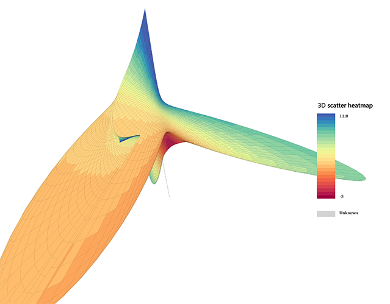
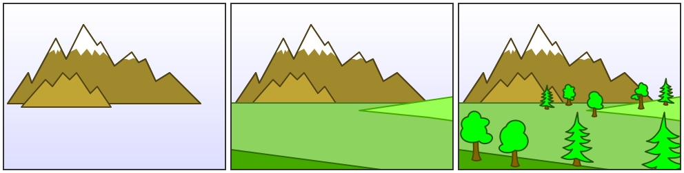
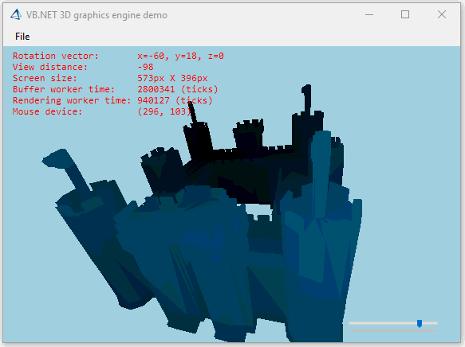

# Build My Own 3D graphics engine step by step

Install ``sciBASIC#`` framework via nuget package

```python
# https://www.nuget.org/packages/sciBASIC#
# For .NET Framework 4.6:
PM> Install-Package sciBASIC -Pre
```

And then reference to these dll files:

+ Microsoft.VisualBasic.Architecture.Framework_v3.0_22.0.76.201\__8da45dcd8060cc9a.dll
+ Microsoft.VisualBasic.Imaging.dll
+ Microsoft.VisualBasic.Imaging.Drawing3D.Landscape.dll
+ Microsoft.VisualBasic.Mathematical.dll
+ Microsoft.VisualBasic.MIME.Markup.dll

## Background &amp; Introduction

All of the Mathematical Sciences library/environment, like the GNU plot, matlab, R, scipy, have their own 3D engine for the scientific data 3D plots. In my recent work required of the 3D scatter plot for visualize my experiment data, and my ``sciBASIC#`` library didn't have its own 3D graphic engine yet. so that I decided create my own 3D graphic engine for my experiment data plots. For search on the Google and wiki, I found all the necessary algorithm for the 3D graphic and implemented this 3D engine based on the gdi+ graphic technics successfully.


Although this gdi+ based 3D graphic engine have the performance problem when the model is too complicated and have a lot of 3D surface to draw, but it is enough for the 3D plots for the scientific computing. For example, using this 3D graphic engine works perfectly for generate this 3D function plot:



**In this article I want to introduce how to build my own 3D graphic engine from ZERO step by step**, and in this article I want to mainly introduce the 3D graphic algorithm and the **3mf** 3D model format that can help you to using for implement your own 3D graphic engine in the future.

## The 3D graphics algorithm

### The 3D graphic object models

First of all, I want to introduce the 2 important object that I use in my own 3D graphic engine.

#### Point3D

```vbnet
<XmlType("vertex")> Public Structure Point3D
    Implements PointF3D

    Public Sub New(x As Single, y As Single, Optional z As Single = 0)
        Me.X = x
        Me.Y = y
        Me.Z = z
    End Sub

    Public Sub New(Position As Point)
        Call Me.New(Position.X, Position.Y)
    End Sub

    <XmlAttribute("x")> Public Property X As Single Implements PointF3D.X
    <XmlAttribute("y")> Public Property Y As Single Implements PointF3D.Y
    <XmlAttribute("z")> Public Property Z As Single Implements PointF3D.Z

    Public Overrides Function ToString() As String
        Return Me.GetJson
    End Function
End Structure
```

#### Surface

```vbnet
''' <summary>
''' Object model that using for the 3D graphics.
''' (进行实际3D绘图操作的对象模型)
''' </summary>
Public Structure Surface
    Implements IEnumerable(Of Point3D)
    Implements I3DModel

    ''' <summary>
    ''' Vertix in this list have the necessary element orders
    ''' for construct a correct closed figure.
    ''' (请注意，在这里面的点都是有先后顺序分别的)
    ''' </summary>
    Public vertices() As Point3D
    ''' <summary>
    ''' Drawing texture material of this surface.
    ''' </summary>
    Public brush As Brush

    Sub New(v As Point3D(), b As Brush)
        brush = b
        vertices = v
    End Sub
End Structure
```

And based on these two important data structure, then we are able to apply the 3D algorithm in this 3D graphic engine. And here is the 3D graphic algorithm that I implemented in this article:

+ 3D rotation
+ 3D to 2D projection
+ The painter algorithm
+ The light source algorithm

### The 3D rotation


3D Rotation is more complicated than 2D rotation since we must specify an axis of rotation. In 2D the axis of rotation is always perpendicular to the **x,y** plane, i.e., the Z axis, but in 3D the axis of rotation can have any spatial orientation. We will first look at rotation around the three principle axes **(X, Y, Z)** and then about an arbitrary axis. Note that for Inverse Rotation: **replace q with -q and then R(R-1) = 1**

#### Z-Axis Rotation

Z-axis rotation is identical to the 2D case:

```vbnet
' x' = x*cos q - y*sin q
' y' = x*sin q + y*cos q
' z' = z
'
'          | cos q  sin q  0  0|
' Rz (q) = |-sin q  cos q  0  0|
'          |     0      0  1  0|
'          |     0      0  0  1|

Public Function RotateZ(angle As Single) As Point3D
    Dim rad As Single, cosa As Single, sina As Single, Xn As Single, Yn As Single

    rad = angle * Math.PI / 180
    cosa = Math.Cos(rad)
    sina = Math.Sin(rad)
    Xn = Me.X * cosa - Me.Y * sina
    Yn = Me.X * sina + Me.Y * cosa
    Return New Point3D(Xn, Yn, Me.Z)
End Function
```

#### X-Axis Rotation

X-axis rotation looks like Z-axis rotation if replace:

+ X axis with Y axis
+ Y axis with Z axis
+ Z axis with X axis

So we do the same replacement in the equations:
```vbnet
' y' = y*cos(q) - z*sin(q)
' z' = y*sin(q) + z*cos(q)
' x' = x
'
'         |1      0       0   0|
' Rx(q) = |0  cos(q)  sin(q)  0|
'         |0 -sin(q)  cos(q)  0|
'         |0      0       0   1|

Public Function RotateX(angle As Single) As Point3D
    Dim rad As Single, cosa As Single, sina As Single, yn As Single, zn As Single

    rad = angle * Math.PI / 180
    cosa = Math.Cos(rad)
    sina = Math.Sin(rad)
    yn = Me.Y * cosa - Me.Z * sina
    zn = Me.Y * sina + Me.Z * cosa
    Return New Point3D(Me.X, yn, zn)
End Function
```

#### Y-Axis Rotation

Y-axis rotation looks like Z-axis rotation if replace:

+ X axis with Z axis
+ Y axis with X axis
+ Z axis with Y axis

So we do the same replacement in equations :

```vbnet
' z' = z*cos(q) - x*sin(q)
' x' = z*sin(q) + x*cos(q)
' y' = y
'
'         |cos(q)  0  -sin(q)  0|
' Ry(q) = |    0   1       0   0|
'         |sin(q)  0   cos(q)  0|
'         |    0   0       0   1|

Public Function RotateY(angle As Single) As Point3D
    Dim rad As Single, cosa As Single, sina As Single, Xn As Single, Zn As Single

    rad = angle * Math.PI / 180
    cosa = Math.Cos(rad)
    sina = Math.Sin(rad)
    Zn = Me.Z * cosa - Me.X * sina
    Xn = Me.Z * sina + Me.X * cosa

    Return New Point3D(Xn, Me.Y, Zn)
End Function
```

### The 3D projection

> https://en.wikipedia.org/wiki/3D_projection

To project the 3D point a<sub>x</sub>, a<sub>y</sub>, a<sub>z</sub> onto the 2D point b<sub>x</sub>, b<sub>y</sub> using an orthographic projection parallel to the y axis (profile view), the following equations can be used:

+ b<sub>x</sub> = s<sub>x</sub> \* a<sub>x</sub> + c<sub>x</sub>
+ b<sub>y</sub> = s<sub>z</sub> \* a<sub>z</sub> + c<sub>z</sub>

where the vector ``s`` is an arbitrary scale factor, and ``c`` is an arbitrary offset. These constants are optional, and can be used to properly align the viewport.

```vbnet
''' <summary>
''' Project the 3D point to the 2D screen.
''' </summary>
''' <param name="x!"></param>
''' <param name="y!"></param>
''' <param name="z!">Using for the painter algorithm.</param>
''' <param name="viewWidth%"></param>
''' <param name="viewHeight%"></param>
''' <param name="fov%"></param>
''' <param name="viewDistance%">
''' View distance to the model from the view window.
''' </param>
Public Sub Project(ByRef x!, ByRef y!, z!,
                   viewWidth%,
                   viewHeight%,
                   viewDistance%,
                   Optional fov% = 256)

    Dim factor! = fov / (viewDistance + z)

    ' 2D point result (x, y)
    x = x * factor + viewWidth / 2
    y = y * factor + viewHeight / 2
End Sub
```

### The painter algorithm

The painter's algorithm, also known as a priority fill, is one of the simplest solutions to the visibility problem in 3D computer graphics. When projecting a 3D scene onto a 2D plane, it is necessary at some point to decide which polygons are visible, and which are hidden.

The name "painter's algorithm" refers to the technique employed by many painters of painting distant parts of a scene before parts which are nearer thereby covering some areas of distant parts. The painter's algorithm sorts all the polygons in a scene by their depth and then paints them in this order, farthest to closest. It will paint over the parts that are normally not visible — thus solving the visibility problem — at the cost of having painted invisible areas of distant objects. The ordering used by the algorithm is called a 'depth order', and does not have to respect the numerical distances to the parts of the scene: the essential property of this ordering is, rather, that if one object obscures part of another then the first object is painted after the object that it obscures. Thus, a valid ordering can be described as a topological ordering of a directed acyclic graph representing occlusions between objects.



One simple method to implements this painter algorithm is using the ``z-order`` method

> https://en.wikipedia.org/wiki/Z-order

```vbnet
''' <summary>
''' ``PAINTERS ALGORITHM`` kernel
''' </summary>
''' <typeparam name="T"></typeparam>
''' <param name="source"></param>
''' <param name="z">计算出z轴的平均数据</param>
''' <returns></returns>
<Extension>
Public Function OrderProvider(Of T)(source As IEnumerable(Of T), z As Func(Of T, Double)) As List(Of Integer)
    Dim order As New List(Of Integer)
    Dim avgZ As New List(Of Double)

    ' Compute the average Z value of each face.
    For Each i As SeqValue(Of T) In source.SeqIterator
        Call avgZ.Add(z(+i))
        Call order.Add(i)
    Next

    Dim iMax%, tmp#

    ' Next we sort the faces in descending order based on the Z value.
    ' The objective is to draw distant faces first. This is called
    ' the PAINTERS ALGORITHM. So, the visible faces will hide the invisible ones.
    ' The sorting algorithm used is the SELECTION SORT.
    For i% = 0 To avgZ.Count - 1
        iMax = i

        For j = i + 1 To avgZ.Count - 1
            If avgZ(j) > avgZ(iMax) Then
                iMax = j
            End If
        Next

        If iMax <> i Then
            tmp = avgZ(i)
            avgZ(i) = avgZ(iMax)
            avgZ(iMax) = tmp

            tmp = order(i)
            order(i) = order(iMax)
            order(iMax) = tmp
        End If
    Next

    Call order.Reverse()

    Return order
End Function
```

### The display device

I have create a winform control for display the 3d model which is avaliable in namespace ``Microsoft.VisualBasic.Imaging.Drawing3D.Device.GDIDevice``. Here is a simple code example of using this 3D model display control in winform:

```vbnet
Dim project As Vendor_3mf.Project = Vendor_3mf.IO.Open(file.FileName)
Dim surfaces As Surface() = project.GetSurfaces(True)
Dim canvas As New GDIDevice With {
    .bg = Color.LightBlue,
    .Model = Function() surfaces,
    .Dock = DockStyle.Fill,
    .LightIllumination = True,
    .AutoRotation = True,
    .ShowDebugger = True
}

Call Controls.Add(canvas)
Call canvas.Run()
```

This 3D model display control is based on the gdi+ graphic engine, so that if the model is too complicated and have a lot of surface to draw, then this control rendering will be very slow. For improvements on the graphics rendering performance as possible as it can, I using 2 worker thread for the 3D graphic display:

+ Model buffer thread
+ Graphic rendering thread

#### Buffer thread

```vbnet
Private Sub CreateBuffer()
    Dim now& = App.NanoTime

    With device._camera
        Dim surfaces As New List(Of Surface)

        For Each s As Surface In model()()
            surfaces += New Surface(.Rotate(s.vertices).ToArray, s.brush)
        Next

        If device.ShowHorizontalPanel Then
            surfaces += New Surface(
                .Rotate(__horizontalPanel.vertices).ToArray,
                __horizontalPanel.brush)
        End If

        buffer = .PainterBuffer(surfaces)

        If .angleX > 360 Then
            .angleX = 0
        End If
        If .angleY > 360 Then
            .angleY = 0
        End If
        If .angleZ > 360 Then
            .angleZ = 0
        End If

        Call device.RotationThread.Tick()
    End With

    debugger.BufferWorker = App.NanoTime - now
End Sub
```

This model buffer worker thread apply the 3D projection for all surface in the model and run the Z-order based painters' algorithm, and then creates the 2D polygon buffer for the rendering thread. Here is the definition of this 2D polygon buffer unit:

```vbnet
''' <summary>
''' The polygon buffer unit after the 3D to 2D projection and the z-order sorts.
''' (经过投影和排序操作之后的多边形图形缓存单元)
''' </summary>
Public Structure Polygon

    ''' <summary>
    ''' The 3D projection result buffer
    ''' </summary>
    Dim points As Point()
    ''' <summary>
    ''' Surface fill
    ''' </summary>
    Dim brush As Brush
End Structure
```

#### Graphics rendering

##### The light source

Aplly the light source on the 3D model can makes our graphic more natural, here is an example of apply the light effects:



One of the simple algorithm for apply the light source is darker the surface's color base on its Z-order depth, which this z-order depth can be obtain from the painter's algorithm:

```vbnet
''' <summary>
''' Makes the 3D graphic more natural.
''' </summary>
''' <param name="surfaces">
''' Polygon buffer.(经过投影和排序之后得到的多边形的缓存对象)
''' </param>
''' <returns></returns>
<Extension>
Public Function Illumination(surfaces As IEnumerable(Of Polygon)) As IEnumerable(Of Polygon)
    Dim array As Polygon() = surfaces.ToArray
    Dim steps! = 0.75! / array.Length
    Dim dark! = 1.0!

    ' 不能够打乱经过painter算法排序的结果，所以使用for循环
    For i As Integer = 0 To array.Length - 1
        With array(i)
            If TypeOf .brush Is SolidBrush Then
                Dim color As Color = DirectCast(.brush, SolidBrush).Color
                Dim points As Point() = .points

                color = color.Dark(dark)
                array(i) = New Polygon With {
                    .brush = New SolidBrush(color),
                    .points = points
                }
            End If
        End With

        dark -= steps
    Next

    Return array
End Function
```

##### The control rendering

And here is the rendering thread, which is triggerd by a refresh thread:

```vbnet
''' <summary>
''' Forces the Paint event to be called.
''' </summary>
''' <param name="sender"></param>
''' <param name="e"></param>
Private Sub _animationLoop_Tick(sender As Object, e As EventArgs) Handles _animationLoop.Tick
    Call Me.Invalidate()
    Call Me.___animationLoop()
End Sub
```

When the method of the winform control ``Me.Invalidate()`` have been invoked. Then this method call will force the control to refresh itself and raise the ``Control.Paint`` event, then we are able to do rendering job:

```vbnet
Private Sub RenderingThread(sender As Object, e As PaintEventArgs) Handles device.Paint
    Dim canvas As Graphics = e.Graphics
    Dim now& = App.NanoTime

    canvas.CompositingQuality = CompositingQuality.HighQuality
    canvas.InterpolationMode = InterpolationMode.HighQualityBilinear

    With device
        If Not buffer Is Nothing Then
            Call canvas.Clear(device.bg)
            Call canvas.BufferPainting(buffer, .drawPath, .LightIllumination)
        End If
        If Not .Plot Is Nothing Then
            Call .Plot()(canvas, ._camera)
        End If
        If device.ShowDebugger Then
            Call debugger.DrawInformation(canvas)
        End If
    End With

    debugger.RenderingWorker = App.NanoTime - now
End Sub
```

## 3mf format

Finally, we have all of the elements that can using for display the 3D graphic. For display a 3D graphic, we must put the model data into the display device control. And I use the **3mf** model file as my 3D engine input model data. Here is how I do for load the 3mf model data:

Open the 3mf model file and load the 3D model into the canvas control just using two simple function:

```vbnet
Imports Microsoft.VisualBasic.Imaging.Drawing3D.Landscape

Dim project As Vendor_3mf.Project = Vendor_3mf.IO.Open(file)
Dim surfaces As Surface() = project.GetSurfaces(True)
```


3MF is a new 3D printing format that will allow design applications to send full-fidelity 3D models to a mix of other applications, platforms, services and printers. The 3MF specification allows companies to focus on innovation, rather than on basic interoperability issues, and it is engineered to avoid the problems associated with other 3D file formats.


> http://www.3mf.io/what-is-3mf/

Due to the reason of 3MF is an XML-based data format designed for using additive manufacturing, so that we can easily load the model in the ``*.3mf`` file using xml de-serialization in VisualBasic, and the xml model for this serialization operation is avaliable in namespace: ``Microsoft.VisualBasic.Imaging.Drawing3D.Landscape.Vendor_3mf.XML``

```vbnet
Public Class Project

    ''' <summary>
    ''' ``*.3mf/Metadata/thumbnail.png``
    ''' </summary>
    ''' <returns></returns>
    Public Property Thumbnail As Image
    ''' <summary>
    ''' ``*.3mf/3D/3dmodel.model``
    ''' </summary>
    ''' <returns></returns>
    Public Property model As XmlModel3D

    Public Shared Function FromZipDirectory(dir$) As Project
        Return New Project With {
            .Thumbnail = $"{dir}/Metadata/thumbnail.png".LoadImage,
            .model = IO.Load3DModel(dir & "/3D/3dmodel.model")
        }
    End Function

    ''' <summary>
    ''' Get all of the 3D surface model data in this 3mf project.
    ''' </summary>
    ''' <param name="centraOffset"></param>
    ''' <returns></returns>
    Public Function GetSurfaces(Optional centraOffset As Boolean = False) As Surface()
        If model Is Nothing Then
            Return {}
        Else
            Dim out As Surface() = model.GetSurfaces.ToArray

            If centraOffset Then
                With out.Centra
                    out = .Offsets(out).ToArray
                End With
            End If

            Return out
        End If
    End Function
End Class
```