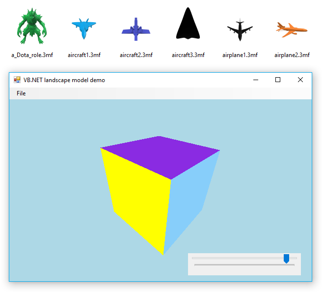

## Build My Own 3D graphics engine step by step

Although this gdi+ based 3D graphic engine have the problem when the , but it is enough for the 3D plots for the scientific computing.

### The 3D rotation
### The projection
### The painter algorithm

### 3mf format

### The display device
#### Buffer thread
#### Graphics rendering