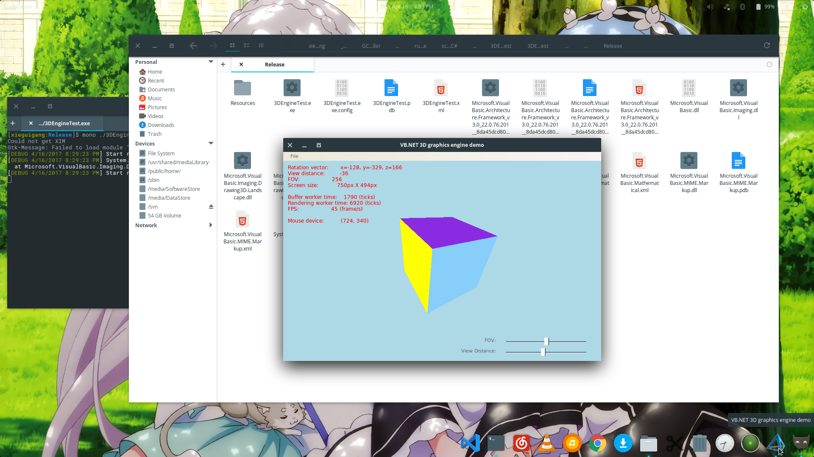
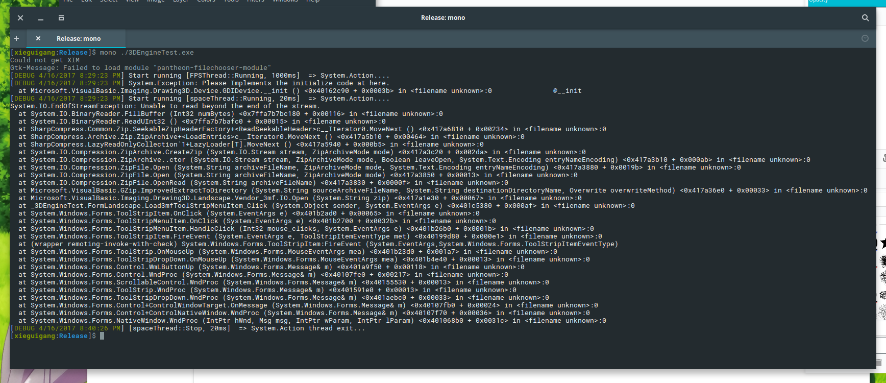
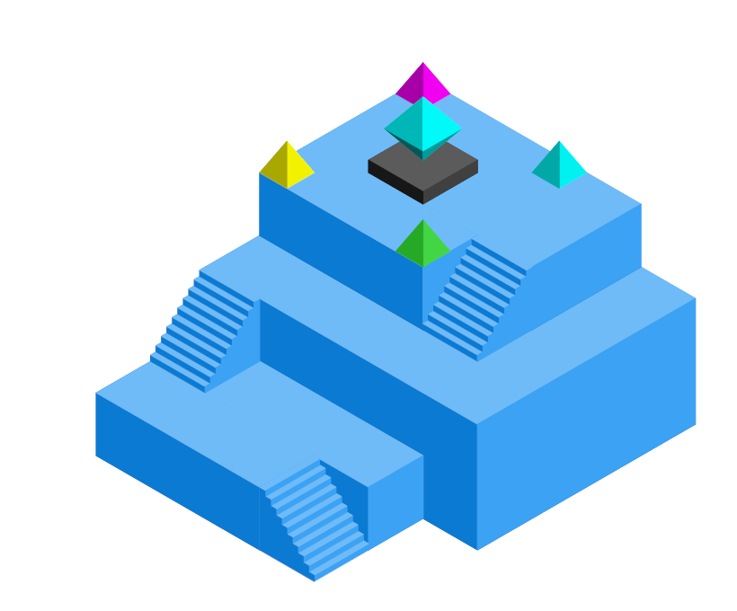
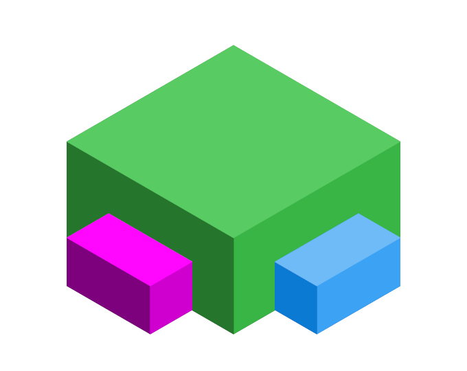
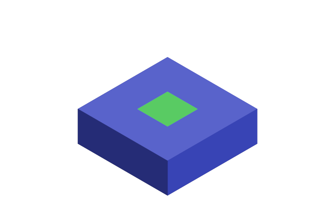
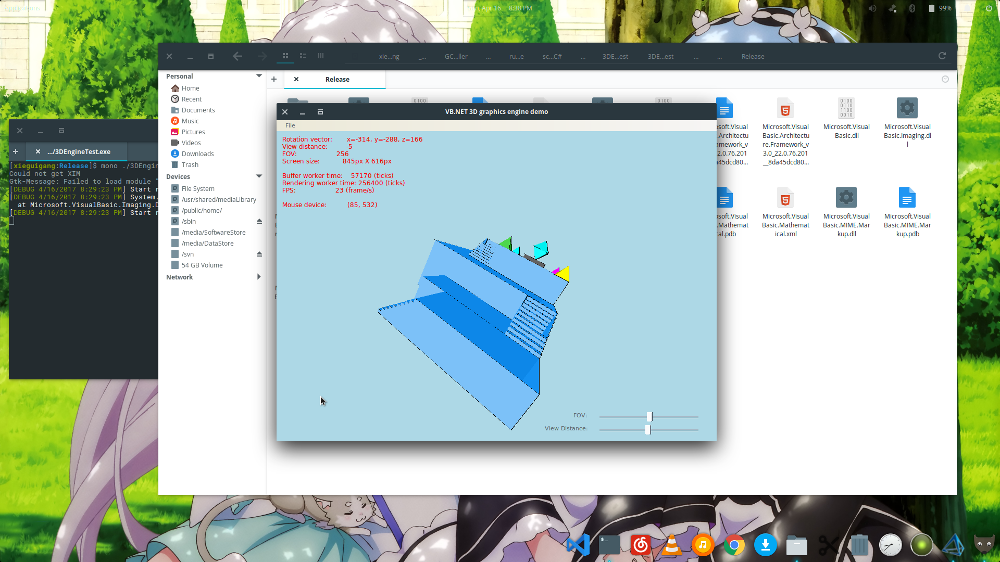

# Isometric 3D model Engine

You can install the latest sciBASIC environment from nuget:

```bash
# https://www.nuget.org/packages/sciBASIC#
PM> Install-Package sciBASIC -Pre
```


> Testing the VB.NET 3D graphics engine on the latest Ubuntu platform.

And I hope this post can help on your linux-Game Development.



> But unfortunatly, the zip library in mono runtime didn't works correctly on the linux platform, so that the 3mf 3D model can not be load by the 3D engine currently, and I'm try to find another engine like 3mf to provides the 3D graphics model. And then I found this isometrics engine in Java.

### Introduct Isometric

The Isometric graphics model is a 3D graphics generator on the Android platform. And you can download the original isometric code for Android in java language from github:

> https://github.com/FabianTerhorst/Isometric

By using the Isometric 3D graphics engine, then you can creates some ``Low Poly`` style 3D object model by using VisualBasic programming in some small code:



```vbnet
isometricView.Add(New Shapes.Prism(New Point3D(1, -1, 0), 4, 5, 2), Color.FromArgb(33, 150, 243))
isometricView.Add(New Shapes.Prism(New Point3D(0, 0, 0), 1, 4, 1), Color.FromArgb(33, 150, 243))
isometricView.Add(New Shapes.Prism(New Point3D(-1, 1, 0), 1, 3, 1), Color.FromArgb(33, 150, 243))
isometricView.Add(New Shapes.Stairs(New Point3D(-1, 0, 0), 10), Color.FromArgb(33, 150, 243))
isometricView.Add((New Shapes.Stairs(New Point3D(0, 3, 1), 10)).RotateZ(New Point3D(0.5, 3.5, 1), -Math.PI / 2), Color.FromArgb(33, 150, 243))
isometricView.Add(New Shapes.Prism(New Point3D(3, 0, 2), 2, 4, 1), Color.FromArgb(33, 150, 243))
isometricView.Add(New Shapes.Prism(New Point3D(2, 1, 2), 1, 3, 1), Color.FromArgb(33, 150, 243))
isometricView.Add((New Shapes.Stairs(New Point3D(2, 0, 2), 10)).RotateZ(New Point3D(2.5, 0.5, 0), -Math.PI / 2), Color.FromArgb(33, 150, 243))
isometricView.Add((New Shapes.Pyramid(New Point3D(2, 3, 3))).Scale(New Point3D(2, 4, 3), 0.5), Color.FromArgb(180, 180, 0))
isometricView.Add((New Shapes.Pyramid(New Point3D(4, 3, 3))).Scale(New Point3D(5, 4, 3), 0.5), Color.FromArgb(180, 0, 180))
isometricView.Add((New Shapes.Pyramid(New Point3D(4, 1, 3))).Scale(New Point3D(5, 1, 3), 0.5), Color.FromArgb(0, 180, 180))
isometricView.Add((New Shapes.Pyramid(New Point3D(2, 1, 3))).Scale(New Point3D(2, 1, 3), 0.5), Color.FromArgb(40, 180, 40))
isometricView.Add(New Shapes.Prism(New Point3D(3, 2, 3), 1, 1, 0.2), Color.FromArgb(50, 50, 50))
isometricView.Add((New Shapes.Octahedron(New Point3D(3, 2, 3.2))).RotateZ(New Point3D(3.5, 2.5, 0), angle), Color.FromArgb(0, 180, 180))
```



```vbnet
isometricView.Add(New Shapes.Prism(New Point3D(0, 0, 0), 4, 4, 2), GREEN)
isometricView.Add(New Shapes.Prism(New Point3D(-1, 1, 0), 1, 2, 1), PURPLE)
isometricView.Add(New Shapes.Prism(New Point3D(1, -1, 0), 2, 1, 1), Color.FromArgb(33, 150, 243))
```



```vbnet
isometricView.Add(New Shapes.Prism(Math3D.ORIGIN, 3, 3, 1), Color.FromArgb(50, 60, 160))
isometricView.Add(New Path3D({New Point3D(1, 1, 1), New Point3D(2, 1, 1), New Point3D(2, 2, 1), New Point3D(1, 2, 1)}), Color.FromArgb(50, 160, 60))
```

Here I have already add this isometric graphics supports into the sciBASIC environment, and the 
By click on the menu from: ``File -> Load Model -> Isometric *`` to view the demo isometric engine generated 3D model:



And this demo application running well on the Linux platform.

## Using the code & Demo

For using the code, you must reference to the dll module ``Microsoft.VisualBasic.Imaging.dll`` at first, and then imports the namespace:

```vbnet
Imports Microsoft.VisualBasic.Imaging
Imports Microsoft.VisualBasic.Imaging.Drawing3D
Imports Microsoft.VisualBasic.Imaging.Drawing3D.Models.Isometric
Imports IsometricView = Microsoft.VisualBasic.Imaging.Drawing3D.IsometricEngine
```

For creates an isometric graphic engine, using the code:

```vbnet
Dim view As New IsometricView
```

Using ``Add`` method to add your Path3D or Shape3D model:

```vbnet
' For example, create a simple cube model:
Call isometricView.Add(New Shapes.Prism(New Point3D(0, 0, 0)), Color.FromArgb(33, 150, 243))
```

And you can using this ``Add`` method to combine the basic 3D model to a very complex low poly style 3D model. At last, using ``Draw`` method for output the 3D model onto a canvas object, and here is an example for output the 3D graphics to a png image:

```vbnet
Sub measureAndScreenshotView(view As IsometricView,
                             width%,
                             height%,
                             <CallerMemberName> Optional name$ = Nothing)

    Using g As Graphics2D = New Size(width, height).CreateGDIDevice
        Call view.Draw(g)
        Call g.ImageResource.SaveAs($"./{name}.png")
    End Using
End Sub
```


This demo was build with VisualStudio 2017 and tested successfully on the latest mono + Ubuntu Linux platform.