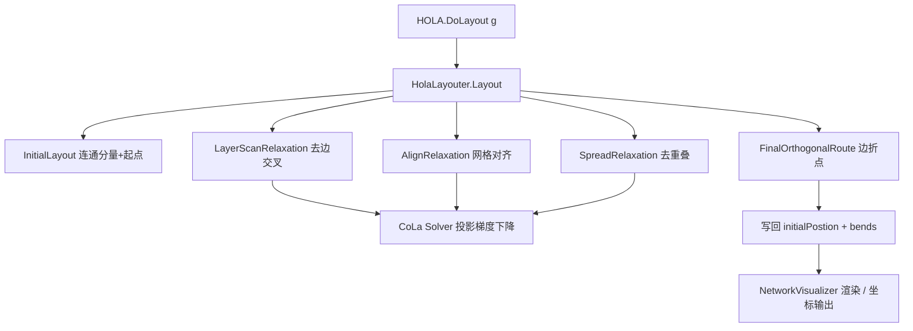

## 用户需求

依据工作区文档 `hola2015.md` 中对 HOLA（Human-like Orthogonal Layout Algorithm）网络布局算法的描述，在 `network_layout\HOLA` 文件夹中实现该算法，并在 `test\OrthogonalLayoutTest.vb` 测试项目中构建可运行的 demo 以查看结果。

## 产品概述

HOLA 是一套面向网络图的正交布局算法。它先基于节点初始坐标做低应力自由布局，再逐步正交化（分层扫描去边交叉、对齐松弛、扩散去重叠），最后生成轴对齐的正交连线路由，并把最终坐标写回 `NodeData.initialPostion` 供可视化渲染。

## 核心功能

- 从 `NetworkGraph` 读取节点与边，按连通分量分组布局
- 初始布局：基于节点当前 `initialPostion`（无则用网格/圆形初始化）作为起点
- 分层扫描松弛：逐层扫描用约束求解器消除边交叉（对齐 + 分离约束）
- 对齐松弛：将接近对齐的节点对强制对齐到网格（对齐约束）
- 扩散松弛：一维扫描排序 + 分离约束 + 投影，消除节点/边重叠
- 最终正交路由：将相邻节点连线生成为轴对齐正交折线，折点存入 `EdgeData.bends`
- 复用现有 CoLa 约束求解器（`network_layout\Cola\Models\Solver.vb`）实现投影梯度下降
- 写回坐标到 `initialPostion`，暴露 `HOLA.DoLayout(g)` 入口
- 测试 demo：在 `OrthogonalLayoutTest.vb` 中填充 `holaTest()`，既输出 PNG 渲染图（`NetworkVisualizer.DrawImage`）也打印节点坐标数据

## 技术栈选择

- 语言：VB.NET（与现有项目一致，`Option Strict On`）
- 工程：`network_layout`（RootNamespace = `Microsoft.VisualBasic.Data.visualize.Network.Layouts`，net10.0），新文件置于 `network_layout\HOLA\`
- 约束求解：复用现有 `Cola.Models.Solver` / `Variable` / `Block` / `Blocks`（同工程命名空间，直接 Imports 调用）
- 图形渲染：复用 `Datavisualization.Network` 的 `NetworkVisualizer.DrawImage` 输出 PNG
- 数据模型：复用 `NetworkGraph` / `Node` / `Edge` / `NodeData.initialPostion`（FDGVector2）/ `EdgeData.bends`（WayPointVector）

## 实现方案

采用"先基础后组合"的策略：先把算法拆成可独立验证的模块（HOLA 数据结构 + 选项、初始布局、约束投影辅助、分层扫描松弛、对齐松弛、扩散松弛、正交路由），再在主控 `HolaLayouter.Layout` 中按文档第 2 节与 8.2 节顺序串联。约束投影统一委托给 CoLa Solver（投影梯度下降 + 一维对齐/分离约束），不重新实现求解器，保证与项目风格一致并降低工作量。坐标系统一约定为 GDI y 向下（NORTH = y 减小）。所有可调参数（gap、对齐阈值 ε、期望边长 L、收敛 ε）集中到 `HolaOptions` 类。

关键决策与权衡：

- 复用 CoLa Solver 而非自研：文档 8.3 明确建议参照 Adaptagrams/CoLa；现有 `Solver.vb` 已提供 `solve/mostViolated/satisfy/setDesiredPositions` 接口，适配成本低于重写，且避免重复维护数值求解逻辑。
- 边交叉检测采用几何扫描（所有线段轴对齐后 O(n log n) 扫描线），符合 HOLA 第 3b 步语义且实现简单。
- 正交路由采用网格 A* 简化版（文档 2c/4d 建议），将折点写入 `EdgeData.bends`，保留算法"审美折点"特性。
- 连通分量分组：论文假设连通图，实际按 `NetworkGraph.GetConnectedGraph` 分组建图后打包排列，规避断连图退化。

## 实现注意事项

- 性能：全对最短路/应力为热点，小图（数百节点内）直接 O(n·m) 可接受；坐标用 `Double`，距离计算 `max(D, 1e-4)` 防除零。
- 复用：所有节点坐标读写统一通过 `NodeData.initialPostion`（FDGVector2），不引入新坐标存储。
- 兼容性：新增文件需确认 vbproj 是否 glob 包含子目录（`Cola/` 已在编译中，HOLA/ 应同理）；若需手动添加 `<Compile Include="HOLA\**\*.vb"/>` 则在工程中补一项，避免文件不被编译。
- 测试集成：`test\Test.vbproj` 已引用 `network_layout` 工程，HOLA 入口命名空间 `Microsoft.VisualBasic.Data.visualize.Network.Layouts.HOLA` 对其可见；demo 复用现有 `NetworkVisualizer.DrawImage` 与坐标打印模式，保持风格一致。
- 日志：仅输出关键阶段应力值与最终坐标，避免坐标大数组刷屏（可写入文件）。

## 架构设计

HOLA 作为 `network_layout` 工程内的独立命名空间模块，主控类 `HolaLayouter` 协调各阶段；各阶段为独立函数/类，共享 `HolaLayoutState`（节点坐标、边列表、约束集）与 `HolaOptions`。约束投影统一调用 CoLa Solver。最终通过 `HOLA.DoLayout(g As NetworkGraph)` 静态入口写回坐标。



## 目录结构

```
network_layout/
├── HOLA/                         # [NEW] HOLA 算法实现目录
│   ├── HolaOptions.vb           # [NEW] 可调参数集：gap、对齐阈值ε、期望边长L、收敛ε、最大迭代
│   ├── HolaLayoutState.vb       # [NEW] 布局中间状态：节点索引映射、坐标(Double x/y)、边列表、约束集
│   ├── HolaLayouter.vb          # [NEW] 主控类 Layout(g)：按文档顺序串联各阶段，返回布局结果
│   ├── InitialLayout.vb         # [NEW] 初始布局：连通分量分组 + 读取/初始化 initialPostion 起点
│   ├── ConstraintHelper.vb      # [NEW] 封装 CoLa Solver 调用：建变量、加对齐/分离约束、投影求解
│   ├── LayerScanRelaxation.vb   # [NEW] 分层扫描松弛：扫描线检测边交叉，加约束投影消除
│   ├── AlignRelaxation.vb       # [NEW] 对齐松弛：接近对齐节点对强制网格对齐约束
│   ├── SpreadRelaxation.vb      # [NEW] 扩散松弛：一维扫描排序+分离约束+投影去节点/边重叠
│   └── OrthogonalRouter.vb      # [NEW] 最终正交路由：网格A*生成轴对齐折线，写入 EdgeData.bends
└── network_layout.vbproj        # [MODIFY] 确认/添加 HOLA\**\*.vb 编译包含（如未 glob）

test/
└── OrthogonalLayoutTest.vb      # [MODIFY] 填充 holaTest()：构造 NetworkGraph，调 HOLA.DoLayout，输出 PNG + 坐标
```

## 关键代码结构

```
Namespace Hola

    Public Class HolaOptions
        Public Property nodeGap As Double = 30.0          ' 节点最小间距
        Public Property alignEpsilon As Double = 4.0      ' 对齐阈值（差多少以内强制对齐）
        Public Property desiredEdgeLength As Double = 60.0 ' 期望边长 L
        Public Property convergeEpsilon As Double = 0.001 ' 应力收敛阈值
        Public Property maxIterations As Integer = 200    ' 各松弛阶段最大迭代
    End Class

    Public Class HolaLayouter
        Public Function Layout(g As NetworkGraph, Optional opts As HolaOptions = Nothing) As NetworkGraph
        ' 串联：InitialLayout -> LayerScanRelaxation -> AlignRelaxation
        '      -> SpreadRelaxation -> OrthogonalRouter -> 写回 initialPostion
        End Function
    End Class

    Public Module [HOLA]
        Public Function DoLayout(g As NetworkGraph, Optional opts As HolaOptions = Nothing) As NetworkGraph
            Return New HolaLayouter().Layout(g, opts)
        End Function
    End Module

End Namespace
```

## Agent Extensions

### SubAgent

- **code-explorer**
- 用途：在生成详细实现前，深入探查 `network_layout\Cola\Models\Solver.vb`、`Variable.vb`、`Block.vb`、`Blocks.vb` 的确切公开方法与字段签名，以及 `network_layout.vbproj` 是否 glob 包含子目录编译项、`test\Test.vbproj` 对 network_layout 的工程引用方式，确保 HOLA 能正确编译并被 demo 调用。
- 预期结果：产出 CoLa Solver 可调用的精确接口清单（方法名/参数）、vbproj 编译包含确认、test 工程引用确认，避免实现时出现接口不匹配或编译遗漏。