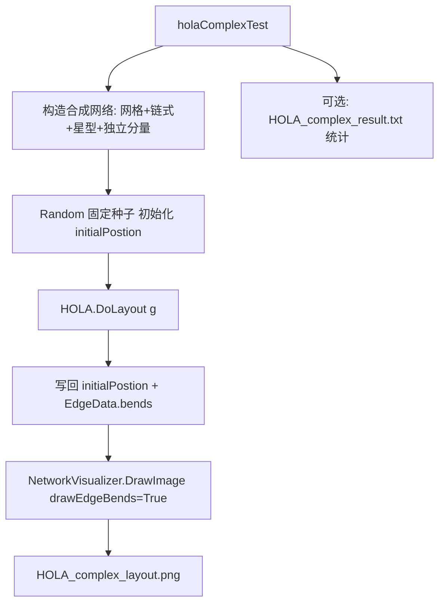

## 用户需求

在已修复边连接渲染缺陷的基础上，构建一个更复杂的网络对 HOLA 正交布局算法进行压力测试。

## 产品概述

修改并增强 `test/OrthogonalLayoutTest.vb` 测试 demo：在原有 12 节点对照用例之外，新增一个程序化生成的合成网络测试，规模 30–60 节点，包含网格块、链式结构、星型结构以及独立小连通分量，并刻意使用混乱的随机初始坐标制造大量边交叉。运行后仅输出 PNG 渲染图（含正交 bends 折点）供目视验证。

## 核心特性

- 程序化生成约 48 个节点的多层混合拓扑（网格 + 链式 + 星型 + 独立连通分量），固定随机种子保证可复现。
- 使用散点/随机初始坐标作为 HOLA 起点，凸显去交叉、对齐、去重叠与正交路由效果。
- 调用 `HOLA.DoLayout` 完成六阶段布局并写回坐标与 bends。
- 用 `NetworkVisualizer` 渲染为 `HOLA_complex_layout.png`（画布放大至 1400×1400，启用 drawEdgeBends，关闭节点标签），目视确认正交对齐、折点连接两端、无飞线。
- 保留原 `holaTest` 作为对照，新增独立入口 `holaComplexTest` 由 `Main` 调用。

## 技术栈

- 语言：VB.NET（`Option Strict On`），与现有工程一致
- 目标框架：net10.0-windows（WinExe 测试工程，无控制台，结果走 PNG/文件）
- 受影响工程：`test`（工作区根 `test/`，引用 `network_layout` 与 `Visualizer`，无需改工程文件）
- 复用 API：
- `NetworkGraph.AddNode(inode)` / `AddEdge(u, v)`
- `inode` = `Microsoft.VisualBasic.Data.visualize.Network.Graph.Node`，`NodeData.initialPostion As FDGVector2`
- `HOLA.DoLayout(graph As NetworkGraph)`（写回 `initialPostion` 与 `EdgeData.bends`）
- `NetworkVisualizer.DrawImage(g, canvas, displayId, drawEdgeBends, labelerIterations, minLinkWidth).Save(path)`
- `Microsoft.VisualBasic.Imaging.Driver.ImageDriver.Register()`（PNG 必需）

## 实现方案

采用"保留对照 + 新增复杂用例"策略，仅在 `test/OrthogonalLayoutTest.vb` 内扩展，不触碰 HOLA 算法、渲染层、U/V 数据或 `WayPointVector`。

### 关键决策

1. **保留原用例**：`holaTest()` 与 `Main` 中原有调用不改，新增 `holaComplexTest()`，由 `Main` 改为调用它（原调用保留为注释，说明可切换）。避免破坏已验证的 12 节点对照。
2. **合成拓扑结构**：单方法内分段构造，约 48 节点：

- 网格块：5×4 = 20 节点，按行列相邻加边，另加部分跨行/跨列边制造交叉；
- 链式：12 节点串成 path，两端接到网格块，形成长边交叉；
- 星型：1 个 hub + 7 个 leaf（共 8 节点），hub 连到网格块某一节点；
- 独立分量：4–6 节点构成环（如 0-1-2-3-0），验证多连通分量不被误连。
label 使用唯一字符串 id（如 `"n0".."n47"`、hub/leaf 专用前缀），保证 `AddEdge` 引用一致。

3. **可复现初始坐标**：用 `New Random(12345)` 固定种子，将节点初始 `initialPostion` 随机散布在 0–1000 范围；节点 `size={18,18}`。固定种子保证每次运行布局输入一致、结果可复现。
4. **渲染参数**：canvas `"1400,1400"` 容纳更多节点；`displayId:=False` 避免标签样式异常；`drawEdgeBends:=True` 显示正交折点；`labelerIterations:=-1`；`minLinkWidth:=8`。输出到 `./HOLA_complex_layout.png`。
5. **可选产物**：仍写入 `./HOLA_complex_result.txt`，记录节点数、边数、生成 bends 的边数统计（非强制但便于核对，沿用原 `holaTest` 的日志模式，使用 `StreamWriter` 包裹 try/catch）。

### 性能与可靠性

- 节点/边规模（~48 节点、~80 边）对 HOLA 的 CoLa 求解与渲染均为 O(n) 量级，远小于原有算法设计容量，无性能瓶颈。
- 初始坐标随机散布后由 HOLA 收敛，固定种子保证可复现；`try/catch` 包裹防止 WinExe 无控制台导致静默失败。
- 不改动任何共享库/算法代码，blast radius 限制在测试工程内。

## 实现注意事项

- 新增方法使用已有 imports，无需新增 import（`Hola`、`Graph`、`Network`、`Imaging` 均已引用）。
- `AddEdge` 依赖节点 label 字符串精确匹配，所有引用必须指向已 `AddNode` 的 label。
- 保持与 `holaTest` 一致的 `initialPostion = New FDGVector2(x, y)` 与 `size = {18, 18}` 写法。
- `Main` 开头 `ImageDriver.Register()` 已存在，无需重复；仅切换调用目标。
- 验证需目视 PNG：节点正交对齐、每条边两端连到节点、无漂浮飞线（即此前修复的渲染 bug 不复现）。

## 架构设计



## 目录结构

```
test/
└── OrthogonalLayoutTest.vb   # [MODIFY] 新增 holaComplexTest()（~48 节点多层合成网络）；Main 改为调用它（原 holaTest 保留为注释对照）；可选输出 result.txt
```

（仅修改此单文件，不新增文件、不改工程引用、不改 HOLA/Visualizer/算法代码）

## 关键代码结构（伪代码，非新增类型）

```
Sub holaComplexTest()
    Using log As New StreamWriter("./HOLA_complex_result.txt")
        Try
            Dim g As New NetworkGraph
            Dim rnd As New Random(12345)
            ' 1) 网格块 5x4 = 20 节点, 随机初始坐标
            ' 2) 链式 12 节点, 连到网格块两端
            ' 3) 星型 1 hub + 7 leaf, hub 连网格块
            ' 4) 独立分量 4-6 节点环
            Call HOLA.DoLayout(g)
            ' 统计节点/边/bends
            Call NetworkVisualizer.DrawImage(g, "1400,1400",
                displayId:=False, drawEdgeBends:=True,
                labelerIterations:=-1, minLinkWidth:=8) _
                .Save("./HOLA_complex_layout.png")
        Catch ex As Exception
            log.WriteLine("ERROR: " & ex.ToString())
        End Try
    End Using
End Sub
```