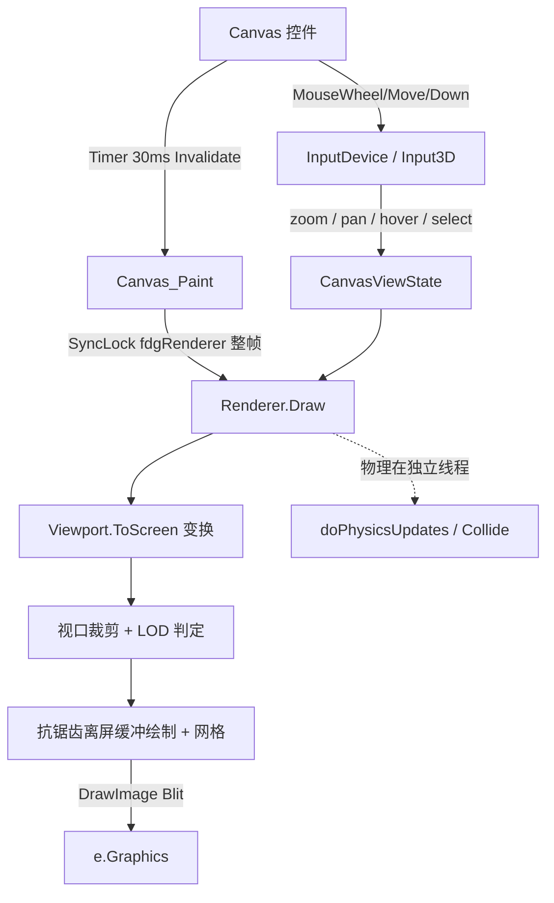

## 用户需求

重构 NetworkCanvas（VB.NET WinForms 网络图可视化控件）项目，在保留现有 GDI+/IGraphics 抽象与对外公共 API 的前提下，优化网络图的显示效果并提升针对大型网络图（数千节点 / 万级边）的渲染性能。

## 产品概述

在现有交互式网络图控件基础上，增强 2D 视图的视觉质量与交互能力，并通过视口裁剪、LOD、离屏缓冲、去锁等手段显著改善大图帧率。不破坏下游（Visualizer、Datavisualization.Network 等）对 Canvas 公共接口的依赖。

## 核心特性

- **2D 缩放与平移**：鼠标滚轮以光标为锚点缩放，空白处拖拽平移视图（节点拖拽仍固定节点）。
- **抗锯齿 / 高质量绘制**：开启 SmoothingMode 抗锯齿、半像素偏移、ClearType 文本渲染；边支持透明度，节点支持描边与高亮配色。
- **悬停高亮与选中**：鼠标悬停高亮节点及其邻边，点击选中（支持多选），并显示 ToolTip 标签/属性。
- **LOD 与背景网格**：缩放过小或节点过密时自动隐藏标签与细边；背景叠加随视口平移缩放的网格。
- **性能优化**：视口裁剪跳过屏外图元、逐帧单次取 Graphics 并去逐图元锁、离屏缓冲整帧绘制后单次 Blit、轻量均匀网格空间索引加速命中测试。

## 技术栈

- 语言/平台：VB.NET，.NET 10（`net10.0-windows`），WinForms（UserControl）。
- 渲染：保留 GDI+（System.Drawing），经现有 `IGraphics`/`Graphics2D` 抽象绘制，不迁移 SkiaSharp。
- 依赖（勿改）：`network_layout`（AbstractRenderer/IRenderer/物理引擎）、`Microsoft.VisualBasic.Imaging`、`Datavisualization.Network`（图模型）。

## 实现方案

### 总体策略

引入一个共享的 **`CanvasViewState`**（含 `Viewport` 缩放/平移、悬停/选中节点、LOD 阈值、网格开关），由 `Canvas` 持有并在每帧绘制前下发至 `Renderer`/`Renderer3D`。渲染时：

1. 通过 `Viewport.ToScreen/ToGraph` 做缩放+平移坐标变换（替代原仅居中偏移）；
2. 在 `drawEdge/drawNode` 中做屏外裁剪与 LOD 判定，跳过不必要的绘制；
3. 整帧仅取一次 `Graphics` 并设高质量模式，移除逐图元 `SyncLock canvas`，改为仅在 `Canvas_Paint` 用 `SyncLock fdgRenderer` 包住整帧（与物理线程互斥，锁次数由 O(E+N) 降为 1）；
4. 绘制到离屏 `Bitmap` 后单次 `DrawImage` Blit 到 `e.Graphics`，减少闪烁并为后续局部更新留扩展点。

### 关键技术决策与权衡

- **视口变换放在 Renderer 实例方法**：原 `GraphToScreen` 为 `Shared` 且被 `InputDevice.getNode` 调用，改为保留 `Shared` 兼容重载、新增基于 `Viewport` 的实例方法；`InputDevice` 同步改用实例方法以保证命中/变换一致。
- **裁剪与 LOD 在 draw 内部 early-return**：无需改动 `network_layout` 的 `AbstractRenderer.DirectDraw`（避免扩大改动面，保持下游兼容），由 `drawEdge/drawNode` 自行判定跳过。
- **命中测试用均匀网格替代 O(N) 线性扫描**：每帧（或布局变更后）以 O(N) 建立网格，`MouseMove` 查询仅查邻近格，悬停/选中从 O(N) 降为近似 O(1)。
- **离屏缓冲**：控件尺寸变化时重建 `Bitmap`；物理持续运动仍需整帧重绘，缓冲主要消除闪烁并统一 Blit。
- **性能瓶颈认知**：渲染层本次聚焦；物理 `Collide` 为 O(N²) 全对全斥力（在 `network_layout`，不在本计划强制项），如需可后续引入 Barnes-Hut。

## 实现要点（防回归）

- 保持 `Canvas.Graph`、`GetSnapshot`、`GetTargetNode`、`SetFDGParams`、`ShowLabel`、`WriteLayout` 等公共 API 签名与语义不变。
- 抗锯齿仅在离屏/目标 `Graphics` 上设置，绘制结束后不影响其他控件。
- `doPaint` 的 `On Error Resume Next` 保留最小兼容，但绘制逻辑改为显式异常经 `App.LogException`。
- 缩放锚点计算需保证光标下图形点不动，避免缩放时视图“漂移”。
- 3D 渲染器（Renderer3D）保留 `Point3D` 旋转+`Project` 投影与 `ViewDistance`，仅复用 `CanvasViewState` 的悬停/选中高亮与标签 LOD，不改动 3D 投影公式。
- `SyncLock fdgRenderer` 框住整帧绘制，与现有 `doPhysicsUpdates` 的 `SyncLock fdgRenderer` 互斥，确保读位置时不与物理写冲突。

## 架构设计



## 目录结构

```
NetworkCanvas/
├── Viewport.vb              # [NEW] Viewport 结构（zoom/panX/panY + ToScreen/ToGraph/ZoomAt/Pan）与 CanvasViewState 类（悬停/选中/网格/LOD 阈值与判定）。
├── SpatialGrid.vb           # [NEW] 均匀网格空间索引，用于悬停/选中的 O(1) 命中查询；Build(nodes)/Query(point)。
├── IGraphicsEngine.vb       # [MODIFY] 扩展接口，新增 View As CanvasViewState 属性（Renderer/Renderer3D 实现），保留 ShowLabels。
├── Renderer.vb              # [MODIFY] 新增 View 属性；重构 GraphToScreen/ToGraph 支持视口变换（保留 Shared 兼容重载）；DirectDraw 整帧去锁；drawEdge/drawNode 增加屏外裁剪、LOD、抗锯齿笔/描边/高亮、背景网格；按色分组批量绘制边。
├── Canvas3D/Renderer3D.vb   # [MODIFY] 复用 CanvasViewState 的悬停/选中高亮与标签 LOD；保留 3D 投影，应用抗锯齿与裁剪。
├── Canvas.vb                # [MODIFY] 持有 CanvasViewState；Canvas_Paint 使用离屏 Bitmap + 高质量 Graphics + SyncLock 整帧；维护 hovered/selected；下发 View 给 renderer；MouseWheel/平移状态写入 View；Tooltip 触发。
├── Canvas.Designer.vb       # [MODIFY] 初始化增加 ToolTip 组件。
├── InputDevice.vb           # [MODIFY] MouseWheel 改为以光标为锚点缩放（非改刚度）；空白处拖拽平移；无拖拽时经 SpatialGrid 计算 hovered 并触发重绘；点击设置 selected（多选 Ctrl）；Tooltip 显示。
└── Canvas3D/Input3D.vb      # [MODIFY] 保留旋转/ViewDistance 滚轮；增加悬停高亮与平移支持。
```

## 关键代码结构

```
Public Structure Viewport
    Public zoom As Single
    Public panX As Single
    Public panY As Single
    Public Const DefaultZoom As Single = 1.0!
    Public Function ToScreen(gx As Single, gy As Single, rect As Rectangle) As PointF
    Public Function ToGraph(sx As Single, sy As Single, rect As Rectangle) As FDGVector2
    Public Sub ZoomAt(anchor As Point, factor As Single, rect As Rectangle)
    Public Sub Pan(dx As Single, dy As Single)
End Structure

Public Class CanvasViewState
    Public ReadOnly Viewport As Viewport
    Public Property Hovered As Node
    Public Property Selected As New HashSet(Of Node)
    Public Property ShowGrid As Boolean = True
    Public Property ShowLabels As Boolean
    Public Property LabelZoomThreshold As Single = 0.5!
    Public Property EdgeZoomThreshold As Single = 0.25!
    Public Property MaxLabelNodes As Integer = 4000
    Public Function ShouldDrawLabels(nodeCount As Integer, zoom As Single) As Boolean
    Public Function ShouldDrawEdges(edgeCount As Integer, zoom As Single) As Boolean
End Class
```