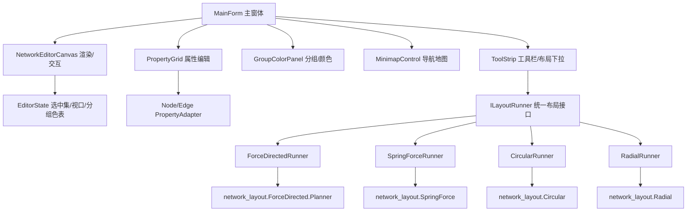

## 用户需求概述

基于现有 `Datavisualization.Network` 网络图对象模型（`NetworkGraph`/`Node`/`Edge`/`NodeData`/`EdgeData`）与 `network_layout` 布局算法，使用 VB.NET WinForms 实现一个交互式网络图编辑器。

## 核心功能

1. 添加节点（`NetworkGraph.CreateNode`）。
2. 选中两个节点后，在二者之间创建一条边连接（`NetworkGraph.CreateEdge`）。
3. 选中某条边后删除该边（`NetworkGraph.RemoveEdge`，保留节点）。
4. 选中一个或多个节点，手动拖拽调整其位置（写入 `Node.data.initialPostion`）。
5. 选中一个或多个节点，编辑其分组信息（写入 `NodeData.Properties("group")`），并维护「分组→颜色」映射表，节点填充色由该映射派生。
6. 选中单个节点或单条边，通过 `PropertyGrid` 查看/编辑其属性（标签、坐标、半径、质量、颜色、权重等）。
7. 提供导航地图（Minimap）：显示全图缩略与当前视口矩形，可点击/拖拽移动主视图中心。
8. 将 `network_layout` 中的 Force-Directed、Spring Force、Circular、Radial 四类布局算法接入编辑器，并重构这些算法的参数使其可通过 `PropertyGrid` 编辑（迭代数、受力系数、半径、画布尺寸等）。

## 技术栈选择

- 语言/框架：VB.NET + WinForms，目标框架 `net10.0-windows`，`.vbproj` 设置 `UseWindowsForms=true`、`MyType=WindowsForms`。
- 引用项目：`Datavisualization.Network/network_graph-netcore5.vbproj`、`network_layout/network_layout.vbproj`（其传递依赖 Data_science、Microsoft.VisualBasic.Core、physics 等已存在于工作区，可直接构建）。
- 渲染：`System.Drawing`（GDI+）自定义 `UserControl`；不引用强耦合力导向物理引擎的 `NetworkCanvas.Canvas`。
- 交互/编辑控件：`PropertyGrid`、`ColorDialog`、`ToolStrip`、`ContextMenuStrip`、`Timer`（重绘节流）。

## 实现方案

### 总体策略

新建独立 WinForms 应用 `NetworkEditor`，以 `NetworkGraph` 为单一数据源；自建 GDI+ 画布控件负责渲染与所有鼠标交互，主窗体承载工具栏、画布、属性面板、分组面板与 Minimap。布局算法通过统一 `ILayoutRunner` 接口接入，参数对象绑定到 `PropertyGrid`。

### 关键决策与权衡

- **自建画布而非复用 NetworkCanvas**：现有 Canvas 与力导向物理动画强耦合，不支持多选/选边/手动拖拽/Minimap，重建更可控。
- **视口变换**：维护 `offset As PointF` 与 `scale As Single`，`GraphToScreen(p) = p * scale + offset`，`ScreenToGraph` 反算。命中检测、拖拽、缩放、平移均基于此，避免每次全量重算。
- **属性适配器（Adapter）解决类型不可编辑问题**：`NodeData.color` 为 `Microsoft.VisualBasic.Imaging.Brush`、`initialPostion` 为 `AbstractVector`、`EdgeData.style` 为 `Pen`，均无法直接 `PropertyGrid` 编辑。适配器将这些暴露为 `System.Drawing.Color`、`X/Y(Double)`、`Radius`、`Mass`、`Group(String)`、`Weight` 等可编辑属性，读写时转换并写回模型，编辑器渲染统一用自己的 `GroupColorMap`(`Dictionary(Of String, Color)`) 生成 `SolidBrush`，不绑定 `node.data.color`，规避类型不匹配。
- **多选共享适配器**：多选节点时绑定同一适配器，对 `Group`/位置等做批量写入（遍历选中集合）。
- **布局重构保持向后兼容**：为四类算法新增「参数类 + 接收参数对象的重载/构造函数」，保留原构造函数与模块函数重载，避免破坏现有调用方。

### 性能与可靠性

- 渲染：仅重绘可见节点/边（视口裁剪，`initialPostion` 落在视口矩形内才绘制），万级节点下用 `BufferedGraphics` 双缓冲 + 拖拽时仅增量重绘。
- 命中检测：点选/框选遍历 `vertex`（O(n)），不引入额外空间索引；若后续节点过多可复用 `NetworkCanvas/SpatialGrid` 思路，本次不引入以保持简单。
- 布局迭代：Force-Directed 用 `Planner.Collide` 循环 `Iterations` 次；运行前对 `initialPostion Is Nothing` 的节点做随机初始化，避免算法读 `.x/.y` 抛空。
- 错误处理：建边前校验两节点非空且非同一节点；删边前确认边已选中；布局参数非法（如半径<=0）回退默认值并打印 Warning。

## 实施要点（防止回归）

- 仅新增文件与对 `network_layout` 的可选重载扩展，**不修改** `Node`/`Edge`/`NodeData`/`EdgeData` 数据模型与现有算法主逻辑。
- `Planner` 新增构造函数，旧 `Sub New(g, ejectFactor, ...)` 保留，确保 `LayoutSanityCheck` 等现有调用不受影响。
- `Circular`/`Radial` 模块函数增加 `...WithParameters(params)` 重载，内部调用既有逻辑。
- 渲染统一使用 `System.Drawing`，避免与 `Microsoft.VisualBasic.Imaging` 的 Brush/Pen 混用。

## 架构设计



## 目录结构

```
network-visualization/
├── NetworkEditor/                                  # [NEW] VB.NET WinForms 应用项目
│   ├── NetworkEditor.vbproj                        # [NEW] net10.0-windows + UseWindowsForms，引用 Datavisualization.Network 与 network_layout
│   ├── My Project/Application.Designer.vb 等        # [NEW] WinForms 应用脚手架
│   ├── MainForm.vb / .Designer.vb / .resx           # [NEW] 主窗体：工具栏、画布、属性面板、分组面板、Minimap 布局
│   ├── NetworkEditorCanvas.vb                       # [NEW] 自定义 GDI+ 控件：视口变换、节点/边渲染、点选/框选/拖拽/缩放/平移
│   ├── MinimapControl.vb                            # [NEW] 导航地图：全图缩略、视口矩形、点击拖拽移动主视图
│   ├── Models/
│   │   ├── EditorState.vb                          # [NEW] 选中节点/边集合、视口 offset/scale、分组→颜色字典、当前布局参数
│   │   └── GroupColorMap.vb                        # [NEW] 分组名→System.Drawing.Color 映射与取色/默认色逻辑
│   ├── Adapters/
│   │   ├── NodePropertyAdapter.vb                  # [NEW] 包装 NodeData 为 PropertyGrid 可编辑属性（X/Y/Radius/Mass/Color/Group），支持多选批量写入
│   │   └── EdgePropertyAdapter.vb                  # [NEW] 包装 EdgeData 为可编辑属性（Label/Weight/Length/Color/Width）
│   ├── Layout/
│   │   ├── ILayoutRunner.vb                        # [NEW] 统一布局接口：Name / GetParameters() / Apply(graph, params)
│   │   ├── ForceDirectedRunner.vb                  # [NEW] 包装 ForceDirectedParameters + Planner.Collide 循环
│   │   ├── SpringForceRunner.vb                    # [NEW] 包装 ForceDirectedArgs + ForceDirected 引擎 + LayoutUpdater.Updates
│   │   ├── CircularRunner.vb                        # [NEW] 包装 CircularLayoutParameters + CircularLayout.LayoutNodes
│   │   └── RadialRunner.vb                         # [NEW] 包装 RadialLayoutParameters + RadialLayout.LayoutNodes
│   └── Controls/
│       └── GroupColorPanel.vb                      # [NEW] 分组列表增删、ColorDialog 取色、批量写入选中节点 Properties("group")
└── network_layout/                                 # [MODIFY] 重构以暴露 PropertyGrid 可编辑参数（保持旧重载兼容）
    ├── ForceDirected/
    │   ├── ForceDirectedParameters.vb              # [NEW] 参数类：EjectFactor/CondenseFactor/MaxTx/MaxTy/DistThreshold/CanvasWidth/CanvasHeight/Iterations（带 DisplayName/Category/Description）
    │   └── Planner.vb                              # [MODIFY] 新增 Sub New(g, params As ForceDirectedParameters) 构造函数，映射参数到既有字段，保留旧构造函数
    ├── Circular/
    │   ├── CircularLayoutParameters.vb             # [NEW] 参数类：Radius/CenterX/CenterY/SortByDegree/MaxSwaps
    │   └── CircularLayout.vb                       # [MODIFY] 新增 LayoutNodes/WithCrossingOptimization 的 *WithParameters(params) 重载
    └── Radial/
        ├── RadialLayoutParameters.vb               # [NEW] 参数类：Radius
        └── RadialLayout.vb                         # [MODIFY] 新增 LayoutNodes(g, params) 重载
```

（注：`SpringForce.Parameters.ForceDirectedArgs` 已具备 PropertyGrid 友好属性，仅需接入 `SpringForceRunner`，必要时补充 `Iterations`。）

## 关键代码结构（节选）

```
' Adapters/NodePropertyAdapter.vb —— 屏蔽 Brush/AbstractVector 不可编辑问题
Public Class NodePropertyAdapter
    Private ReadOnly nodes As Node()
    <Category("Position"), DisplayName("X")> Public Property X As Double
        Get : Return nodes(0).data.initialPostion.x : End Get
        Set(v) : For Each n In nodes : n.data.initialPostion.x = v : Next : End Set
    End Property
    <Category("Group"), DisplayName("分组")> Public Property Group As String
        Get : Return nodes(0).data("group") : End Get
        Set(v) : For Each n In nodes : n.data("group") = v : Next : End Set
    End Property
    ' Color/Mass/Radius/Y 等类似
End Class

' Layout/ILayoutRunner.vb
Public Interface ILayoutRunner
    ReadOnly Property Name As String
    Function GetParameters() As Object          ' 绑定到 PropertyGrid
    Sub Apply(g As NetworkGraph, params As Object)
End Interface
```

## 设计风格

采用现代深色专业风格（Dark Professional），以深蓝灰背景衬托高对比节点与高亮选中态，配合细描边、柔和阴影与悬停/选中微动效，整体克制、信息密度高，适合数据可视化编辑场景（桌面端，非移动端放大）。

## 页面/窗体布局（单窗体多区域，自上而下、自左而右）

1. **顶部工具栏 ToolStrip**：新建/打开、添加节点、建边模式开关、删除选中边、应用布局下拉（4 种算法）+「运行布局」按钮、适配视图、缩放比例显示。
2. **左侧分组与颜色面板 GroupColorPanel**：分组列表（名称+色块），新增/删除分组，`ColorDialog` 取色；选中节点后「应用到选中」写入 `Properties("group")`；下方映射表可编辑。
3. **中央主画布 NetworkEditorCanvas**（Dock=Fill）：GDI+ 渲染网络；节点圆形填充（分组色）、边折线；选中节点高亮描边+半透明光晕，选中边加粗高亮；框选橡皮筋矩形；空白处拖拽平移、滚轮缩放。
4. **右侧属性面板**：上 `PropertyGrid`（绑定单选节点的 `NodePropertyAdapter` 或单选边的 `EdgePropertyAdapter`，多选时绑定共享适配器批量编辑）；下为当前布局算法参数 `PropertyGrid`。
5. **右下角导航地图 MinimapControl**：固定 220×220，绘制全图节点缩略点与当前视口矩形；点击/拖拽移动主视图中心；带细边框与半透明遮罩。

## 交互与视觉

- 选中态：节点外加 2px 发光描边（青色 #36E2C2），边高亮为橙色 #FFB454 加粗。
- 悬停：节点轻微放大（scale 1.08）并显示标签 ToolTip。
- 分组色：默认调色板 12 色循环；色块与节点填充一致性由 `GroupColorMap` 保证。
- 响应式：画布随窗体缩放（Anchor/Dock），Minimap 与属性面板固定宽度，工具栏固定高度。