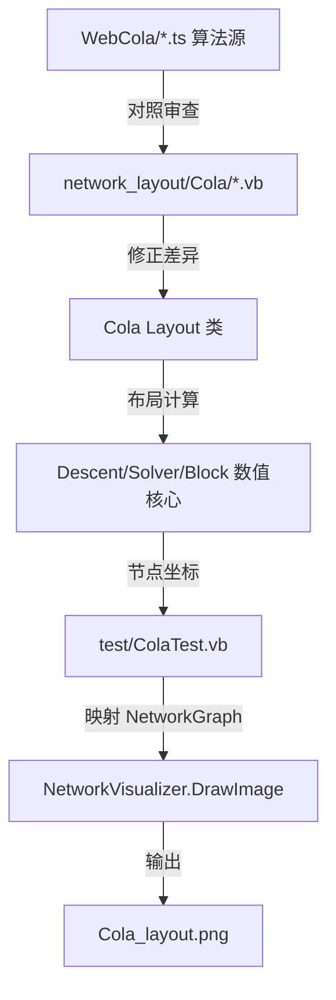

## 用户需求概述

用户拥有一个用 VB.NET 实现的网络图可视化模块。网络布局算法来自 WebCola 的 TypeScript 源码,目前已大部分翻译进 `network_layout\Cola` 文件夹,但测试效果不理想。用户要求:对照 WebCola 的 TypeScript 算法源,审查 `network_layout\Cola` 中已翻译的 VB 代码,找出与 TS 源不一致的地方并修正;修正完成后,在 `test\ColaTest.vb` 中编写测试代码,把经过修正的 Cola 布局算法生成的正确网络图,通过 `NetworkVisualizer.DrawImage` 渲染为图像文件供检查。

## 功能内容

- 代码审查:逐文件比对 `WebCola/*.ts` 与 `network_layout/Cola/**/*.vb`,定位翻译不一致处。
- 代码修正:修正审查发现的差异(已知 `Layout/layout.vb` L682 条件写反为严重 bug;并对其余文件逐行复核)。
- 测试程序:在 `test/ColaTest.vb` 中构建网络模型、调用修正后的 Cola 布局、将坐标写回网络图、用 `NetworkVisualizer.DrawImage` 渲染为 PNG。
- 视觉效果:输出的 PNG 应展示经 Cola 应力最小化布局后的节点与边,节点分布均匀、边交叉减少,便于目视验证算法正确性。

## 核心特性

- 精确对照 TS 算法源码审查并修正 VB 翻译
- 构建可复用的 Cola 布局测试,生成可视化图像产物
- 桥接 Cola 自有 Node/Link 数据结构与 NetworkGraph 数据模型

## 技术栈选择

- 语言: VB.NET (.NET Framework, 与现有工程一致)
- 算法源: WebCola TypeScript (`WebCola/*.ts`)
- 数据模型: `Datavisualization.Network` (NetworkGraph / inode / NodeData / Edge / FDGVector2)
- 渲染: `Visualizer` 项目 `NetworkVisualizer.DrawImage`
- 测试宿主: `test/Test.vbproj` (Module + Sub Main 风格, 参考 `OrthogonalLayoutTest.vb`)

## 实现方案

核心策略:先以 `code-explorer` 子代理对 `WebCola` 与 `network_layout/Cola` 做系统性逐文件比对,产出"TS 行 → VB 文件:行 → 差异 → 修正"的精确清单;人工确认清单后批量修正;最后编写 `test/ColaTest.vb`,重点解决 Cola `Node[]/Link(Of Node)[]` 与 `NetworkGraph` 的桥接,运行布局并回写坐标再渲染。

关键技术决策:

1. **优先修正确认 bug**:`Layout/layout.vb` L682 `If(Me._constraints Is Nothing, Me._constraints, {})` 逻辑写反,应改为 `If(Me._constraints Is Nothing, {}, Me._constraints)`,否则无约束时返回 Nothing 会导致后续 `curConstraints.Length` 抛 NullReference,有约束时反而清空。
2. **逐文件审查范围**:`descent.vb`、`Models/*.vb`、`linklengths.vb`、`handleDisconnected.vb` 经初步核对与 TS 基本一致(仅 `descent.vb` 构造函数维度 `New Double(Me.k)` 可微调为 `Me.k-1`,实际无害);重点应放在 `Layout/layout.vb`、`Layout/Projection.vb` 与 TS `layout.ts` 内联 `Projection` 类的对照,以及 `Link(Of Node).source` 语义(`index` vs `id`)与 `start()` 中 link.source 赋值分支的一致性。
3. **性能**:布局为 O(n²) 应力计算,沿用现有算法即可;测试网络规模控制在 12~50 节点,渲染前仅遍历一次写回坐标,无额外开销。
4. **桥接设计**:在测试模块内做映射函数,把 `inode` 列表映射为 Cola `Node()` (x/y/width/height/index/fixed),`Edge` 映射为 Cola `Link(Of Node)` (source/target 为 Node 引用);布局后把 `node.x/node.y` 写回 `inode.data.initialPostion`,再 `DrawImage`。

## 实现说明(执行注意)

- 修正时仅改与 TS 源不一致的逻辑,避免误改经核实正确的数值核心(`descent`/`vpsc` Solver/`Block`)以免引起回归。
- `test/ColaTest.vb` 需确认 `Test.vbproj` 以通配符包含 `*.vb` 编译项;若否,需补充 `<Compile Include="ColaTest.vb" />`。
- 渲染前必须调用 `Microsoft.VisualBasic.Imaging.Driver.ImageDriver.Register()` 注册 GDI 驱动。
- 建议复用 `OrthogonalLayoutTest` 的 12 节点用例作为对照,便于目视验证。

## 架构设计

WebCola TS 源 (算法权威) → network_layout/Cola VB (翻译实现, 待审查修正) → test/ColaTest.vb (集成测试 + 可视化验证)



## 目录结构

```
network_layout/Cola/
  Layout/
    layout.vb          # [MODIFY] 修正 L682 curConstraints 条件; 逐行复核 start/initialLayout 与 layout.ts 差异
    Projection.vb      # [MODIFY] 对照 layout.ts 内联 Projection 类, 修正 projectFunctions/solve 等差异(如有)
  descent.vb           # [REVIEW] 已确认正确; 可选微调构造函数维度
  Models/
    Variable.vb        # [REVIEW] 已确认正确
    Solver.vb          # [REVIEW] 已确认正确
    Block.vb           # [REVIEW] 已确认正确
    Blocks.vb          # [REVIEW] 已确认正确
    Constraint.vb      # [REVIEW] 已确认正确
    PositionStats.vb   # [REVIEW] 已确认正确
  linklengths.vb       # [REVIEW] 已确认正确
  handleDisconnected.vb# [REVIEW] 已确认正确
test/
  ColaTest.vb          # [NEW] 构建网络图, 调用 Cola 布局, 写回坐标, 渲染 PNG
  Test.vbproj          # [MODIFY] 确保 ColaTest.vb 纳入编译
```

## Agent Extensions

### SubAgent

- **code-explorer**
- Purpose: 系统性地在 WebCola 与 network_layout/Cola 之间做跨文件逐段代码比对,定位所有 TS 与 VB 翻译不一致点
- Expected outcome: 产出精确到文件与行号的"差异→修正"清单(含 layout.vb 其余方法、Projection.vb、Link 类型语义、各子模块引用关系),供修正步骤直接执行,避免误改已正确的数值核心