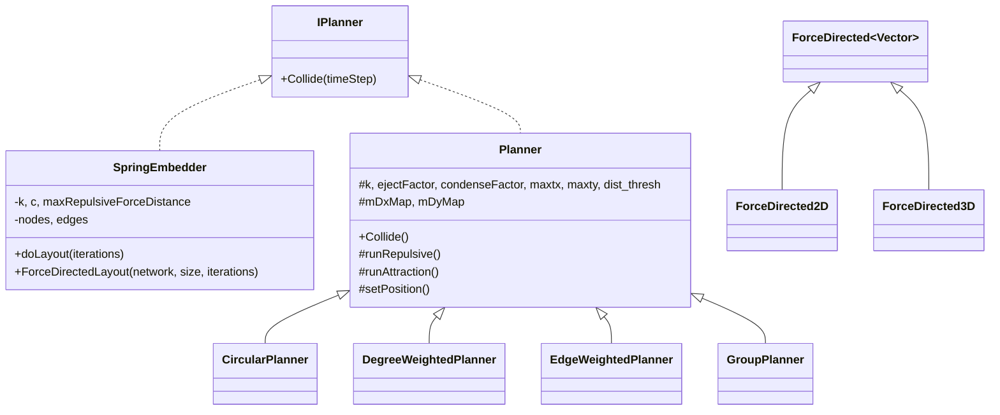

## 用户需求

对 `network-visualization/network_layout` 项目中的**力导向布局算法家族**进行代码审查，定位并修正其中的布局算法逻辑错误，并修改源码后进行编译与效果验证。

## 产品概述

`network_layout` 是基于 `Datavisualization.Network` 的网络图对象做布局计算的模块，其中力导向家族包含两套实现：一套是经典弹簧嵌入 `SpringEmbedder`（实现 `IPlanner`），另一套是 FR 风格 `ForceDirected.Planner` 基类及其子类（`CircularPlanner`、`DegreeWeightedPlanner`、`EdgeWeightedPlanner`、`GroupPlanner`），以及实际被公共 API `doForceLayout` 调用的 `SpringForce` 物理引擎（`ForceDirected(Of Vector)` / `ForceDirected2D` / `ForceDirected3D`）。本次仅审查并修正该力导向家族，不改动 `physics` 数学库及 Radial/Circular/Cola/Orthogonal/EdgeBundling 等其它家族。

## 核心问题（待修正的逻辑错误）

- **SpringEmbedder.vb**：合力累加到 `NodeData.force`（`System.Drawing.Point`，X/Y 为整型），每次赋值被截断为整数，力被严重量化；吸引力距离被错误截断到排斥力上限（默认 10），导致吸引力恒≈0、网络无法收拢；排斥力默认作用距离过小，网络无法铺开；共享入口 `ForceDirectedLayout` 使用不可调的缺陷默认值。
- **ForceDirected/Planner.vb 及全部子类**：`setPosition()` 将位移硬性截断到 `maxtx=4`/`maxty=3` 像素/迭代，而排斥力（`k²/dist`）与吸引力（`dist²/k`）量级远大于该常数，导致所有节点位移被等同压到 ±4、排斥/吸引相对强弱全部失效、收敛极慢、布局受截断支配。
- **ForceDirected/DegreeWeightedPlanner.vb**：`runAttraction()` 先调用 `MyBase.runAttraction()` 累加倍直接边吸引力，随后在循环内 `mDxMap(id)=0.0` 重置，把基类已计算的直连吸引力**整体抹除**，仅保留间接吸引力，属明显逻辑错误。
- **SpringForce/Layout/Layout/ForceDirected.vb**：库仑排斥力使用 `repulsion/distance`（线性 1/r）而非逆平方 `repulsion/distance²`，长程排斥偏弱、节点易重叠聚集；`parallel=True` 时 `applyCoulombsLaw` 对 `current.ApplyForce` 存在跨线程数据竞争；`createSpring` 对重边返回零自然长度与零刚度弹簧，使重边不产生弹簧力且把节点拉向重叠；`updatePosition` 越界重置在坐标极大/为负时仍可能越界。

## 验证目标

修改后编译通过，并以合成小网络验证：节点不塌缩到原点、两两最小距离非退化、整体包围盒有合理尺寸、迭代过程中系统总能量下降并趋于收敛。

## 技术栈

- 语言/框架：VB.NET（.NET Core 5），与现有 `network_layout.vbproj`、`Datavisualization.Network`、`physics` 项目保持一致，不引入新框架。
- 依赖：布局算法直接复用 `Datavisualization.Network.Graph`（节点/边/向量 `FDGVector2`）与 `physics` 数学函数；验证阶段仅需 `dotnet build` 与最少量的合成网络构造代码。

## 实现策略

整体采用“定点修正 + 回归验证”的方式，严格在现有架构内改错，不重构、不引入新布局范式：

1. **SpringEmbedder 精度与模型修正**：放弃向整型 `NodeData.force` 累加，改为在 `SpringEmbedder` 内部维护 `Dictionary(Of Node, PointF)`（或双精度 dx/dy 累加器）保存每轮合力；移除 `edgeAttractions` 中对距离的 `maxRepulsiveForceDistance` 截断（FR 吸引力为 `d²/k`，本不应截断）；将排斥力作用距离默认值提高到与画布/节点数相关的合理值（如 `k` 的整数倍或画布短边比例），避免仅在 10px 内生效；`ForceDirectedLayout` 暴露参数或采用合理默认，并确认 `connectedNodes`/`graphEdges` 覆盖完整。
2. **FR 风格 Planner 位移调度修正**：将 `setPosition()` 的常数硬截断替换为 FR 经典“温度冷却调度”——每轮位移上限 `temperature` 随迭代递减（如 `temp = initTemp * (1 - i/iterations)`），位移向量按合力方向归一化后受 `temperature` 限幅。该修正在基类 `Planner` 中完成，所有子类（`Circular`/`Degree`/`Edge`/`Group`）自动受益，保持方向信息与排斥/吸引相对强弱。
3. **DegreeWeightedPlanner 吸引力抹除修正**：去掉 `runAttraction()` 内逐节点 `mDxMap(id)=0.0` 重置，改为在基类直连吸引力之上继续累加间接吸引力；同时确保 `reset()`→`runRepulsive`→`runAttraction`→`setPosition` 的累加链不被清空。
4. **SpringForce 主引擎质量与并发修正**：库仑力改为 `repulsion / (distance*distance)`（与默认 `Repulsion=4000` 协调重新标定）；并行分支对非 pinned 节点的力写入加锁或显式串行化临界区以避免竞态；`createSpring` 对重边赋予与首条弹簧一致的自然长度与刚度（而非 0/0）；`updatePosition` 越界重置约束到合理正区间并避免重置回负值/越界。

## 关键实现要点（防止回归）

- 仅改动被确认有逻辑错误的函数，保持 `IPlanner.Collide` 与 `doForceLayout` 对外签名不变，避免影响 `Visualizer`/`mingle` 等调用方。
- `force` 字段为 `System.Drawing.Point`（整型）属数据模型约束，本次不修改 `Datavisualization.Network` 的 `NodeData`，仅在 `SpringEmbedder` 内部用双精度累加器绕开，控制改动面。
- 冷却调度与库仑力变更属于物理参数调整，需保留可配置入口（构造函数参数/字段），默认取值参考现有 `iterations=1000`、`Repulsion=4000`、`Damping=0.83`。
- 不修改 `G:\pixelArtist\src\framework\gr\physics`；若发现确为误用其接口，仅在调用处修正。

## 架构与类关系



## 目录结构与改动文件

```
network-visualization/network_layout/
├── SpringEmbedder.vb                       # [MODIFY] 改用双精度累加器保存合力；移除吸引力距离截断；提高排斥默认作用距离；ForceDirectedLayout 暴露/修正默认参数
├── ForceDirected/
│   ├── Planner.vb                          # [MODIFY] setPosition 改为温度冷却限幅；复核 runRepulsive/runAttraction 符号与累加链
│   └── DegreeWeightedPlanner.vb            # [MODIFY] 修正 runAttraction 中 mDxMap(id)=0.0 重置抹除基类吸引力的问题，改为累加
├── SpringForce/Layout/Layout/
│   └── ForceDirected.vb                    # [MODIFY] 库仑力改逆平方；并行竞态加锁/串行化；createSpring 重边赋予合理 length/K；updatePosition 越界重置约束到正区间
└── LayoutSanityCheck.vb                    # [NEW] 最小验证程序：构造小网络，调用 doForceLayout 与 SpringEmbedder.ForceDirectedLayout，
                                            #        断言节点不塌缩到原点、两两最小距离非退化、包围盒尺寸合理、总能量随迭代下降
```

（注：`CircularPlanner`/`EdgeWeightedPlanner`/`GroupPlanner` 通过基类 `setPosition` 冷却调度自动受益，无需逐个改位移逻辑；如审查发现子类额外逻辑错误，在执行时一并修正。）

## 关键代码结构（冷却调度示意）

```
' ForceDirected/Planner.vb —— setPosition 的位移限幅改为温度冷却
Protected Overridable Sub setPosition(iteration As Integer, totalIterations As Integer)
    Dim temperature As Double = initTemperature * (1.0 - iteration / Math.Max(1, totalIterations))
    For Each node As Node In g.vertex.Where(Function(v) Not v.pinned)
        Dim dx = mDxMap(node.label), dy = mDyMap(node.label)
        Dim len = Math.Sqrt(dx * dx + dy * dy)
        If len > temperature Then
            dx = dx / len * temperature
            dy = dy / len * temperature
        End If
        ' ... 叠加到 node.data.initialPostion，并做画布边界约束
    Next
End Sub
```