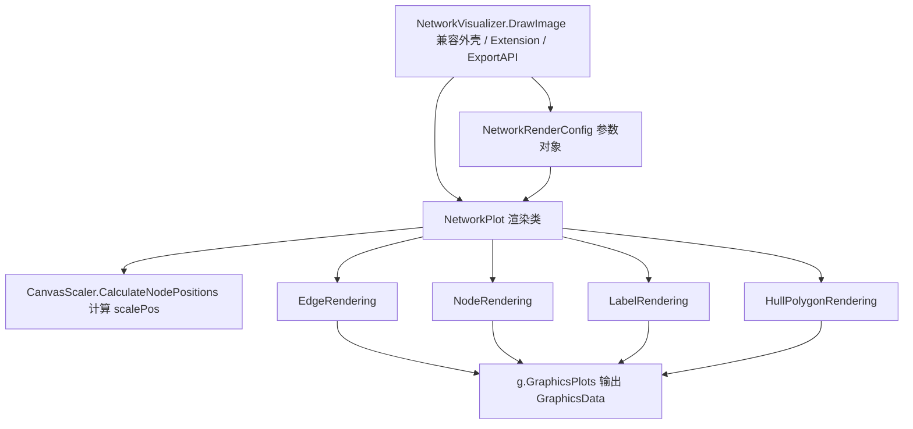

## 用户需求

将 Visualizer 模块中"每次传递大量参数的函数调用模式"重构为"模块化的 class 对象调用"。以 `Visualizer\NetworkVisualizer.vb` 中主入口 `DrawImage`（30+ 个可选参数）为核心改造对象，并参考同模块内已有的 `DrawKDTree`（Plot 类 + Theme 配置对象 + 薄外壳）范式，使网络图绘制的参数组织与渲染流程更加清晰、可复用。

## 产品概述

对网络图可视化模块进行结构性重构：引入统一的渲染配置类 `NetworkRenderConfig` 与渲染类 `NetworkPlot`，把原先分散在 `DrawImage` 内部的坐标换算、边/节点/标签渲染以及凸包多边形绘制逻辑收敛为职责单一的 class 对象；原有的 `NetworkVisualizer.DrawImage` 退化为兼容外壳，对外公开 API（`Draw.Image` 导出、扩展方法调用）保持不变，ggraph 与现有 test 工程无需改动。

## 核心特性

- 新增 `NetworkRenderConfig` 配置类，集中承载所有绘图参数，默认值与现有 Optional 参数严格一致
- 新增 `NetworkPlot` 渲染类，持有 NetworkGraph 与配置对象，对外暴露 `Render()` 产出图像
- 将私有扩展方法 `drawhullPolygon` 抽取为独立的 `HullPolygonRendering` 类
- `EdgeRendering` / `NodeRendering` / `LabelRendering` 构造函数改为从共享的 `NetworkRenderConfig` 取参，消除长参数列表
- `NetworkVisualizer.DrawImage` 保留为薄外壳，内部委托 `NetworkPlot`，保持导出标记、扩展方法及 `BackgroundColor` 属性/委托兼容

## 技术栈

- 语言/框架：VB.NET，.NET 5（`networkVisualizer.NET5.vbproj`）
- 绘图引擎：sciBASIC.NET Imaging（`Microsoft.VisualBasic.Imaging`，GDI+/SVG/PS 驱动）
- 网络模型：`Microsoft.VisualBasic.Data.visualize.Network.Graph` 的 `NetworkGraph` / `Node` / `Edge`
- 不引入任何新依赖，仅做模块内部结构重组

## 实现方案

### 总体策略

采用"配置对象 + 渲染类 + 薄外壳"的范式（与 `DrawKDTree` 一致）：用 `NetworkRenderConfig` 收口所有可选参数，用 `NetworkPlot` 收口绘制主流程（scalePos 计算、各渲染子类的实例化与 `plotInternal` 委托、`g.GraphicsPlots` 输出），用 `NetworkVisualizer.DrawImage` 作为仅做参数映射的兼容外壳。

### 关键技术决策

1. **保留 `Module NetworkVisualizer` 作为外壳**：`Draw.Image` 是 `<ExportAPI>` 导出且被 ggraph（`InternalsVisibleTo("ggraph")`）与 test 通过扩展方法/命名参数调用，改为 class 会破坏调用链；因此仅将其方法体瘦身为"构造 config → 调用 `NetworkPlot.Render()`"。
2. **`NetworkPlot` 不强制继承 `Plot`**：`DrawKDTree` 继承自 `Data.ChartPlots` 的 `Plot`，但网络可视化使用 `g.GraphicsPlots(frameSize, margin, background, plotInternal, driver)` 的独立管线，强行继承会引入 ChartPlots 主题耦合且需改造 `plotInternal` 签名；故 `NetworkPlot` 作为独立渲染类，结构（配置对象 + 薄外壳）参考 `DrawKDTree`，渲染管线保持原样。
3. **渲染子类统一吃 `NetworkRenderConfig`**：`EdgeRendering`(8 参)、`NodeRendering`(14 参)、`LabelRendering`(6 参) 的构造函数改为 `(config, scalePos, [graph])`，运行时依赖（如 `scalePos`、`graph`）仍随构造传入；`drawhullPolygon` 的 9 个参数同样收口进 `HullPolygonRendering(config, scalePos, drawPoints)`。
4. **默认值零回归**：`NetworkRenderConfig` 每个字段默认值必须与 `DrawImage` 现有 Optional 完全一致（canvasSize="1024,1024"、padding 默认 100、background="white"、defaultColor="skyblue"、WhiteStroke 常量、`minLinkWidth=2`、`labelerIterations=1500`、`driver=Drivers.Default`、`ppi=100` 等），避免行为漂移。

### 性能与可靠性

- 重构不改变绘制算法与复杂度（仍为 O(边数 + 节点数) 的线性绘制），`config` 对象每次渲染仅分配一次，无额外开销。
- `scalePos` 计算、`labeler` 退火迭代、凸包绘制逻辑原样迁移，不引入新的热路径或重复遍历。
- 可见性：`NetworkRenderConfig` 与 `NetworkPlot` 设为 `Public`，保证 ggraph（友元程序集）可见；`HullPolygonRendering` 及渲染子类保持 `Friend`（同程序集内可见即可）。

## 实现注意事项

- 严格保留 `NetworkVisualizer` 中的 `<Assembly: InternalsVisibleTo("ggraph")>`、`<ExportAPI("Draw.Image")>`、`<Extension>`、`Public Property BackgroundColor`、`Public Delegate`（`DrawNodeShape` / `GetLabelPosition` / `DrawShape`）。
- 不修改任何调用方：`Visualizer\Canvas.vb`（`CanvasDrawer.DrawImage`）、`test\OrthogonalLayoutTest.vb`、`test\drawTest.vb`、`test\visualEffectsTest.vb` 保持原样可编译。
- 迁移 `drawhullPolygon` 时，凸包分组解析（max/min/top<n>/逗号列表）、`Designer.GetColors`、`DrawHullPolygon`、图例绘制逻辑须逐行对应，确保输出像素一致。
- 渲染子类重构仅改构造函数签名与字段赋值，绘制方法体（`drawEdges`/`RenderingVertexNodes`/`renderLabels` 等）逻辑不变，降低回归风险。

## 架构设计



## 目录结构

```
Visualizer/
├── NetworkRenderConfig.vb          # [NEW] 渲染配置类。承载 DrawImage 的全部可选参数及默认值，
│                                   #       字段与 DrawImage Optional 参数一一对应，默认值严格一致。
│                                   #       须为 Public，供 ggraph 与外壳可见。
├── NetworkPlot.vb                  # [NEW] 渲染类。构造接收 NetworkGraph + NetworkRenderConfig；
│                                   #       内部完成 scalePos 计算、实例化 EdgeRendering/NodeRendering/
│                                   #       LabelRendering/HullPolygonRendering，暴露 Render() As GraphicsData。
│                                   #       参考 DrawKDTree 结构但不继承 Plot，避免引入 ChartPlots 依赖。
├── Render/
│   ├── HullPolygonRendering.vb     # [NEW] 由原私有扩展 drawhullPolygon 迁移而来。构造接收
│   │                               #       (config, scalePos, drawPoints)，方法 RenderHull(g)。
│   │                               #       凸包分组解析与图例绘制逻辑逐行对应，保持输出一致。
│   ├── EdgeRendering.vb            # [MODIFY] 构造函数改为 (config, scalePos)，删除 8 个独立参数；
│   │                               #          drawEdges/renderEdge/rendering 逻辑保持不变。
│   ├── NodeRendering.vb            # [MODIFY] 构造函数改为 (graph, config, scalePos)，删除 14 个独立参数；
│   │                               #          RenderingVertexNodes/renderNode 逻辑保持不变。
│   └── LabelRendering.vb           # [MODIFY] 构造函数改为 (config)，删除 6 个独立参数；
│   │                               #          renderLabels/renderLabel 逻辑保持不变。
└── NetworkVisualizer.vb            # [MODIFY] 保留 Module、BackgroundColor 属性、三个 Delegate、
                                    #       InternalsVisibleTo 与 ExportAPI/Extension 标记；
                                    #       DrawImage 方法体改为构造 config 并调用
                                    #       New NetworkPlot(net, config).Render()；
                                    #       删除私有 drawhullPolygon 方法（已迁移至 HullPolygonRendering）。
```

## 关键代码结构

```
Public Class NetworkRenderConfig
    Public Property CanvasSize As String = "1024,1024"
    Public Property Padding As String = g.DefaultPadding
    Public Property Background As String = "white"
    Public Property DefaultColor As String = "skyblue"
    Public Property DisplayId As Boolean = True
    Public Property NodeStroke As String = WhiteStroke
    Public Property MinLinkWidth As Single = 2
    Public Property LabelerIterations As Integer = 1500
    Public Property Driver As Drivers = Drivers.Default
    Public Property Ppi As Integer = 100
    ' 其余字段与 DrawImage 的 Optional 参数一一对应，默认值严格保持一致
End Class

Public Class NetworkPlot
    ReadOnly net As NetworkGraph
    ReadOnly config As NetworkRenderConfig

    Sub New(net As NetworkGraph, config As NetworkRenderConfig)
    Public Function Render() As GraphicsData
End Class
```