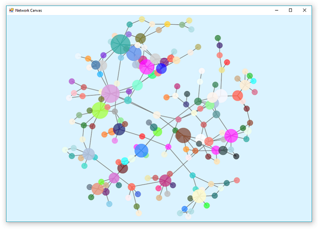

> [Downloads the demo example](https://github.com/xieguigang/VisualBasic_AppFramework/releases/tag/v0.16-update)<br />
> [Downloads the latest source code from github](#)


## Introduction and background
In my recent work on the GCModeller, I want to developing a module for the biological network data visualization.
One of the solution is using d3js for this data visualization and the another solution is the Cytoscape software.

The [Cytoscape](http://cytoscape.org/) software is doing the best in the network visualization as it provides a lot of style mapping and data imports and exports function. And in my recent work, the cytoscape software was used for visualize the biological network data frequently. But there is problem that the cytoscape software can only generate the statics image of the network, and just can only export a interactive output in web app format. And the cytoscape software is also can not programming with VB.NET. And as I want to build a inner interactive module for the biological network visualization, so that I should try another way for the job. There is another important tools for visualize the network data in the HTML programming: [d3js](https://github.com/d3/d3). And the d3js is one of my favorite tools in the data visualization.

Here is my most favorite project from Mr. whichlight's work: a project for visualize the reddit discussion network by using d3js.

><br />
>[_Reddit Discussion Network Visualization_](https://github.com/whichlight/reddit-network-vis)

And the d3js is my first choice in this work. And here is the force directed graphic engine that I write with d3js hybrid programming with VB.NET (whole source cdoe and example can be download from [here](https://github.com/SMRUCC/GCModeller.Workbench/tree/master/d3js/Force-Directed%20Graph/js)):

```javascript
function d3Network(jsonFile, width, height) {

    var color = d3.scale.category20();
    var force = d3.layout.force()
        .charge(-120)
        .linkDistance(30)
        .size([width, height]);

    var svg = d3.select("body").append("svg")
        .attr("fill", "#DBF3FF")
        .attr("width", width)
        .attr("height", height)
        .attr("class", "chart");

    d3.json(jsonFile, function (error, graph) {
        if (error) throw error;

        force
            .nodes(graph.nodes)
            .links(graph.links)
            .start();

        var link = svg.selectAll(".link")
            .data(graph.links)
            .enter().append("line")
            .attr("class", "link")
            .style("stroke-width", 0.5);

        var node = svg.selectAll(".node")
            .data(graph.nodes)
            .enter().append("circle")
            .attr("class", "node")
            .attr("r", function (d) {
                return Math.sqrt(d.size)+1;
            })
            .style("fill", function (d) {
                return color(d.group);
            })
            .style("opacity", 0.8)
            .call(force.drag);

        node.append("title")
            .attr("class", "tooltip")
            .style("font-size", 16)
            .html(function (d) {
                return "name:\t" + d.name + "\ntype:\t" + d.type + "\nlinks:\t" + d.size;
            });

        force.on("tick", function () {
            link.attr("x1", function (d) { return d.source.x; })
                .attr("y1", function (d) { return d.source.y; })
                .attr("x2", function (d) { return d.target.x; })
                .attr("y2", function (d) { return d.target.y; });

            node.attr("cx", function (d) { return d.x; })
                .attr("cy", function (d) { return d.y; });
        });
    });
}
```

The VB.NET language was programming hybrids with javascript as the server side on the local client. And by using WinForm web browser control, that we can display the network visualization data. But as the .NET Webbrowser control is based on the IE browser and not support d3js well, so that I have to changes the .NET Webbrowser control to the opensource Firefox browser or Google chrome. And by using Firefox in the project, it actually works, but the problem is that we needs deploy our application with the Chrome kernel(~100MB) and Firefox kernel(~50MB). This is not so convenient and friendly for my customer clients.

And after search on the github, I found a solution for this interactive network visualization work in the .NET language its own way.

<!--more-->



This network canvas library is majority based on the work of [Mr. Woong Gyu La](http://www.codeproject.com/Articles/833043/EpForceDirectedGraph-cs-A-D-D-force-directed-gra)

### Overviews
This canvas library is consist with 4 parts majority:

1. [Force Directed layout engine](./Datavisualization.Network/Layouts/ForceDirected/Layout/ForceDirected.vb)
2. [Canvas control for WinForm](./NetworkCanvas/Canvas.vb)
3. [InputDevice for user mouse events](./NetworkCanvas/InputDevice.vb)
4. [Renderer for the graphics rendering of the network data](./NetworkCanvas/Renderer.vb)

### Code in details

##### Force Directed layout engine
The force directed network layout engine which is available at type [**Microsoft.VisualBasic.DataVisualization.Network.Layouts.ForceDirected2D**](./Datavisualization.Network/Layouts/ForceDirected/Layout/ForceDirected.vb)
The introduction for this layout provider is available at Mr. Woong Gyu La's article: ["EpForceDirectedGraph.cs- A 2D/3D force directed graph algorithm in C#"](http://www.codeproject.com/Articles/833043/EpForceDirectedGraph-cs-A-D-D-force-directed-gra)

##### Canvas control for WinForm
The canvas control providers the user interface and rendering task thread for the layout engine.
Set up the network data just by using the **Canvas.Graph** property:

```vbnet
    Public Property Graph As NetworkGraph
        Get
            If net Is Nothing Then
                Call __invokeSet(New NetworkGraph)
            End If

            Return net
        End Get
        Set(value As NetworkGraph)
            Call __invokeSet(value)
        End Set
    End Property

    Private Sub __invokeSet(g As NetworkGraph)
        net = g
        fdgPhysics = New ForceDirected2D(net, FdgArgs.Stiffness, FdgArgs.Repulsion, FdgArgs.Damping)
        fdgRenderer = New Renderer(
            Function() paper,
            Function() New Rectangle(New Point, Size),
            fdgPhysics)
        inputs = New InputDevice(Me)
        fdgRenderer.Asynchronous = False
    End Sub
```

And these components is using for the layout engine and rendering of the image:

```vbnet
    ''' <summary>
    ''' The network data model for the visualization
    ''' </summary>
    Dim net As NetworkGraph
    ''' <summary>
    ''' Layout provider engine
    ''' </summary>
    Protected Friend fdgPhysics As ForceDirected2D
    ''' <summary>
    ''' The graphics updates thread.
    ''' </summary>
    Protected Friend timer As New UpdateThread(30, AddressOf __invokePaint)
    ''' <summary>
    ''' The graphics rendering provider
    ''' </summary>
    Protected Friend fdgRenderer As Renderer
    ''' <summary>
    ''' GDI+ interface for the canvas control.
    ''' </summary>
    Dim paper As Graphics
```

All of the rendering work is starting from the **timer** object:

```vbnet
''' <summary>
''' The graphics updates thread.
''' </summary>
Protected Friend timer As New UpdateThread(30, AddressOf __invokePaint)

    Private Sub __invokePaint()
    Call Me.Invoke(Sub() Invalidate())
End Sub
```

By notifying the Windows message that the control needs to be update in periodic in the timer thread, and then the event **Paint** will be trigged, and then we are able to use the graphics gdi+ interface in the rendering engine for the network visualization. As you can see, this event function provides the required gdi+ interface for the rendering engine and invoke updates the network layout and the control graphics image.

```vbnet
Private Sub Canvas_Paint(sender As Object, e As PaintEventArgs) Handles Me.Paint
    paper = e.Graphics
    paper.CompositingQuality = Drawing2D.CompositingQuality.HighQuality
    paper.SmoothingMode = Drawing2D.SmoothingMode.HighQuality

    Call fdgRenderer.Draw(0.05F)
End Sub
```

Here is the same function that implements in javascript:
```javascript
force.on("tick", function () {
     link.attr("x1", function (d) { return d.source.x; })
         .attr("y1", function (d) { return d.source.y; })
         .attr("x2", function (d) { return d.target.x; })
         .attr("y2", function (d) { return d.target.y; });

     node.attr("cx", function (d) { return d.x; })
         .attr("cy", function (d) { return d.y; });
    });
```

##### InputDevice for user mouse events

The graphics node in the d3js visualization can be drag by the mouse by binding the mouse event to each node object:

```javascript
var node = svg.selectAll(".node")
      .data(graph.nodes)
      .enter().append("circle")
      .attr("class", "node")
      .attr("r", function (d) {
            return Math.sqrt(d.size)+1;
      })
      .style("fill", function (d) {
            return color(d.group);
      })
      .style("opacity", 0.8)
      .call(force.drag);
```

And this input device class is implements the same function as the code **.call(force.drag)** in javascript:

First, when our mouse move on the control, will trigger a mouse move event. And for drag a node on the control, a mouse down event will be triggered. When finish the drag, the mouse up event will be triggered.
And both of these events have a **MouseEventArgs** parameter, which we can using this argument value for the node detectes and node drags.

From the very beginning, we start to drag a node, then we can set the drag event start and knowing which node is clicked by using **__getNode(Point)** function:
```vbnet
    Private Sub Canvas_MouseDown(sender As Object, e As MouseEventArgs) Handles Canvas.MouseDown
        drag = True
        dragNode = __getNode(e.Location)
    End Sub
```
The **__getNode(Point)** function loops on the nodes in the network, and detected the mouse location is located in which nodes region by using **System.Drawing.Rectangle.Contains(System.Drawing.Point) As Boolean** method, due to the reason of the node location is the location in the data mode, can not be used on the user client directly, so that a function **Canvas.fdgRenderer.GraphToScreen** for the projection between the data model and user interface is used in this function:

```vbnet
    Private Function __getNode(p As Point) As Node
        For Each node As Node In Canvas.Graph.nodes
            Dim r As Single = node.Data.radius
            Dim npt As Point =
                Canvas.fdgRenderer.GraphToScreen(
                Canvas.fdgPhysics.GetPoint(node).position)
            Dim pt As New Point(npt.X - r / 2, npt.Y - r / 2)
            Dim rect As New Rectangle(pt, New Size(r, r))

            If rect.Contains(p) Then
                Return node
            End If
        Next

        Return Nothing
    End Function
```

Then by start the mouse move we are able to move the location of the draged node:
```vbnet
    Private Sub Canvas_MouseMove(sender As Object, e As MouseEventArgs) Handles Canvas.MouseMove
        If Not drag Then
            Return
        End If

        If dragNode IsNot Nothing Then
            Dim vec As FDGVector2 =
                    Canvas.fdgRenderer.ScreenToGraph(
                    New Point(e.Location.X, e.Location.Y))

            dragNode.Pinned = True
            Canvas.fdgPhysics.GetPoint(dragNode).position = vec
        Else
            dragNode = __getNode(e.Location)
        End If
    End Sub
```

If is in the drag mode, then we are set the location of the draged node to the mouse current location, then are we implements the drag events. When we finish the drag event, a mouse up event will be trigged, we release the drag node at here:
```vbnet
    Private Sub Canvas_MouseUp(sender As Object, e As MouseEventArgs) Handles Canvas.MouseUp
        drag = False
        If dragNode IsNot Nothing Then
            dragNode.Pinned = False
            dragNode = Nothing
        End If
    End Sub
```


##### Renderer for the graphics rendering of the network data
As we mentioned above, the world between the inner data model and the user interface is different, so that we needs two function for the projection between the inner data model world and the outside user world:

```vbnet
    ''' <summary>
    ''' Projects the data model to our screen for display.
    ''' </summary>
    ''' <param name="iPos"></param>
    ''' <returns></returns>
    Public Function GraphToScreen(iPos As FDGVector2) As Point
        Dim rect = __regionProvider()
        Dim x = CInt(Math.Truncate(iPos.x + (CSng(rect.Right - rect.Left) / 2.0F)))
        Dim y = CInt(Math.Truncate(iPos.y + (CSng(rect.Bottom - rect.Top) / 2.0F)))
        Return New Point(x, y)
    End Function
```
```vbnet
    ''' <summary>
    ''' Projects the client graphics data to the data model. 
    ''' </summary>
    ''' <param name="iScreenPos"></param>
    ''' <returns></returns>
    Public Function ScreenToGraph(iScreenPos As Point) As FDGVector2
        Dim retVec As New FDGVector2()
        Dim rect = __regionProvider()
        retVec.x = CSng(iScreenPos.X) - (CSng(rect.Right - rect.Left) / 2.0F)
        retVec.y = CSng(iScreenPos.Y) - (CSng(rect.Bottom - rect.Top) / 2.0F)
        Return retVec
    End Function
```

And these two project function required of a graphics region on the client controls, which the data source is provides by a lambda expression in the canvas control:

```vbnet
Imports System.Collections.Generic
Imports System.Linq
Imports System.Text
Imports Microsoft.VisualBasic.DataVisualization.Network.Graph
Imports Microsoft.VisualBasic.DataVisualization.Network.Layouts
Imports Microsoft.VisualBasic.DataVisualization.Network.Layouts.Interfaces

Public Class Renderer
    Inherits AbstractRenderer

    ''' <summary>
    ''' Gets the graphics source
    ''' </summary>
    Dim __graphicsProvider As Func(Of Graphics)
    ''' <summary>
    ''' gets the graphics region for the projections: <see cref="GraphToScreen"/> and <see cref="ScreenToGraph"/>
    ''' </summary>
    Dim __regionProvider As Func(Of Rectangle)
```

The lambda expression in the constructor provides the required client data for the data visualization renderer:

```vbnet
    Private Sub __invokeSet(g As NetworkGraph)
        net = g
        fdgPhysics = New ForceDirected2D(net, FdgArgs.Stiffness, FdgArgs.Repulsion, FdgArgs.Damping)
        fdgRenderer = New Renderer(
            Function() paper,
            Function() New Rectangle(New Point, Size),
            fdgPhysics)
        inputs = New InputDevice(Me)
        fdgRenderer.Asynchronous = False
    End Sub
```

Then by using the **GraphToScreen** function, we are knowing where the node should be draw and using **ScreenToGraph** we can update the draged node its location into the data model.

For draw a edge, we just using the **Graphics.DrawLine(pen As Pen, x1 As Integer, y1 As Integer, x2 As Integer, y2 As Integer)** function, and by using the function **Graphics.FillPie(brush As Brush, rect As Rectangle, startAngle As Single, sweepAngle As Single)** that we can draw a node on the canvas.

### How to use?
Just create a empty form, and then put the canvas control in your form like this:

```vbnet
    Imports System.Windows.Forms
    Imports Microsoft.VisualBasic.DataVisualization.Network.Canvas
    Imports Microsoft.VisualBasic.DataVisualization.Network.FileStream

    Public Class Form1

        Dim canvas As New Canvas With {
            .Dock = DockStyle.Fill
        }

        Private Sub Form1_Load(sender As Object, e As EventArgs) Handles MyBase.Load
            Call Me.Controls.Add(canvas)

            canvas.Graph = CytoscapeExportAsGraph(
                App.HOME & "\Resources\xcb-main-Edges.csv",
                App.HOME & "\Resources\xcb-main-Nodes.csv")
        End Sub
    End Class
```

### Performance issue
Both VisualBasic and C# have the performance issue of the gdi+ graphics on large image rendering, as all of the gdi+ graphics work is on the CPU. This tools works well on the small network, but it get stuck when trying to rendering a large scale network data, and the graphics display is not so smoothly.

Planning changes the graphics engine from gdi+ to Microsoft Win2D or OpenGL in the future work.

### Running the Test
The testing project source code can be download from the [github](./Test) and here is the [example release program](https://github.com/xieguigang/VisualBasic_AppFramework/releases/tag/v0.16-update).

