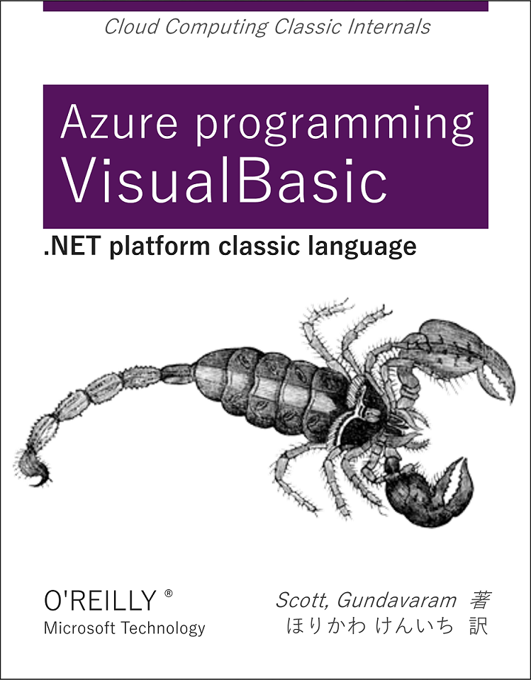

# Programming Guidelines for VisualBasic App

## Authors
1. [@xieguigang](https://github.com/xieguigang) ([xie.guigang@gcmodeller.org](mailto://xie.guigang@gcmodeller.org))
2. [@asuka](https://github.com/amethyst-asuka) ([amethyst.asuka@gcmodeller.org](mailto://amethyst.asuka@gcmodeller.org))

## Index
>1. [Easy Document in VisualBasic](https://github.com/xieguigang/VisualBasic_AppFramework/blob/master/guides/EasyDocument.md)
>2. [Code Style guidelines](https://github.com/xieguigang/VisualBasic_AppFramework/tree/master/vb_codestyle)
>3. [VisualBasic Type Characters](https://github.com/xieguigang/VisualBasic_AppFramework/blob/master/guides/dataTypes.md)
>4. [VisualBasic CLI pipeline](../Example/PipelineTest/README.md)
>
### Appendix
>1. [Deal with the github merge conflicts](https://github.com/xieguigang/VisualBasic_AppFramework/blob/master/guides/MergeGthubConflicts.md)
>2. [VB.NET how to?(Chinese version)](https://github.com/xieguigang/VisualBasic_AppFramework/blob/master/guides/VBdotNET_howto.md)
>

Hope this guide could help.

