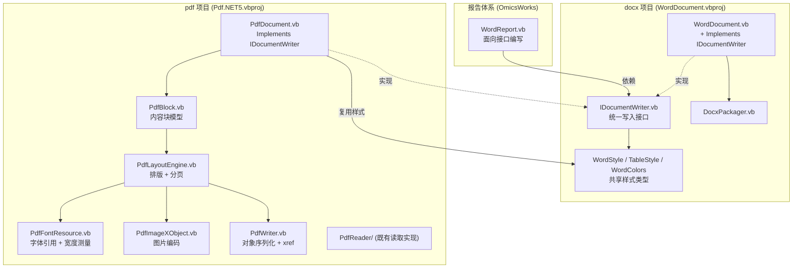

## 用户需求

在 `application%pdf` 项目中新增一个 PDF 写入（生成）模块，能够将**文本数据、表格数据、图片数据**写入并生成 PDF 文件；该模块必须与现有 `docx/WordDocument.vb` 提供**完全一致的编程接口体验**。

同时抽象出一套公共文档写入接口，让 `WordDocument`（生成 docx）与新的 PDF 写入对象（生成 pdf）**同时实现该接口**，从而在现有数据报告体系 `G:\OmicsWorks\src\src\Knowledge\ResearchReport\WordReport.vb` 中，只需传入不同的文档生成对象实例，报告的文档写入逻辑代码即可复用而无需改写。

## 产品概述

为文档处理模块补齐"写"方向的能力，形成"读（PdfReader）+ 写（PdfWriter）"闭环，并通过统一接口实现 docx / pdf 双格式输出的一份代码两种产物。

## 核心功能

### 1. 统一文档写入接口

- 覆盖元数据（作者、标题、主题、描述、标签）、样式配置、页面设置、内容写入、表格、图片、Markdown 内容块、保存等全部公开能力
- 全部写入方法返回接口自身，支持流式链式调用
- `WordDocument` 现有公开方法签名与返回类型保持完全不变，通过显式接口实现完成适配，不破坏任何既有调用方

### 2. PDF 文档生成

- **文本**：文档大标题、H1-H6 六级标题、正文段落（支持指定样式）、代码块、引用块、有序/无序列表、任务列表、定义列表、水平分割线
- **表格**：等宽表格、按窗口宽度自适应、按内容宽度自适应；支持表头底色与加粗、单元格对齐、隔行底色、三线表样式、跨页时表头重复
- **图片**：按磅值指定宽高或按原生比例自动缩放，自动限制在可打印区域内，支持居中显示与图注
- **排版**：自动换行、自动分页、分页符、目录页、页面尺寸与页边距设置（A4 / Letter / 自定义）
- **样式复用**：直接复用现有 `WordStyle` / `TableStyle` / `WordColors` 类型，字体、字号、粗斜体下划线、前景/背景色、对齐、行距、段前段后距、首行缩进等属性在两种格式中语义一致

### 3. 报告体系接入

- 报告生成代码通过接口类型编写一次，传入 docx 或 pdf 实例即可分别产出两种格式
- 提供 `WordReport.vb` 的迁移说明与最小验证方式

## 视觉效果

生成的 PDF 在版式上与 docx 输出保持视觉一致：标题分级明显且带主题色，正文行距舒适并支持首行缩进，表格具备清晰的边框、彩色表头与隔行底纹，图片居中并配灰色斜体图注，整体呈现规范的科研报告排版风格。

## 技术栈

- **语言/框架**：VB.NET，`net10.0`（沿用两个项目现有 `TargetFramework`）
- **docx 项目**：`applicationvnd.openxmlformats-officedocument.wordprocessingml.document/docx/WordDocument.vbproj`，RootNamespace = `Microsoft.VisualBasic.MIME.Office.WordDocument`
- **pdf 项目**：`application%pdf/Pdf.NET5.vbproj`，RootNamespace = `Microsoft.VisualBasic.MIME.application.pdf`
- **依赖**：`Pdf.NET5.vbproj` 已包含对 `WordDocument.vbproj`、`markdown.NET5.vbproj`、`JSON-netcore5.vbproj`、`Core.vbproj` 的 `ProjectReference`（当前 git 工作区已修改就位），**无需新增任何项目引用或 NuGet 包**
- **压缩**：复用 BCL `System.IO.Compression.DeflateStream`（`FlateDecode.vb` / `ImageHelper.vb` 已在用同一套 zlib 手法）

## 实现方案

### 总体策略

采用**接口抽象 + 双实现**：在 docx 项目内新增 `IDocumentWriter` 接口，抽出 `WordDocument` 的全部公开写入能力；`WordDocument` 用**显式接口实现**（`Private Function X(...) As IDocumentWriter Implements IDocumentWriter.X`）转调既有公开方法；PDF 侧新建 `PdfDocument` 类原生实现同一接口。调用方面向 `IDocumentWriter` 编程，即可通过替换实例切换输出格式。

### 关键技术决策

**决策 1：接口放在 docx 项目（用户已确认）**

`WordStyle` / `TableStyle` / `WordColors` 已定义在 docx 项目，且 pdf 项目已引用它。将 `IDocumentWriter` 与它们并置，可零成本复用样式类型，无需新建抽象项目、无需迁移类型、无需改动任何 `.vbproj`。代价是 pdf 项目在依赖方向上依赖 docx 项目，但该引用已存在，不引入新的耦合。

**决策 2：显式接口实现保证零破坏（用户已确认）**

`WordDocument` 现有方法返回具体类型 `WordDocument`，`WordReport.vb` 中 `ApplyReportStyles` 依赖此返回类型做链式调用。VB.NET 的显式接口实现允许**同名方法同时存在两个版本**：公开版返回 `WordDocument`，接口版返回 `IDocumentWriter`。这样：

- `WordDocument.vb` 中所有现有公开签名**一字不改**，仅在类声明加 `Implements IDocumentWriter` 并追加一段接口适配代码
- 通过 `WordDocument` 具体类型调用时，编译器优先绑定公开版，`WordReport.vb` 现有代码**无需修改即可继续编译通过**
- 通过 `IDocumentWriter` 变量调用时绑定接口版，链式返回接口类型

**注意重载消歧**：`Paragraph` 有 2 个重载、`Table` 有 3 个重载、`TableAutoFitWindow` / `TableAutoFitContents` 各 2 个重载。接口中必须逐一声明，且 `Implements` 子句需精确指向对应重载。`Table(headers, data As String(,))` 与 `Table(headers, rows As String()())` 在 VB 中签名可区分，但 `Table(headers, data(,), alignments())` 与 `Table(headers, rows()(), Optional alignments())` 需注意 `Optional` 参数导致的调用歧义——接口中保持与现有实现**完全相同**的参数形态（含 `Optional` 与默认值）即可复现当前行为。

**决策 3：自研原生 PDF 写入器（用户已确认）**

与自研 `PdfReader` 风格统一，零外部依赖、许可证干净。核心是手写 PDF 1.4 语法：间接对象表 + xref 表 + trailer；页面树 `/Pages` → `/Page`；每页一条 `/Contents` 内容流；`/Resources` 挂载 `/Font` 与 `/XObject`。

**架构要点：两阶段渲染。** docx 是流式文本标记，Word 负责排版；PDF 必须由生成器自己完成排版与分页。因此设计为：

1. **收集阶段**：所有 `H1/Paragraph/Table/Image/...` 调用不直接产出 PDF 字节，而是追加到一个 `List(Of PdfBlock)` 内容块队列（保存类型 + 文本 + 样式引用 + 表格/图片数据）
2. **布局与输出阶段**：`Save` 时由 `PdfLayoutEngine` 顺序遍历块队列，做换行测量、分页判断、Y 坐标推进，产出每页的内容流指令，再由 `PdfWriter` 序列化为完整 PDF 文件

这样分离的收益：分页/表格跨页/图片放不下自动换页等逻辑集中在一处，不污染 API 层；后续要加页眉页脚、页码、真实 TOC 页码回填，只需扩展布局阶段。时间复杂度 O(N) 对块数线性，字符宽度测量对每个字符 O(1) 查表。

**决策 4：引用系统字体不嵌入（用户已确认）**

对西文使用 PDF 标准 14 字体（Helvetica / Helvetica-Bold / Helvetica-Oblique / Courier），`/Encoding /WinAnsiEncoding`。

对中文，采用 **CID 字体 + 预定义 CMap，不嵌入字体文件**：`/Type0` 字体，`/Encoding /UniGB-UCS2-H`，`/DescendantFonts` 指向 `/CIDFontType0`，`/CIDSystemInfo` 为 `Adobe / GB1`，`/FontDescriptor` 只写度量信息与 `/Flags`，**不写 `/FontFile2`**。文本以 UTF-16BE 十六进制串 `<....>` 输出。阅读器会用本地字体替换渲染。这是"引用不嵌入"在 PDF 中处理 CJK 的标准做法，实现量小且无需 TTF 解析与子集化。

**已知取舍（需在代码注释与文档中明示）**：不嵌入字体意味着 PDF 不自包含，在缺少对应中文字体的机器/阅读器上可能显示为方框或被替换字形，且宽度测量按 CJK 全角 1000/1000 em 估算，与实际字体度量存在偏差。架构上把字体解析隔离在 `PdfFontResource` 中，未来若要改为嵌入子集，只需替换该类实现，不影响布局引擎与 API 层。

**决策 5：单位体系换算**

- docx：页面用 twips（1 英寸 = 1440），`WordStyle.Size` / `SpaceBefore` / `SpaceAfter` / `FirstLineIndent` 用磅（pt），图片用 EMU
- PDF：统一用磅（pt），1 英寸 = 72 pt
- 换算常量：**1 pt = 20 twips**。`PageSetup` 入参保持 twips（与接口一致），内部除以 20 转 pt。A4 = 11906×16838 twips = 595.3×841.9 pt，与 PDF A4 标准尺寸吻合，验证换算正确
- 坐标系差异：PDF 原点在**左下角**，Y 轴向上；布局引擎内部用"距页顶距离"推进，输出时统一转换为 `pageHeight - y`

**决策 6：图片处理**

- **JPEG**：直接以 `/DCTDecode` 作为 XObject 流原样嵌入，零解码开销
- **PNG**：需解码。复用 `ImageHelper.ReadImageDimensions` 读尺寸；像素数据用 `DeflateStream` 解 zlib 后逆向 PNG 行过滤器（None/Sub/Up/Average/Paeth 五种），得到 raw RGB，再用 `DeflateStream` 重新压缩为 `/FlateDecode` XObject；带 alpha 通道时拆出 `/SMask`
- 尺寸解算逻辑**完整移植** `WordDocument.ResolveImageExtent` 的语义（两者都给则不强制比例；只给一个则按原生比例推导；都不给则按原生像素；未知则退回可打印宽度 4:3），仅把 EMU 换成 pt，保证两种格式图片视觉一致
- 同一图片文件多次插入时按路径缓存 XObject，避免重复解码与重复嵌入导致文件膨胀

**决策 7：表格布局**

列宽策略对齐 docx 三种模式：等宽（内容宽度均分）、`window`（占满内容宽度）、`contents`（按内容测量宽度按比例分配，总宽不超过内容宽度）。单元格文本自动换行，行高取该行所有单元格换行后的最大高度。**跨页处理**：当前行放不下则换页，且若设置了表头则在新页重绘表头（对应 docx 的 `<w:tblHeader/>`）。三线表模式仅绘顶线、表头下线、底线且无表头底色（表头文字改深色），与 `WriteAutoFitTable` 的 `threeLine` 分支语义一致。

**决策 8：Toc 的语义差异**

docx 的 `Toc` 写入 Word 的 TOC 域，由 Word 打开时计算页码。PDF 无此机制。方案：收集阶段为每个 heading 记录标题与级别并占位一页；布局阶段先完成全文布局拿到各标题实际页码，再回填目录页条目（标题 + 前导点 + 页码），并为每个条目建立跳转到目标页的内部链接注解。这样 PDF 的目录是**开箱即用**的，体验优于 docx 需手动更新域。

## 实现要点

- **代码风格严格对齐仓库**：GPL3 文件头 `#Region` 注释块 + Code Statistics 区块 + 中文 XML 文档注释；**不写 `Namespace` 块**（依赖 `.vbproj` 的 `RootNamespace`，与 `WordDocument.vb` / `PdfReader.vb` 一致）
- **命名避冲突**：pdf 项目已存在 `PdfObject.vb` 中的 `PdfDictionary` / `PdfArray` / `PdfStream` / `PdfName` 等**读取方向**的公开类型，且同处一个根命名空间。写入侧新类型必须避免重名，统一加 `Writer` 前缀或采用 `PdfObj*` 之外的命名（如 `PdfWriterDict`、`PdfObjectWriter`），否则会与现有读取类型冲突导致编译失败。这是本次实现最容易踩的坑
- **`Save` 的资源管理**：用 `Using` 包裹 `FileStream`；写入前确保输出目录存在（对齐 `DocxPackager.Save` 第 96-100 行的建目录逻辑）
- **错误处理对齐现有约定**：图片文件不存在时走 `Console.Error.WriteLine($"[警告] ...")` 并跳过、返回自身继续链式调用，与 `WordDocument.Image` 第 800-803 行、`ImageHelper` 的告警风格完全一致；不抛异常中断整篇报告生成
- **避免日志刷屏**：图片解码失败等告警按文件路径去重，同一文件只警告一次
- **性能**：内容流用 `StringBuilder` 累积后一次性编码；字符宽度表用静态 `Dictionary` 缓存；xref 偏移量在写入过程中记录，避免二次扫描；大表格逐行流式输出不做全量物化
- **爆炸半径控制**：`WordDocument.vb` 仅新增 `Implements IDocumentWriter` 与一段集中的接口适配区（建议放在文件末尾"内部访问器"之后，用注释区块隔开），**不改动任何现有方法体与签名**；`DocxPackager.vb` / `WordStyle.vb` / `ImageHelper.vb` 完全不动
- **验证方式**：生成一份含 DocTitle / Toc / H1-H3 / 段落 / 三线表 / 图片 / 分页符的 PDF，用本项目现有 `PDF.GetText` 读回文本校验内容完整性，并用阅读器目视核对版式

## 架构设计



数据流：调用方链式调用 → `PdfDocument` 收集为 `PdfBlock` 队列 → `Save` 触发 `PdfLayoutEngine` 测量换行与分页 → 生成每页内容流 → `PdfWriter` 组装对象/xref/trailer → 落盘。

## 目录结构

```
mime/
├── applicationvnd.openxmlformats-officedocument.wordprocessingml.document/
│   └── docx/
│       ├── IDocumentWriter.vb   # [NEW] 统一文档写入接口。声明 WordDocument 的全部公开能力：
│       │                        #   元数据属性 Author/Title/Subject/Description/Tags/ApplicationName；
│       │                        #   样式 HeadingStyle/ParagraphStyle/DefaultStyle/TableStyle/CodeStyle/BlockquoteStyle/TitleStyle；
│       │                        #   页面 PageSetup/PageSetupA4/PageSetupLetter；
│       │                        #   内容 DocTitle/H1..H6/Heading/Paragraph(2 重载)/CodeBlock/Blockquote/List/TaskList/DefinitionList/Hr/PageBreak/Toc；
│       │                        #   表格 Table(3 重载)/TableAutoFitWindow(2 重载)/TableAutoFitContents(2 重载)；
│       │                        #   图片 Image；块 WriteBlocks；保存 Save。
│       │                        #   所有写入方法返回 IDocumentWriter 以支持链式调用。参数形态与现有实现逐字一致（含 Optional 默认值）。
│       │                        #   遵循仓库风格：GPL3 头注释 + 中文 XML 文档注释，不写 Namespace 块。
│       └── WordDocument.vb      # [MODIFY] 仅两处改动：(1) 类声明改为 Public Class WordDocument : Implements IDocumentWriter；
│                                #   (2) 文件末尾新增"IDocumentWriter 显式接口实现"区块，每个成员写成
│                                #   Private Function X(...) As IDocumentWriter Implements IDocumentWriter.X : Return X(...) : End Function
│                                #   转调既有公开方法。现有所有公开方法签名/返回类型/方法体一律不动，保证 WordReport.vb 零修改仍可编译。
│                                #   注意重载的 Implements 子句需精确对应。
└── application%pdf/
    └── PdfWriter/               # [NEW] PDF 写入子目录，与既有 PdfReader/ 并列
        ├── PdfDocument.vb       # [NEW] PDF 文档生成器主类，Implements IDocumentWriter。对外提供与 WordDocument 完全一致的
        │                        #   流式 API 与同形构造函数 New(Optional author, title, tags, subject, description)。
        │                        #   构造时初始化与 WordDocument 完全相同的默认样式（H1-H6 字号 24/22/20/18/16/14、
        │                        #   正文 Calibri+雅黑 11pt 行距 1.5、代码 Consolas 10pt、引用斜体、标题 36pt 居中蓝）。
        │                        #   内部仅收集 PdfBlock 队列与样式状态，不做排版；Save 时委托布局引擎与序列化器。
        │                        #   页面参数以 twips 入参、内部转 pt 存储。Image 文件缺失时走 [警告] 日志并跳过。
        ├── PdfBlock.vb          # [NEW] 内容块模型。定义 PdfBlockType 枚举（Title/Heading/Paragraph/Code/Quote/List/TaskList/
        │                        #   DefList/Hr/PageBreak/Toc/Table/Image）与 PdfBlock 类（承载文本、级别、样式快照、
        │                        #   表格 headers/rows/alignments/模式标志、图片路径与目标尺寸、图注）。
        │                        #   样式必须在入队时 Clone 快照，避免后续 XxxStyle() 调用回溯影响已写入内容。
        ├── PdfLayoutEngine.vb   # [NEW] 排版与分页核心。负责：按可打印宽度做文本换行测量（中英文混排，CJK 可任意断行、
        │                        #   西文按空格断词）、行高与段前段后距推进、首行缩进、对齐（left/center/right/justify）、
        │                        #   剩余空间不足时自动分页、表格列宽计算（等宽/window/contents 三模式）与跨页重绘表头、
        │                        #   三线表边框分支、图片按 ResolveImageExtent 同语义解算尺寸并居中、
        │                        #   Toc 两遍布局（先全文定位标题页码再回填目录页与跳转注解）。
        │                        #   输出为每页的 PDF 内容流指令字符串。
        ├── PdfFontResource.vb   # [NEW] 字体资源管理（引用系统字体，不嵌入）。西文映射 PDF 标准 14 字体
        │                        #   （Helvetica/-Bold/-Oblique/Courier）配 /WinAnsiEncoding；中文构建 /Type0 +
        │                        #   /Encoding /UniGB-UCS2-H + /CIDFontType0 后代字体 + /CIDSystemInfo(Adobe,GB1)，
        │                        #   /FontDescriptor 不含 /FontFile2。提供 MeasureText(text, style) 字符宽度测量
        │                        #   （标准字体内置宽度表 + CJK 按全角估算）与 EncodeText 输出 UTF-16BE 十六进制串。
        │                        #   宽度表用静态 Dictionary 缓存。字体解析在此隔离，未来改嵌入子集只需替换本类。
        ├── PdfImageXObject.vb   # [NEW] 图片转 PDF XObject。JPEG 走 /DCTDecode 原样嵌入；PNG 解 zlib 后逆向五种行过滤器
        │                        #   （None/Sub/Up/Average/Paeth）得 raw RGB，再 Flate 压缩为 /FlateDecode，
        │                        #   含 alpha 时拆出 /SMask。复用 ImageHelper.ReadImageDimensions 读原生尺寸。
        │                        #   按文件路径缓存已编码 XObject，避免同图重复解码与重复嵌入。
        │                        #   不支持的格式打印 [警告] 并跳过（同一文件仅告警一次）。
        ├── PdfWriter.vb         # [NEW] PDF 文件序列化器。负责间接对象编号分配、对象体写出、
        │                        #   /Catalog + /Pages 页面树 + 各 /Page（含 /MediaBox /Resources /Contents /Annots）、
        │                        #   /Info 文档信息字典（映射 Author/Title/Subject/Keywords(Tags)/Creator(ApplicationName)）、
        │                        #   内容流 Flate 压缩、xref 交叉引用表与 trailer、%%EOF。
        │                        #   写入过程中记录各对象字节偏移供 xref 使用，避免二次扫描。
        │                        #   Save 用 Using 管理 FileStream，写入前自动创建输出目录。
        │                        #   注意：新增类型名不得与 PdfReader/PdfObject.vb 中既有的 PdfDictionary/PdfArray/
        │                        #   PdfStream/PdfName 等读取侧公开类型冲突（同属一个根命名空间）。
        └── PdfColor.vb          # [NEW] 颜色工具。将 WordColors 的 6 位十六进制 RGB 字符串（无 # 前缀）转换为
                                 #   PDF 内容流所需的 0-1 归一化 RGB 三元组，并生成 rg（填充）/ RG（描边）指令。
                                 #   对非法或空字符串做安全兜底（返回黑色 / 视为无底色）。
```

## 关键代码结构

统一接口的核心契约（仅列关键片段，实际需覆盖全部成员）：

```
''' <summary>
''' 统一文档写入接口。WordDocument(docx) 与 PdfDocument(pdf) 均实现该接口，
''' 使同一份文档写入代码可通过传入不同实例生成不同格式。
''' 所有写入方法返回 IDocumentWriter 以支持流式链式调用。
''' </summary>
Public Interface IDocumentWriter

    Property Author As String
    Property Title As String
    Property Subject As String
    Property Description As String
    Property Tags As String()
    Property ApplicationName As String

    Function HeadingStyle(level As Integer, style As WordStyle) As IDocumentWriter
    Function ParagraphStyle(style As WordStyle) As IDocumentWriter
    Function TableStyle(style As TableStyle) As IDocumentWriter

    Function PageSetup(pageWidth As Integer, pageHeight As Integer,
                       marginTop As Integer, marginRight As Integer,
                       marginBottom As Integer, marginLeft As Integer) As IDocumentWriter
    Function PageSetupA4() As IDocumentWriter

    Function Heading(level As Integer, text As String) As IDocumentWriter
    Function Paragraph(text As String) As IDocumentWriter
    Function Paragraph(text As String, style As WordStyle) As IDocumentWriter

    Function Table(headers As String(), rows As String()(),
                   Optional alignments As String() = Nothing) As IDocumentWriter
    Function TableAutoFitWindow(headers As String(), rows As String()(),
                                Optional alignments As String() = Nothing,
                                Optional center As Boolean = False,
                                Optional threeLine As Boolean = False) As IDocumentWriter

    Function Image(file As String,
                   Optional width As Double = 0,
                   Optional height As Double = 0,
                   Optional caption As String = "") As IDocumentWriter

    Function WriteBlocks(blocks As IEnumerable(Of JSONSchema.Block)) As IDocumentWriter

    Sub Save(filePath As String)

End Interface
```

`WordDocument` 的零破坏适配范式：

```
' 公开方法保持原样不动，返回具体类型
Public Function H1(text As String) As WordDocument
    Return Heading(1, text)
End Function

' 文件末尾集中追加显式接口实现，转调公开方法
Private Function IDocumentWriter_H1(text As String) As IDocumentWriter Implements IDocumentWriter.H1
    Return H1(text)
End Function
```

## 消费方迁移说明

`WordReport.vb` 当前的扩展方法首参类型为具体的 `WordDocument`。**本次改造后该文件无需任何修改即可继续编译并正常产出 docx**。

若要启用"传入不同实例产出 pdf"的能力，需将该文件中扩展方法的首参类型由 `WordDocument` 改为 `IDocumentWriter`（涉及 `WriteResultsSections` / `WriteFigure` / `WriteTable` / `ApplyReportStyles` 及 `BuildWordReport` 中的 `doc` 声明），改为由外部传入实例而非内部 `New WordDocument(...)`。这是启用多态输出的必要一步，属于调用方的一次性适配，方案会同步给出改造示例。

## Agent Extensions

### SubAgent

- **code-explorer**
- Purpose: 在实现前系统性核查 `application%pdf` 项目中既有公开类型的命名占用情况（`PdfReader/PdfObject.vb` 中的 `PdfDictionary` / `PdfArray` / `PdfStream` / `PdfName` / `PdfNumber` 等），因两个方向的实现同处一个根命名空间，写入侧新类型一旦重名将直接导致编译失败
- Expected outcome: 输出既有公开类型的完整清单与冲突风险点，据此确定写入侧类型的最终命名方案，确保新增文件一次性编译通过