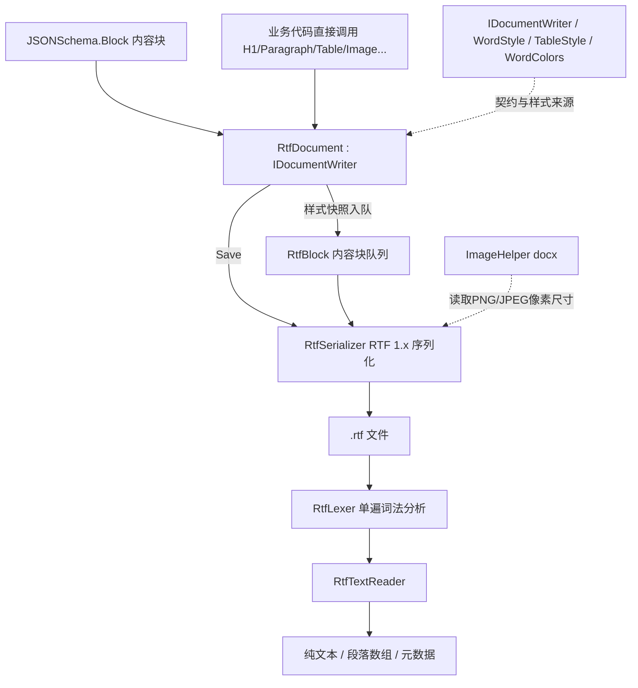

## 产品概述

在现有 `application%rtf` 项目中补齐两条此前缺失的能力：一是**按统一文档写入接口生成 RTF 文档**（可由 Markdown 内容块直接驱动），二是**从 RTF 文档中读回文本**；同时不破坏现有的 `Rtf` / `FormatedRegion` / `Font` 文档模型。

## 核心功能

### 1. RTF 文档生成

- 新增可直接替换 docx / pdf 写入器使用的 RTF 写入器，调用方式与既有写入器完全一致（同一份写入代码换实例即可产出不同格式）。
- 支持文档元数据（作者、标题、主题、描述、标签、生成程序名）。
- 支持样式设置：标题 1-6 级、正文、默认、代码块、引用块、文档大标题、表格样式。
- 支持页面设置：纸张与四边距（默认 A4、Letter 预设）。
- 支持内容写入：大标题、H1-H6、段落（可指定样式）、代码块、引用块、有序/无序列表、任务列表、定义列表、水平分割线、分页符、目录。
- 支持表格：等宽表格、按窗口宽度自适应、按内容宽度自适应、居中、三线表、逐列左/中/右对齐。
- 支持图片：png/jpg 以十六进制二进制内嵌进 RTF，按页面宽度或给定尺寸换算显示大小；文件缺失时跳过并输出警告，不影响其余内容。
- 支持由 Markdown 内容块批量写入：标题、段落、代码、引用、列表/任务列表/定义列表、表格、分割线、图片（其余类型降级为普通段落文本）。
- 输出为符合 RTF 1.x 规范、可被 Word / LibreOffice / 写字板直接打开的 `.rtf` 文件，含字体表、颜色表与生成器元数据，中文正确显示。

### 2. RTF 文档解析

- 解析 `.rtf` 文件或文本流，输出整篇纯文本。
- 输出按段落切分的文本数组（逐段产出）。
- 输出文档元数据：标题、作者、生成程序等（缺失时给出空值而不报错）。
- 忽略字体表、颜色表、样式表、图片、域代码等非正文内容；正确还原段落、软换行、制表符、表格单元格分隔与 Unicode 转义字符（含中文）。
- 无效/损坏内容具备容错能力，不抛出不可控异常。

### 3. 兼容与验证

- 既有 `Rtf` / `FormatedRegion` / `Font` 的公开 API 与行为保持不变，新能力以新增类型提供。
- 提供可运行的控制台示例：用内容块生成 RTF → 解析回来 → 自校验文本内容一致，并演示与 docx/pdf 写入器共用同一段调用代码。

## 技术选型

- 语言与运行时：**VB.NET**，目标框架 **net10.0**，SDK 风格工程（沿用 `RTF.vbproj` 现有配置：RootNamespace / AssemblyName = `Microsoft.VisualBasic.MIME.RTF`、`GenerateDocumentationFile`、`GeneratePackageOnBuild`）。
- 依赖：**不新增任何 NuGet 依赖**。`RTF.vbproj` 已引用 `Microsoft.VisualBasic.Core`、`application%json`、`text%markdown`（提供 `JSONSchema.Block`）、docx 的 `WordDocument.vbproj`（提供 `IDocumentWriter`、`WordStyle`、`TableStyle`、`WordColors`、`ImageHelper`），实现目标所需的类型全部可直接使用。
- 文本处理：`System.Text.StringBuilder` / `System.Text.Encoding`、`System.IO`，纯 BCL；解析器不依赖绘图或 Office 组件。
- 编码策略：写入侧所有非 ASCII 字符统一以 `\uN?`（有符号 16 位）输出，保证中文在任何打开环境下正确显示；读取侧对 `\'hh` 十六进制转义按需注册代码页提供程序（`CodePagesEncodingProvider`，注册失败时降级为单字节拉丁映射），并优先识别 `\uN`。

## 实现方案

整体沿用 `application%pdf` 已确立并验证过的范式（**新类与 `PdfDocument` 对称**）：

1. **块队列 + Save 时渲染**：写入 API 只把内容收集为 `RtfBlock`（样式在入队时 `Clone()` 快照，避免后续改样式回溯影响已写内容），`Save` 时一次性序列化为 RTF 文本。
2. **接口落点**：公开方法返回具体类型 `RtfDocument`（协变、链式调用），接口成员由 `Private Function IDW_Xxx(...) As IDocumentWriter Implements IDocumentWriter.Xxx` 显式实现并转发到公开方法——这是 docx/pdf 两个既有实现共同遵循的仓库惯例，必须照此办理，保证三种写入器可互换。
3. **样式翻译层**：新增内部映射，把 `WordStyle`（磅/倍数/十六进制 RGB）翻译为 RTF 控制字（`\fs` 取磅×2 半磅、`\b/\i/\ul`、`\ql/\qc/\qr/\qj`、`\sb/\sa` 取磅×20 twips、`\sl`/`\slmult`、`\fi`、段落底纹）。`WordColors` 的 6 位 hex 转 `\redN\greenN\blueN;` 颜色表项；字体与颜色表用 `Dictionary(Of String, Integer)` 去重并**保证表项序号与 `\fN`/`\cfN` 严格对齐**（旧 `Rtf` 存在序号错位缺陷，新实现不复用其表生成逻辑）。
4. **解析器为单遍词法分析**：显式栈处理 `{}` 分组与 `\*` 可忽略目标，遇到 `fonttbl/colortbl/stylesheet/info/pict/object/...` 整组跳过；`\par`/`\line`/`\row` 产出段落边界，`\tab`/`\cell` 产出分隔符，`\bin` 按长度跳过二进制；对未闭合分组等畸形输入直接结束解析并返回已收集文本（不抛异常）。
5. **性能与复杂度**：写入为 O(总文本长度) 单遍拼接；表项查找 O(1)（避免旧实现的 `Array.IndexOf` 线性查找）；图片十六进制编码预分配字符缓冲并以查表法输出，避免逐字节字符串拼接导致 O(n²)；解析为 O(输入长度) 单遍、内存占用与输出文本同阶。大文档不做递归下降，避免深嵌套栈溢出风险。

关键权衡：TOC 不依赖 Word 域动态生成（域在非 Word 打开器中不可靠），改为对已写入标题生成静态缩进目录文本，结果确定、可被解析回读；表格自适应按内容宽度以“各列最大文本长度占比”分配可用宽度，简单稳定且无文本量测依赖。

## 实施要点

- **不改动既有行为**：`Rtf.vb`、`Font.vb`、`FormatedRegion.vb`、`Models/Font.vb`、`Omml/*` 一律不动（`InternalSetFormat` 仍保持 `NotImplementedException`），新能力全部落在新增文件中，零回归面。
- **命名冲突防护**：
- 新文件不得命名 `RTF.vb`（与既有 `Rtf.vb` 在 Windows 大小写不敏感文件系统上冲突），也不得在同一命名空间声明名为 `RTF` 的类型（VB 标识符大小写不敏感，会与 `Rtf` 类重复）。
- 新文件只 `Imports Microsoft.VisualBasic.MIME.Office.WordDocument` 与 `Microsoft.VisualBasic.MIME.text.markdown`，**不要 `Imports System.Drawing`**，避免 `Font` 与本项目既有 `Font` 类歧义；`Omml` 命名空间下的同名 `WordDocument`/`Paragraph`/`Font` 不做 `Imports`，避免歧义。
- **目录约定**：VB 工程无按目录自动命名空间，新增文件一律**不声明 Namespace**（落在根命名空间 `Microsoft.VisualBasic.MIME.RTF`），与 `PdfWriter/PdfDocument.vb` 的做法一致。
- **日志与错误**：沿用现有风格，问题走 `Console.Error.WriteLine($"[警告] ...")`；图片缺失/尺寸无法识别按 pdf 侧既有行为跳过并告警；解析失败不向调用方抛异常（文件不存在可抛 `FileNotFoundException`，与 `DocxTextReader` 一致）。
- **不引入新依赖、不改动无关工程**；主项目新增 `test` 子目录时必须加 `<Compile Remove="test\**" />` 等排除项（`RTF.vbproj` 目前没有该排除项，否则示例代码会被编入库）。

## 架构设计



## 目录结构

```
application%rtf/
├── Writer/
│   ├── RtfBlock.vb            # [NEW] RTF 中间内容块模型。定义 RtfBlockType 枚举（Title/Heading/Paragraph/Code/Quote/List/TaskList/DefList/Hr/PageBreak/Toc/Table/Image）与 RtfBlock 类：块类型、文本、标题级别、列表有序标志、任务勾选、定义列表术语、样式快照（WordStyle，入队时 Clone）、表格表头/行/对齐/自适应模式/居中/三线表、图片路径/目标宽高/图注。字段设计与 PdfBlock 对齐，保证两种写入器语义一致。
│   ├── RtfDocument.vb         # [NEW] RTF 文档写入器，Public Class RtfDocument : Implements IDocumentWriter。元数据属性（Author/Title/Subject/Description/Tags/ApplicationName）；构造 New(Optional author, title, tags, subject, description) 并按 WordDocument/PdfDocument 完全一致的默认样式初始化 6 级标题与正文/默认/代码/引用/大标题样式及 TableStyle；页面尺寸以 twips 保存（默认 A4：11906×16838，四边距 1440）。公开方法全部返回 RtfDocument 以支持链式调用，并成对提供 Private Function IDW_Xxx(...) As IDocumentWriter Implements IDocumentWriter.Xxx 显式转发。WriteBlocks/WriteBlock 覆盖 heading/paragraph(p)/code/quote|blockquote/list|li|bulletedlist|orderedlist/tasklist|tasks|todo/deflist|definition|dl/table/hr|horizontal-rule|thematic-break/image|img/link|a/math|equation|tex|latex/footnote|note 及 type 为空/未知时降级为段落。Image() 复用 docx 的 ImageHelper.ReadImageDimensions 取像素尺寸，文件缺失/无法识别时告警并跳过。Save(filePath) 委托 RtfSerializer 落盘。
│   └── RtfSerializer.vb       # [NEW] RTF 1.x 序列化器。生成文档头（\rtf1\ansi\ansicpg936\deff0\deflang1033\deflangfe2052\viewkind4\uc1\pard）、fonttbl（{\fN\fnil\fcharset134 name;}，N 与 \fN 严格对齐，中文用 fcharset134）、colortbl（首项留空对应 \cf0 自动色，自定义色自 \cf1 起，\redN\greenN\blueN;）；把 RtfBlock 逐块渲染为控制字文本：文本转义（\\ \{ \}）与非 ASCII 的 \uN?（半磅字号、粗斜下划线、颜色/底纹、对齐、段前段后、行距、首行缩进）；列表用 \li/\fi 缩进加项目符号或序号；任务列表用 ☑/☐；Hr 用段落下边框；PageBreak 用 \page；Toc 输出已收集标题的静态缩进目录；表格输出 \trowd\trgaph\cellx...\intbl...\cell...\row，支持表头行 \trhdr 与底纹、逐列对齐、三线表边框、等宽/按窗口/按内容宽度三种列宽分配；图片输出 {\pict\pngblip|\jpegblip\picw\pich\picwgoal\pichgoal 十六进制流}，十六进制转换预分配缓冲并查表输出。以无 BOM 编码写出文件。
├── Reader/
│   ├── RtfLexer.vb            # [NEW] RTF 词法/分组解析器。单遍扫描并维护分组栈，识别控制字（\word[-]N? 与可选分隔空格）、控制符号（\'hh、\*、\~、\-、\_）、\uN（有符号 16 位，并按 \ucN 跳过回退字符）、\bin N（跳过 N 字节）；维护可忽略目标集合（fonttbl/colortbl/stylesheet/info/listtable/listoverridetable/rsidtbl/pict/shppict/nonshppict/object/comment/footnote/generator/filetbl/xmlnstbl/fldinst/...）整组跳过；输出正文文本事件（字符、段落边界 \par|\line|\row、分隔符 \tab|\cell、分页 \page）；对畸形输入（未闭合分组、非法字节）安全终止。\'hh 解码按需注册 CodePagesEncodingProvider 并使用 cp936，注册不可用时降级为单字节映射。
│   ├── RtfTextReader.vb       # [NEW] RTF 文本读取器。Public Class RtfTextReader：ExtractText(filePath|stream) As String（文件不存在抛 FileNotFoundException，末尾 TrimEnd）、ExtractParagraphs(...) As String()（按段落切分，空段保留策略与 DocxTextReader 一致）、ExtractMetadata(...) 返回标题/作者/生成程序（缺省为空字符串），并提供 Shared Iterator Function GetText(filePath|stream) As IEnumerable(Of String) 逐段产出，作为与 pdf 侧 PDF.GetText 对应的模块级入口。
│   └── (无 RTF.vb，避免与 Rtf.vb 文件/类型名冲突)
├── test/
│   ├── test.vbproj            # [NEW] 控制台示例工程，参照 pdf/test/test.vbproj：SDK 风格、net10.0、OutputType Exe、Platforms AnyCPU;x64、配置集合与主项目一致，ProjectReference 指向 ..\RTF.vbproj 与 ..\..\..\Microsoft.VisualBasic.Core\src\Core.vbproj。
│   └── Program.vb             # [NEW] 演示与自校验：构造 JSONSchema 内容块（含中文标题/段落/代码/列表/表格/分割线/图片）→ 经 RtfDocument 写入 .rtf → 用 RtfTextReader 解析回来 → 断言关键文本与段落数一致，并同样用 IDocumentWriter 变量演示 docx/pdf/rtf 三种实现互换；输出通过/失败结论。
├── RTF.vbproj                 # [MODIFY] 增加 <Compile Remove="test\**" /> 等排除项；更新 Description/PackageTags/PackageReleaseNotes/ReleaseNotes 以覆盖“IDocumentWriter 实现 + Markdown 内容块写入 + RTF 文本提取”三项新能力；保留既有 ProjectReference 与 README 打包项不变。
├── RTF.sln                    # [MODIFY] 将新增的 test.vbproj 与 docx 的 WordDocument.vbproj 加入解决方案（后者已被 RTF.vbproj 引用但未在 sln 中登记）。
└── README.md                  # [MODIFY] 更新命名空间地图与关键类型清单，新增“RtfDocument（IDocumentWriter 实现）”与“RtfTextReader（文本/段落/元数据提取）”章节，补充同时生成 docx/pdf/rtf 与回读文本的快速上手示例。
```

## 关键代码结构

```
' Writer/RtfBlock.vb —— 与 PdfBlock 对齐的中间内容块
Public Enum RtfBlockType
    Title : Heading : Paragraph : Code : Quote : List
    TaskList : DefList : Hr : PageBreak : Toc : Table : Image
End Enum

Public Class RtfBlock
    Public Type As RtfBlockType
    Public Text As String                 ' 标题/段落/代码/引用
    Public Level As Integer = 1           ' 标题级别 1-6
    Public Ordered As Boolean = False     ' 列表有序标志
    Public Checked As Boolean = False     ' 任务列表勾选
    Public Term As String                 ' 定义列表术语
    Public Style As WordStyle             ' 样式快照（入队时 Clone）
    Public TableHeaders As String()
    Public TableRows As String()()
    Public TableAlignments As String()    ' left | center | right
    Public TableMode As String = "equal"  ' equal | window | contents
    Public TableCenter As Boolean = False
    Public TableThreeLine As Boolean = False
    Public ImagePath As String
    Public ImageWidth As Double = 0       ' pt，0 表示按原生比例
    Public ImageHeight As Double = 0
    Public ImageCaption As String
End Class
```

```
' Reader/RtfTextReader.vb —— 对外读取契约
Public Class RtfTextReader
    Public Function ExtractText(filePath As String) As String
    Public Function ExtractText(stream As Stream) As String
    Public Function ExtractParagraphs(filePath As String) As String()
    Public Function ExtractMetadata(filePath As String) As RtfDocumentInfo
    Public Shared Iterator Function GetText(filePath As String) As IEnumerable(Of String)
    Public Shared Iterator Function GetText(stream As Stream) As IEnumerable(Of String)
End Class
```

## Agent Extensions

### SubAgent

- **code-explorer**
- Purpose: 在实现前对 `IDocumentWriter` 的完整成员清单、docx 侧 `WordStyle`/`TableStyle`/`WordColors`/`ImageHelper` 的公开签名与用法、以及本仓库中 `Rtf` 类与各写入器的既有调用点做一次系统核对。
- Expected outcome: 产出一份可执行的方法对照表（接口成员 ↔ RtfDocument 公开方法 ↔ IDW_ 显式实现）与调用点清单，确保 RTF 写入器不遗漏/不写错任何接口成员，并确认改动的影响范围仅限新增文件。