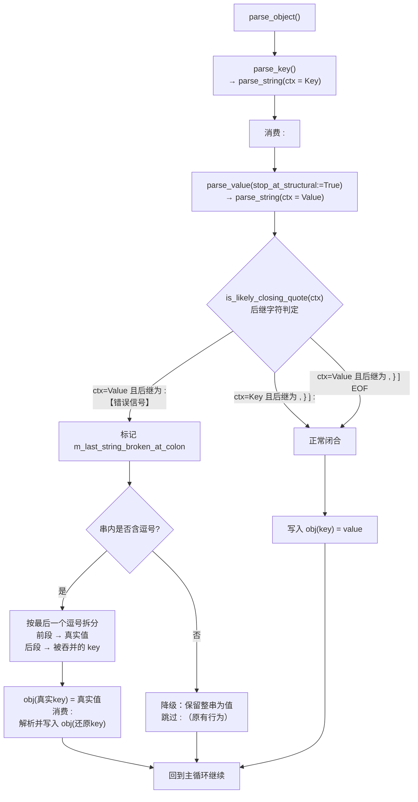

## 用户需求

从生产环境中遇到的严重语法错误 JSON 文档 `test/test_error_json.json` 中，抽提出可被通用化修复的语法错误类型，并升级 `LenientParser/LenientJsonParser.vb` 的容错解析能力，使其能以**通用策略**（而非针对该文件的特例硬编码）修复此类错误，从该文档中还原出更多有效信息，提升生产代码的稳健性。

## 问题现状

`test/test_error_json.json` 是一份单行 JSON 文档，存在系统性重复出现的语法错误，导致现有宽容解析器**完全无法提取任何有效内容**。

错误的实际形态是：字符串值的**闭合引号被遗漏**，致使该字符串吞掉了后面的 `", "` 分隔符与紧随其后的属性名。例如：

- 错误形式：`"module_name": "multiplevar_test,goal": "通过主成分分析..."`
- 正确形式：`"module_name": "multiplevar_test", "goal": "通过主成分分析..."`

该错误在文档中反复出现，涉及 `module_name`/`goal`、`xlsx_file`/`sheets`，以及 `sheets` 数组内 9 个对象各自的 `csv`/`sheet_name`/`annotation` 字段。

现有解析器遭遇该错误后会发生**键值级联错位**：值被错误地取成 `multiplevar_test,goal`，随后多余的 `:` 被静默跳过，紧接着的整段正文被当作下一个属性名读取，如此逐级错位，最终产出一个内容被打散成垃圾属性名的对象，毫无可用信息。

## 核心功能

- **抽提通用错误类型**：将该错误归纳为「值位置字符串缺失闭合引号，吞并了分隔符与后继属性名」这一普适错误类别，其判定依据是 JSON 语法的硬性约束——处于**值位置**的字符串，其闭合引号之后合法的后继字符只能是 `,`、`}`、`]`，**绝不可能是 `:`**。一旦出现 `:`，即可确证发生了本类错误。
- **引入 key/value 位置上下文感知**：让字符串解析过程知晓自身处于属性名位置还是值位置，从而对 `:` 这一后继字符作出截然不同的判定。
- **自动拆分还原**：确认错误后，按字符串内容中的**最后一个逗号**切分，逗号之前还原为真实值，逗号之后还原为被吞并的下一个属性名，并回填到对象中继续正常解析。
- **保持既有容错能力不回退**：原有 15 条修复策略（注释跳过、单引号字符串、未闭合截断修复、缺失冒号容忍、无引号属性名、智能引号闭合探测等）行为完全保留。
- **验证效果**：修复后应能从该文档还原出完整正确的结构——顶层含 `module_index`、`module_name`、`goal`、`xlsx_file`、`sheets`，且 `sheets` 数组内 9 个对象各自含正确的 `csv`、`sheet_name`、`annotation` 三个字段。

## 技术栈

- **语言/框架**：VB.NET（.NET Core 5，项目 `JSON-netcore5.vbproj`）
- **改造目标**：`LenientParser/LenientJsonParser.vb`（命名空间 `LenientJson`，类 `LenientJsonParser`）
- **依赖类型**：`Javascript/JsonObject.vb`、`Javascript/JsonArray.vb`、`Javascript/JsonValue.vb`
- **验证载体**：`test/simple_jsonParserTest.vb`（既有 Module，含 `Main11`/`test1`/`test2`/`test3`）

## 实现思路

### 核心洞察

现有 `is_likely_closing_quote()`（第 1014-1049 行）把 `:` 无条件列入了「合法后继字符」集合：

```
Return nextChar = ","c OrElse nextChar = "}"c OrElse nextChar = "]"c OrElse nextChar = ":"c
```

这是失效的根源。`:` 只有当字符串处于 **key 位置**时才是合法后继；处于 **value 位置**时，`:` 恰恰是「闭合引号缺失」这一错误的**确定性信号**。当前实现缺失这层上下文，把错误信号误判成了正常闭合。

### 修复策略（新增第 16 条：Missing Closing Quote Recovery）

采用「**上下文感知 + 值位置错位拆分**」两步法，全部改动收敛在 `LenientJsonParser.vb` 内部，不触碰任何公开 API：

**第一步：为字符串解析引入位置上下文**

给 `parse_string()` 与 `is_likely_closing_quote()` 增加一个表示解析上下文的参数（key 位置 / value 位置）。判定规则分化为：

- **key 上下文**：合法后继为 `,` `}` `]` `:` —— 与现有行为完全一致，零回退风险。
- **value 上下文**：合法后继仅为 `,` `}` `]` 以及 EOF；遇到 `:` 则**不**判定为正常闭合，而是标记为「疑似缺失闭合引号」。

为避免污染方法签名并便于在字符串解析结束后回传判定结果，采用「解析上下文枚举参数 + 私有字段记录本次字符串是否触发错位」的组合。因 `parse_string()` 返回类型为 `String`，用一个私有布尔字段（如 `m_last_string_broken_at_colon`）承载副带信息是此处最小侵入的做法，符合该类已有的以 `m_` 前缀字段维护解析状态的风格。

**第二步：在 `parse_object()` 中执行拆分还原**

`parse_object()` 解析完值后，若检测到本次值字符串触发了「值位置遇 `:`」信号，则执行还原：

1. 在字符串内容中定位**最后一个逗号**（该逗号即被吞掉的 `", "` 分隔符残留）。
2. 逗号之前的文本 → 修剪后作为**真实值**写入当前 key。
3. 逗号之后的文本 → 修剪并剥除可能残留的引号后，作为**下一个 key**。
4. 消费掉当前位置的 `:`，直接解析出下一个 key 的值并写入，然后回到主循环继续。

若字符串中不含逗号（无法可靠拆分），则**降级为原有行为**（保留整串作为值并跳过 `:`），保证策略永不使情况变得更糟。

### 关键技术决策与权衡

| 决策 | 理由 |
| --- | --- |
| 以「值位置后继为 `:`」作为唯一触发信号 | 这是 JSON 语法的硬性约束推导出的**确定性**判据，非启发式猜测。合法 JSON 永远不会触发，因此对正常文档零误伤，完全满足用户「通用而非特例」的要求。 |
| 按**最后一个**逗号切分而非第一个 | 真实值内部可能天然包含逗号（本文档的中文 `goal` 长文本即含大量中文逗号与顿号）。被吞并的属性名是标识符，几乎不含逗号，故最后一个逗号才是分隔符残留位置。这是本场景下最稳健的切分点。 |
| key 上下文保持原有判定逻辑不变 | 严格控制爆炸半径，确保 15 条既有策略行为零回退。 |
| 拆分失败时降级为原行为 | 安全兜底，保证新策略是纯增益。 |
| 不做输入预处理/正则重写 | 该文档单行且体积可观，正则全局改写既不可靠也带来额外内存拷贝。在既有单遍游标扫描中就地判定，维持 O(n) 单次扫描，无额外空间开销。 |


### 性能

保持原有 **O(n) 单遍字符扫描**特性。新增逻辑仅在错误实际触发时执行一次字符串内的反向找逗号（`LastIndexOf`），属局部 O(m) 操作且仅在异常路径触发，正常文档完全不受影响。无新增内存分配热点。

## 实施要点

- 遵循该文件既有代码风格：私有方法 snake_case（`parse_value`、`is_likely_closing_quote`）、字段 `m_` 前缀、轻量 helper 标注 `<MethodImpl(MethodImplOptions.AggressiveInlining)>`、逻辑分组使用 `#Region`。
- 类头 XML 注释中维护着「15 条修复策略」编号清单（`<list type="number">`，第 84-100 行），需追加第 16 条并保持同等详实的文档风格；`parse_string()`、`parse_object()`、`is_likely_closing_quote()` 的 XML 文档注释同步更新。
- `parse_object()` 中写入键值统一使用索引器赋值 `obj(key) = value`（覆盖语义），**不要**改用 `JsonObject.Add`——后者基于 `Dictionary.Add`，重复 key 会抛异常，与宽容解析的设计意图相悖。
- 还原出的下一个 key 需做 `Trim()` 并剥除可能残留的前后引号字符，防止把 `"` 带进属性名。
- 空 key 或空白 key 的情形要有防护，避免产生无意义的空属性名。
- 文档中的 `F:\\datapool\\...` 路径含大量 `\\` 转义，现有 `parse_string()` 的 `Case "\"c` 分支已能正确处理，**不需改动**。
- 公开 API（`Parse`、`ParseJSON`、`Open`、`OpenStream`）签名与行为保持不变，`LenientJsonExtensions.vb` 的 `ParseJsonLenient`/`LoadLenientJson`/`RepairJson` 无需改动即可自动受益。

## 架构设计

改动完全内聚于 `LenientJsonParser` 类内部的解析流程，不引入新组件、不改变对外契约。



## 目录结构

```
mime/application%json/
├── LenientParser/
│   └── LenientJsonParser.vb        # [MODIFY] 核心改造文件。
│                                   #   1) 新增解析上下文枚举（Key / Value 两种字符串位置语义）；
│                                   #   2) 新增私有字段 m_last_string_broken_at_colon，记录本次
│                                   #      字符串解析是否在值位置遭遇 : （缺失闭合引号信号）；
│                                   #   3) parse_string() 增加上下文参数，在值位置遇 : 时置位标记
│                                   #      并结束字符串；
│                                   #   4) is_likely_closing_quote() 增加上下文参数，key 位置沿用
│                                   #      原判定（, } ] :），value 位置排除 : 并将其识别为错误信号；
│                                   #   5) parse_key() 以 Key 上下文调用 parse_string()；
│                                   #      parse_value() 以 Value 上下文调用；
│                                   #   6) parse_object() 新增错位还原分支：按最后一个逗号拆分出
│                                   #      真实值与被吞并的 key，消费 : 后解析该 key 的值并回填；
│                                   #      无逗号时降级为原有行为；
│                                   #   7) 类头策略清单追加第 16 条 "Missing Closing Quote Recovery"，
│                                   #      并同步更新相关方法的 XML 文档注释。
│                                   #   约束：保持 snake_case 私有方法、m_ 字段前缀、#Region 分组风格；
│                                   #        键值写入统一用 obj(key) = value 索引器（覆盖语义）。
└── test/
    └── simple_jsonParserTest.vb    # [MODIFY] 在既有 Module simple_jsonParserTest 中新增验证方法
                                    #   （如 test4），使用 LenientJsonParser.Open 加载
                                    #   test/test_error_json.json，断言/输出还原结果：
                                    #   顶层含 module_index、module_name("multiplevar_test")、
                                    #   goal（中文长文本）、xlsx_file("1_multiplevar_test.xlsx")、
                                    #   sheets（9 元素数组）；每个 sheet 对象含 csv / sheet_name /
                                    #   annotation 三个正确字段。同时回归 test3 中的 LLM_test2 /
                                    #   LLM_test3 样例，确认既有策略无回退。
                                    #   遵循既有风格：方法末尾 Pause()，并挂入 Main11 调用链。
```

## 关键结构定义

仅给出最核心的上下文枚举契约，其余为常规实现：

```
''' <summary>
''' 指示当前正在解析的字符串处于 JSON 结构中的哪个语法位置。
''' 该上下文决定了闭合引号后继字符的合法性判定规则。
''' </summary>
Private Enum StringContext
    ''' <summary>属性名位置：闭合引号后可合法出现 , } ] :</summary>
    Key
    ''' <summary>值位置：闭合引号后仅可合法出现 , } ] 或 EOF；出现 : 即为缺失闭合引号错误</summary>
    Value
End Enum
```