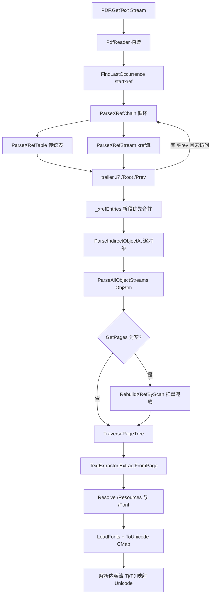

## 产品概述

本仓库是一个使用 VB.NET 从零实现的 PDF 读写工具模块（无第三方 PDF 依赖）。现有 `PDF.GetText(Stream)` 能对常规 PDF 正常提取全文，但对部分"格式特殊"的 PDF 静默返回空文本。本任务要求定位并修复底层读取器缺陷，并在 `test\Program.vb` 中补全可执行的测试代码，使两个指定测试文件能被正确提取文本。

## 核心功能

1. **修复线性化 PDF 的交叉引用解析**：支持沿 trailer 的 `/Prev` 逐段回溯解析完整 xref 链（含传统 xref 表与 xref 流两种形态），保证对象表完整、页面树可被完整遍历。
2. **修复资源/字体的间接引用解析**：页面 `/Resources`、资源字典 `/Font`、字体 `/Encoding` 为间接引用（`N 0 R`）时能够正确解引用，字体子字典支持直接字典与引用两种写法，保证 ToUnicode CMap 能被加载、字符码能正确映射为 Unicode。
3. **修复 ToUnicode CMap 解码**：奇数长度十六进制目标串改为左补零，避免 `<20>` 被误译为 U+2000。
4. **健壮性兜底**：xref 损坏/缺失时扫描 `N G obj` 重建对象表并定位 `/Type /Catalog`；页面树遍历支持无 `/Type /Page`、直接字典形式的 `/Kids`。
5. **测试程序**：`test\Program.vb` 支持传入任意 PDF 路径，不传参时默认运行 `Z:\pdf_test\FSN3-8-1904.pdf` 与 `Z:\pdf_test\P020210610394569640881.pdf`；输出页数、每页字符数、总字符数、耗时与文本预览，并把全文写入同名 `.txt`；提取失败或字符数为 0 时返回非 0 退出码。

## 技术栈

- 语言/框架：VB.NET，net10.0（`Pdf.NET5.vbproj` 与 `test\test.vbproj`）
- 依赖：仅 .NET BCL（`System.IO.Compression.DeflateStream` 做 Flate 解码），无第三方 PDF 库
- 构建/运行：`dotnet build` / `dotnet run --project test`，Windows PowerShell 环境

## 实现方案

### 总体策略

这是一次**定点修复**而非重写：只在 `PdfReader.vb`、`TextExtractor.vb`、`ToUnicodeCMap.vb` 三个文件内做最小侵入式修改，保持现有类结构、命名与中文注释风格（这些文件头部均有统一的 GPL `#Region` 头与"职责/流程"块注释，新增代码需沿用）。

### 已实测确认的根因（对两个 PDF 的二进制分析结果）

两个文件均为**线性化 PDF**，xref 被拆成"首页 xref + 主 xref"两段，靠 `/Prev` 串联：

| 文件 | 最后 startxref | 首页 xref 段 | 主 xref 段（`/Prev`） | Catalog | 页数 |
| --- | --- | --- | --- | --- | --- |
| FSN3-8-1904.pdf (1,178,896B, PDF1.6) | 216 | `xref 225 61` → 对象 225..285 | `/Prev 1174266` → `xref 0 225` → 对象 0..224 | `226 0 R` | 10 |
| P020210610394569640881.pdf (1,467,335B, PDF1.7) | 160 | `xref 548 127` → 对象 548..674 | `/Prev 1456212` → `xref 0 548` → 对象 0..547 | `549 0 R` | 8 |


实测：主段 + 首页段条目数（224+61=285、548+127=675）与文件内 `N G obj` 实际对象数完全一致，证明 `/Prev` 链一旦打通，对象表即完整。

### 缺陷与修复决策（按严重度）

**缺陷 1（致命，两文件都因此 0 页）— xref 未跟随 `/Prev`**

- 现状：`ParseXRefAndTrailer()` 只解析 `startxref` 指向的单段 xref，直接丢弃 trailer 的 `/Prev`。
- 后果：FSN3 仅载入 225..285、P020 仅载入 548..674；Catalog 恰好在首页段内可取到，但 `/Pages`（FSN3 `220 0 R` / P020 `543 0 R`）落在主段，`Resolve()` 返回 `PdfNull.Instance` → `GetPages()` 返回空列表 → `GetText()` 静默产出 0 页。
- 方案：抽 `ParseXRefChain(startOffset)` 循环：解析当前段的 xref 表或 xref 流 → 取 trailer → 读 `/Prev` → 继续，直到无 `/Prev`、偏移越界或偏移重复（用 `HashSet(Of Long)` 防环）。
- 关键决策：
- **新段优先**：`_xrefEntries` 仅当 key 不存在时写入，避免旧段覆盖增量更新后的新条目；
- **`/Root` 取最新**：FSN3 最后一段 trailer 只有 `/Size /ID`、**没有 `/Root`**，因此必须保留**第一段（最新）** trailer 作为 `_trailer`/`_rootRef`，旧段只用于补条目，否则 Root 丢失；
- 解析失败（异常）不整体中断，捕获后终止链，交由兜底路径。

**缺陷 2（致命，P020 修好缺陷 1 后仍是乱码）— `/Resources`、`/Font` 支持间接引用**

- 现状：`ExtractFromPage` 用 `TryCast(page.Get("Resources"), PdfDictionary)`，`LoadFonts` 用 `TryCast(resources.Get("Font"), PdfDictionary)`，二者遇到 `PdfReference` 直接丢弃。
- 实测：P020 有 `/Font N 0 R` **15 处**、`/Resources N 0 R` **7 处**（首页即 `/Resources << /Font 573 0 R ...>>`，573 = `<< /F8 574 0 R ... >>`）；FSN3 有 `/Encoding N 0 R` 4 处。
- 后果：`_fonts` 为空 → `DecodeText` 走 Latin-1 兜底 → 乱码。
- 方案：新增统一的解引用辅助（在 `TextExtractor` 内私有函数，语义等价于"若对象是 `PdfReference` 则 `Resolve`，再按目标类型 `TryCast`"），分别作用于 `Resources`、`Font`、`Encoding`；字体子字典的值同时支持 `PdfReference` 与直接 `PdfDictionary`；`/Encoding` 为字典时回读其 `/BaseEncoding`。

**缺陷 3（中）— `ToUnicodeCMap.HexToUnicodeString` 右补零**

- 现状：奇数长度目标串右补零，`<20>` → `[0x20,0x00]` → U+2000（EN QUAD）。
- 方案：改为**前置**一个 0 字节（左补零）。
- 说明：本次两个测试文件恰好都用 4 位十六进制（`<0020>`），该缺陷不阻塞验收，但属于明确错误，一并修正。

**缺陷 4（中，健壮性）— 页面树遍历与 xref 兜底**

- `TraversePageTree`：补充 `/Kids` 为直接字典的递归；节点无 `/Kids` 但有 `/Contents` 时视为页面（部分生成器省略 `/Type /Page`）。
- 新增 `RebuildXRefByScan()` 兜底：仅当正常路径拿不到 `/Root` 或 `GetPages()` 为空时启用，用正则式扫描 `N G obj` 建对象表，并扫描 `/Type /Catalog` 定位 Root；全程 `Try/Catch` 保护，任何失败都退化为原有行为，绝不抛出。

### 架构与数据流



### 性能与影响面

- 对象解析为一次性全量构建（FSN3 285 个对象、P020 674 个对象），`Dictionary` 查询 O(1)，无 N+1 问题；`/Prev` 链长度通常为 1~3，开销可忽略。
- `Resolve()` 中"压缩对象按需解析 ObjStm"的现有逻辑保留；两文件 `ObjStm` 出现 0 次，不影响。
- 所有兜底/容错路径均为"仅在失败时触发"，不改变正常链路行为，避免回归 `PDF32000_2008.pdf` 等既有可用样本。

## 实施注意事项（防回归）

- 保持 `PdfReader`、`TextExtractor`、`ToUnicodeCMap` 的 `Public` 签名不变（`Resolve`、`GetPages`、`DecodeStream`、`ExtractFromPage`、`ExtractAll`、`Lookup`、`HasMapping`），`PDF.vb` 的 `GetText` 一行不改。
- 沿用现有中文注释风格与 `#Region` 文件头；新增私有方法放在对应"职责分区"注释块内，不新增文件。
- 解码链路异常处理：现有 `FlateDecode.Decode` 已是 Try/Catch，不要在 `DecodeStream` 外层再吞异常导致静默失败；兜底扫描失败必须可观测（测试程序输出诊断，而非静默）。
- 文件头部的自动生成的 `Code Statistics` 注释块无需手动同步（由构建脚本生成），不要手改。
- 修改后需回归验证仓库内既有的 `PDF32000_2008.pdf`（对照 `PDF32000_2008.txt`），确认常规路径未被破坏。

## 目录结构

```
g:\pixelArtist\src\framework\mime\application%pdf\
├── PdfReader\
│   ├── PdfReader.vb        # [MODIFY] 核心修复。1) 新增 ParseXRefChain(offset) 循环解析 /Prev 链（兼容 xref 表与 xref 流），已访问偏移用 HashSet 防环；2) _xrefEntries 改为“新段优先、key 已存在则不覆盖”；3) _trailer/_rootRef 固定取最新一段 trailer（FSN3 末段 trailer 无 /Root）；4) 新增 RebuildXRefByScan() 扫盘兜底（扫描 “N G obj” 建对象表 + 扫描 /Type /Catalog 定位 Root），仅在无 /Root 或 GetPages 为空时启用且全程 Try/Catch；5) TraversePageTree 支持 /Kids 直接字典、以及无 /Kids 但有 /Contents 的节点视为页面。
│   ├── TextExtractor.vb    # [MODIFY] 1) 新增私有 Resolve(Of T) 风格解引用辅助；2) ExtractFromPage 中 /Resources 支持 PdfReference；3) LoadFonts 中 /Font 支持 PdfReference，字体值同时支持 PdfReference 与直接 PdfDictionary；4) /Encoding 支持 PdfReference，并在 Encoding 字典中回读 /BaseEncoding。保持 Subtype/BaseFont/ToUnicode/IsTwoByte 逻辑不变。
│   └── ToUnicodeCMap.vb    # [MODIFY] 修正 HexToUnicodeString()：奇数长度十六进制目标串改为前置 0 字节（左补零），避免 <20> 被解码为 U+2000。
├── test\
│   └── Program.vb          # [MODIFY] 补全 Main 的 Try 块实现：无参默认跑 Z:\pdf_test\FSN3-8-1904.pdf 与 Z:\pdf_test\P020210610394569640881.pdf，支持命令行传入任意 pdf 路径；输出页数/每页字符数/总字符数/耗时/前 200 字符预览；全文写入同名 .txt；任一文件页数为 0、字符数为 0 或抛异常时返回非 0 退出码并打印堆栈。保留现有 PrintUsage 与 UTF8/CodePages 编码注册。
├── PDF.vb                  # [只读参照] GetText 入口，不修改。
└── PdfReader\{PdfLexer,PdfObjectParser,PdfObject,FlateDecode}.vb  # [只读参照] 已核对可正常工作，不修改。
```

## 关键代码结构

新增/调整的私有方法契约（仅签名，不含实现）：

```
' PdfReader.vb
Private Sub ParseXRefChain(firstOffset As Long)
Private Function ParseXRefSectionAt(offset As Long) As PdfDictionary  ' 返回该段 trailer
Private Sub MergeXRefEntry(objNum As Integer, entry As XRefEntry)     ' 新段优先，key 已存在则忽略
Private Sub RebuildXRefByScan()                                       ' 兜底：扫描 "N G obj" + /Type /Catalog

' TextExtractor.vb
Private Function ResolveAs(Of T As Class)(obj As PdfObject) As T      ' 若为 PdfReference 则 Resolve 后 TryCast
```

## Agent Extensions

### Skill

- **pdf**
- 用途：对 `Z:\pdf_test\FSN3-8-1904.pdf` 与 `Z:\pdf_test\P020210610394569640881.pdf` 用成熟工具提取一份参考文本，作为本 VB.NET 提取器输出的对照基准（ground truth），用于判断提取结果是"正确"而非仅仅"非空"。
- 预期结果：得到两个文件的参考全文，与 `test\Program.vb` 输出的 `.txt` 做页数与关键文本片段比对，确认修复后的提取结果真实可读。